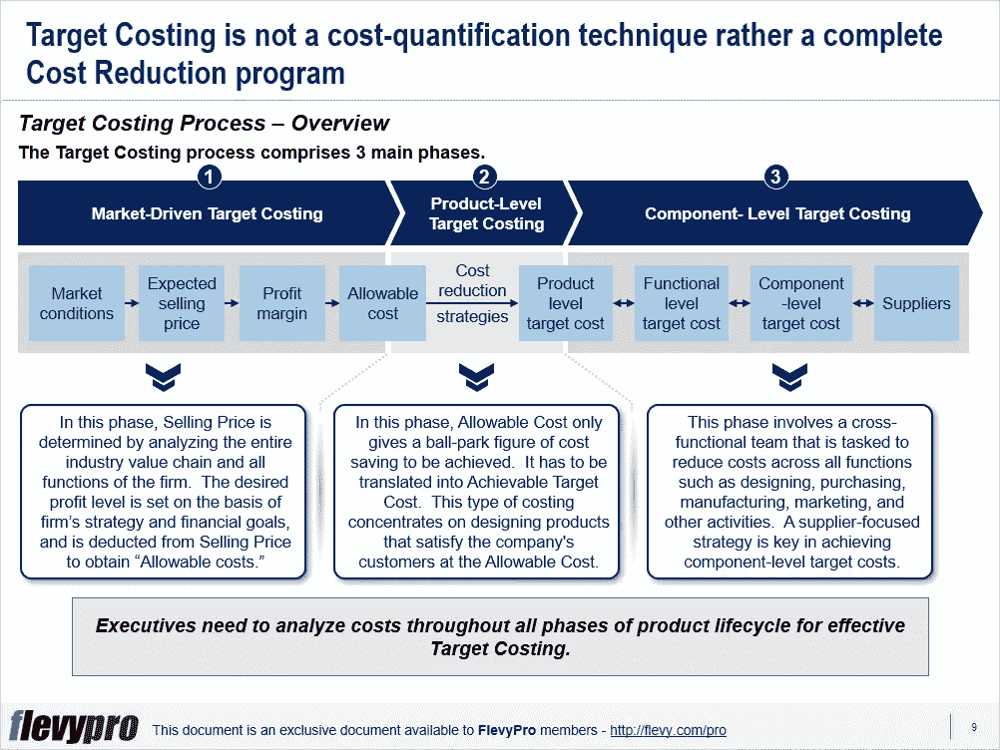

# 你对基于成本的定价满意吗？试试目标成本——一种有效的产品定价方法

> 原文：<https://medium.datadriveninvestor.com/are-you-satisfied-with-cost-based-pricing-2ad6917d05ca?source=collection_archive---------11----------------------->

基于成本的定价正迅速成为过去的遗迹，并被[目标成本](https://flevy.com/browse/flevypro/target-costing-5201)的概念所取代。目标成本计算指的是一个有组织的过程，以确定开发一个拟议产品的成本，以便在未来以产品的预期售价产生利润。

在快速消费品、建筑、医疗保健和能源等高度竞争的市场中，价格由市场力量决定。生产者无法有效控制销售价格。在某种程度上，唯一的控制是成本，所以管理的重点必须是影响产品、服务或运营成本的每一个组成部分。

目标成本法是一种积极主动的成本规划、[成本管理、](https://flevy.com/business-toolkit/cost-management)[成本降低](https://flevy.com/business-toolkit/cost-reduction)实践。成本是在产品生命周期的早期，而不是在后期阶段，从产品和业务中计划和管理的。目标成本的基本目标是使企业在任何竞争市场中都能盈利。目标成本计算广泛应用于多个行业，如制造业、能源、医疗保健、建筑和许多其他行业。

目标成本计算的一些关键特征是:

*   卖方是价格接受者，而不是价格制定者。
*   目标售价包含了期望的利润率。
*   在制定总售价时，产品设计、规格和顾客期望是内在的。
*   降低成本和有效的成本管理是管理战略的基石。
*   在设计、采购、制造、营销和其他活动中，必须通过团队协作来实现目标成本。

与其他产品定价技术相比，目标成本具有以下优势:

*   向客户交付更多价值，因为产品是在牢记客户期望的情况下生产的。
*   设计和制造产品的方法是市场驱动的。
*   [通过流程改进和产品创新获得竞争优势](https://flevy.com/business-toolkit/competitive-advantage)。
*   彻底的[流程改进](https://flevy.com/browse/stream/process-improvement)，创造规模经济。
*   新的市场机会转化为真正的节约，以实现最佳的资金价值，而不仅仅是实现最低的成本。

目标成本计算过程包括 3 个主要阶段。

1.  **市场驱动的目标成本**
2.  **产品级目标成本**
3.  **组件级目标成本**

让我们简单讨论一下这三个阶段。

# 1.市场驱动的目标成本计算

在这个阶段，销售价格是通过分析整个行业价值链和公司的所有职能来确定的。这个成本计算阶段的重点是分析市场条件和确定公司的利润率，以确定产品的“允许成本”。

在这一阶段，期望利润水平是根据企业的战略和财务目标确定的，并从销售价格中扣除以获得允许的成本。竞争的激烈程度、顾客的性质、竞争者推出的类似产品以及顾客的复杂程度是影响市场驱动的目标成本计算的关键因素。

# 2.产品级目标成本计算

在这一阶段，容许成本只是给出了要实现的成本节约的大概数字。它必须转化为可实现的目标成本。这种成本计算集中于设计产品，以允许的成本满足公司的顾客。产品级目标成本计算的基本原则是永远不要超过目标成本。

这个目标成本阶段的目标是给产品设计者制造强烈而现实的压力来降低成本。产品策略(产品线中的产品数量、重新设计频率、创新程度)和产品特性(复杂性、前期投资规模和产品开发持续时间)是影响产品级目标成本计算的关键因素。

# 3.组件级目标成本计算

部件级目标成本计算确定了一个公司愿意购买用于其产品的外部获得的部件的价格。这一阶段涉及一个跨职能团队，其任务是降低所有职能部门的成本，如设计、采购、制造、营销和其他活动。

组件成本历史记录是评估新组件级目标成本以及最佳供应商选择的起点。以供应商为中心的战略是影响组件级目标成本的关键因素。

有兴趣了解更多关于[目标成本计算流程](https://flevy.com/browse/flevypro/target-costing-5201)的工作原理及其关键步骤吗？你可以[在](https://flevy.com/browse/flevypro/target-costing-5201) [Flevy 文档市场](https://flevy.com/browse)上这里**目标成本**下载一个可编辑的 PowerPoint。

## 你在这个框架中找到价值了吗？

您可以从 [FlevyPro 库](https://flevy.com/pro/library)下载关于这个和数百个类似业务框架的深入介绍。 [FlevyPro](https://flevy.com/pro) 得到了数千名管理顾问和企业高管的信任和使用。有些人不得不说:

> “我的 FlevyPro 订阅为我提供了当今市场上最受欢迎的框架和平台。它们不仅增加了我现有的咨询和辅导产品和服务，还让我跟上了最新的趋势，为我的实践激发了新产品和服务，并以其他解决方案的一小部分时间和金钱教育了我。我强烈推荐 FlevyPro 给任何认真对待成功的顾问。”

–战略商业建筑师事务所创始人比尔·布兰森

> “作为一家利基战略咨询公司，Flevy 和 FlevyPro 框架和文件是一个持续的参考，有助于我们为客户构建我们的调查结果和建议，并提高他们的清晰度、力度和视觉效果。对我们来说，这是增加我们影响力和价值的宝贵资源。”

–Cynertia Consulting 的咨询区域经理 David Coloma

> “作为一个小企业主，FlevyPro 提供的资源材料已被证明是非常宝贵的。根据我们的项目事件和客户要求按需搜索材料的能力对我来说很棒，并证明对我的客户非常有益。重要的是，能够针对特定目的轻松编辑和定制材料有助于我们进行演示、知识共享和工具包开发，这是整个计划宣传材料的一部分。虽然 FlevyPro 包含任何咨询、项目或交付公司都必须拥有的资源材料，但它是小公司或独立顾问工具箱中必不可少的一部分。”

–变革战略(英国)董事总经理迈克尔·达夫

> “作为一名独立的成长顾问，FlevyPro 对我来说是一个很好的资源，可以访问大量的演示知识库来支持我与客户的合作。就投资回报而言，我从下载的第一个演示文稿中获得的价值是我订阅费用的好几倍！这些资料的质量让我能够打出超出自己体重的水平，这就像是用很小一部分开销就能获得四大咨询公司的资源一样。”

–Roderick Cameron，SGFE 有限公司的创始合伙人

> “我每个月都会浏览几次 FlevyPro，寻找与我面临的工作挑战相关的演示文稿(我是一名顾问)。当主题需要时，我会进一步探索，并从 Flevy 市场购买。在所有场合，我都阅读它们，分析它们。我采纳与我的工作最相关和最适用的想法；当然，所有这些都转化为我和我的客户的利益。"

量子 SFE 公司首席执行官奥马尔·埃尔南·蒙特斯·帕拉

在 [**管理和企业咨询**](https://app.ddichat.com/category/management-and-corporate-consulting) **:** 中安排一个 DDIChat 会话

 [## 专家-管理和企业咨询- DDIChat

### DDIChat 允许个人和企业直接与主题专家交流。它使咨询变得快速…

app.ddichat.com](https://app.ddichat.com/category/management-and-corporate-consulting) 

在这里申请成为 DDIChat 专家[。
与 DDI 合作:](https://app.ddichat.com/expertsignup)[https://datadriveninvestor.com/collaborate](https://datadriveninvestor.com/collaborate)
点击此处订阅 DDIntel [。](https://ddintel.datadriveninvestor.com/)