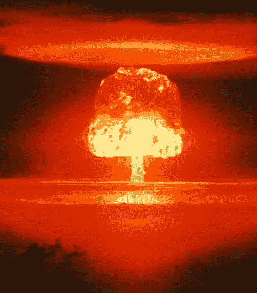
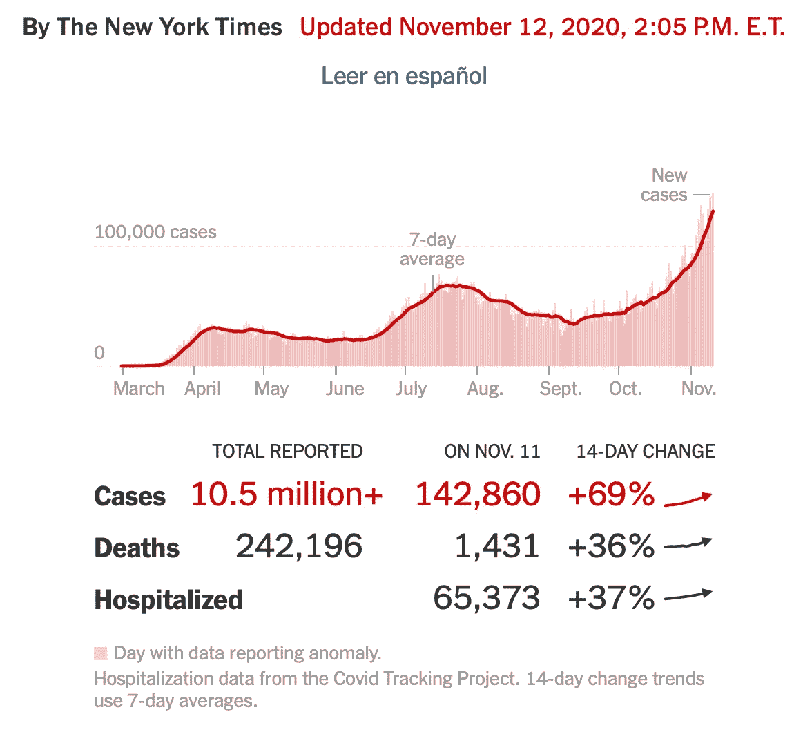
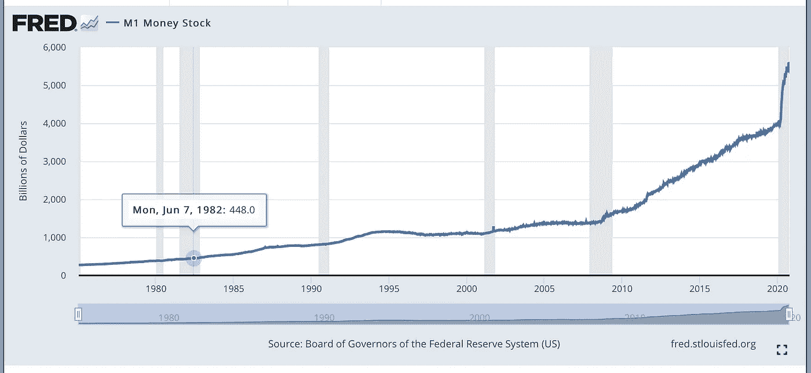
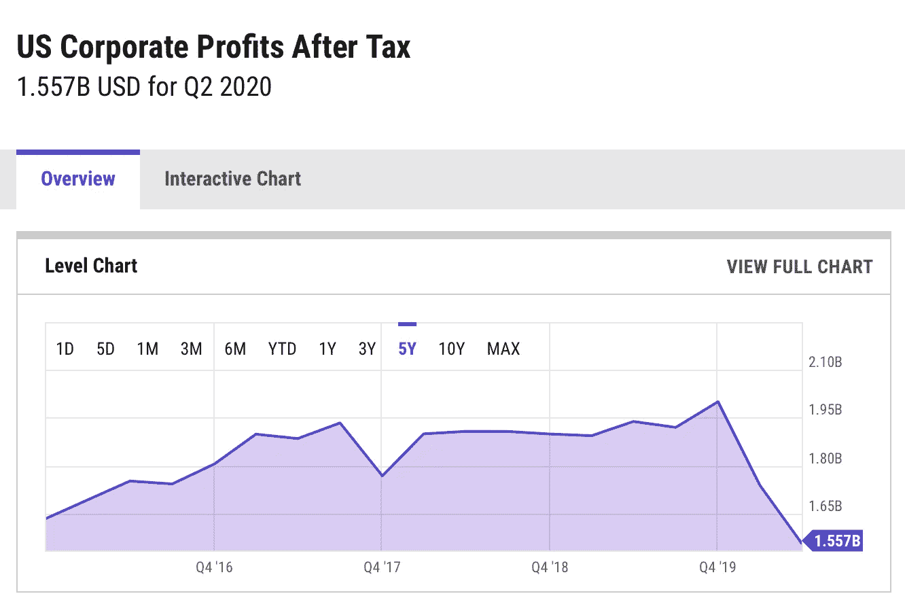
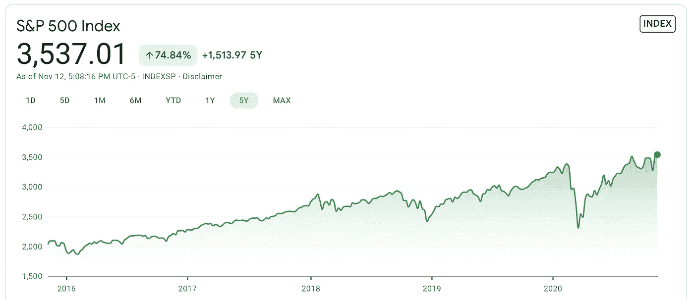

# 你害怕市场吗？乔布斯？经济？

> 原文：<https://medium.datadriveninvestor.com/are-you-scared-about-the-market-jobs-economy-1c662c1f3fa4?source=collection_archive---------8----------------------->

## 既然我们已经选出了一个成年人，我们还能期待什么呢…

A view of the stock market sometime soon (Wikimedia Commons)

# **1。** **期待什么变化……**

最后。在四年的经济和国家由你的学前班恶霸和他的大车轮帮管理后，老师回来了，一个成年人站在了教室的前面。

我们知道，拜登-哈里斯将与我们刚刚看到的有记录以来最长、最灾难性的四年截然不同。在不太迷恋新政府(*必须……保持……公正*)的情况下，我们可以期待成熟的、系统的、广泛的政策集中在对整个国家最有利的方面(*我* ***爱*** *乔和卡玛拉！！！*)。

抱歉。我回来了。

拜登和哈里斯都是为国家服务。不像特朗普夫妇那样追求个人财富和自我膨胀。

首要任务是控制新冠肺炎·疫情。这是因为我们知道，拜登-哈里斯和他们的团队也知道，所有人的健康与经济的健康是一样的。

为了正确看待疫情，以下是由于川普的疏忽而导致的美国每日冠状病毒病例:

Coronavirus daily new cases since March 2020\. The author is using this website image under the fair use doctrine.

与几周前相比:

Coronavirus daily new cases since March 2020\. The author is using this website image under the fair use doctrine.

这是未来将会发生的唯一最重要和最重要的背景。

让我们来说说我们对未来的预期。这些是我的想法和意见——我很想听听你的。

# **2。** **市场操纵……**

几周前，我提出了特朗普操纵股市的证据，尽管经济受到冠状病毒疫情的破坏。请在此处查看，并告诉我您是否同意:

 [## 这个市场被操纵了

### 展示了这场持续 7 个月的疯狂反弹背后的原因

medium.com](https://medium.com/datadriveninvestor/this-markets-being-manipulated-8c5c0d8db7f4) 

关键是 2020 年注入经济的现金数量惊人。回想一下十多年前，在校园里围绕美联储量化宽松政策(QE)的激烈争吵。记得吗？QE 向经济中投入的现金量是灰色条附近的两个小步骤，代表 2008 年 9 月前后和衰退后的房地产衰退。让我再展示一张图表:

M1 includes funds that are readily accessible for spending. The author is using this website image under the fair use doctrine.

通过比较，注意 2020 年释放到经济中的现金量。huuuge 增加了现金。

释放到市场的现金是人为支撑股市的东西——这一切都是为了安抚特朗普。

与此同时，在总统竞选期间，特朗普多次“预测”如果拜登赢得总统大选，股市将会崩盘(好像这真的是我们最需要担心的事情)。：

 [## 道琼斯指数持平，特朗普警告拜登股市再次崩盘

### 随着道琼斯指数的交易，围绕刺激谈判的持续不确定性继续模糊指数的看涨情绪…

www.ccn.com](https://www.ccn.com/dow-flat-as-trump-warns-biden-stock-market-crash-again/)  [## 特朗普总统警告说，“你的 401k 将会崩溃”，但投资者似乎并不太担心

### 唐纳德·特朗普总统表示，唐纳德·特朗普总统对保持牛市活力绝对至关重要…

www.marketwatch.com](https://www.marketwatch.com/story/president-trump-warns-your-401ks-will-crash-but-investors-dont-seem-too-worried-about-it-11603300668) 

川普命令他亲手挑选的美联储主席杰罗姆·鲍威尔采取措施支撑股市:

 [## 特朗普对鲍威尔感到愤怒，希望美联储采取更多措施阻止股票下跌:报道

### 随着美国股市暴跌，唐纳德·特朗普总统本周再次攻击美联储董事长杰罗姆·鲍威尔

www.marketwatch.com](https://www.marketwatch.com/story/trump-furious-with-powell-wants-fed-to-do-more-to-arrest-stock-market-decline-report-2020-03-12) 

那么，既然拜登真的赢了，你认为特朗普会怎么做？

没错。根据川普的命令，美联储将逆转现金注入。经济中现金的减少意味着货币的价格(利率)会上升。投资者将把资金从股市转移到利率更高的现金投资、定期存款、货币基金等。，股价最终会崩盘。就像他们今年应该做的那样。

但是听着。这不是一件坏事。考虑到疫情，股票市场价格过高，不应该处于这样的水平。

这种价格上涨是暂时的，急需的调整也是如此。对于长期投资者来说，上下波动没有真正的后果。我无意根据特朗普及其亲信的操纵做出轻率的投资决定。

# **3。** **疫苗怎么样……**

如果有人相信特朗普的说法，即疫苗将在他加冕时上市，我是说选举，我有一座桥想卖给你。不出所料，没有疫苗发布，也不会很快发布。特朗普政府发布的任何疫苗都应该不惜一切代价避免。

由拜登任命的值得信赖的公务员领导的 FDA 发布的任何疫苗，我都会服用。除了拜登任命的 FDA 局长之外，福奇是另一个我会注意的人:

 [## 安东尼·福奇博士——真理的低语者

### 如何在罪恶的深渊中成为事实和真相的传播者

medium.com](https://medium.com/illumination/dr-anthony-fauci-the-truth-whisperer-243b1b948dba) 

冠状病毒疫苗尤其具有挑战性。科学界和医学界几十年来一直在努力研究[冠状病毒疫苗](https://www.ncbi.nlm.nih.gov/pmc/articles/PMC1592697/)，但他们的努力收效甚微。部分问题是在之前的 SARS 疫情消退后缺乏资金(并指出即使在无感染时期也需要保持资金不变)。但是技术上的挑战是巨大的，而且现在也不能保证更多的资金会给我们一种安全有效的 SARS 疫苗。几十年来对艾滋病疫苗的争夺是一个相关的警示故事。

# **4。** **如何控制疫情然后……**

尽管拜登控制疫情的细节仍在演变，随着疫情本身的快速变化(见上图)，但正如《科学》杂志报道的那样，我们已经知道一些关键点:

*   *站起来一支 10 万人的联络寻人兵团；*
*   *通过“数量级”增加测试，部分是通过将免下车测试点的数量增加一倍；*
*   利用《国防生产法案》( DPA)的全部权力来补充个人防护装备的耗尽库存；
*   *建立一个工作队，监测应对措施中的种族和民族差异；*
*   *提供资金帮助州和地方政府以及企业应对疫情；和*
*   呼吁国会为学校提供财政援助。

追踪受感染患者的所有接触者并立即对他们进行隔离，对于任何成功的疫情控制都是至关重要的。这是第一要务，也是为什么 10 万人的联络追查力量至关重要。

定期检测是任何成功的疫情控制的另一个重要部分，特别是当病毒可以由无症状的病毒携带者传播时。因此，增加“数量级”(意味着 10 倍、100 倍或更多)的测试也是必须的。

口罩和距离是强制性的，以尽量减少这种高传染性病毒的传播。必须尽一切努力生产足够的口罩供每个人佩戴，并为医院提供足够的用品以应对激增的病例。

任何政府都必须是全民政府。尤其是那些最脆弱的人。对这个疫情来说，这意味着少数民族，我们已经看到他们受病毒打击最严重。

由于特朗普政府放弃了责任，州和地方政府一直难以发挥带头作用。这已经大大减少了地方和州的预算，随之而来的是更多的裁员。例如，学校正在努力雇佣额外的人员来保持学生之间的距离，从而缩小班级规模。疫情袭击了许多其他学校功能，仍然需要更多资源(如公交车司机)来确保学校安全。

# **5。** **“是经济，笨蛋”…**

但底线是经济，正如克林顿的竞选策略师在他的简洁名言中指出的，对吗？最终，一旦我们开始控制疫情，我们需要慢慢地让经济运转起来。人们需要购买用品，支付租金或抵押贷款，购买汽车，出去吃饭，旅游，看电影……换句话说，人们的现金是流经经济的血液。这就是为什么没有健康的人，我们就没有经济。优先权，伙计们。

上面讨论的疫情控制措施越早获得动力，经济就能越早开始复苏。一旦人们有了信心，被大量减少的工作就会开始恢复。相信有足够的测试来验证它们是无病毒的，有足够的口罩来保护每个人的安全，有足够的接触追踪来发现感染者并隔离他们，有足够的资金供政府和企业运作。

但是今年，没有那些控制，没有人有信心出去。因此，由于缺乏像你我这样的个人买家，公司利润今年大幅下滑，如下图所示:

Five-year chart of corporate earnings. The author is using this website image under the fair use doctrine.

在没有利润的情况下，股票就是这样估值的，我们怎么能指望股票市场在与利润图完全相反的情况下飙升呢？这是同一时期的 S&P500 股票走势图:

S&P500 stock index over five years. The author is using this website image under the fair use doctrine.

所以，是的，尽管我讨厌这么说，但特朗普说股市将崩盘是对的。但这并不反映特朗普的远见和智慧的特殊能力。这是因为特朗普一直在操纵股市，以可笑的错觉抬高股市，认为这将有助于他连任。

但现在他已经输了，他没有动力继续推高股市。它确实会崩溃。在一个正常运行的股票市场中，这是理所应当的。

我们看到的 3 月 23 日左右低点的暴跌是正确的市场反应，尽管特朗普当时在发脾气。

我个人预计股市会崩溃(谁知道它是否真的会崩溃)——但我们现在比拜登和哈里斯更有优势，因为我们会控制住疫情。那么这个满目疮痍的经济将会在后视镜里。事情会变得更好——通过大量的努力工作和一些焦虑(对那些不幸的人来说，隔离可不好玩)。我不会恐慌抛售，也不会因为前任总统的愚蠢而改变我的长期投资方法。我现在很乐观，因为我们都选了一个更好的。

这是我们需要关注的。

还有让我们的国家重新团结起来。