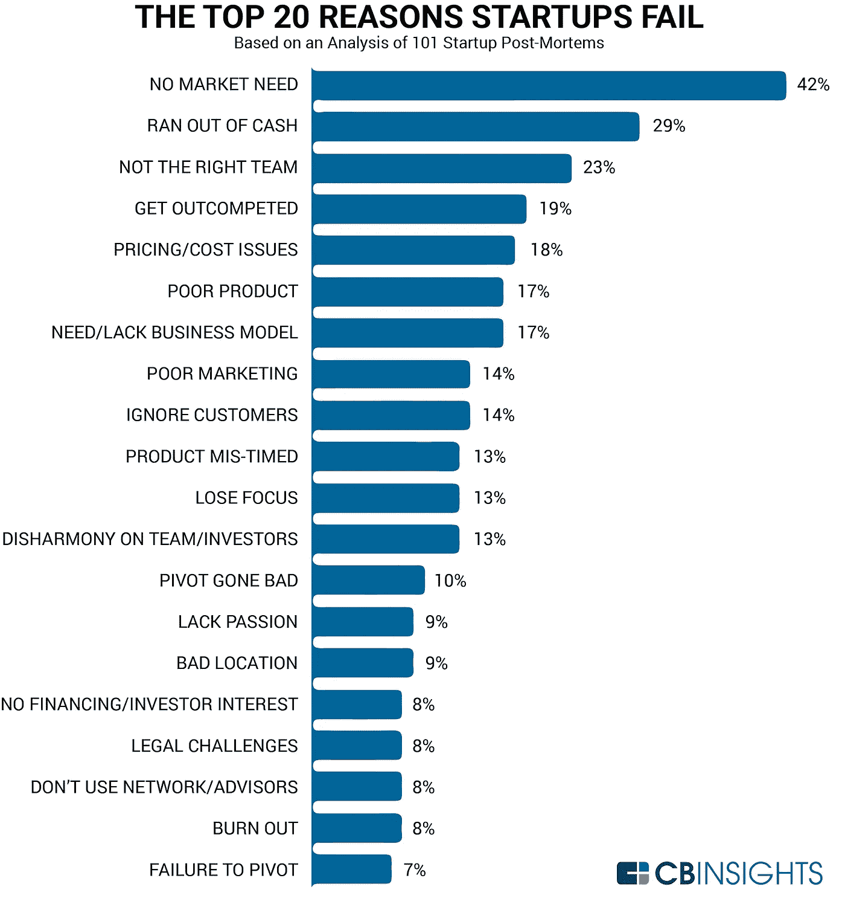
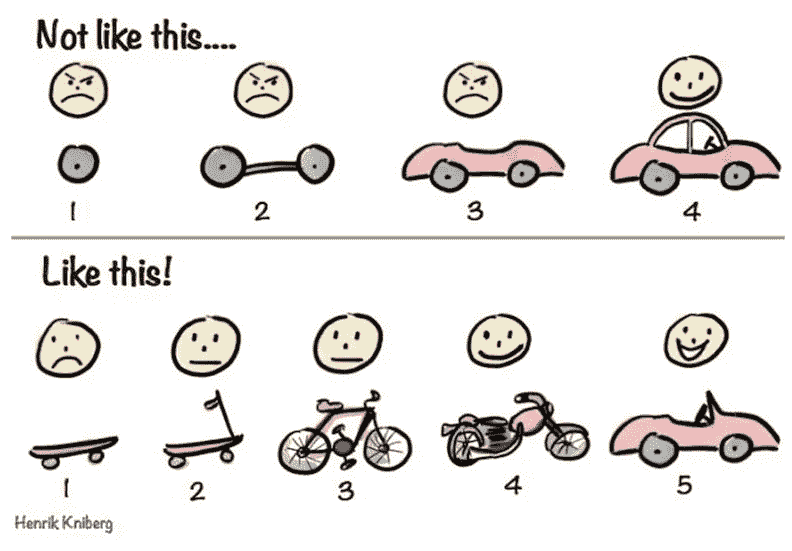

# 你确定你的创业公司需要 MVP 吗？

> 原文：<https://medium.datadriveninvestor.com/are-you-sure-that-your-startup-needs-mvp-62126e1df79f?source=collection_archive---------13----------------------->

每个成功企业的核心都是一个伟大的想法。然而，从长远来看，并不是所有看起来很酷的概念都有利可图。今天，精益创业公司和其他技术奇才越来越多地使用最小可行产品(MVP)作为成功软件产品的发射台。大量(42%)初创公司失败是因为他们的产品不被市场需要。这个结论是 2018 年春天在 CB Insights 公司得出的。这项研究只是加强了精益和敏捷的支持者的信念，他们已经异口同声地说:不要创造一个昂贵的产品，提供一个可行性最低的版本。

通过专注于产品开发所需的基本功能和一系列关键能力，企业能够形成某种核心，这将形成未来产品的基础。如果公司不能恰当地形成核心，那么它就冒着最终创造出不必要的产品的风险——这句话意味着“无用的用户体验”。

# 什么是 MVP？

打个比喻，MVP 的概念是由《从战壕中精益》一书的作者 Henrik Kniberg 解释的。他描述了两个产品创造过程。

送用户一程，了解一下焦点小组的意见。反馈将逐渐改进产品——变成踏板车、自行车、摩托车，然后变成梦想中的汽车。重要的是，客户将能够在每次迭代中使用该产品。假设他不是完美的，但会帮助部分解决他们的问题。您将节省开发资源，并且您肯定知道如何做得更好。

# 为什么要用 MVP？

*   用最少的资源测试产品假设的能力；
*   加速学习；
*   减少开发时间；
*   尽快为早期消费者创造产品；
*   其他产品的基础；
*   评估创造所需产品的能力。

# 如何确定自己的 MVP

在你开始开发之前，你需要确定你的 MVP 是什么:你的产品应该有哪些功能，哪些不应该被要求？保持客观很重要——一个你非常喜欢的功能可能并不是你应用中最重要的，在 MVP 开发阶段就拒绝它比较好。
列出你的产品的特点和特征。详细写下每一项——这会让你对你将要发展的东西有一个大致的了解。下一步是确定某些功能的优先级——在您的应用程序中，什么是最重要和最有价值的？以此为起点，将其余功能纳入未来发展规划。

# 在线领域的 MVP 示例:

## Dropbox

该产品尚未“诞生”，但创作者发布了一个 4 分钟的演示视频，在视频中他们解释了这个想法。观看视频的人订阅了时事通讯。一夜之间，潜在用户的基数从五千增加到了七十五。

## Spotify

开发人员丢弃了太多东西，创造了可以发明的最简单的原型。在这个程序中，他们从笔记本电脑上下载音乐，并播放了几次，这样就不会出现任何问题，音乐也能流畅播放。没有人问版权、界面美和可用性的问题。首先，有必要让人们熟悉流媒体技术。

## Groupon

世界著名的优惠券搜索网站的早期版本是一个基于 WordPress 的博客，它安装了一个小工具，可以通过电子邮件发送 PDF 格式的优惠券。

# 结论

我们看到这些产品在今天是多么的成功，但是我们忘记了他们花了很多年才达到现在的水平。平衡产品优先级不会随着 MVP 的推出而结束。它贯穿于整个产品生命周期。即使你有了客户群，有了盈利的公司，你还是要选择先做什么，后留什么。最低限度可行的产品不是“原始”版本，而是未来解决方案的“框架”，包含了其中最重要的东西。