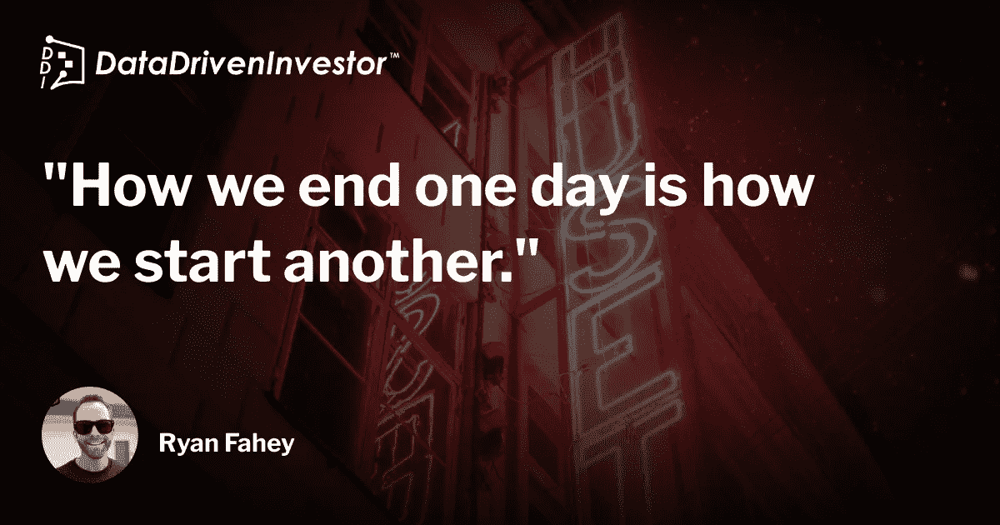
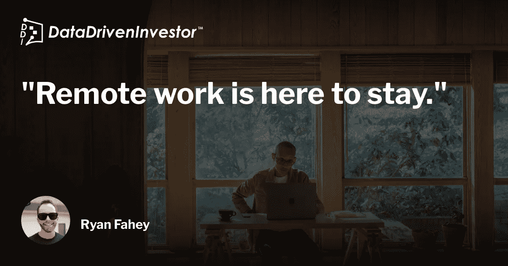

# 你在远程繁荣吗？

> 原文：<https://medium.datadriveninvestor.com/are-you-thriving-remotely-c6d6854e1565?source=collection_archive---------18----------------------->

## 远程工作

## 如何在新经济中尽你所能

Photo by [Max van den Oetelaar](https://unsplash.com/@maxvdo?utm_source=medium&utm_medium=referral) on [Unsplash](https://unsplash.com?utm_source=medium&utm_medium=referral)

欢迎来到新世界。

在这个世界里，超过 55%的全球员工拥有某种形式的远程工作选择。

2020 年最后一个季度，[电子商务平台销售额](https://www.digitalcommerce360.com/article/us-ecommerce-sales/)创下历史新高。

这是一个充满连接的世界，然而却没有 [*真正的连接*](https://www.amazon.ca/Everyone-Communicates-Few-Connect-Differently-ebook/dp/B003BWL0TE) 。

在这个世界里，工作时间和家庭时间的界限是模糊的。

这是一个需要我们不断关注的世界，而不是我们努力工作的目标——与我们最爱的人共度美好时光。

那么，你在这个新世界中处于什么位置呢？

Photo by [Tachina Lee](https://unsplash.com/@chne_?utm_source=medium&utm_medium=referral) on [Unsplash](https://unsplash.com?utm_source=medium&utm_medium=referral)

你是一个感觉比以往任何时候都更有联系，但情感联系却比以往任何时候都少的人吗？

你是因为冒名顶替综合症(*也就是说，如果我更努力地工作，我就会证明自己的价值，变得“足够”*)而工作更长时间的人，还是一天结束后就不干了？

你是否在争夺情感能量来满足你家人或你最亲近的人的心？

如果你是这些事情中的任何一个(*或全部*)，你并不孤单。你是疫情经济车轮上的一个重要齿轮。

不管你喜不喜欢，远程工作是燃烧这种新经济的燃料，我们没有人有时间停下来想想一年后会是什么样子；我们一直忙于逐月生活。

没错——我们已经绕着太阳转了一整圈，这个疫情挑战着我们的社会和做生意的方式，同时决定着我们何时可以和谁进行身体互动。

不管你相不相信，现在是你我在这个新经济中重新开始生活的时候了。是时候停止月月生活了。我们今天远程做的事情很重要。这很重要，因为它将在新的工作方式中创造一个更有活力的未来。

[***我们需要结构来创造自由***](https://www.amazon.ca/Greenlights-Matthew-McConaughey/dp/0593139135/ref=sr_1_1?dchild=1&gclid=Cj0KCQiApY6BBhCsARIsAOI_GjYCEvP7_mbfWTNAcx0cIrOSo1aYYnhv05nLfhzb7cKByvFJBGlGgeEaAi-OEALw_wcB&hvadid=357018785972&hvdev=c&hvlocphy=9000683&hvnetw=g&hvqmt=e&hvrand=6374088882146442185&hvtargid=kwd-938479872685&hydadcr=25167_10268456&keywords=greenlights+book&qid=1612957436&sr=8-1&tag=googcana-20) ***。***

我们需要希望来对抗绝望。

我们需要自信来消除冒名顶替的感觉。

我们需要系统、常规和策略来让我们的日子充满力量。

为了生存，我们需要渴望归属感和目标。

但是我们真的能繁荣吗？

Photo by [Loic Leray](https://unsplash.com/@loicleray?utm_source=medium&utm_medium=referral) on [Unsplash](https://unsplash.com?utm_source=medium&utm_medium=referral)

在我的新书《如何在远程工作环境中茁壮成长》中，我阐述了从脆弱的*生存状态到安全的*茁壮成长的*状态所需的策略、系统和常规。*

我和你一样，在 2020 年的春天被扔进了一个完全远程的工作环境。我既兴奋又害怕。我既雄心勃勃又小心谨慎。

我的远程办公室有一把 2000 年代早期的旧椅子，还有一张从宜家买来的带坐垫的旧木桌。我的指挥中心很弱。我心想，“*别担心，这是暂时的*”。

我们都知道我错了。

我知道我需要测试新的系统、工具、策略和程序，以找出如何在新的远程环境中以最佳水平工作。

像你一样——我正在成熟。

很快。

一年后，我们在这里。虽然我仍然使用那张旧桌子作为我的办公桌，但我已经升级了我远程办公室周围的植物，创造了一个阅读空间，增加了一个更好的灯，第二个显示器，当然，还有一把更符合人体工程学的椅子。

我已经调整了我的晨间作息，让我每天都保持旺盛的精力。

我已经升级了我的睡眠时间表和晚上的时间表，让我能够集中精力，为第二天做好准备。

我学会了做更好的饭菜，学会了在屏幕前“适可而止”。

我创造了新的系统和策略来更好地完成我的工作。

我知道如何茁壮成长。

这也是我对你的真诚希望。我希望在你的远程工作环境中，你已经找到了如何在这种新的工作方式下在长期职业生涯中茁壮成长的方法。我希望在过去的 12 个月里，你为成功转动、成长和播种的种子比你整条街的总和还要多。

如果碰巧这不是你，你会认为自己是在这种新的工作方式中幸存下来的人，而不是蓬勃发展的 T2 人，让我与你分享三种方法，你可以扭转今天的局面，让明天的旅程变得更好。

# 从活动开始

> 30 分钟的心脏跳动是美好的一天和伟大的一天的区别。

你已经从在[媒体](https://medium.com/u/504c7870fdb6?source=post_page-----c6d6854e1565--------------------------------)上阅读的大量文章中了解到了这一点，但它值得重复一遍。以 30 分钟中度到剧烈的体育活动开始你的早晨是一个关键的习惯，它可以成就或毁掉你一天的剩余时间。这个习惯可以帮助你吃得更少，注意力更集中，在你开始一天的工作之前有一种成就感。

# 以复习和睡觉结束

众所周知，前总统巴拉克·奥巴马会在晚上的例行公事中花一部分时间考虑第二天的任务。从今天的需求中抽离出来，专注于另一件事，会让你在明天茁壮成长。这一举措，加上晚上睡个好觉(*7–9****高质量的*** *小时的成年人睡眠*)是让你在疫情经济中茁壮成长的可靠途径。

# 阅读我即将出版的书

[***如何在偏远的工作环境中茁壮成长***](https://amzn.to/3ekGBr2) 就相当不言自明了。这是一本关于如何远程发展的书。句号。它是为像我这样的远程工作者建造的，他们在 2020 年春天被扔进一个巨大的培养皿中，并期望像 1999 年一样工作。它是在与两只猫隔离时精心制作的(*我正在引导我内心的马克·吐温*)，在完全封闭的情况下完成的。没错，这是一本诞生于潮水不断把我的船推上岸的时代的书。在那里，零下 30 度的锻炼是保持活跃的唯一方式，在加拿大的深冬，黑暗的时间比光明的时间更长。

***我们不是为了简单地生活。我们注定要好好活着*** 。偏远不应该剥夺我们的机会。我们都应该好好生活。这本书将帮助你用这种新的工作方式做到这一点。这取决于我们所有人去迎接挑战，变得最好。

 [## 如何在远程工作环境中茁壮成长

### 如何在远程工作环境中茁壮成长电子书:法赫、瑞安、费思、乔伊:亚马逊

www .亚马逊. ca](https://www.amazon.ca/dp/B091MSMR2D/ref=sr_1_1?dchild=1&keywords=how+to+thrive+in+remote+working+environment&qid=1617484066&sr=8-1) 

当您今天激活您的会员资格时，可以无限制地访问媒体报道:

 [## 加入我的介绍链接媒体-瑞安法赫

### 作为一个媒体会员，你的会员费的一部分会给你阅读的作家，你可以完全接触到每一个故事…

wellnessrf.medium.com](https://wellnessrf.medium.com/membership)