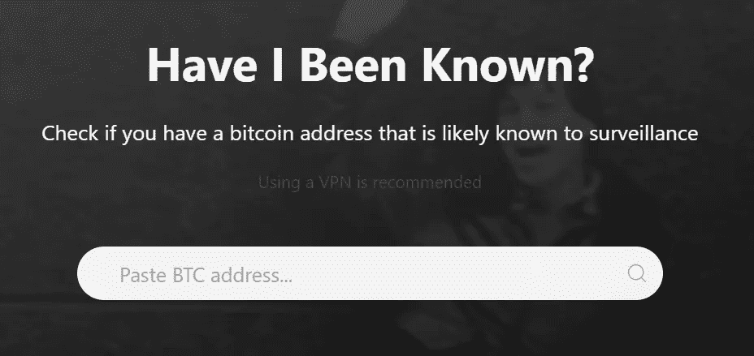
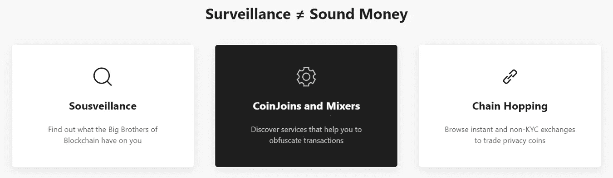
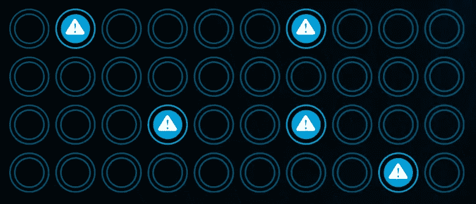

# 你的比特币地址被监控了吗？

> 原文：<https://medium.datadriveninvestor.com/are-your-bitcoin-addresses-under-surveillance-636100bc1ee0?source=collection_archive---------5----------------------->

## 免费资源知道区块链的大佬们是否在窥探你的账户

Image: [Robert Zunikoff](https://unsplash.com/@rzunikoff) via Unsplash

与一些假设相反，itcoin 不是一种私人的价值交换手段。T2 应该是透明的。但不知何故，有一种误解认为区块链隐藏了一切。

问问最近 Twitter 崩溃的黑客就知道了。政府机构已经在跟踪他们的交易。

我们还可以转向最尴尬的隐私错觉例子之一，发生在 2016 年美国大选期间。一群 [**12 名俄罗斯黑客**](https://www.ccn.com/russian-agents-who-hacked-dnc-emails-thought-bitcoin-would-keep-them-anonymous) 假设他们的活动不会被窥探的眼睛发现，他们使用比特币为他们的秘密行动提供部分资金。

 [## 为什么参与正确的加密交换至关重要|数据驱动型投资者

### 到目前为止，与黄金和美元相比，加密货币，尤其是比特币，已经显示出巨大的增长

www.datadriveninvestor.com](https://www.datadriveninvestor.com/2020/07/16/why-engaging-with-right-crypto-exchange-matters/) 

撇开黑客不谈，那么《普通乔》呢，或者如《密码解释者》视频所展示的那样，《鲍勃和爱丽丝》呢？

比特币旨在成为一些人所认为的破碎金融系统的替代品。隐私是其中不可或缺的一部分。

我们知道，比特币基地和双子座现在与美国税务机器国税局一起工作。所以，亲爱的读者，如果你在任何一个交易所买卖、交易或持有 BTC，你可能会想知道你的账户是否在一个特殊的观察名单上。我做到了。

现在有一种方法可以找出答案。更好的是，该网站包含有用的资源，告诉你如何保护自己，以及如果你的一个或多个 BTC 地址被监控时该如何处理。

或者，正如该网站所解释的，监视。那是什么意思？在这里，我来解释一下…

# 你被人知道了吗？

检查是否有一些区块链的大佬在看，只需在 [**的搜索栏中粘贴一个 BTC 地址就可以了**](https://haveibeenknown.com/) 。

不，以太网地址不起作用。不知道为什么，但我被迫尝试。

网站的过滤器从哪里提取区块链数据？知道确切的问题会出现，它被列在常见问题部分:

> “我们使用来自 Blockstream 的 Esplora API，我们的隐私分析 JavaScript 来自他们的开源 block explorer。”

现在，让我们假设您通过过滤器运行您的地址，并发现一个侵犯隐私的“gotcha”。然后呢？

首先，对给您带来的不便表示抱歉！其次，HIBK 为您提供了一些选择…

# 搅拌锅

如果你有理由回头看看你的数字肩膀，有几种不同的策略可用:搅拌机和连锁跳跃。

## 混合器

简而言之，通过 mixer 发送您的 BTC 会将事务与其他地址组合在一起。

以下是 CoinJoin 服务描述消费的方式:

> “事务的构造使得分析区块链的人无法确定哪个输出属于哪个用户。”

想象一下搅拌机，就像把你的硬币和其他硬币一起扔进去，做成一杯交易冰沙。HIBK 会教你如何做到这一点。

## 链式跳跃

让自己不被发现的一个方法是使用 P2P(分散式)交易所。跨链原子互换——从一个个人(非交换)钱包交易到另一个——现在已经成为现实。

将资产转移到隐私币是另一种选择。隐私币似乎越来越流行，像 [**面纱**](https://www.veil-project.com/) 这样的项目旨在创建私有的、不可信的、端到端的金融生态系统。

# 谁在看？

那么，哪些组织在区块链四处窥探呢？实际上，有很多。

*Image credit: CipherTrace.com*

本质上，无论哪家公司持有政府合同都可以窥探。

以下是该行业中的一些知名人士:

区块链 Intel，BlockSeer，Chainalysis，CipherTrace，Comply Advantage，Coinfirm，Crystal Blockchain，Elliptic，中微子，Scorechain。

值得注意的是，这份自称为“智能解决方案”的公司名单远非包罗万象。

## 还有问题吗？

该网站的创建者 [**约书亚婚姻**](https://twitter.com/satoshua) ，在 [**Bitcointalk 论坛**](https://bitcointalk.org/index.php?topic=5262324.msg54851983#msg54851983) 上更深入地探讨了这一技术。

# 最后的想法

监督机构的目的是防止欺诈者进行未经授权的加密取款。但是历史告诉我们，那些有权干涉私人事务的人经常越界。

是的，这里有需要。区块链是一个充满骗子的阴暗交易所。骗子们更喜欢瞄准 BTC，因为它具有普遍的流动性。原始密码是迄今为止最容易交易和花费的。

但是当隐私是一个问题时，你确实有选择。如果你认为你被监视了，现在你知道怎么发现了！

# 你有什么看法？

区块链的间谍活动与你有关吗？你在乎你的资金流动是否被跟踪吗？

在下面的评论中分享你的观点吧！

**访问专家视图—** [**订阅 DDI 英特尔**](https://datadriveninvestor.com/ddi-intel)