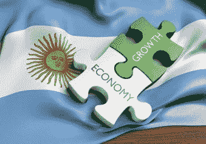

# 阿根廷——对美国和中国的警告

> 原文：<https://medium.datadriveninvestor.com/argentina-a-warning-to-the-united-states-and-china-483f9d287215?source=collection_archive---------0----------------------->

人们可能会问，为什么北美繁荣昌盛，而拉丁美洲却远远落在后面。毕竟，大约 500 年前，两者都是从同一点开始的。为什么有些人最终兴旺起来，而其他人却没有？

历史学家不喜欢“如果”的推测，因为它们不能改变过去。Rok Spruk 博士不是历史学家；他是经济学家。他的博士学位是定量经济史。找出为什么一些国家比其他国家做得更好是他的专长。理解为什么一些国家成功了，而另一些国家失败了，可以帮助我们识别未来繁荣或衰退的早期迹象。在他最近的研究中，斯普鲁克博士关注了阿根廷的案例。

 [## 另一场精心策划的全球经济危机正在逼近？如果我们的数据经济可以帮助它|数据…

### 我们的 DApp 的开发，称为 DECENTR，目前正与我们的 R&D 同步进行，作为我们即将到来的…

www.datadriveninvestor.com](https://www.datadriveninvestor.com/2019/03/06/another-engineered-global-economic-crisis-looming-not-if-our-data-economy-can-help-it/) 

我们大多数人都因为探戈、[、埃维塔](https://en.wikipedia.org/wiki/Evita_(musical))、一系列军事政变和持续的经济问题而了解阿根廷。众所周知，在 20 世纪初，阿根廷是世界上最富有的国家之一。据估计，在 1895 年，阿根廷拥有世界上人均 GDP 最高的国家[。在大约两代人的时间里，从 1870 年到 1930 年，阿根廷一直是世界上最繁荣的 10 个国家之一。正如金融时报](https://panampost.com/marcelo-duclos/2018/04/14/in-1895-argentina-had-the-worlds-highest-gdp-per-capita-what-went-wrong/?cn-reloaded=1)[所写的](https://www.ft.com/content/778193e4-44d8-11de-82d6-00144feabdc0)，在 20 世纪初，对于欧洲移民来说，布宜诺斯艾利斯是一个和纽约一样有吸引力的目的地。

# 阿根廷如何变得富有

这相对简单。1800 年以前，今天的阿根廷在某种程度上相当于美国的西部荒原。形式上它是西班牙的殖民地，但不像更北部的地区那样受到严格控制。英国也试图在那里获得一些影响力，但没有成功。此外，土著游牧部落很少，不像印加人或阿兹特克人那样先进。当地人的财富主要来自肥沃土地上的农业和银矿开采。在拉丁语中， *argent* 是银的意思；从 17 世纪开始，阿根廷这个术语就被用作这片领土的名称。

在 19 世纪的第一个十年，西班牙忙于拿破仑战争。西班牙殖民地将此视为寻求独立的机会。阿根廷在 1816 年做到了这一点，但几十年来，它因关于新国家政治形态的冲突而四分五裂。它以 1853 年签署的宪法结束，建立了一个模仿美国的联邦政治体系。这种政治共识带来了外国投资者和移民。现代农业扩展到新的领域。新建的铁路允许将农作物运往港口出口。普及免费教育始于 1884 年，很快使阿根廷成为拉丁美洲识字率最高的国家。阿根廷进入 20 世纪时是一个富裕的、拥有延伸铁路、技术先进的现代国家。

# 纸面上和现实中的法律

斯普鲁克博士在他的论文中写道:“1913 年，阿根廷的人均收入是美国的 72%。2010 年，阿根廷仅达到美国水平的三分之一。1860 年，阿根廷需要大约 55 年才能达到瑞士的人均收入水平。今天，阿根廷需要 90 多年才能达到瑞士的繁荣水平。然后，他问:“*哪里出了问题？人们可以猜测政治是罪魁祸首。但是，一如既往，看细节就能说明问题。*

斯普鲁克博士指出了阿根廷和美国在文化和传统上的差异。美国宪法产生于北美移民长期实行的规范。平等、个人自由和在一个公正的社会中追求繁荣的权利是不言自明的价值观，尽管往往没有得到完全实施，但却受到普遍尊重；奴隶制就是一个例子。

正如斯普鲁克博士写道:“*西班牙精英阶层立即建立了(……)剥削性的劳动制度，这种制度建立在以严重膨胀的价格向当地人口强行分配商品和服务的基础上，使非精英人口长期背负沉重的债务*”这导致非精英阶层几乎没有经济机会。随着西班牙王室出售公职，“恐吓、贿赂和欺诈成为政治和经济权力分配的基石”法治传统比北美要弱得多。1853 年的宪法代表了开明的阿根廷人的愿望，而不是现实。它被接受是因为它在当时提供了一个令人满意的政治妥协。

用法律术语来说，在美国，法律上的情况反映了实际上的政治。在新成立的独立的阿根廷，两者之间有很大的分歧。

# 哪里出了问题

继《宪法》之后，颁布了许多新的法律，以打破无法无天的长期传统。它规定将农业扩展到新的领域。这个国家的经济繁荣起来。到 19 世纪末，再也没有新的扩张领域了。任何进一步的增长都需要更高的效率。面对这一挑战，旧的政治基础事实上压倒了写在纸上的法律。

农业是阿根廷经济的基石。卡尔·索尔伯格教授在他 1971 年发表的[论文](https://www.jstor.org/stable/174745)中，以农业为例详细描述了阿根廷经济的解体。

在美国，家庭农场是常态。新移民可以很容易地为自己获得土地。一位美国农民拥有自己的土地，他对提高土地效率很感兴趣。在阿根廷，地主中的精英阶层拥有大部分可耕地，他们通常不耕种自己的土地，而是将土地租给许多农民。他们的财务目标是获得最高租金。他们强行以高价向佃农出售供应品。他们以年度合同租用农田，并拒绝支付任何永久性的改良费用。尽管存在这些结构性的低效率，但通过拥有大量土地，他们有收入支持他们奢侈的生活方式，这与受剥削的农民形成鲜明对比。

从法律角度来说，佃农的公民权利受到了地主的侵犯，地主强迫他们签订不公平的合同。然而，没有可靠的公众支持来实现所有公民的平等。用政治术语来说，现存的*事实上的*保护主义束缚了自由市场。被剥夺了创业自由的农民无法积累足够的资本来购买自己的农场。通过剥削佃农，浪费的地主可以保持盈利。如果自由市场已经存在，就像在美国一样，最没有效率的土地所有者将被迫把他们的土地卖给最勤劳的农民。这种自我调节的市场机制，尽管在法律上得到保证，但事实上并没有发挥作用。精英们攫取了阿根廷的大部分财富。

一系列的社会动荡使这个国家分崩离析，农民和他们的劳动者要求更好的待遇。来自欧洲的亲社会主义思想帮助相对受过良好教育的阿根廷人意识到不公正正在发生。精英们操纵形式上的民主投票系统为自己谋利。20 世纪初，阿根廷变得政治不稳定。由于领导人害怕革命，1912 年通过了《enz·培尼亚法》。它恢复了宪法权利，并为所有男性引入了秘密强制选举权。不幸的是，萨 enz·培尼亚法案并没有解决政治问题，事实上，政治问题扭曲了自由市场力量，是阿根廷问题的症结所在。

尽管受到历史学家的高度赞扬，但萨 end 培尼亚法案仍可被视为阿根廷繁荣终结的开端。首先，它没有消除*事实上的*精英对大众的非法剥削，这是阻碍穷人通过工作提升自己的障碍。认识到财富差距，萨 enz·培尼亚法授权政府实施财富再分配计划。这平息了当时的政治紧张局势，但产生了长期的打击士气的效果。对于弱势群体来说，从政府获得福利成为了一种比工作更容易的经济发展方式。

第二，通过强制投票，萨 enz·培尼亚法给了寻求通过支持民粹主义政客来轻松解决问题的大众真正的政治发言权。1916 年赢得总统选举的伊波利托·伊里戈延就是这样一位政治家。从那时起，直到今天，阿根廷的历届政府都试图通过探索各种民粹主义政策来微观管理阿根廷经济。

# 事情如何变得更糟

谷物袋的故事是政府干预如何影响阿根廷经济的生动例子。在美国，从 19 世纪中期开始，谷物升降机就已经被建造来储存用于批发贸易的谷物。它提高了效率，降低了损失。在阿根廷的佃农制度下，没有建造谷物升降机的市场激励。所有的谷物都用袋子包装和搬运。此外，土地所有者将这些袋子高价卖给他们的农民。这些包大多是用从印度进口的布料制成的。

在 1917-1918 年，由于第一次世界大战造成的贸易中断，阿根廷经历了粮食袋短缺。他们的价格翻了三倍。阿根廷政府试图提供帮助。它与英国领事馆达成协议，阿根廷农民可以以合理的价格从领事馆的英国代理处购买袋子。效果并不好，因为大多数农民没有现金按照要求提前支付这些袋子的费用。然后，订购的袋子送得太晚，造成粮食的重大损失。

失望之余，政府开始涉足箱包行业。在 1919 年至 1920 年这个季节，它提供手袋的时间太晚了。此外，政府代理订购的袋子比行业标准小 25%。与此同时，市场做出了反应，自 1920 年以来，手袋再次以合理的价格上市。新闻界宣传说，由于整个过程的腐败，政府最终得到了 2900 万个没有人想买的袋子。

# 繁荣正在慢慢消失

当大萧条袭击阿根廷时，民粹主义政策失去了公众的支持。尽管在 1912 年之前就已经有定论，但大多数历史学家认为阿根廷的衰落始于 1930 年的军事政变。它限制了民粹主义的财富再分配，恢复了寡头政治的特权地位。选举舞弊和政治压迫进一步摧毁了政治制度，而在美国，尽管政治制度并不完美，但却构成了经济繁荣的法律框架。

1943 年，下一次政治转向带回了反精英主义的方向，导致了著名的民粹主义领袖胡安·庇隆领导下的十年。由于最高法院支持前军政府的合法性，庇隆因非法解雇最高法院法官并迫使其他人辞职而被铭记。它削弱了稳定政治体系的下一个基石机构。

令人惊讶的是，经济很好地经受住了政治混乱。正如我前面所写的，促成阿根廷经济增长的条件实际上只存在于 19 世纪的后 40 年。到了 1900 年，它们都不见了。1895 年，阿根廷与美国并驾齐驱。然后，直到 1915 年，阿根廷的人均 GDP 仍然在美国的 70%左右波动。其后 25 年略有下降。然后，在 1940 年初，它下降到美国人均 GDP 的 50%左右，并在接下来的 35 年里一直保持这一水平。接下来，它在 20 世纪 70 年代再次跳水，在过去十年里保持在美国的三分之一左右。这些数字表明了曾经繁荣的经济有多大的弹性。在繁荣的政治条件不复存在后的近半个世纪里，阿根廷仍然相对富裕。一个世纪后，即 2002 年，该指数跌至谷底。很难扼杀繁荣，但阿根廷人证明了这是可以做到的。

有趣的是，没有迹象表明阿根廷人意识到他们是如何对待自己的。那里的政治派别仍然忙于修复经济。小政府的概念并不流行。自由市场理念没有得到选民的支持。阿根廷人可以自己治理自己的国家，而不是要求下一届政府为他们治理，这种简单的想法并不流行。

# 美国的情况

为阿根廷人辩护，自由市场在美国也没有什么好的报道。有趣的是，在 20 世纪初，美国也有很多不满。原因和阿根廷一样。下层人民不满于他们没有分享到他们应得的财富增长。同样，和阿根廷一样，美国政府获得了干预经济的额外权力。它受到宪法第 16 修正案的保护，于 1913 年设立了联邦所得税。

在接下来的几年里，政府投票通过了禁令，并深入参与到移民的微观管理中。禁令已经废除，但政府今天仍然严格控制移民。后来，社会保障，以及医疗保险、医疗补助、政府雇员养老金和许多其他财富再分配计划开始实施。

尽管有一些颠簸，美国的经济仍在增长；然而，在过去的一百年里，这种增长的速度比以前慢了。小政府和市场驱动经济的理念在美国人当中仍然很强大，草根阶层对有限政府的支持保护了美国免于重蹈阿根廷的覆辙。但这种情况正在改变。民粹主义思想正在获得支持。当面临一个问题时，19 世纪的美国拓荒者起初本能地试图找出如何自己解决，或者在同胞的帮助下解决。当今天的美国人看到一个问题时，他们的第一反应是要求政府为他们解决这个问题。

同样，在解决社会差距时，政府倾向于进行更多的财富再分配。创造条件鼓励人们通过工作提升自己是第二个想法。类似地，正如大约一百年前的阿根廷人所做的那样，许多美国人认为精英拥有太多的政治权力，因此个人的成功能力受到了限制。正如阿根廷人以前所做的那样，许多美国人误以为选举民粹主义政客就能解决问题。

中国最近的快速增长表明，美国错过了多少增长机会。我想到了与阿根廷的相似之处。从积极的一面来看，阿根廷经济因不利的政治条件而缓慢衰退，这给了我们希望，美国可能需要几十年时间才能像阿根廷那样完蛋。到那时，这篇文章的大部分读者可能已经不在了。从消极的一面来看，缓慢的下滑可能会被忽视，直到为时已晚，无法阻止。

# 中国的情况

中国共产党的领导人似乎没有意识到自由市场已经过时了。上世纪 70 年代，他们注意到弹丸之地香港的人均 GDP 比 mainland China 高出约 30 倍。两者的关键区别在于香港的自由市场经济。中国公民的福祉是中国共产党的首要目标；因此，如果自由市场对香港的中国人有效，为什么不在中国其他地方也试试呢？它们始于 1980 年毗邻香港的深圳经济特区。由于运作良好，自由市场政策扩大了。2018 年，中国人均国内生产总值比 1980 年高出 22 倍。香港也有所斩获，同期人均 GDP 增长了 3.6 倍。与此同时，美国的人均 GDP 仅增长了 1.9 倍。与香港的对比显示了增长机会的丧失。

中国过去的 40 年类似于阿根廷在 1860-1900 年间的 40 年快速增长。在很长一段时间里，mainland China 有一个中间派政府，企业自由的传统处于边缘地位。中国的巨大成功震惊了世界，但对中国人来说也同样令人惊讶。同样，在阿根廷，它不是从一个悠久的传统中产生的；这是有意识地采纳一个遥远的想法的结果。中国共产党的领导人把前所未有的经济增长完全归功于他们，尽管事实上他们最重要的贡献是靠边站，而不是阻止人们进步。

受到他们成功的鼓舞，中国领导人渴望管理它。40 年前，他们热衷于向香港学习；现在，他们觉得有资格告诉香港应该如何运作。从 Quora 上成千上万关于香港社会动荡的帖子中，人们可以得出这样的结论:中国大陆人没有得到香港人想要的东西。个人自由经常是以太的；它体现在人们以自己的方式做的许多普通的小事上。但是，这些个人选择的总和使人们幸福，社会繁荣；尽管如此，对于一个局外人来说，这些个人偏好可能看起来很荒谬。最近香港和中国之间的紧张关系揭示了对自由市场政策的好处的正式的、法律上的承认和作为事实上的 T2 的旧的时尚政治之间的冲突仍然存在。

在过去的几十年里，中国共产党启动了许多雄心勃勃的项目，如[大跃进](https://en.wikipedia.org/wiki/Great_Leap_Forward)或[文革](https://en.wikipedia.org/wiki/Cultural_Revolution)。它们之所以变成灾难性的，不仅是因为错误的理念，也是因为这个贫穷的国家无法承担奢侈的冒险。现在，中国领导人有钱投资这些项目。其中一些，比如建设一个广泛的快速铁路网络，或者[一带一路计划](https://en.wikipedia.org/wiki/Belt_and_Road_Initiative)具有经济意义。除了道德上的反对，其他的，如扩大监控网络，特别是当[针对少数民族](https://www.wsj.com/articles/china-shifts-to-new-phase-in-campaign-to-control-xinjiangs-muslims-11580985000)时，似乎在经济上毫无意义。这些可能是中国刚刚开始享受的繁荣衰落的预兆。看着中国惊人的成功，阿根廷人也可以学到一些东西，如果他们渴望重复他们祖先的成功。对中国来说，挑战在于避免重蹈阿根廷的覆辙。我们可能需要几十年才能知道这一挑战有多严峻。

# 阿根廷的教训

有很多。社会似乎忽视了他们。智者说，历史是伟大的老师。然而，更聪明的怀疑论者告诉我们，历史告诉我们，它不能教给我们任何东西。

*原载于 2020 年 2 月 17 日 https://www.datadriveninvestor.com***。**