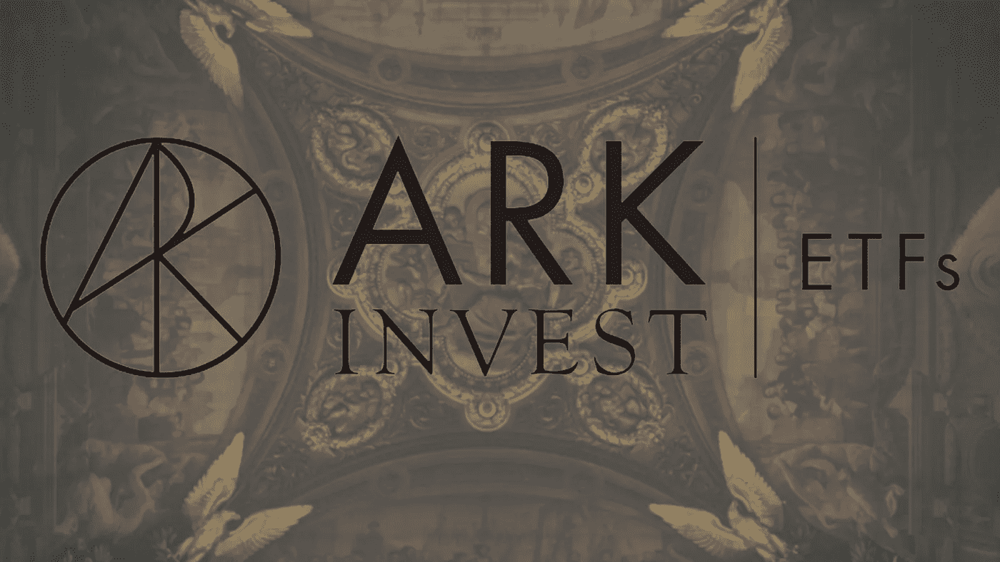
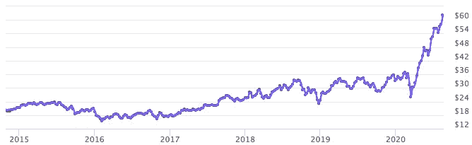
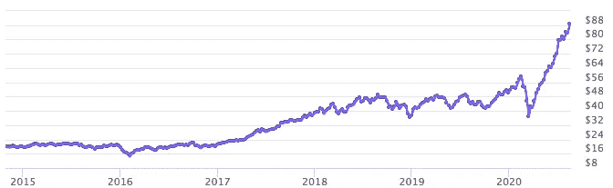
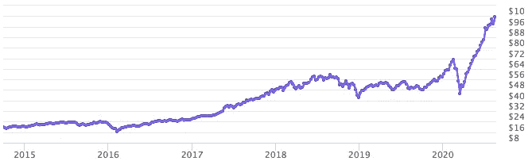
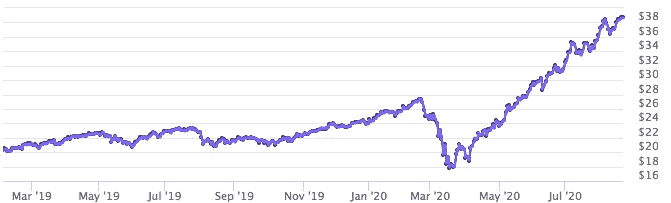

# 方舟，以及他们的创新和积极管理的 ETF。

> 原文：<https://medium.datadriveninvestor.com/ark-and-their-innovative-and-actively-managed-etfs-41af096172fb?source=collection_archive---------7----------------------->

2014 年 1 月，ARK Investment Management LLC 的首席执行官凯瑟琳·伍德(Catherine Wood)创办了自己的公司，并将创新引入了 ETF 市场。

# 方舟是什么？

ARK Investment Management LLC 成立于 2014 年 1 月，自那以来一直是创新投资的避风港。该公司创建了一些积极管理的 ETF，专注于破坏性和创新性技术。

同年 9 月 30 日，推出了 arkwetf 和 ARKQ ETFs 供购买。第一只 ETF 专注于人工智能和电子商务等技术，第二只专注于机器人技术。一个月后，ARKK 和 ARKG 已经向投资者公开。ARKK 关注的是整体创新，ARKK 关注的是“基因组革命”。差不多五年后，ARK 把 ARKF 带到了公众面前。方舟 ETF 家族的最新成员专注于金融科技。

方舟和指数 ETF。这两个组织分别是专注于 3D 打印行业的 PRNT 和专注于以色列创新公司的 IZRL。

# 首席执行官凯瑟琳·伍德

凯瑟琳·伍德是方舟投资管理公司的创始人兼首席执行官。她在该行业拥有超过 40 年的经验，并积极管理公司的产品。许多人说凯瑟琳可能会成为“新的沃伦·巴菲特”。由于她对创新的关注，近年来她吸引了很多关注。

# 主要的 ETF 产品。

## 1.方舟基因革命 ETF

*   **符号:** ARKG
*   **收盘价:**62.97 美元
*   **年费用率:** 0.75%
*   **在 ETF.com 上的综合评分:** B

有了这种金融资产，人们可以通过医疗行业的进步投资于生活质量的扩展和改善。ARKG ETF 专注于 CRISPR、基因编辑、靶向治疗、生物信息学、分子诊断、干细胞和农业生物学领域的公司。它被归类为主动股票 ETF，其净资产约为 13 亿美元。该 ETF 自成立以来的回报率为 19.76%，一年内的回报率为 55.87%。一些控股公司包括 I **nvitae Corp、Crispr Therapeutics Ag、Arcturus Therapeutics Holdin、Compugen Ltd、Illumina Inc、Twist Bioscience Corp、Pacific Biosciences Of Calif、Editas Medicine Inc、Personalis Inc 和 Seres Therapeutics Inc.**

Performance of ARKG since its inception. The image has been taken from [https://ark-funds.com/arkg](https://ark-funds.com/arkg)

## 2.方舟创新 ETF

*   **符号:** ARKK
*   **收盘价:**89.83 美元
*   **年费用率:** 0.75%
*   **ETF . com 综合评分:** B

ARKK ETF 专注于创新。它专注于各种行业，如专注于 DNA 的公司，能源、自动化和制造业的创新，共享技术和金融科技。我要说的是，这只 ETF 是其他 ARK ETFs 中已经包含的各种公司的集合。它的净资产达到 48 亿美元。**公司包括 Tesla Inc、Invitae Corp、Square Inc、Crispr Therapeutics Ag、Roku Inc、Proto Labs Inc、2u Inc、Llumina Inc、Zillow Group Inc 和 Editas Medicine Inc .**ARKK 自成立以来的回报率为 26.70%，一年内的回报率为 48.99%。

Performance of ARKK since its inception. The image has been taken from [https://ark-funds.com/arkk](https://ark-funds.com/arkk)

## 3.方舟自主技术和机器人 ETF

*   **符号:** ARKQ
*   **收盘价:**:55.74 美元
*   **年费用率:** 0.75%
*   **ETF . com 上的总体评分:** B

**自动运输、机器人和自动化、3D 打印、能源储存和太空探索**，仅仅是一个人可以通过将 ARKQ ETF 纳入他或她的投资组合来投资的一些行业。包括的一些资产有**特斯拉公司、2u 公司、Xilinx 公司、Materialise Nv-ADR、Proto Labs 公司、Alphabet 公司、Stratasys 有限公司、Jd。Com Inc-ADR，Trimble Inc，Deere & Co.** 它自成立以来产生了 17.21%的回报率，一年内的回报率为 39.91%。

Performance of ARKQ since its inception. The image has been taken from [https://ark-funds.com/arkq](https://ark-funds.com/arkq)

## 4.方舟下一代互联网 ETF

*   **符号:** ARKW
*   **收盘价:**105.04 美元
*   **年费用率:** 0.76%
*   ETF.com 上的综合评分: B

该 ETF 包括改变互联网以及我们使用和互动互联网的方式的技术。像**云计算和网络安全、电子商务、大数据和人工智能(AI)、移动技术和物联网(IoT)、社交平台以及最后但同样重要的区块链和 P2P 等技术。**它包括像 **Tesla Inc .、Square Inc——A、Roku Inc .、Sea Ltd——ADR、2u Inc .、Huya Inc——ADR、Zillow Group Inc——C、Spotify Technology Sa、脸书 Inc——A 级、Xilinx Inc .这样的公司**这只 ETF 自成立以来的回报率为 32.33%，一年内的回报率为 62.86%。

Performance of ARKW since its inception. The image has been taken from [https://ark-funds.com/arkw](https://ark-funds.com/arkw)

## 5.方舟金融科技创新 ETF

*   **符号:** ARKF
*   收盘价:38.77 美元
*   **年费用率:** 0.75%
*   **ETF . com 上的总体评级:** B

ARKF 是 ARK ETF 家族中最年轻的兄弟，专注于交易创新、区块链技术、风险转换、无摩擦融资平台、面向客户的平台和新中介等技术和行业。其持有的一些公司包括**Square Inc-A、Mercadolibre Inc、腾讯控股有限公司-uns ADR、苹果公司、Zillow Group Inc-C、洲际交易所公司、Sea 有限公司-ADR、Lendingtree Inc、Pinterest Inc-A 级和美团点评-b 级等公司。**虽然年轻，但该 ETF 自成立以来取得了 39.56%的业绩，净资产价值接近 2.21 亿美元。

Performance of ARKF since its inception. The image has been taken from [https://ark-funds.com/fintech-etf](https://ark-funds.com/fintech-etf)

## 6.方舟太空探索 ETF

*   **符号:** ARKX
*   **收盘价:** $20.91
*   **年费用率:** 0.75%
*   **ETF . com 上的总体评级:**不适用

2021 年 3 月 30 日，ARK investments 为市场带来了另一只 ETF。这次是与太空探索公司合作。这只 ETF 中一些著名的公司有:天宝公司(Trimble Inc .)、克瑞托斯防务与安全公司(Kratos Defense & Security)、洛克希德马丁公司(Lockheed Martin Corp .)和波音公司(Boeing Co/the)

*来源*

1.  [https://ark-funds.com/](https://ark-funds.com/)
2.  [https://www.etf.com/](https://www.etf.com/)

免责声明:

为了投资这些市场，你必须意识到风险并愿意接受它们。不要用你输不起的钱去交易。本文包含的信息仅用于教育目的，不作为任何特定投资的建议。在任何市场交易都有很高的风险，可能不适合所有的投资者。

*更新*

2021 年 4 月 1 日:ARKX ETF 新增。