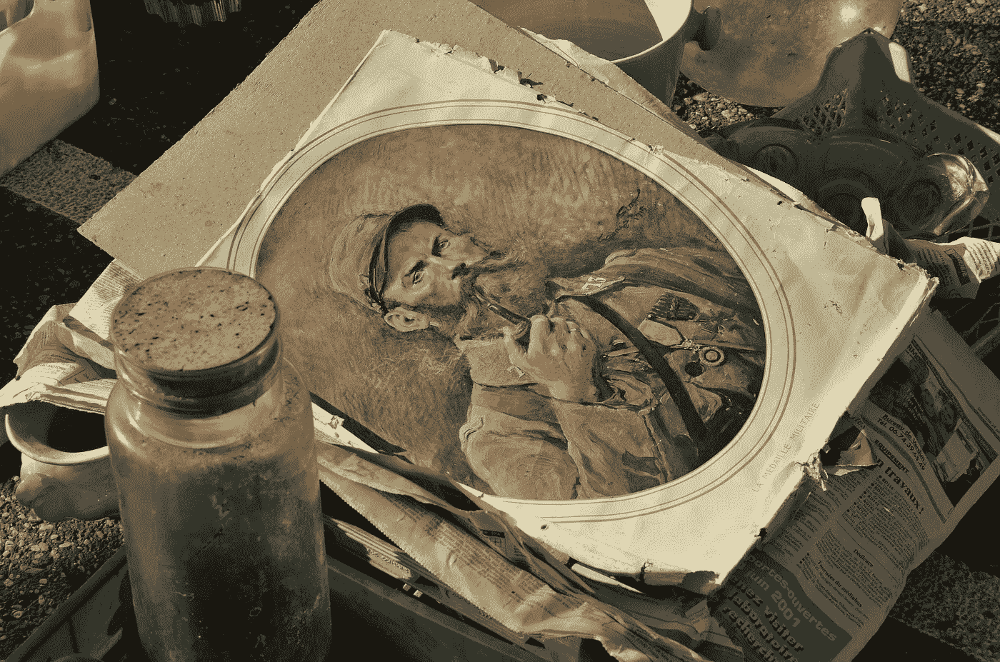

# 艺术品市场:有哪些新的风险？

> 原文：<https://medium.datadriveninvestor.com/art-market-what-are-the-new-risks-2e705d95c45d?source=collection_archive---------17----------------------->

[Eveline de Bruin](https://pixabay.com/it/users/MrsBrown-692504/?utm_source=link-attribution&utm_medium=referral&utm_campaign=image&utm_content=1423779) Pixabay

# *新冠肺炎危机放大了风险*

艺术世界是一个独立的宇宙，它依赖于关系和运作，只有少数人能够接触到。生活在一个“利基”维度，运营商运行的风险很多。此外，在最近的健康突发事件后，网络犯罪激增、加强，并立即采取行动，对基本服务部门以及“特权”部门(如艺术界)发起越来越有针对性的攻击。

毕竟，至少很自然的是，犯罪分子的兴趣转向了那些“富裕”的商品部门，那里的资金流动引人注目，利润率更高。

 [## 为什么加密对日常生活至关重要？数据驱动的投资者

### 你几乎每天都要输入密码，这是你生活中最基本的加密方式。然而问题是…

www.datadriveninvestor.com](https://www.datadriveninvestor.com/2020/02/10/why-encryption-is-critical-to-everyday-life/) 

由此衍生出一种总是更有说服力的必要性，即装备自己来保护数据的遗产，即使仅仅是在隐私方面，免受恶意罪犯的暴力攻击，这些罪犯总是更有准备和更具侵略性。

# *漏洞和匿名*

艺术界，像其他主要属于富裕阶层的部门一样，有着脆弱的悠久传统，仅仅是因为他们需要保持绝对的匿名性，使用的主要是流动性和控制不善的资金或不可靠的中介！

这场卫生危机也影响到了艺术品和珍贵艺术品领域，这些领域继续在网络平台上运营。这种“交易”并不总是合法的，但它唤醒了客户和崇拜者，也唤醒了反垄断当局，仅在 2019 年，就有一些数字显示，反洗钱罚款 58 起，全球金额超过 80 亿美元！

艺术品市场参与者必须遵守欧洲议会和理事会发布的第 5 号反洗钱(欧盟)指令 2018/843，该指令旨在防止金融系统被用于洗钱和资助恐怖主义的目的，他们有义务在当年 1 月前将其纳入各种国家法律；2019 年 10 月 4 日第 125 号执行法令于 2019 年 11 月生效。根据这些规定，该部门的经营者必须遵守**合规方案**，旨在**阻止和防止非法贩运**，核查交易和报告可疑活动，以便**进行审慎监督**。

# *OFAC 指导方针*

在美国，欧洲尚未对《银行保密法》进行修改，该法可追溯到 1970 年，也被称为*货币和外国交易报告法*，该法正在扩展到这部分业务，以帮助美国金融机构帮助美国政府机构预防和侦查洗钱活动。控制变得更加严格:最近 OFAC ( *外国资产控制办公室*)，财政部外国资产控制处，对 **Nazem Said Ahmad** 的控诉就是证明，他涉嫌通过贝鲁特的一家艺术画廊洗钱，为真主党提供财政支持！

为了更好地遵守，在艺术界，OFAC 发布了指导方针，明确要求遵循以下程序:

- **客户尽职调查**不仅要遵循充分的 KYC，还要追踪交易和作品的供应链，从最初的出处到最后的获得！

- **充分的反洗钱流程**以实施严格的反洗钱控制，通过记录保存、风险评估和所谓的“**危险信号**报告来触发有效、可扩展和灵活的程序。

- **最后一个有效收购方**，由于要追溯到中间人和复杂的“幽灵”交易背后的真正所有者非常复杂，由空壳公司和层层通道组成。

# *关键点*

为了维护更加透明的艺术市场，确定了以下要点:

-禁止艺术品市场参与者与受制裁的个人和实体进行交易；

-行为者有监管义务执行量身定制的基于风险的合规方案；

-任何从事违禁交易的实体都可能受到民事或刑事制裁。

如果你拥有有价值的作品、有价值的画作或收藏家的物品，做好更严格、更彻底的管控准备，这无疑不会完全化解艺术品市场的风险，但肯定有助于将其更“危险”的影响降至最低。

版权所有

***拉斐尔·阿格莫，律师***