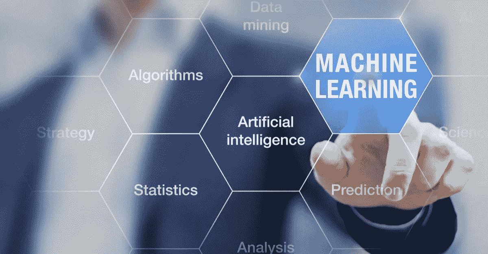

# 人工智能

> 原文：<https://medium.datadriveninvestor.com/artificial-intelligence-101-813235a4be77?source=collection_archive---------14----------------------->

“人工智能”和“机器学习”是目前几乎每个行业和应用领域都在使用的流行词汇。通过一瞥或一触解锁我们的手机，我们应该听的音乐的提示，以及我们应该看的电视节目——这些都是这些流行语在我们日常生活中的影响的例子。

这项技术还改变了医疗保健、营销、运输、金融服务和全球许多行业的运营方式。例如，金融服务正在收获人工智能解决方案的回报，这些解决方案正在信贷、风险、欺诈检测、保留、交叉销售、个人援助和投资方面创造更智能、更高效的决策。

有幸为许多银行和金融服务机构开发和实施人工智能解决方案后，我遇到了一个常见的问题—*通俗地说，这些术语到底是什么意思，是什么让它们在今天如此适用？*

让我们试着分解它。

***本质上，AI 是机器展现出来的智能，与人类展现出来的自然智能形成对比。***

正如我们人类通过我们的经验“学习”我们的隐性知识(嵌入人类大脑中的直觉知识)，在重复的任务中逐渐提高，人工智能模型也需要以类似的方式“训练”。

机器学习(ML)是人工智能的一个子集，它基于这样一个概念，即让机器访问大量数据或信息，并让它们在最少的人工干预下进行自我学习。这些 ML 算法可以从各种类型的数据中学习，从数字和文本到图像和音频。简单地说，这是通过统计学、数学、计算机科学和物理学的结合来实现的。

最大似然算法工作在一个概率系统上——基于输入给它们的大量输入数据，它们的目标是以一定程度的确定性对期望的输出做出决策。随着时间的推移，算法通过不断评估算法预测和预期结果之间的差异来“学习”如何做出准确的决策。当差异较大时，模型受到的惩罚更多；当差异较低时，处罚较少。通过这种方式，算法被慢慢地调整，直到它能够产生想要的结果。

AI 不是一个新奇的概念；其实已经有几十年了。然而，数据和云计算的爆炸式增长——人工智能模式成功的两个关键因素——使人工智能更加有效，并导致其在工业中的广泛应用。

每天产生的数据量实在令人难以理解。客观地说，仅过去几年就产生了世界上 90%以上的数据！按照我们目前的速度，每天会产生超过 2.5 万亿字节的数据，随着世界变得越来越数字化，这一数字还会呈指数级增长。

云服务提供商的崛起——如亚马逊网络服务(AWS)或微软 Azure——是人工智能开发和生产的基础。它使企业能够以可承受的成本处理大量数据和计算密集型服务。

由于数据是机器学习算法的食物，并且因为计算能力是这些算法背后的引擎，人工智能的能力只会得到改善。难怪分析师称人工智能为第四次工业革命。

值得注意的是，ML 应用程序具有降低运营成本、增加销售额和解决许多业务问题的潜力。然而，如果使用不当，它们可能会导致金钱损失或名誉受损。因此，当下列一种或多种情况适用时，考虑使用 ML 来解决任务是一个很好的选择:

1.有大量的数据。

2.逻辑规则或等式太复杂，比如语音或面部识别。

3.规则在不断变化，就像欺诈检测一样。

4.环境或基础数据不断变化，需要系统不断适应——如需求预测或金融市场交易。

随着我们的世界经历冠状病毒的人类和经济成本，该领域的创新已经在帮助世界在这些麻烦时期变得更安全。此外，适应这种不断变化的环境将被证明是企业生存的关键，无论企业规模大小。虽然人工智能可能没有所有的答案，但该技术有许多方法可以帮助企业领先，或者至少避免落后。

我希望这能澄清为什么围绕这些流行语会有这样的炒作。

*Yossi 拥有电气工程学士学位，是一名人工智能爱好者，曾为国内外的银行和金融服务提供人工智能解决方案。Yossi 一直对投资充满热情，目前正在利用他在机器学习、技术和数据方面的专业知识，在全球股票市场推动公正和适应性强的投资策略。如需了解更多信息，请联系 yossi@alchetec.co.za*[*linked ln*](http://www.linkedin.com/in/yossi-ziskin-014932119)*或发送电子邮件*