# 人工智能——代理和环境

> 原文：<https://medium.datadriveninvestor.com/artificial-intelligence-agents-and-environments-9b93d73791f3?source=collection_archive---------0----------------------->

**了解智能体(机器人、机器人、程序)和环境(工作场所)。**

1.  **为什么是代理和环境？**
2.  **特工**
3.  **环境**
4.  **代理和环境的示例**
5.  **结论**

主体和环境是人工智能的两大支柱，我们的目标是构建智能主体并在环境中工作。如果你广泛地考虑，代理是解决方案，环境是问题。

简单来说，即使是初学者或研究人员也能理解这一点，并将其定义为**代理作为游戏，环境作为背景。**

用几个例子来定义代理和环境，以便读者可以注意到它的上下文。代理和环境不是那么简单的。这两种情况下都存在类型，下图总结了这些类型。

在我们开始之前，让我们定义几个将在整篇文章中遇到的术语。

**感知**:什么智能体看环境。

**感知历史**:是特定时期出现的感知历史。

**执行器**:将某物付诸行动的机械装置。

**效应器**:激活的代理器官(手和腿)。

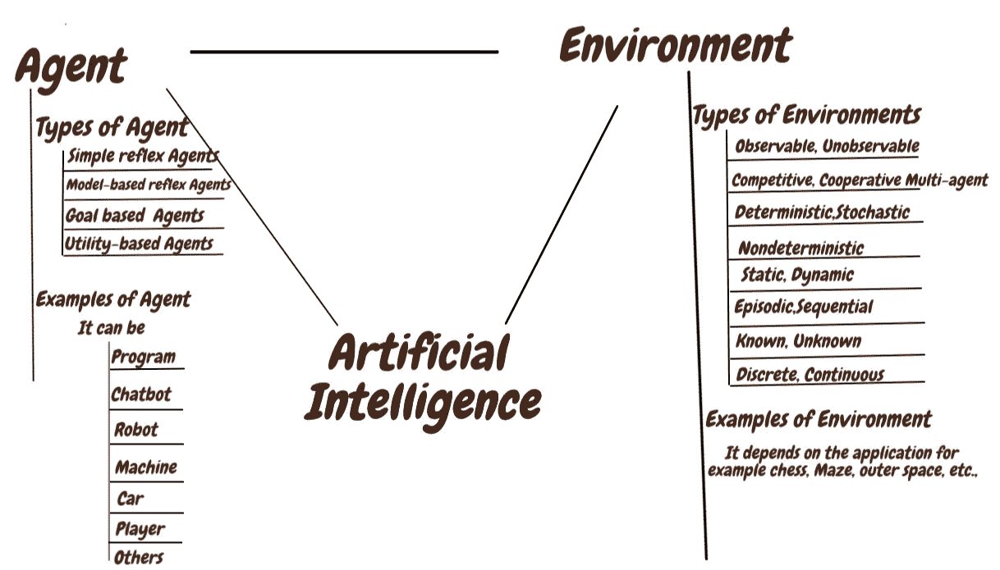

**Types of Agents and Environments**

这是更好地参考更多的第一和第二章在一个现代的方法由斯图尔特罗素，彼得诺维格。现在，我们以一种易于人工智能新手或初学者理解的方式来定义代理和环境的类型。在定义上述内容时，我们将会遇到在不同应用程序或领域中会遇到的其他概念。cc

环境是代理将要工作的地方。一般来说，环境给予代理人可能的奖励、状态和行动。

人工智能的任务环境显然是巨大的。我们确定了任务环境可以分类的几个维度。理解人工智能需要理解环境。

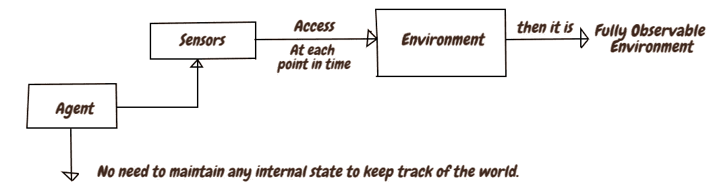

如果一个智能体的传感器能让它在每一个时间点上获得环境的完整状态，那么我们说任务环境是完全可观测的。

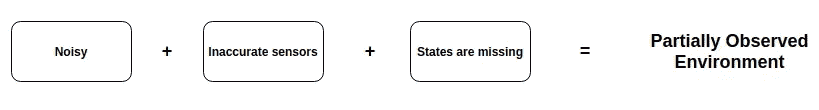

由于噪声和不准确的传感器，或者由于状态的一部分仅仅从传感器数据中丢失，环境是部分可观察的。

如果代理根本没有传感器，那么环境是不可观察的

只有一个代理参与环境是单个代理。一个以上的智能体与环境交互，这就是多智能体。

如果一个代理(实体)最大化其性能超过环境中的其他代理(实体),则是竞争多代理环境。一个代理可以基于物理法则被对待(根据物理法则行动)。

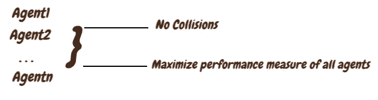

避免冲突最大化所有代理的性能度量，因此，它是部分合作的多代理环境。

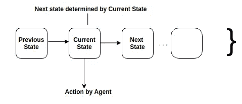

如果环境的下一个状态完全由当前状态&主体执行的动作决定，那么我们说环境是确定性的，否则就是随机的。

在多主体环境中，不确定性纯粹来自于其他主体的行为。在确定性中，其它智能体的动作不能被任何其它智能体(每个智能体)预测。

如果一个环境不是完全可观察的或不确定的，那么它就是不确定的。在非确定性环境中，行动以其可能的结果为特征，但不附带任何概率。

其中,**随机**通常意味着关于结果的不确定性根据**概率**来量化。**不确定性**环境描述通常与要求代理对其行动的所有可能结果取得成功的绩效测量相关联。

在**情节**环境中，代理人的经历被分成原子情节。在每一集里，代理接收一个感知，然后执行一个动作。下一集不依赖于前几集采取的行动。许多分类任务是阶段性的。

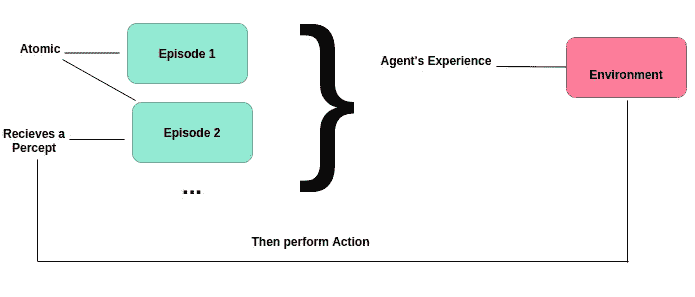

在**连续**环境中，当前的决策可能会影响所有未来的决策。情景环境比顺序环境简单得多，因为代理不需要提前考虑。

静态环境很容易处理，因为代理不需要一直观察世界。在决定一项行动时，也不需要担心时间的流逝。

如果环境可以在一个代理人深思熟虑的时候改变，那么我们说这个环境对于这个代理人来说是动态的；否则环境是静态的。

**动态**环境不断地询问代理它想做什么，如果它还没有决定，那就算作决定什么也不做。

**半动态环境**:如果环境本身不随时间的推移而变化，但代理人的绩效得分变化，则环境为**半动态**。

在这两个不同的环境中，适用于环境的状态，时间的处理方式，以及代理人的感知和行动。国际象棋-离散、连续-自动车辆驾驶。

这两个都是专指环境本身而非动因；如果一个已知的环境，所有行动的结果是给定的。如果环境是未知的，代理将不得不学习它是如何工作的，以便做出好的决策。这些环境是**强化学习**中**开发**(已知环境)和**探索**(未知环境)的好例子。

代理是我们问题的解决方案。代理需要人工智能提供的智能在环境中工作。每个代理都必须执行自己的代理程序，代理功能，从感知到行动的映射。下图对此进行了描述。

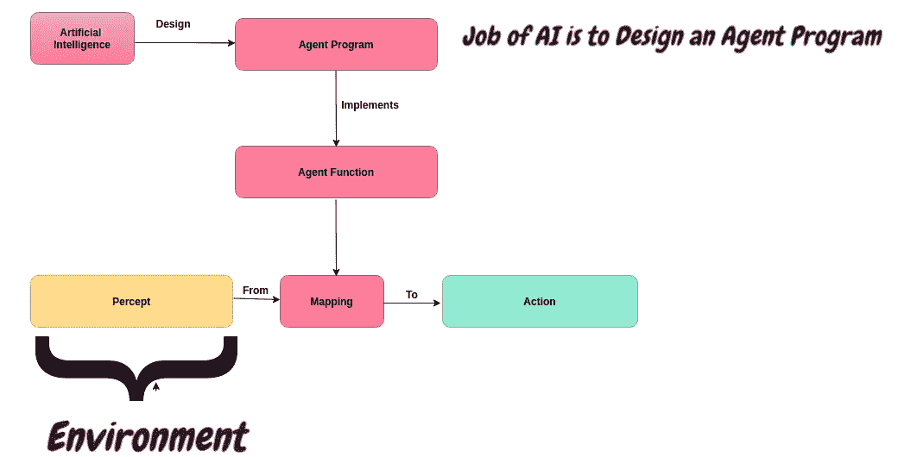

**代理的操作**:代理程序、代理函数是操作。

**代理程序**:它运行在某种带有物理传感器和执行器的计算设备上——称之为架构。

**Structure of Agents**

因此 **Agent =架构+程序**；显然，程序应该适合于架构。程序动作和架构示例如下所示。

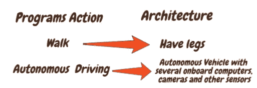

体系结构使来自传感器的感知可用于程序，运行程序，并在生成程序的动作选择时将其提供给执行器。让我们讨论代理端的概念。

代理程序结构将当前感知作为来自传感器的输入，并将动作返回给执行器。

**Relation among the components of an agent and environment**

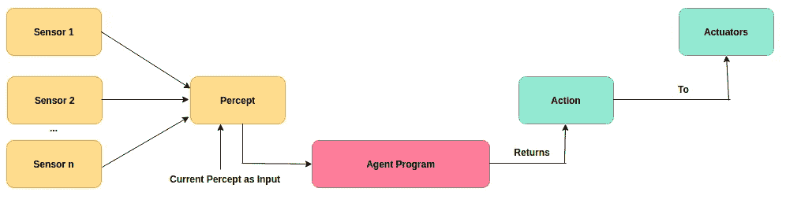

**Structure of Agent Program**

代理程序将当前感知作为输入，因为从环境中无法获得更多信息。

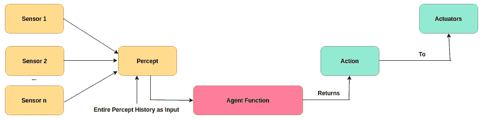

将整个感知历史作为输入的代理函数。将当前感知作为输入的代理程序和获取整个感知历史的代理函数之间的区别。

有四种基本的代理程序，它们体现了几乎所有智能系统的基本原理。它们是**简单反射代理**、**基于模型的反射代理**、**基于目标的代理**和**基于效用的代理**。每个代理程序以特定的方式组合特定的组件来生成动作。

它是最简单的代理，因为这些代理直接从感知中选择动作，而忽略感知历史。简单的反射行为甚至发生在更复杂的环境中。让我们来定义条件-动作规则。

**条件动作规则**:连接，定义为“对视觉输入进行处理，建立条件，然后在代理程序中触发动作。这种联系被称为**“条件-动作规则”。**简单反射剂的示意图，定义如下

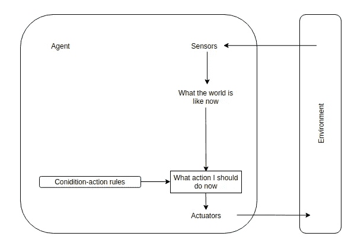

**Depicts how condition-action rule allow the Simple reflex agent to make the connection from percept to action**

当代理部分观察环境时，代理需要跟踪它现在看不到的世界的一部分。也就是说，主体应该保持某种内部状态，这取决于感知历史和当前状态的未观察方面。也就是说，在图像上，它被定义为

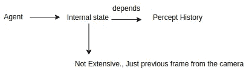

**更新内部状态**:代理程序中需要编码两种知识。

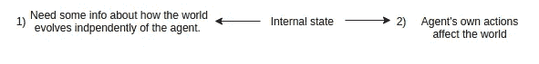

**模型**:无论是在简单的布尔电路中实现，还是在完整的科学理论中实现的“世界如何运转”的知识，都称为世界的模型。使用这种模型的代理被称为基于**模型的代理**。

所以，**当前状态=旧内部状态+当前感知**

**基于模型的反射代理的结构**

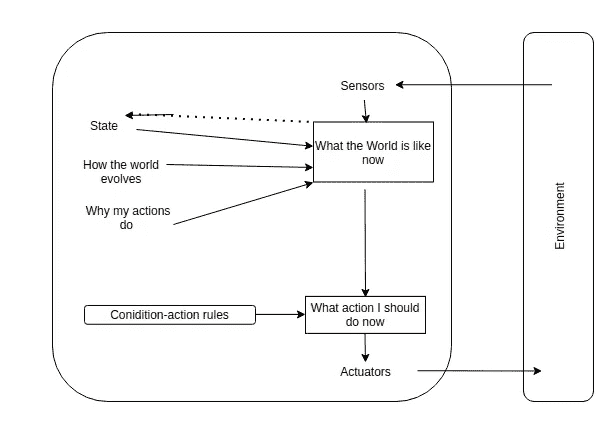

**Structure of Model Reflex agent**

代理需要某种描述理想情况的目标信息。

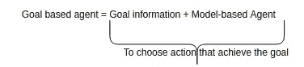

搜索和规划是人工智能中实现智能体目标的子领域。简单地通过将目的地指定为目标，基于目标的代理的行为可以很容易地被改变以前往不同的目的地。基于目标的代理结构被定义为

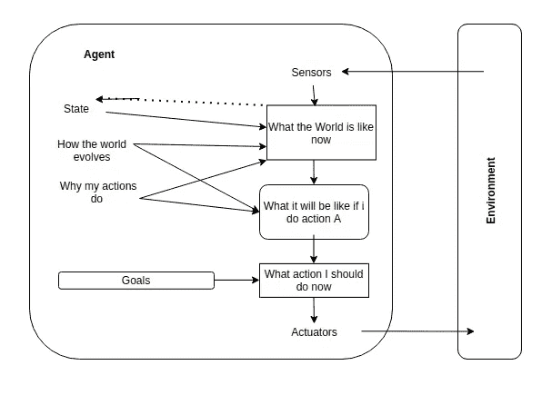

**Structure of Goal-based Agent**

目标提供了快乐和不快乐状态之间的区别，用**“快乐”&“不快乐状态”**具体说明。指定快乐&不快乐并不意味着科学，经济学家&计算机科学家使用术语**“效用”。**

一个代理的效用函数被描述为一个性能测量的内部化。

基于目标的智能体和基于效用的智能体在灵活性和学习方面有很多优势。当目标不充分时，效用代理人做出理性的决策 1)效用函数规定了适当的权衡。2)效用提供了成功的可能性，可以根据目标的重要性进行权衡。

一个理性的基于效用的主体选择最大化行动结果预期效用的行动。基于实用程序的代理结构的结构描述如下。

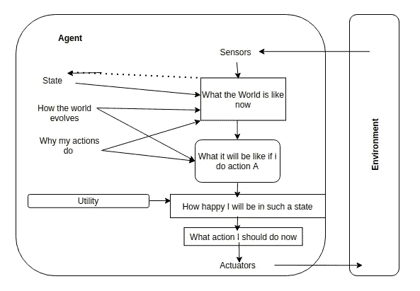

**It is Model-based, Utility-based agent**

由于它们的上下文、应用和必要性，代理和环境的例子很多。下图中列出了可能的和众所周知的代理和环境。

**Simple agents and environments**

在我们为我们的应用程序开发任何类型的智能代理之前，必须了解代理和环境。为了设计任何基于环境的智能代理，有必要了解需要构建什么类型的代理，它需要什么，什么样的设备，等等。，最好是参考更多的第一和第二章在一个现代的方法由斯图尔特罗素，彼得诺维格。**。**

感谢您阅读我的文章，感谢您的反馈、评论和分享。

# 参考资料:

本文基于斯图尔特·拉塞尔、彼得·诺维格所著的《人工智能:现代方法》中的第二章。