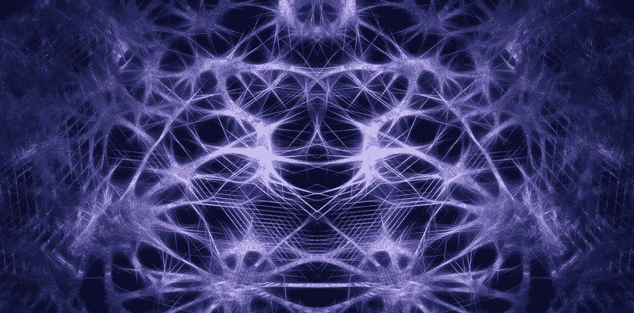
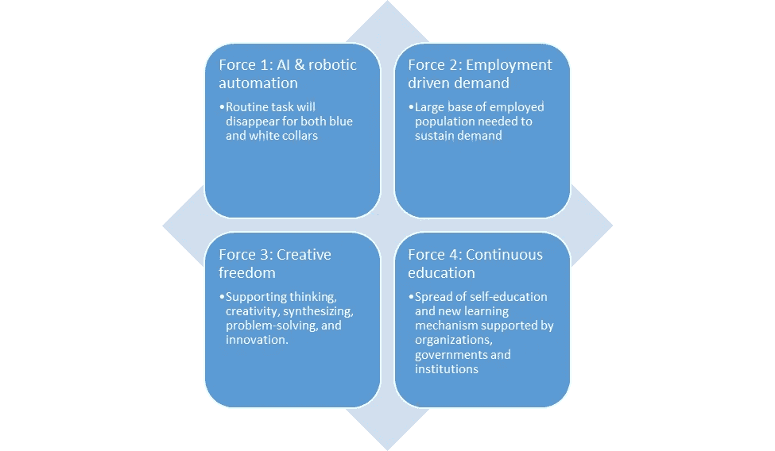
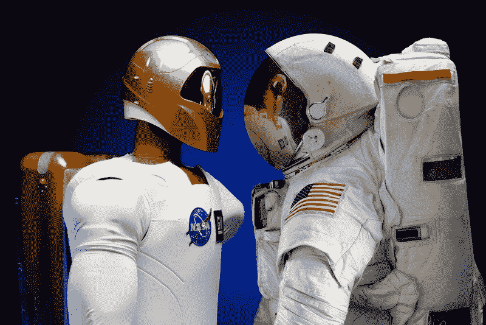
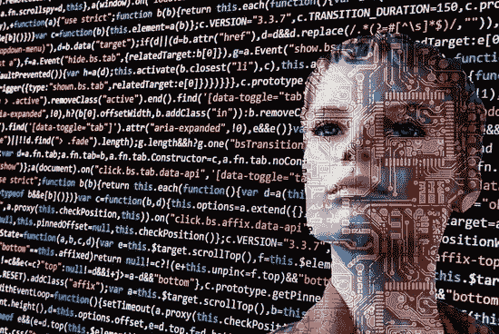

# 人工智能和人类意识

> 原文：<https://medium.datadriveninvestor.com/artificial-intelligence-and-human-awareness-1226aef2f111?source=collection_archive---------8----------------------->

每天我们都听到人工智能在越来越多的行业中取得突破，慢慢渗透到我们生活的几乎每个方面:当媒体报道[人工智能出问题](https://medium.com/syncedreview/2018-in-review-10-ai-failures-c18faadf5983)(滑稽或怪异)时，各国政府围绕着将[人工智能引入国家立法](https://www.ft.com/content/4fd088a4-021b-11e9-bf0f-53b8511afd73)来监管[自动化接管工作](https://www.forbes.com/sites/jackkelly/2019/04/15/walmart-is-deploying-thousands-of-robots-to-replace-human-workers-what-this-means-for-your-job/#1a87a5be51d8)，[自动驾驶汽车](https://www.dailymail.co.uk/news/article-6997461/Human-Driving-Association-pushes-against-self-driving-cars-calls-constitutional-amendment.html)，[医疗诊断工具](https://hitinfrastructure.com/news/pathologists-see-artificial-intelligence-as-promising-diagnostic-tool)或者更简单地说[人工智能组件从我们购买的任何新设备中获取数据](https://www.wired.com/story/alexa-google-assistant-echo-smart-speaker-privacy-controls/)。

被这种嗡嗡声包围，感觉就是再过几十年，AI 就会接管，人类就会无事可做，*要么在贫困中熄灭，要么整天聊天，被社交媒体“囚禁”！*

事实上，这些情景并没有考虑到我们这个物种进化和适应变化的能力。事实是，我们越是以各种形式应用人工智能，就越能清楚地看到，人工智能应用程序只能处理它们可以被设计的任务，因此，即使精心制作，也总是会出现无法“预料”的情况，这些情况会使系统失去控制，需要人类意识来管理。

 [## AI 将军是否已经超过了人类的智力容量？数据驱动的投资者

### 不仅在游戏中，而且在劳动力市场上，机器都比人类聪明。在今天的许多领域，使用…

www.datadriveninvestor.com](https://www.datadriveninvestor.com/2020/02/12/has-general-ai-exceeded-the-intellectual-capacity-of-humans/) 

这就是为什么科学家会问自己，智能机器的能力可能会在多大程度上发展出与我们不一致的目标，以及我们将如何围绕环境的剧烈变化而进化。在这两种情况下，这都将是我们进化过程中的重要一步。

这将会带来多大的破坏性？

很多。新的工作、新的生活方式、新的报酬方式和新的社会基础设施，通过社会不平等的过渡，政府和组织将需要与尚未制定的教育计划和手段保持平衡。在这种意义上，工作经验、学术头衔或拥有的证书将失去价值，因为“研究”技能将填补人工智能大规模使用带来的缺口。自由时间、创造自由和持续的持续教育将催生一场新的“文艺复兴”，这是人类意识的一次飞跃，跨越了一些关键的门槛，实现了智力有效性的巨大飞跃。

这种变化不一定是“友好的”，所以让我们密切关注将塑造我们未来的竞争力量。

**力 1:极度自动化**。与前几次相比，这一波自动化有双重副作用。第一，它将影响大多数经济部门，因为每个部门都有可以自动化的任务；这意味着我们不会有经济消失和其他繁荣:他们*都将受到影响和消化变化*。第二，它将*影响社会基础设施的各个层面*，彻底改变社会的面貌。在过去工业革命的自动化浪潮中，我们经历了从农民到工人，从蓝领到白领的转变。随着人工智能驱动的自动化，受影响较小的工作是今天被认为最“脆弱”和薪酬较低的工作；“天性”胜于“培养”的工作岗位将会继续存在下去，即使这并不意味着它们会成为高薪工作，因为这份工作并不稀缺。呼叫中心是一个很好的例子:虽然人工智能机器人可以接听电话，连接到特定部门，道歉或提供折扣，但它无法与客户建立情感联系。另一个例子是照看孩子:在合适的温度下加热牛奶，以合适的频率唱歌和摇摇篮，这不足以让你的孩子由一台“机器”照看。

这些“幸存”工作的共同特点是“情感接触”。

第二种力量:就业驱动的需求。如果购买力不存在，无论你生产的产品有多便宜，都没有生意可做。这将意味着新形式的工资将会出现，各种组织和政府将会发挥作用，捍卫国内需求，以保护其市场竞争力。就业立法需要适应承认和促进时间消费或促进消费作为生产范式的一个组成部分。这一进程已经开始，并在不同层面启动了若干举措。一个很好的例子是[2016 年由世界银行集团和国际劳工组织牵头在联合国发起的全球伙伴关系"全民社会保护 USP2030](https://www.social-protection.org/gimi/gess/NewYork.action?id=34) **，**展示了各国在全民社会保护方面取得的成就，或者是[国际劳工组织第 202 (2012)](https://www.ilo.org/dyn/normlex/en/f?p=NORMLEXPUB:12100:0::NO::P12100_ILO_CODE:R202) 号社会保护最低标准建议，这是一项政策和标准，得到了所有政府、雇主和工人的同意，规定了一套基本的社会保障保障，至少应确保全民享有基本医疗保健和基本收入保障预计明年会有更激进的措施出台，在许多国家，围绕向所有居民提供无条件现金转移的争论已经开始。

**力三:创作自由。** *人类的智慧不在于解决问题，而更在于定义问题的能力。结合通过自动化任务获得的自由时间，人工智能将提供洞察力，这将促进创造力、综合能力、解决问题、支持思维和创新。多项人工智能发现将释放人类思维的力量，改变生活方式。大多数成功的组织将审查其嵌入“创造自由”实践的流程，放弃传统的薪酬结构和福利，并逐步向创业模式发展，消除障碍，使全球薪酬正常化。换句话说，*可持续的利润将流向组织，这些组织将利用人工智能能力增强工人的技能，而不是通过自动化他们的工作来取代他们。**

**力 4:继续教育**。通过解决问题，人工智能将增强*人类智能*来定义人工智能将帮助解决的新问题:这一循环将完全改变我们进行研究的方式，这将不再是大学机构或研发部门的垄断。一个*所有领域研究的民主化*将推动制造平台、标准化供应链(联合或第三方生产范式)和新的知识产权范式的创建，这些范式将跨越所有商业领域。一个明显的例子是 Rishab Jain 的案例，他是美国最优秀的年轻科学家，一名七年级学生，他开发了一个人工智能应用程序，利用人工智能改善了对胰腺癌的治疗。

**综上所述，** AI 是一个快速增长且高利润的行业，毫无疑问。成功的人工智能实施将自动执行与特定工作相关的部分任务，将荣誉和职责留给人类来执行他们工作的所有方面，这些工作需要判断力、社交技能和其他特定的人类能力。因此，*人工智能不会接管整个就业市场(以及我们的生活),但它将通过激发创造力和促进更高水平的人类意识来增强我们的能力:在一段可能的文化停滞期之后，一场新的“文艺复兴”*。

________________________________________________________________________

*免责声明:本文代表的观点或意见是个人的，仅属于文章作者，不代表作者在专业或个人能力上可能或可能不相关的人、机构或组织的观点或意见，除非明确声明*。

*原载于*[*https://www.linkedin.com*](https://www.linkedin.com/pulse/artificial-intelligence-human-awareness-flavio-aliberti/)*。*