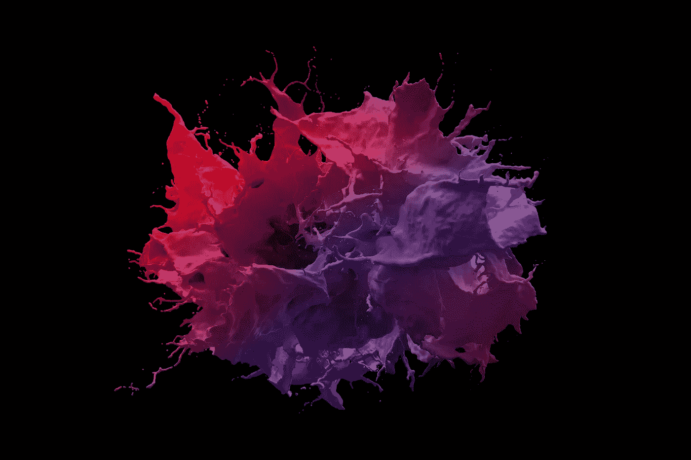

# 人工智能和语言学

> 原文：<https://medium.datadriveninvestor.com/artificial-intelligence-and-linguistics-dc9eeee775dd?source=collection_archive---------0----------------------->

Photo by — [@deeezyfree](https://unsplash.com/@deeezyfree)

## 自然语言处理和语言的科学研究

过去几天，我一直在写关于自然语言处理(NLP)中不同工具的文章。这是一个有趣的过程，主要集中在[通用应用程序](https://medium.com/@alexmoltzau/nlp-with-python-e0b7dbd720d6)和三个用于处理 python 语言的包上。这三个包分别是[空间、NLTK](https://medium.com/@alexmoltzau/lets-talk-about-spacy-fe142b866ac2) 和[节](https://medium.com/@alexmoltzau/stanza-python-nlp-6132c2e101c3)。这篇文章将仅仅触及那些试图理解语言学的人所写的被认为是语言学的东西的表面。如果您有任何意见，请随时投稿。这主要是基于维基百科上的[语言学页面。](https://en.wikipedia.org/wiki/Linguistics)

## 为什么是语言学和 AI？

人工智能领域的努力通常与书面或口头语言有关。

在我研究了与人工智能相关的自然语言处理之后，我认为我忽略了重要的一点，那就是:语言学。

如果我们要理解语言或言语事件，那么就有大量现有的研究领域值得探索。

## 什么是语言学？

> 语言学是对语言的科学研究。它包括对语言形式、语言意义和语境中的语言的分析。语言学家传统上通过观察声音和意义之间的相互作用来分析人类语言。

传统上，它通过观察声音和意义之间的相互作用来分析人类语言。

它还涉及影响语言的不同因素，通常是:

*   社交。
*   文化。
*   （有关）历史的
*   政治的

语言学和基于语言的语境通常部分是通过这些不同的途径决定的。

## 语言学谁或什么？

Photo by [@asnim19](https://unsplash.com/@asnim19), Unsplash

这是一张帕尼尼三明治的图片。

帕尼尼(意为“面包卷”)是一种三明治，由意大利面包制成，通常通过烧烤或烘烤加热。

如果你在欧洲的某些地方，它可能会看起来更长更舒展，这在昂贵的咖啡店里很常见。

Pāṇini 也是公元前 6 世纪的印度语法学家，被认为是最早从事语言记录和描述活动的人。

A 17th-century birch bark manuscript of Pāṇini’s grammar treatise from Kashmir ([source, CC BY 4.0](https://en.wikipedia.org/wiki/P%C4%81%E1%B9%87ini#/media/File:Birch_bark_MS_from_Kashmir_of_the_Rupavatra_Wellcome_L0032691.jpg))

看，语言可以随着时间的推移表达不同的意思！

想象一下 2020 年在欧洲叫你儿子帕尼尼。

也许用这个词不太合适。

Pāṇini 和后来的印度语言学家巴特里哈里对索绪尔提出的许多基本观点都有重大影响。

他毕竟是梵语教授，被广泛认为是现代结构语言学之父，与查尔斯·皮尔士站在符号学的另一边，尽管索绪尔使用的概念是符号学。

 [## 商业价值和人工智能的 5 个原则|数据驱动的投资者

### 提取商业价值很难。我是说真的很难...说到高级分析，这一过程甚至…

www.datadriveninvestor.com](https://www.datadriveninvestor.com/2020/07/07/5-principles-for-business-value-and-artificial-intelligence/) 

## 语言学的相关研究领域

相关的学习领域可以(*转述)*:

*   ***历史和进化语言学:*** *关注语言如何在一段延长的时间内变化和成长。*
*   ***符号学:*** *通过符号和标志对直接和间接语言的研究。*
*   ***文学批评:*** *对文学、电影、艺术或出版材料的历史和意识形态分析。*
*   ***翻译:*** *将书面/口头文本中的意义从一种语言或方言转换并记录到另一种语言或方言中。*
*   ***言语-语言病理学:*** *在认知层面治愈语音残疾和功能障碍的矫正方法。*

我们还可以考虑四个主要的子学科:

1.  历史语言学。
2.  句法和词法。
3.  语义学和语用学。
4.  语音学和音韵学。

## 1.历史语言学

据说历史语言学起源于 18 世纪早期的语言学(Campbell，1998):

文献学通常被定义为对文学文本以及口头和书面记录的研究，确定它们的真实性和原始形式，并确定它们的意义。

早期的重要性是建立语系和重建旧语言。

## 2.句法和形态学

句法和形态学是语言学的分支，研究有意义的语言单位如词和词素的顺序和结构。

规则和约束是如何支配一种语言的使用者将单词组织成句子的？

这是语法学家研究的一个问题。

语素——子词单位，如前缀和后缀，可以用类似的方式研究。形态学家。

是的，这些话听起来有些晦涩，很少有人理解。

*狗*和*狗*关系密切，区别仅在于复数语素“-s”。

This is a happy dog, not several happy dogs (photo by [@joeyc](https://unsplash.com/@joeyc), Unsplash)

仅仅一个字母就可以改变一个单词的意思。

这里有一个有趣的事实——说英语的人可以直观地推断出*狗*之于*狗*如同*猫*之于*猫*；并且，以类似的方式，*狗*对于*狗捕捉器*就像*盘子*对于*洗碗机*一样。

这不是已知的。

文言文几乎没有词法，几乎完全使用“自由”语素，依靠词序来传达意思。

汉语，名词单复数形式都一样。你可能需要定义一个数字，使用量词或模糊的复数形式(一些、几个、几个等等)。)反而。

如果你想要一个有点难的单词，试着说:**形态音系学**。它是研究词素内部发生的音变的学科。

这就是它能变得多具体(也许令人困惑)的原因！

Morphing Frame by Polina Zinziver (source: [GIPHY](https://giphy.com/gifs/animation-animated-gif-frame-by-xT9IgoGnDMxtAjlxjq))

## 3.语义学和语用学

你可能已经看到语言学和人工智能领域或一般编程之间的直接联系。

**“语义学**是对语言意义的语言学和哲学研究，*编程语言*，形式逻辑和符号学。”

在这里，你可以清楚地看到从语言学到编程语言的直接联系，尽管其他分支学科也是相关的。

能指是什么意思？

The word ‘Wikipedia’ represented in ASCII binary code, made up of 9 bytes. (Source: [Atyndall](https://en.wikipedia.org/wiki/Binary_code#/media/File:Wikipedia_in_binary.gif) [CC BY-SA 3.0](https://creativecommons.org/licenses/by-sa/3.0))

语义学关注的是能指之间的关系——比如单词、短语、标记和符号——以及它们在现实中所代表的意义。

那是…他们的外延。外延在现实中代表什么？

**外延**是将一个符号翻译成它的意思，准确地说是它的字面意思，或多或少像字典试图定义的那样。

这个概念中的语义学关注的是核心意义。

然而，语用学关注的是语境中的意义。

语用学可以包括:

*   言语行为理论:一个人表达的东西，它不仅呈现信息，还执行一个动作。
*   会话含义:说话者用话语暗示或暗示的东西，即使它没有在字面上表达出来。
*   **在交互中说话:**用于考察语法结构与实时交互和语言运用的关系。

以及哲学、社会学、语言学和人类学中对语言行为的其他研究方法。

语义在给定的语言中被“编码”——语用学是意义的传递。

意义不仅仅是结构和语言知识。关于参与者的已有知识、说话者的推断意图以及其他因素都很重要。

语言使用者能够通过方式、地点、时间等克服明显的歧义。指话语。

## 4.语音学和音韵学

这些分支与声音有关。通常是声音的物理方面，如声学、产生和感知。

音韵学是语言学的一个分支，研究语言如何将声音组合在一起。

→语言抽象和声音分类。

## 话语与人工智能

最后我会提到这一点。首先，因为我在全班同学面前的一次演讲中犯了严重的错误，其次是因为它对我目前的工作非常重要。

我目前正在建立一个文本数据集(语料库)进行分析。

**语料库:**在语言学中，语料库或文本语料库是由大量结构化文本组成的语言资源。"

我试图理解的是某种程度上的话语。

话语是作为社会实践的语言，是一个多层次的概念。

**话语**通常指书面和口头交流，尽管它的用法在不同的学科和方法中有所不同。

*作为话语，陈述不是一个符号单位，而是一个抽象的结构，允许这些符号赋予意义，从而在对象、主体和陈述之间传达特定的、可重复的信息(福柯，1969)。*

从很多方面来说，这是一种社会实践！

可以对书面和口头文本进行分析和检查，以揭露这些意识形态。

当特定的话语被用于特定的目的时，它就成为一种语言变体，被称为语域。

在社会语言学中，语域是用于特定目的或特定交际场合的各种语言。

词汇增补(新词)之所以发挥作用，是因为人们在某个专业领域内的专业知识。

考虑一下单词'*创新'*。这是什么意思？是在特定的社会背景下使用的吗？有区别吗？它是一个研究机构吗？是策略吗？

因此，语域和语篇通过词汇的使用来区分自己。我们可以考虑“敏捷”、“scrum”、“企业家”、“加速”、“指数”等等吗？如果一个是这个论述的一部分，或者如果它在不同的领域以特定的方式被使用，它可能是有趣的。

创新的语言有什么用途？

## 参考资料:

坎贝尔，莱尔(1998)。*历史语言学:导论*。爱丁堡:爱丁堡大学出版社。第 391 页。ISBN 978–0–7486–4601–2。

米歇尔·福柯(1969)。*L ' archeéologie du savoir*(法语)。巴黎:编辑加利马尔。

这是#500daysofAI，您正在阅读 408 条。500 天来，我每天都在写一篇关于或与人工智能相关的新文章。

**访问专家视图—** [**订阅 DDI 英特尔**](https://datadriveninvestor.com/ddi-intel)