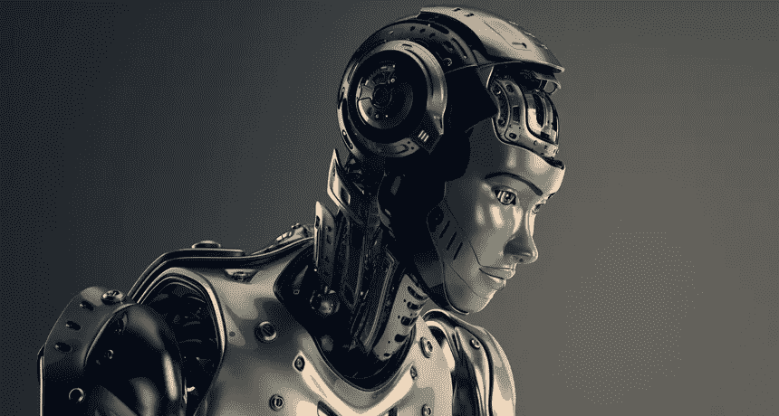

# 人工智能和量子计算:创新的未来

> 原文：<https://medium.datadriveninvestor.com/artificial-intelligence-and-quantum-computing-the-future-of-innovation-3174c83e25fb?source=collection_archive---------3----------------------->

虽然人工智能及其技术被世界各地的大型和小型组织完全采用和利用，但量子计算机只有少数组织有需求，并且某些研究机构可以使用。然而，量子计算的概念还没有被一些人理解。

这篇文章的重点是什么被认为是全球技术和经济进步的主要先锋技术。

# 人工智能

OCIACIA/ISTOCKPHOTO

从机器人到虚拟/交替现实，从自动驾驶汽车到像 Siri、Alexa 这样的个人助理，(仅举几例)。人工智能专注于构建智能系统，以独立执行特定领域的任务(物理任务和基于知识的任务)。人工智能技术被用于各种不同的用例，并被进一步研究以实现更多的技术突破

模糊逻辑是一种基于由不确定性水平定义的人类认知决策过程的方法，不像只有 0 和 1(或真和假)的经典逻辑。模糊逻辑由真理组成，包括 0 和 1(极端真理)以及其间的数字(真理的程度)。它的应用主要是决策和模式识别。

 [## 2019 年即将改变世界的技术|数据驱动的投资者

### 很难想象一项技术会像去年的区块链一样受到如此多的关注，但是……

www.datadriveninvestor.com](https://www.datadriveninvestor.com/2019/01/17/the-technologies-poised-to-change-the-world-in-2019/) 

人工神经网络模拟生物神经网络，其中输入被接收、处理并作为输出发出。人工神经网络由类似于生物神经元的节点组成，这些节点通过链路连接。链接提供节点的输出作为直接连接节点的输入，并且每个链接具有其相关联的权重。网络可以是单层的也可以是多层的。它用于解决预测、回归、分类、聚类、模式识别等问题。

专家系统是为解决特定领域的问题而创建的计算机系统或应用程序，类似于该领域的人类专家。它由知识库和推理机组成。知识库存储专家系统使用的复杂的特定领域事实，这些信息由专业人员和知识工程师提供。推理引擎通过对通过用户界面从用户获得的信息和来自知识库的事实应用逻辑规则来推断解决方案和建议。人工智能的其他领域包括自然语言处理和机器人技术。

2020 年消费电子展(CES 2020)上的展览毫无疑问地宣布，人工智能已经证明了过去几年认为不可能的概念是可能的，一些展览显示:

*   Withings ScanWatch -一款用于追踪睡眠呼吸暂停和心跳异常的智能手表
*   **杜比视觉智商-** 一种使用内置传感器根据房间亮度优化电视图像内容的技术
*   **BrainCo 的假手-** 利用截肢者的脑电波和肌肉信号来增强运动
*   **LG 的 ThinQ 洗衣机-** 一种前置式洗衣机，使用传感器调整每件衣物的洗涤周期
*   **索尼的愿景 S-** 确保安全性、适应性和娱乐性的电动汽车
*   **丰田承诺打造智能城市**

人工智能确实是世界各个领域的驱动力，它对商业和医疗保健的影响是巨大的，但这项技术被认为仍在发展。

# 量子计算

与使用物体的单一状态和 0 和 1 的比特的经典计算机不同，量子计算机使用量子比特或量子比特。量子位可以用 0 或 1 的单一状态来表示，它也可以是叠加态和纠缠态。量子叠加是量子力学的一个原理，即“任何两个量子态可以加在一起，结果将是另一个有效的量子态”。量子纠缠描述了粒子相互作用(或纠缠)时发生的事件。这些粒子变得相互依赖，即使它们被分离，它们的量子态也是如此。基于这些原理，量子计算机往往更强大，解决复杂问题的速度更快，效率更高。

Google’s quantum computer called ‘Sycamore’ (credit: Google)

> “量子计算机可能会刺激科学领域的新突破、拯救生命的药物、更快诊断疾病的机器学习方法、制造更高效设备和结构的材料、退休后生活良好的财务策略以及快速指挥救护车等资源的算法的发展。”
> 
> - [IBM](https://www.ibm.com/quantum-computing/learn/what-is-quantum-computing)

虽然量子计算机在满足消费者需求方面的全部实际能力还不得而知，但 IBM、谷歌和微软等公司正在对其进行投资。用户和研究人员可以通过云上的 Qiskit SDK 访问 IBM 的研究量子计算机。研究人员正在研究各种方法以减少计算误差。亚马逊还在名为 Amazon Braket 和微软的 Azure Quantum 的云上提供量子计算服务。

如果实现无差错计算，量子计算无疑将是一项重大的技术突破。