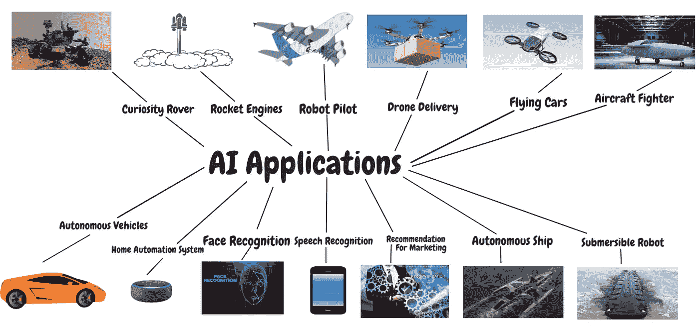
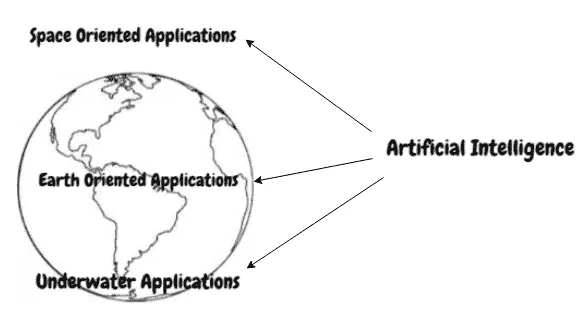
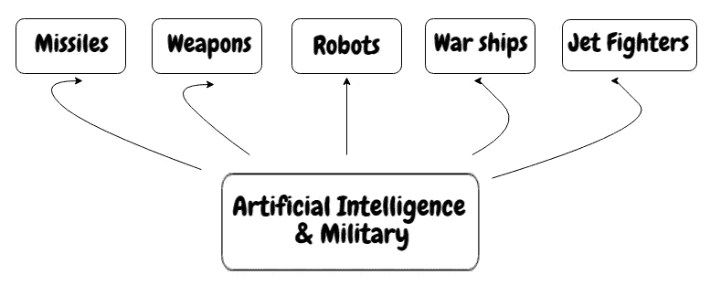
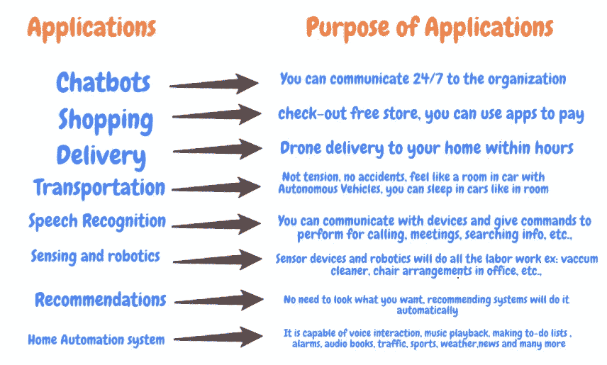

# 人工智能应用——从太空到水下

> 原文：<https://medium.datadriveninvestor.com/artificial-intelligence-applications-space-to-underwater-6b0391fe8b2c?source=collection_archive---------1----------------------->

**Artificial Intelligence Applications**

探索人工智能在各个领域的应用。

1.  人工智能应用概述。
2.  空间应用
3.  地球应用—人工智能与生活方式
4.  水下应用
5.  结论

是时候了解这些机器了，它们在没有人类干预的情况下自主运行。毫无疑问，目前人工智能发展迅猛，速度非常快。就应用而言，它是在有智能地方应用。

如今，人工智能可以应用于各种领域，如机器人、太空探索、机器智能、飞行汽车、自动驾驶汽车、水下以及人类无法在恶劣环境中挖掘和工作的复杂领域。本文提供的应用都适用于机器。在**水下**和**其他星球**工作对人类来说是不可能的，但人工智能已经实现了。

人工智能应用于从水下到太空的项目，因此，应用程序可以分为地球上方，位于地球和地球下方。我试图通过简短的介绍和视频来探索这些主题。

有许多应用需要涵盖，但由于一些其他原因，我试图涵盖只有少数几个，并分为 3 个不同的类别。

在各个学科/领域都已经开始了，不胜枚举。特别是从军事、农业、购物、航运、送货、运输、通信、银行、医疗保健/医疗、空间相关等等开始。

特别是在软件应用中，有各种各样的软件机器人存在于丰富和无限的领域中。

有必要了解人工智能应用程序的力量，上面提到的一些应用程序正在研究和进展中，其他应用程序今天已经可供我们使用。应用程序需要得到国家政府的批准才能使用。

Above the Earth Applications

**太空&飞行应用:这些应用都在地球上空。**

先从被 NASA 称为**【火星探测计划】**的**【探索宇宙】**最大的成就说起。他们使用 [**好奇号**](https://en.wikipedia.org/wiki/Curiosity_(rover)) 汽车大小的漫游车，作为美国宇航局火星科学实验室( **MSL** )任务的一部分，在火星上进行探索。好奇号于世界协调时 2011 年 11 月 26 日 15:02 发射。

**注:本申请解释冗长。**

美国宇航局关于好奇号的声明:

> 火星探索计划的目标是探索火星，并通过一系列精心挑选的机器人轨道器、着陆器和移动实验室提供连续的科学信息和发现，这些机器人轨道器、着陆器和移动实验室通过高带宽火星/地球通信网络相互连接。

它是最先进的应用之一，也是第一个用于控制航天器操作时间安排的机载自主规划程序。它的工作原理是远程代理概念，该概念根据地面指定的高级目标生成计划，并监控这些计划的执行——检测、诊断和从出现的问题中恢复。MAPGEN 是后续计划，它为美国宇航局的 **MER** 计划日常运作，而 **MEXAR2** 做任务规划——后勤和科学规划。——来源第 28 页，载于[人工智能:现代方法](http://aima.cs.berkeley.edu/)。

这些好奇号火星车将在火星上操作人类的手和眼睛，机器人几乎完全依赖地球上的人类智能。

MAPGEN 是一个地面决策支持系统，用于 **MER** 任务操作。它被称为混合计划者。它确定该计划在月球车上可用资源的范围内，并且没有任何时间违规。

好奇号在太空探索中使用人工智能(AI ),这完全是一个复杂的领域，使用了从电信网络到科学仪器、机械臂、导航臂等各种学科概念。，它有各种组件，如 ChemCam、MastCam、6 轮、高增益、低增益和 UV 传感器。

人工智能及其子领域不仅限于机器，现在他们正应用于制造智能发动机(火箭发动机)。德克萨斯大学奥斯汀分校正在开发新的“科学机器学习”来应对这一挑战。科学机器学习=科学计算+机器学习，通过物理建模和数据驱动学习的结合，最终有可能创建降阶模型。

火箭发动机可以用强化学习来开发，强化学习与环境交互，获得回报。为了模拟这些新模型，我们需要新的模拟器来完成模拟任务。

强化学习算法给出了更多的准确性。

将人工智能用于机器人飞行员的大量研究正在进行。自主飞机的最新发展是带着[乘客和](https://www.zdnet.com/article/autonomous-plane-takes-off-passengers-cargo/#:~:text=The%20company%2C%20Xwing%2C%20has%20now,with%20this%20category%20of%20aircraft)货物起飞。

这家名为 [Xwing](https://xwing.com/) 的公司现在已经用其改装的塞斯纳 208B Grand Caravan 进行了多次载客自主起飞到着陆的飞行，这在航空领域是第一次使用这种类型的飞机。

像澳大利亚、美国这样的发达国家花费数百万美元建造自主飞行器战斗机。这些喷气式战斗机携带武器、导弹等。在战争中。

它是提供运输道路和空中的个人空中交通工具或可行驶的飞机。这些也被称为**。它能够在公共道路和空中安全、可靠和环保地运行。它可以在没有合格飞行员驾驶的情况下飞行。最近以色列公司设计了两种[飞行汽车](https://interestingengineering.com/israeli-company-designs-two-flying-car-models?fbclid=IwAR2vxlzK3p8_PCnSQfjaNy0lr5odXa1jfC3IGJfv3QmzxnIujcIcZnVhpXI)模型城市鹰和猎鹰 XP。**

****

**在军事领域有巨大的发展，从军舰、武器、机器人、导弹、飞行器等等。人造机器人将代替人类参加战争。有很多研究正在进行。**

**澳大利亚、美国、韩国、俄罗斯、英国和中国等发达国家和先进国家花费数百万美元用于建造自主机器。你可以在这篇[文章](https://en.wikipedia.org/wiki/Artificial_intelligence_arms_race)中获得这方面的完整图片。**

********

**本节探索面向地球的应用，这些应用改变了我们的生活方式，截至 2020 年有很多应用可用。日常应用总结如下:**

********

**如今，你可以与手机、汽车、家庭自动化系统等设备进行交流。，最好的例子就是 iPhone - Siri 应用，可以问天气，新闻，在谷歌搜索，打电话联系号码，谷歌地图等。，Siri 将执行用户命令，例如:用户发出命令，说“在谷歌中搜索神经科学”，然后 Siri 将搜索该短语，并在默认浏览器中打开。**

****

**几乎所有的汽车都有语音识别功能，它可以执行用户命令，甚至可以启动和停止你的旅行。下面是 MBUX 语音控制。**

****

**亚马逊 Alexa:它是人工智能中的虚拟助手，充当家庭自动化系统。它能够进行语音交互，播放音乐，制作待办事项列表，闹钟，有声读物，交通，体育，天气和其他实时信息，如新闻等。你可以找到更多的其他传感设备，你可以用你的指尖操作和感觉。以下视频介绍了 5 种智能家居技术**

****

**Amazon Go 是第一家不需要结账的商店。客户只需使用 Amazon Go 应用程序进入商店，浏览并购买所需的产品或商品，然后离开。顾客无需起诉柜台或收银台就能购买产品。**

****

**下面的视频显示了自动驾驶机器人(送货机器人，名为 YAPE)如何直接将货物带给你，它使用面部识别来识别客户送货。**

**它让送货变得又快又容易，机器人可以轻松地在人行道上行走。YAPE 的载重量为 70 公斤，一次充电可以行驶 80 公里。它使用计算机视觉，传感器融合来检测和避免人行道边缘，轨道或其他异常情况。波士顿动力公司是一家研究机器人的著名公司。**

****

**它广泛应用于组织、公寓、大学、自动驾驶等场合的人脸识别。，用于授权人员和活动。它使用计算机视觉概念来识别它。人脸识别的应用有很多，比如手机解锁、考勤、授权会员等。,**

****

**开发自动驾驶汽车是每个人工智能爱好者的梦想。它节省了时间，避免了事故，因为现在 5 级 SDC 还没有上市。许多 R&D 将在没有人类司机的情况下实现。几乎所有公认的试图实现自动驾驶汽车的车企。你可以召开会议，打电话，很多事情都可以在自动驾驶汽车上发生。当它达到 5 级时，它的内部和外部设计完全不同。几乎所有汽车领域的公司都在投资和研究自动驾驶汽车。**

****

**无人机可以以各种方式用于运送货物，用于跟踪，视频场景，农业领域等。这些天我们可以运送药品、急救物品、洪水中的食物等。但由于安全原因，各国政府必须在使用前批准。**

****

**聊天机器人是一种人工智能软件，可以通过消息应用程序、网站、移动应用程序或电话模拟与用户用自然语言进行的对话或聊天。**

****

**使用人工智能和深度学习技术可以轻松检测出各种疾病。疾病，如疟疾、心律失常、癌症检测、糖尿病视网膜病变、肺炎检测等。,**

****

**推荐系统是旨在向用户建议相关项目的算法(项目是要看的电影、要读的书籍、要购买的产品或项目或取决于行业的任何其他东西)。这些系统在向用户推销产品或物品时非常有用。**

** [## 推荐系统介绍-推荐系统| Coursera

### IBM 为课程“用 Python 进行机器学习”制作的视频。在本模块中，您将了解推荐者…

www.coursera.org](https://www.coursera.org/lecture/machine-learning-with-python/intro-to-recommender-systems-6vXTY) 

这里介绍这一类别的两个应用，自主船和潜水机器人。以前由 IBM 开发。

IBM 推出了一艘人工智能驱动的海洋研究船，名为**五月花号**自主船。它将尝试在 2021 年春天穿越大西洋。

五月花号自主船将收集海洋和海洋生物的数据，包括塑料取样。

IBM 和 ProMare 宣布了一个互动网站，即 [MAS400](https://mas400.com) 门户网站，该网站将提供船只行踪、环境条件和其他数据的实时更新。

你可以找到更多关于[五月花号](https://mas400.com)的信息

深海是这样一个地方，它不仅有丰富的海洋生物，其大片海域还富含镍、铜、钴、锌等金属，这些金属对于制造智能手机、电动汽车和太阳能电池板部件等电子和电子产品非常重要。

这是一个新的令人印象深刻的例子，说明了软机器人在帮助人类到达恶劣环境的同时尽可能少地造成环境破坏的潜力。

这些自主水下航行器(AUV)比太空探索更具挑战性。

这些天来，人工智能爱好者开发了各种各样的应用程序，在非生命体中实现智能。在传感、无人驾驶飞机、机器人、面部表情等方面有许多正在开发应用。，市场上会有许多应用程序。

人工智能不是有限的，它因其属性智能而无限。在未来，肯定会完全改变我们的生活方式。由于缺乏计算能力，有许多应用被搁置，如果量子计算机是便携式的，并以各种方式混合在一起，那么超级智能肯定会取代我们的奋斗和工作。

感谢您阅读我的文章，并感谢您的反馈。**