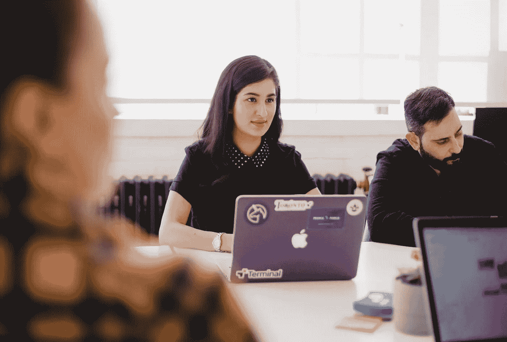

# 人工智能将我们带回到人类的触觉

> 原文：<https://medium.datadriveninvestor.com/artificial-intelligence-brings-us-back-to-the-human-touch-a4639601049c?source=collection_archive---------26----------------------->

## 广泛分散的工作场所凸显了对连接的需求

Photo by You X Ventures on Unsplash

随着工作团队分散在家中和其他地方，保持联系变得越来越重要。

数字创新、设计和工程公司 [Globant](https://www.globant.com/) 的联合创始人兼首席技术官 [Guibert Englebienne](https://twitter.com/guibert/) 说:“疫情迫使我们在一夜之间对世界进行数字化改造。

“组织突然发现自己处在一个非常遥远的工作环境中，”他说。“这带来了很多挑战。”

正如 Englebienne 向分析师、品牌战略家、播客和 TalentCulture 首席执行官 Meghan M. Biro 解释的那样，技术正以人工智能的形式来拯救人类。

“在某些时候，开始问‘我们的团队还好吗？’是很自然的事情甚至可能是“它在那里吗？””恩格勒比恩说当我们在办公室的时候，我们可以看到彼此的眼睛。我们可以看看某人是否没事。突然，这一切都消失了。"

 [## 现代工人仍然是人类|数据驱动的投资者

### 这位经验丰富的海军陆战队员离开了军队，却发现平民的生活方式不尽如人意。他也发现了…

www.datadriveninvestor.com](https://www.datadriveninvestor.com/2018/11/20/modern-workers-are-still-human/) 

随着世界误入歧途，Englebienne 和他的公司转向人工智能驱动的合作。

“我们意识到，我们已经创造了一个允许更人性化的组织的社交操作系统——在这个系统中，我们每个人都可以联系更多的人，”他说。“我们更加了解他们。

“与此同时，我们为组织创造了大量的集体智慧，这使我们更具适应性，”Englebienne 说。

他认为人工智能在创造一种文化方面发挥着重要作用，这种文化在帮助决定公司想要营造什么样的氛围的同时也能激发灵感。

# 个人与团队焦点

当员工根据个人成就进行评估时，组织很难与团队合作。对合作的认可可能会被视为降低其价值。

“如果每个人都不清楚公司的使命和关键目标，这可能会对团队协作产生很大影响，”比罗说。“人们必须达成共识，才能创新和合作。

“如何让人们对自己的工作充满热情？”她说“如果他们不是，那会拖垮整个团队。责任在于参与和激励员工的工作文化，而不是个人。”

 [## 保持距离的终极方法|数据驱动型投资者

### 领导和经理面临着参与和支持远程团队的挑战。曾经对…来说很平常的事情

www.datadriveninvestor.com](https://www.datadriveninvestor.com/2020/04/30/the-ultimate-way-to-keep-your-distance/) 

被传播是一种常见的，尽管令人不安的常态。

“有这么多偏远的团队，竞争是真实的，”比罗说。“经理们需要关注每个人——以及跟踪每个人如何合作的方法。”

经理们的困境反映了整个公司的焦虑。

Englebienne 说:“组织在处理当今企业所需的适应性和可伸缩性方面准备不足。“围绕某些行为复制创始人的思维模式——强大的文化——并分享使命目标是实现自主的关键。自主释放成长。

“让每个人都成为这些行为的守护者，是围绕这些行为形成习惯的关键，”他说。“我们对庆祝、反馈、社交发帖等情绪进行数字化的实验，让我们发现了原本不知道的团队成员。”

这导致了意想不到的揭露。

Englebienne 说:“这些互动带来了组织如何工作的可见性。“这种洞察力可以推动每个成员变得更加自主、有意识，并有能力更好地与同龄人联系。”

# 支持创新

人工智能驱动的工具有助于减少单调重复的任务，从而腾出时间来单独或与他人合作思考创新方法。

“人工智能工具在创造洞察力和可视化方面非常有效，可以帮助经理们培养更好的团队合作和创新，”比罗说。

“员工在支持创造力的文化中茁壮成长，”她说。“人工智能驱动的工具可以帮助将工作场所中志同道合的人联系在一起，这创造了整个创意文化。这反过来会影响我们的工作方式。”

 [## 释放软技能的超能力|数据驱动的投资者

### 软技能是一个误称，甚至是不屑一顾。事实上，安吉拉·麦尔斯认为，“生活……

www.datadriveninvestor.com](https://www.datadriveninvestor.com/2020/04/27/unleash-the-superpowers-of-soft-skills/) 

真相在于数字。

“使用数据来了解每个人是如何参与的，并确保团队的包容性和公平性，”Biro 说。“这样，每个人都有机会发挥创造力，提出想法。”

这种注入带来了可喜的新观点。

“思想的多样性激发创造力，”Englebienne 说。“人工智能有助于将具有互补技能、不同背景的人联系起来，这些人可能不会停下来在饮水机旁聊天，因为他们认为自己没有太多共同点。

“这种差异恰恰有助于创造出比有相似经历的群体更大、更好、更美的东西，”他说。

领导者需要熟悉人工智能工具，这样他们才能批准其他员工加入进来。企业文化的改变必须自上而下地被接受并有效。

# 文化改进和可能性

“人工智能驱动的工具不仅有助于推动文化，它们还在塑造文化——为联系和互动创造新的机会，”比罗说。

“我发现 Globant 发生的事情真的很有趣，”她说。“这对于希望能够在员工中实时分享见解的领导者来说意义重大。”

这给任何试水的人带来了许多选择。

“人工智能让领导人获得了如此多关于参与和脱离的有意义的数据，”比罗说。“它可以创建一个虚拟的介绍，这意味着你走进一个会议，已经有一个人是谁的感觉。这对文化很有好处。

"我想知道的是:团队是如何工作的？"她说。“在这个过程中他们在哪里？谁在带头？谁是啦啦队？谁在某一天的贡献得到了认可？那就是 AI。”

 [## 企业生存取决于他们的文化|数据驱动的投资者

### 当公司从一个不可预见的挑战蹒跚地走向另一个挑战时，痛苦的变化和直觉支配着这一天。除了…

www.datadriveninvestor.com](https://www.datadriveninvestor.com/2020/05/12/corporate-survival-hinges-on-their-culture/) 

这些知识是巩固关系的第一步。

“人工智能可以帮助你培养文化和人际关系，”Englebienne 说。“文化可以成就或毁灭一家公司。在 Globant，我们已经通过我们的 [StarMeUp OS](https://twitter.com/StarMeUpOS/) 平台成功实施了人工智能，帮助我们了解组织内部的人类纤维。”

他解释说，人工智能增强了他的公司与更多人联系并更好地了解他们的能力。

“另一个重要的方面是多样性和包容性，”Englebienne 说。“社会资本是提升公司地位的关键。人工智能可以帮助每个人建立对环境有益的重要联系。这样，每个人都能茁壮成长，无论组织的起源或规模如何。”

**关于作者**

吉姆·卡扎曼是[拉戈金融服务公司](http://largofinancialservices.com/)的经理，曾在空军和联邦政府的公共事务部门工作。你可以在[推特](https://twitter.com/JKatzaman)、[脸书](https://www.facebook.com/jim.katzaman)和 [LinkedIn](https://www.linkedin.com/in/jim-katzaman-33641b21/) 上和他联系。

*原载于 2020 年 10 月 13 日*[*【https://www.datadriveninvestor.com】*](https://www.datadriveninvestor.com/2020/10/13/artificial-intelligence-brings-us-back-to-the-human-touch/)*。*