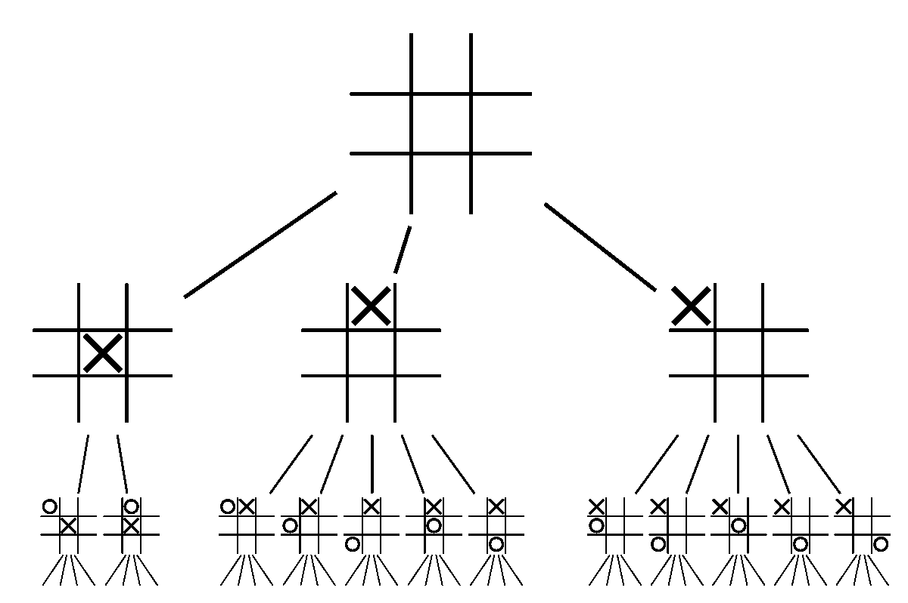
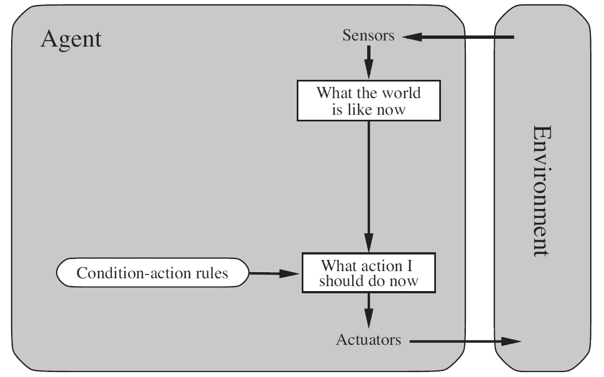
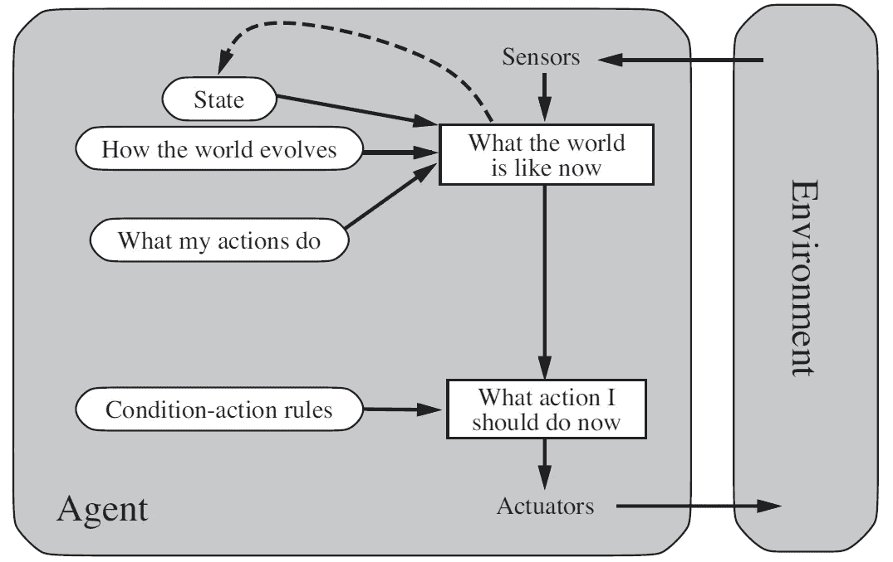
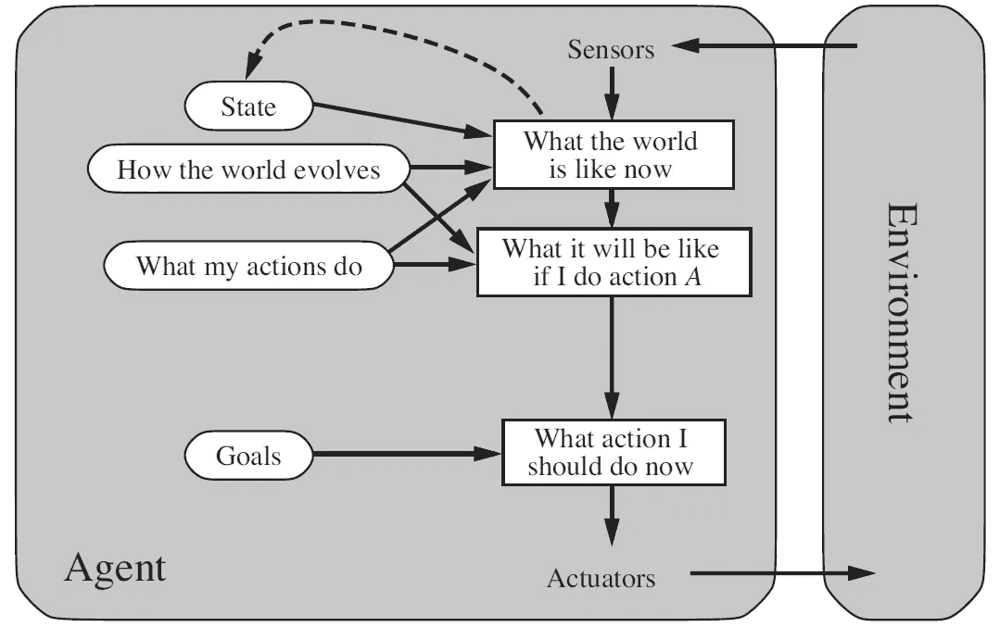
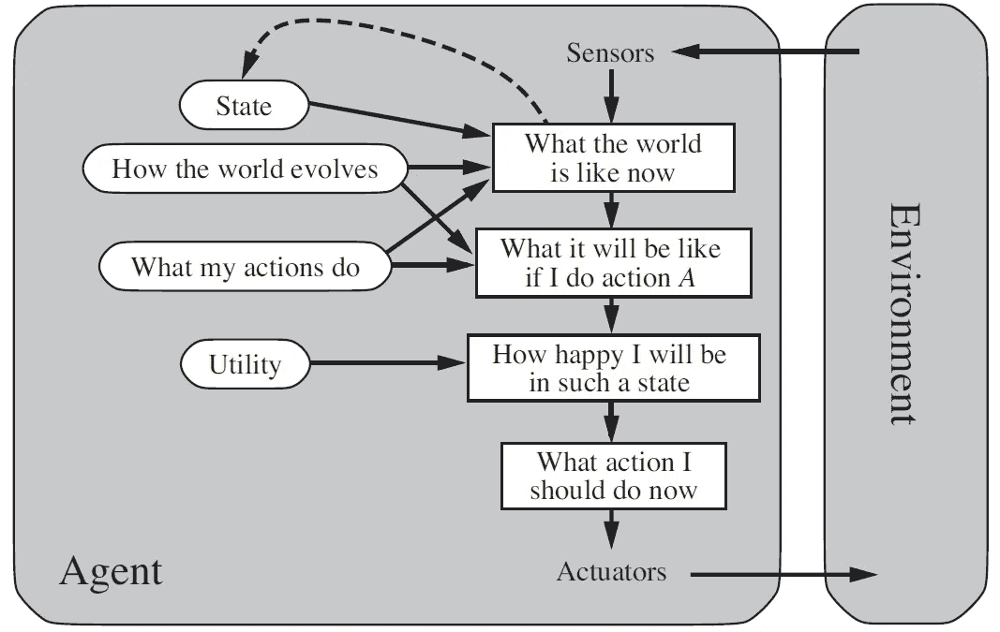

# 人工智能:设计代理

> 原文：<https://medium.datadriveninvestor.com/artificial-intelligence-designing-agents-a036246b1fc1?source=collection_archive---------4----------------------->

让我们来看看在设计人工智能代理时需要考虑什么。

Photo by [Tim Meyer](https://unsplash.com/@timmeyer?utm_source=medium&utm_medium=referral) on [Unsplash](https://unsplash.com?utm_source=medium&utm_medium=referral)

# 代理人的叙述

想象一下，你是一个变形金刚。你可以是任何你想要的汽车或公路交通工具，只要它至少有一个座位。

你被派到地球来保护一个名叫山姆的人类，现在你需要在世界末日之前把他从任务城带到胡佛大坝和其他汽车人重新组合。

应该不会太难吧？你只需要向南行驶 22 英里。

嗯，有几个问题:这是一个明亮、温暖的周六，道路上挤满了各行其是的无辜平民。他们不知道汽车人和霸天虎为地球而战。所以，不像电影里那样，你必须遵守一些驾驶规则来确保每个人的安全。

第二，你需要在半小时内到达胡佛大坝，准时拯救世界，所以你需要保持平均每小时 44 英里的速度。

最后，你注意到你被一辆贴着警车标志的黑色福特萨林野马跟踪。你有点怀疑它，因为它太酷了，不是一辆普通的巡逻车。你认为这可能是一个邪恶的霸天虎冒充警车。所以你需要避开它的视线，甩掉它……但是不要做任何太花哨的事情，以防它*只是一辆普通的巡逻车。*

Barricade, the Decepticon police car. Credit: [Ideal Classic Cars](https://www.idealclassiccars.net/vehicles/16/2005-z-movie-car-transformers-barricade-saleen-mustang)

(如果这个变形金刚的比喻超出了你的想象，想象你是一辆自动驾驶汽车，你需要让你的乘客从 A 点到 B 点，同时遵守道路规则，按时到达，并避免高速公路巡逻。)

那你怎么带萨姆去胡佛大坝呢？你是否坚持从目标中衍生出的一套规则？或者你试图预测行动和后果，并使用*这些*作为规则？你优先考虑哪些目标？将某些任务排在其他任务之前*可以吗？当所有的事情都完成后，你怎么知道你成功了呢？*

# 什么是代理？

如果你没有注意到，上述问题的本质可以被[简化为](https://en.wikipedia.org/wiki/Reduction_(complexity))自动驾驶汽车在任何给定行程中必须做出的决策过程。

我们可以称汽车为一个**代理**，或者一个可以感知环境并根据这些输入产生输出的实体。换句话说，这个代理试图解决一个问题。

[类型的环境](https://medium.com/swlh/artificial-intelligence-types-of-environments-f5a6b54bea7b)对定义问题空间时要考虑的因素有很大的影响，但是现在让我们把重点放在导航输入和输出上。

“输入”被称为**感知**，本质上是瞬时的，或*原子的*。这仅仅意味着感知是一次一个时刻被认知的，也就是说，你不能知道未来，只能知道现在和过去。请注意，一个代理人在一个时间步骤中可能有不止一个可能的输入，就像一个人在一秒钟内从他或她的每个感官接收各种信号一样。

这个“过去”被称为**感知序列**，或者代理曾经接收到的所有输入的时间顺序集合。

当我们将当前的一组输入与当前的一组输出以及环境的当前性质结合起来时，我们得到了问题的当前**状态**。

反过来，状态和感知序列是错综复杂地联系在一起的。整个状态空间，或者可能发生的任何事情的集合(例如，在井字游戏中，状态空间将是棋盘可能的每种排列)通过从一个状态指向下一个状态的动作来链接。

An incomplete state space, but an example of how states are linked via actions. Credit: [Wikipedia](https://en.wikipedia.org/wiki/Game_tree)

当然，在现实中，可能无法构建一个完整的状态空间，因为可能存在无限种可能性。但重要的是，不同的行动可能导致不同的未来，而代理人的工作是达到特定的或最佳的目标状态。

此外，状态转换遵循一个被称为**马尔可夫性质**的重要规则，该规则指出，给定现在，未来*独立于过去。简单地说，特定的未来状态发生的机会仅由当前状态和所采取的行动给出。*

但是这并不是说未来作为一个整体与过去没有关系，只是在时间步骤内，或者在上面的游戏树中的层内，从一个状态到下一个状态的运动只取决于连接它们的动作。

# 做正确的事情

我已经提到了一个想法，即代理充当一种将输入映射到输出的功能。但是这是没有用的，除非输出是合适的。

因此，我们的自动驾驶代理必须通过做出理性的选择来尝试做“正确的事情”。

知道对与错的区别已经是一个世纪之久的争论，但是理性到底意味着什么？

我们可以通过查看什么是理性*而不是*来创建一个弱定义:如果我们把我们的自动驾驶汽车放入拉斯维加斯，并要求它从城市导航到胡佛大坝，它将基于它从环境中收集的输入生成一个感知序列。当汽车试图到达大坝时，这个感知序列将产生一个行动序列。

如果行动序列导致我们到达胡佛大坝，那么我们可以说自动驾驶智能体是理性的。

但是等等！你可能会想。*如果我们的汽车永远随机行驶，直到最终降落在胡佛大坝上，会怎么样？按我们的定义，这也是理性的！*

这就是为什么这是一个*弱*的定义。

为了获得一种强烈的理性感，我们必须开始增加评估表现的主观衡量标准。对我们来说，我们可能会考虑时间(通常越少越好)、安全(我们安全到达)和合法性(我们正确遵守所有的道路法规)。

我们也可以考虑**知识**。如果我们以前已经开过这条路，我们应该知道什么时候转弯。如果我们以前在监控区超速被抓过，我们应该知道要保持在限速以内。

请注意，这个理性的定义有多个灰色区域。绩效没有放之四海而皆准的规则；这些相关的考虑留给设计代理的人来决定。

因此，我们得出了理性主体的最终定义，这是斯图尔特·拉塞尔和彼得·诺维格在他们关于人工智能的开创性著作《人工智能:

> 对于每一个可能的感知序列，一个理性的主体应该选择一个行动，这个行动被期望最大化它的性能度量，给定由感知序列提供的证据和主体拥有的任何内置知识。

但是要小心理解理性和**全知**的区别。一个理性的主体根据自己的感知和环境的当前状态为自己做出最好的决策。它不一定做出总体上最佳的决策。另一方面，一个无所不知的代理人肯定知道将会发生什么，什么是最佳路径，因此做出决定来确定未来。要知道世界上的每一个结果是相当困难的…

考虑这种情况:我们的自动驾驶汽车在高速公路上，它注意到左侧车道有一个开口，它可以利用这个开口超车前面的慢司机。它驶入左车道，但突然，一颗陨石从上面砸来，摧毁了发动机。

我们理性的自动驾驶汽车是否做出了错误的选择？当然不是！我们不能指望它能解释来自外星的物体！

因此，理性的目标是最大化*预期*绩效，因为我们只能知道当前和过去。

# 代理结构

我们已经详细讨论了代理是什么以及它应该做什么。那么，我们如何为这项工作找到合适的代理人呢？

回想一下前面的内容，代理只是简单地处理输入来产生理性的输出。我们称这个过程为**代理函数**。它本质上是理论性的，因此我们将**代理程序**命名为实现代理功能的实际代码、实际硬件和软件。

反过来，这种硬件和软件的性质，传感器和执行器，组成了完整的计算设备，这就是所谓的**架构**。

简单来说， *agent =架构+程序*。

在考虑这两个部分时，架构仅仅是代理的物理特征，但是程序是创造力和独创性参与的地方，是智慧真正产生的地方。

现在让我们考虑四种类型的代理程序，它们是几乎所有智能系统的基础。

# 代理类型

## 简单反射剂

简单反射智能体，顾名思义，是最简单的智能体。利用当前的感知，它根据一套规则做出决定。这些代理不跟踪历史，因此没有感知序列。

例如，考虑一个通知你下雨天气的简单程序。它的书里唯一的规则是:如果外面下雨，发个信息说你需要带伞。没别的了。

How a simple reflex agent interacts with its environment. Credit: [Russell and Norvig](http://aima.cs.berkeley.edu/)

这些 **if-then** 连接被称为**条件-动作规则**，并作为简单反射代理中反身“智能”的基础。如果你看上面的图表，你会注意到代理的唯一决策过程是由这些条件-动作规则决定的。

## 基于模型的反射代理

但有时我们需要跟踪感知序列，或历史。这种知识在预测未来状态以及跟踪变量方面很有用。

基于模型的反射代理维护一个**模型**，它可以感知当前世界中的事物，特别是那些预计会改变的元素。使用这种内部模型和自反条件-动作规则，代理可以根据可能发生的情况来选择它的动作。

How a model-based reflex agent interacts with its environment. Credit: [Russell and Norvig](http://aima.cs.berkeley.edu/)

在上图中，请注意与简单反射代理的区别。在这里，我们通过状态历史和建模来跟踪世界现在的样子，并了解我们的行为如何影响环境。鉴于这些见解和基本的如果-那么规则，我们的代理能够作出决定。

基于模型的代理的一个例子是人工智能 Pacman。Pacman 可以跟踪幽灵(Blinky，Pinky，inky 和 Clyde)的位置，以及食物颗粒的位置。在任何时间步，他的行动将是向上、向下、向左或向右移动(除非他在迷宫的边缘或在“曲速隧道”)。如果他吃了能量丸，他只能抓住其中一个鬼魂。

如果我们放松对任何分数的需求，吃豆人在任何时候都只会根据他可以采取的行动和保持游戏运行的行动来做出决定，也就是说，他只是做出了防止失败的决定。

如果我们把赢和输分别作为理想和不理想的状态，我们可以把吃豆人变成基于目标或基于效用的代理人。

## 基于目标的代理

一个基于目标的代理需要一个特定的结束状态。使用上面的 Pacman 示例，如果我们添加 Pacman 想要捕获所有四个鬼魂并吃掉所有食物颗粒的条件，则目标状态是没有点剩余且所有鬼魂都在监狱中的状态。

从代理的角度来看，基于目标的代理建立在基于模型的反射代理之上。除了跟踪现实世界中的变量和动作概率，基于目标的代理还通过下一个状态使其更接近最终状态的方式来做出决策。

How a goal-based reflex agent interacts with its environment. Credit: [Russell and Norvig](http://aima.cs.berkeley.edu/)

与基于模型的代理相比，基于目标的代理**搜索**一个引导它到达目标的动作序列。在实践中，这可以包括使用搜索算法，如[深度优先](https://en.wikipedia.org/wiki/Depth-first_search)、[广度优先](https://en.wikipedia.org/wiki/Breadth-first_search)、[统一成本](https://en.wikipedia.org/wiki/Dijkstra's_algorithm)，以及通知 [A*](https://en.wikipedia.org/wiki/A*_search_algorithm) (发音为“A-star”)搜索。一个**试探法**，或者总是*低估*到目标的距离的经验法则，通过帮助选择一条总体最短路径来为像 A*这样的有根据的搜索提供指导(例如，从米申城开车到胡佛大坝的试探法是从你的当前位置到大坝的*直线距离*，因为这低估了*实际*距离，但是提供了选择一条总体最短路径的帮助。我们总是低估，因为有一个猜测的上限比无限高估的可能性更好，这将使原本合理的决定看起来不可取，导致循环。).

## 基于效用的代理

而且有时候，达到目标状态还不够。有些未来比其他的更好。

在我们的自动驾驶汽车示例中，到达胡佛大坝并不是唯一的目标。还有安全、时间和合法性的问题。因此，虽然在一个小时内到达大坝确实符合要求，但在半个小时内到达是解决问题的一个更好的方案。

基于效用的代理是基于目标的代理，它将“幸福”分数分配给某些州，而不是其他州。这种“幸福”被称为效用，目标是最大化它。如理性所述，一个代理只能最大化*预期*值，而不是实际值。所以这里我们试图最大化期望效用。

How a utility-based reflex agent interacts with its environment. Credit: [Russell and Norvig](http://aima.cs.berkeley.edu/)

在上图中，代理在基于目标的代理示意图的基础上，指定“我在这种状态下会有多开心。”在程序中，这类似于给决策分配优先级，或者给决策路径分配权重。

到目前为止，您应该已经对在为您的人工智能需求设计合适的代理时应该考虑什么有了一个很好的介绍性想法。为了进一步明确您的问题空间和解决方案需求，了解您的代理所处的[环境](https://medium.com/swlh/artificial-intelligence-types-of-environments-f5a6b54bea7b)可能会有所帮助。

但无论如何，你现在知道了几乎所有形式的智力中包含的思维的基本性质。快乐学习！

# 重温叙事

让我们说，你已经决定采取某种形式的黄黑雪佛兰科迈罗与一些额外的运动包的顶级性能。有了这些助力，你肯定是一只吃野马的小而邪恶的动物…

现在，你在高速公路的右车道上轻松地以每小时 55 英里的速度行驶，山姆安全地坐在驾驶座上，手里拿着一些可以拯救世界的小东西。

通过你后视镜，你对霸天虎模样的警车有了新的认识。它刚刚换了车道。而且看起来距离很远，但是在高速公路上所有的物体看起来都比看起来要近。你希望这不是路障，但有些东西告诉你，否则。

Let’s help Optimus Prime save the world. Photo by [Arseny Togulev](https://unsplash.com/@tetrakiss?utm_source=medium&utm_medium=referral) on [Unsplash](https://unsplash.com?utm_source=medium&utm_medium=referral)

有点害怕，你把车开到最左边的车道，加大油门。凭借您的高性能套件，您可以轻松地从 55 英里加速到 120 英里。

萨姆惊呼道，“哇！大黄蜂，你在干什么？”

*保护你，你这个笨蛋*，你用无线电回应。我们需要在 30 分钟内安全到达胡佛大坝，避开路障。

萨姆记得他在学校上过的一门课，回答说:“很公平。我们现在或许应该像一个基于效用的代理人那样行动。仅仅到达胡佛大坝还不够好，但我们需要尽快到达那里，以阻止威震天征服地球。反射性行动不会说明更好或更坏的结果，只有原子决策……”

*呃，好吧……*你回复。你不记得以前上过这样的课。但是他对效用的定义听起来不太对。

以你的速度向南 22 英里会很快消失。幸运的是，“飞机强制执行区”今天似乎下班了。

但是说曹操曹操到。一架直升机从头顶飞过，砰的一声，一辆写着“警察”字样的黑色福特野马停在你前方几米处。它的灯在闪烁，警报器在鸣响。你踩下紧急刹车，滑到路障后面不到一英寸的地方停了下来。

他变成了他的机器人。“你真的不应该在高速公路上开那么快，大黄蜂。与基于目标的代理不同，基于效用的代理除了按时到达目的地之外，还应该优先考虑乘客的安全。以每小时 120 英里的速度行驶似乎并不能达到那个重要的要求。这里有一张票提醒你。”他把一张纸条塞到你的雨刷下。“嗯，我得走了。威震天在等我！”他开车走了。

嗯，你认为事情并不像预期的那样发展。*我以为我们会战斗到死。但是你会记起不久前学过的东西。*哦，对了*，你突然回忆起来。我不是一个无所不知的代理人，我也不需要这样。作为一个理性的、基于效用的代理人，我将总是尽我所能在正确的时间做出正确的选择，并希望它最大化我的预期效用！*