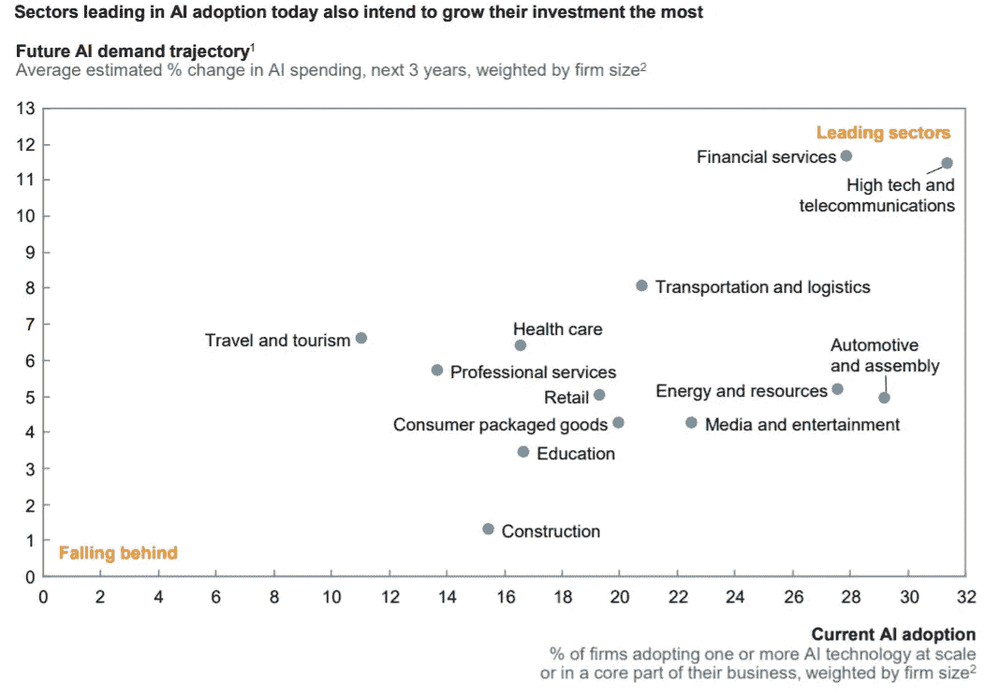

# 为您的企业提供人工智能

> 原文：<https://medium.datadriveninvestor.com/artificial-intelligence-for-your-business-a48c825d5a59?source=collection_archive---------13----------------------->

## 人工智能如何发展你的初创公司并优化日常任务

Photo by [Franck V.](https://unsplash.com/@franckinjapan?utm_source=medium&utm_medium=referral) on [Unsplash](https://unsplash.com?utm_source=medium&utm_medium=referral)

A 人工智能、深度学习、计算机视觉，以及科技世界中所有其他的热门词汇。对于企业主来说，这些可能是有趣的讨论话题，但它们与企业本身无关。另外，所有这些都太先进了，还没有很好的发展，对吗？

本文的目标是改变这种观点，并给出现实世界中的例子，说明如何利用技术简化和改进任何业务。把你的偏见放在一边，确保尝试这些策略。

# 人工智能

那么AI 首先是什么？人工智能是指任何类型的智能设备、计算机和技术，它们可以学习并将其知识应用于现实世界的问题。这是一个庞大的研究领域，包括机器学习(自我学习的算法)、计算机视觉(使用相机识别物体并跟踪它们)、机器人技术和许多其他领域。

然而，你不需要知道这些来为你的公司获得一些利益。人工智能的许多应用相当简单，一般用户都可以使用。此外，如果你有一个技术人员或者可以雇佣一个，可能性是无穷无尽的。

 [## 加速科技银行的数字化:云和人工智能成为疫情赢家|数据驱动的投资者

### 疫情新型冠状病毒的经济效应正在把斗争推向每个国家的主要产业…

www.datadriveninvestor.com](https://www.datadriveninvestor.com/2020/05/12/speeding-up-the-digitalization-of-the-tech-banking-cloud-and-ai-as-the-pandemic-winners/) 

# AI 是面向所有人的吗？

Image: McKinsey Global Institute AI adoption and use survey; McKinsey Global Institute analysis

正如我们可以从趋势和行业专家那里看到，人工智能目前在金融服务和技术领域得到了高度利用。随着金融科技公司的蓬勃发展，这些趋势很容易被注意到。技术部门是不言自明的。

现在，其他人呢？某些行业没有充分利用人工智能的力量，这一事实不应让你气馁。事实上，基本上任何领域都有大量的任务可以优化。这将使你的企业领先于竞争，让你专注于发展战略，而不是担心你的电子邮件和文件。

# 工序自动化

Photo by [Franck V.](https://unsplash.com/@franckinjapan?utm_source=medium&utm_medium=referral) on [Unsplash](https://unsplash.com?utm_source=medium&utm_medium=referral)

人工智能最明显的应用当然是过程自动化。计算机在解决问题的方法上可能没有那么有创造性，但它们解决任何数学问题的速度肯定比你快。任何不需要太多技巧的简单任务都可以轻松交给 AI 算法。

## 1.用自然语言处理“阅读”文档

现在的计算机可以从任何文章和文件中提取重要特征，并为你提供深入的分析。通过阅读你所有的财务报告和法律文件，该算法可以找到你能想到的每一个错误。此外，还可以对数据进行分析，以优化您的支出并实现收入最大化。

## 2.传输电子邮件和通话数据

这种类型的数据存储是有原因的，通过一个简单的算法，可以转录所有这些数据，并按类别组织，从中可以找到许多有用的见解。然后，可以对信息进行分析，这将为您的员工节省无数时间来阅读每一封电子邮件。

# 认知参与

Photo by [Volodymyr Hryshchenko](https://unsplash.com/@lunarts?utm_source=medium&utm_medium=referral) on [Unsplash](https://unsplash.com?utm_source=medium&utm_medium=referral)

这一类别包括与客户实时请求和订单处理的任何类型的沟通。不要低估计算机的工作量。

## 1.全天候支持和聊天机器人

如果你的公司没有聊天机器人，那就去买一个吧。这基本上是许多网站和服务的标准，可以大幅减少客户支持所需的员工数量。此外，您拥有的员工将只需要处理重要的请求，而算法可以处理任何与帐户相关的问题。

## 2.产品和服务建议

通过使用从电子邮件、电话和网站行为中收集的数据，您的计算机可以向有可能为此付费的客户提供产品建议。

# 认知洞察力

Photo by [Markus Spiske](https://unsplash.com/@markusspiske?utm_source=medium&utm_medium=referral) on [Unsplash](https://unsplash.com?utm_source=medium&utm_medium=referral)

T 我想在这里提到的最后一类包括收集统计数据并对其进行实际分析。一个算法可以理解你的客户喜欢什么，不喜欢什么。在人工智能的帮助下，你可以知道哪些顾客想要某种特定的产品类型，并据此调整你的产品和广告。

## 1.购买预测

通过研究以往的购买行为，你的团队可以发现什么产品最畅销，什么类型的人更有可能购买。或者你可以把这项工作交给人工智能算法，除此之外，它还会准确地告诉你某个浏览你网站的人会买什么。

## 2.自动化个性化广告定位

除了前面一点，你可以更进一步，实际上自动化你的广告策略。找一个算法，分析你之前的广告数据，根据当前情况进行调整。

# 结论

Photo by [Kelly Sikkema](https://unsplash.com/@kellysikkema?utm_source=medium&utm_medium=referral) on [Unsplash](https://unsplash.com?utm_source=medium&utm_medium=referral)

人工智能不一定要复杂和超前。此外，它实际上可以在您的业务中用于自动化和分析。愿意尝试，你的企业会因此而感谢你。

# 参考

崔，男(2017)。人工智能:下一个数字前沿？。*麦肯锡全球研究院*， *47* ，3–6。

莱普林斯-林盖博士(2020)。商业人工智能:哪里出了问题，以及如何解决问题。 *ZDNet* 。检索于 2020 年 7 月 7 日，来自[https://www . zdnet . com/article/ai-for-business-what-going-miss-and-how-to-get-it-right/](https://www.zdnet.com/article/ai-for-business-whats-going-wrong-and-how-to-get-it-right/)

**访问专家视图—** [**订阅 DDI 英特尔**](https://datadriveninvestor.com/ddi-intel)