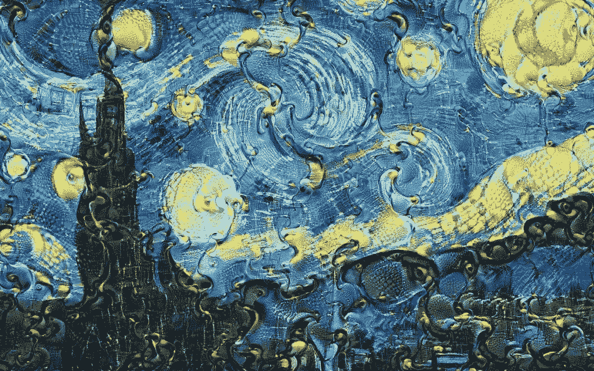
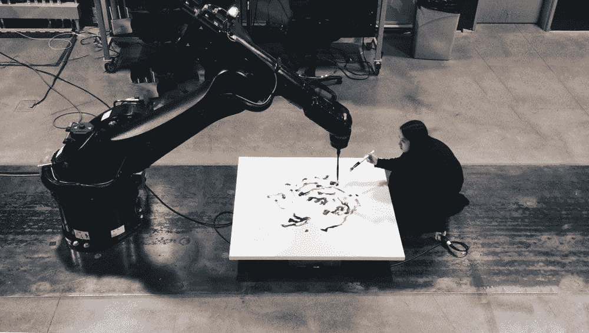
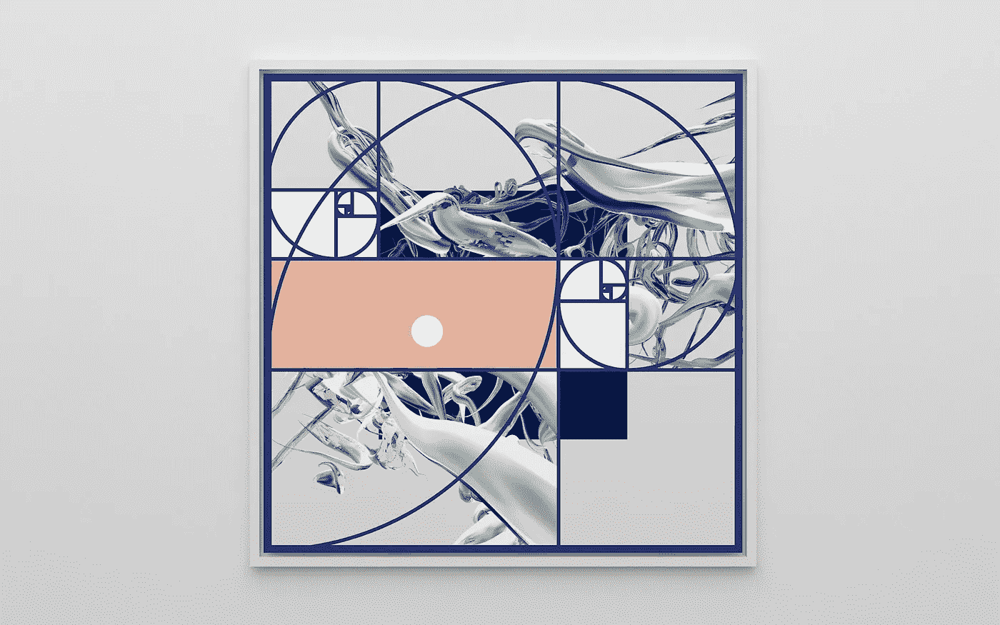
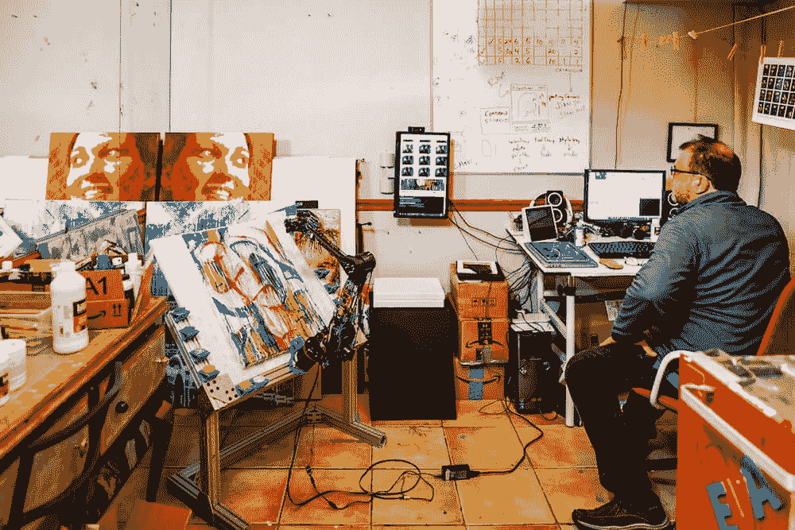
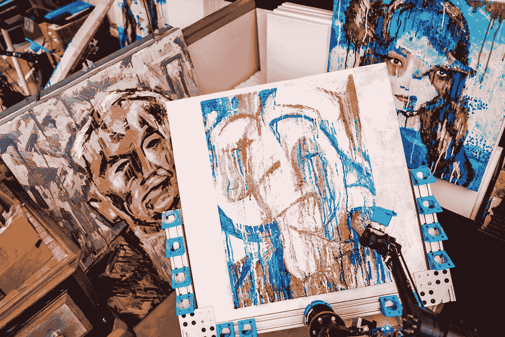

# 艺术中的人工智能

> 原文：<https://medium.datadriveninvestor.com/artificial-intelligence-in-art-45ebbb25966a?source=collection_archive---------21----------------------->

一些艺术家如何使用统计程序来创造现代艺术

A Vincent Van Gogh-inspired Google Deep Dream painting

在我很小的时候，我很幸运有父母鼓励我学习艺术。他们给我买了一本里面有动物的书，我可以在大约 4 或 5 岁的时候练习画画，我的一个较老的记忆是试图在从比利时到美国的飞机上画它们。我喜欢画画，所以他们给我报名参加艺术课程。遗憾的是，我做了几年，并没有实践视觉艺术，但我仍然对艺术家们的大部分作品深表赞赏。在被鼓励艺术的父母包围后，我很高兴看到我的直系亲属都变得很有艺术天赋，并经常练习。带着对艺术的这种欣赏，毫不奇怪我也在和一位艺术家兼艺术老师约会。在我们的一次夜间电话中，克洛伊兴奋地讲述了她为学生们计划的一堂课，内容是人工智能在艺术中的不同应用方式。有些作品令人瞠目结舌，我想在这篇文章中与读者分享。

# **视觉艺术的人工智能**

一些艺术家正在使用创造性的新方法，将人工智能与他们的艺术实力结合起来。这里有一些我最喜欢的将人工智能融入到他们作品中的艺术家，以及我最喜欢的展示他们独创性和技巧的作品。

## **备忘录 Atken**

Memo Akten 是一名来自土耳其伊斯特布尔的艺术家和研究员，他使用人工智能和艺术来探索和表达科学与精神之间的相互联系。他把自己的很多作品上传到 youtube 上。下面是他的作品《深度冥想》中的一个片段，他在其中使用神经网络作为媒介，讲述了一个有意义的人类控制的故事:

Memo 还有很多其他令人惊叹和发人深省的作品，我建议大家都去看看。

这里有一个他的网站链接，你可以在那里找到他的作品并了解他更多:[http://www.memo.tv/works/#selected-works](http://www.memo.tv/works/#selected-works)

## 苏文·钟

钟松文是国际公认的多学科艺术家。她在中国出生，在加拿大长大。她的人工智能工作旨在通过探索手工标记和机器标记来更好地理解人类和计算机之间的互动。

Into The Light, Blueprint 2

以下是她的网站链接，可以查看更多她令人惊叹的作品:[https://sougwen.com/](https://sougwen.com/)。

## 品达·范·阿尔曼

品达·范·阿尔曼(Pindar Van Arman)是一位富有创造力的人工智能艺术家，他编码并教机器人如何以各种不同的风格绘画。他还因其名为 CloudPainter 的获奖作品而闻名，这是一个自主机器人，任何人都可以上网并使用它来控制和制作艺术品。看到凡·阿尔曼能够编程并让他的机器生产出什么，真是非同寻常。

这里有一个 CloudPainter 网站的链接，在那里你可以看到他的大部分作品:[https://www.cloudpainter.com/](https://www.cloudpainter.com/)。

# **结束语**

看到人们已经能够结合机器学习做什么是令人惊讶和鼓舞的，我很兴奋地学习和看到人工智能将被使用的新的和创新的方式。我提供了一些我最喜欢的人工智能艺术家的简介，但你可以在网上找到更多。下面提供的网站是我发现的最好的链接之一，可以了解更多关于人工智能艺术家及其作品的影响:

【https://aiartists.org/? FB clid = iwar 1b 8 w 1a 6 mvpznoee 3 srqvygxwldpvwhkiaibws 8 ycqvey P1 F5 si h18 txtc