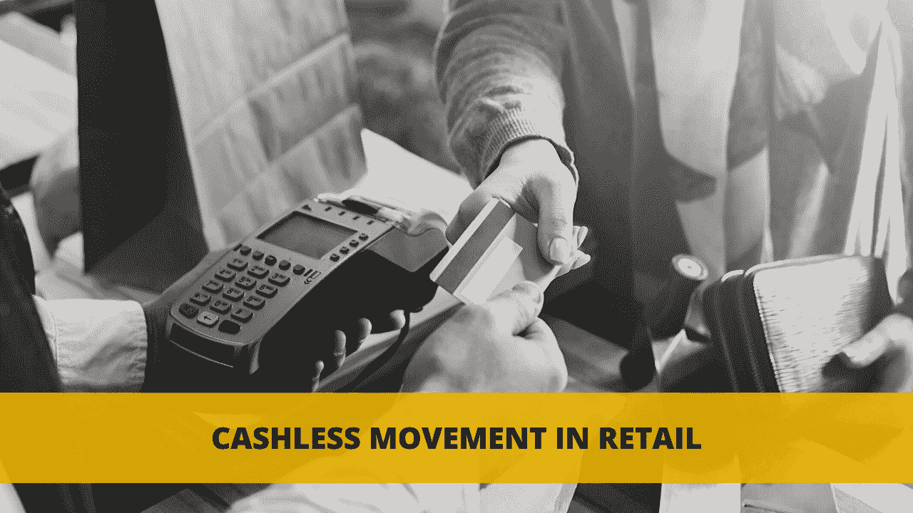
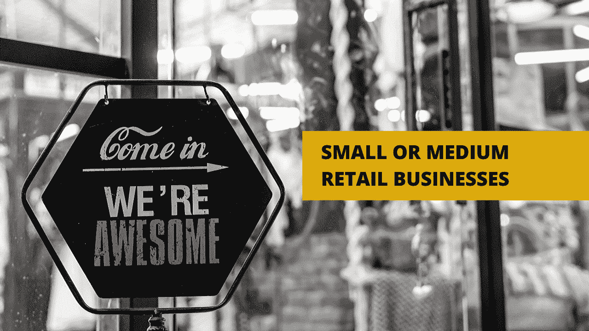

# 零售和电子商务业务中的人工智能

> 原文：<https://medium.datadriveninvestor.com/artificial-intelligence-in-retail-and-e-commerce-businesses-3158a7431d2?source=collection_archive---------16----------------------->

成为零售企业的老板从来都不是一件容易的事情。竞争激烈，顾客挑剔，被多样化的选择所淹没。每天都有数千家商店关门，与此同时，许多企业家在网上提供他们的产品。

如今，成功的关键不仅是提供高质量和独特的产品，更重要的是了解潜在客户快速变化的需求以及吸引他们注意力的方法。

为了确定客户行为模式而必须处理的数据量对于一个人来说太大了。像往常一样，技术创新拯救了世界。

 [## 人工智能与创造力:梦想成真|数据驱动的投资者

### 人工智能总是让我着迷。不仅作为一套有用的工具，不断发展，而且作为一个…

www.datadriveninvestor.com](https://www.datadriveninvestor.com/2019/01/28/ai-creativity-deep-dream-comes-true/) 

# 零售业中的人工智能创新——当前现实

有许多尖端技术可用于零售业务，如面部识别、无人机、机器人等。事实证明，只有不到 10%的零售商已经将它们应用于他们的公司。

这是为什么呢？答案很简单——缺乏信任。

所有的创新在赢得安全有效的解决方案的声誉之前都有很长的路要走。对于零售商来说，尤其是那些经营中小型企业的零售商，使用新技术是没有意义的，除非它们被证明是非常有益的。

另一方面，保持更新是至关重要的，有时要冒险实施新的创新。否则，如果不不断改善购物者的商店体验，在某个时候，业务业绩将开始下降，竞争对手将永远占据顾客的注意力。

零售市场正在经历转型。与传统购物相比，顾客选择便利和独特的体验。电子商务正在发展，现有的商店如果想跟上步伐并在竞争中保持优势，就必须采用新技术。

零售业目前的趋势是什么？

# 零售业的无现金运动

零售业在互联网上迅速发展，交易无需现金。为了购物，顾客可以使用他们的智能手机、电脑、平板电脑等。这种多样性对营销人员有着巨大的影响，他们需要预测模型，能够将不同设备上的零售行为联系起来，同时建立可持续的零售活动。

有必要围绕客户正在使用的媒体实现更多的上下文。为此，营销人员需要机器学习解决方案来将这些海量数据转化为清晰的分析，并最终转化为商业策略。

让我们仔细看看零售商中流行的人工智能驱动的创新。

# 零售商如何利用人工智能技术发展业务

虽然基于人工智能的技术是一个相对较新的领域，但市场上已经有许多工具可供各种专注于增长的公司使用。下面，我列举了最受欢迎的几个。

顶级创新工具([根据 IBT](https://www.ibtimes.com/infographic-machine-learning-dominates-ai-use-retailers-2826463) ):

1.机器学习

2.聊天机器人和语音机器人

3.自然语言生成

4.图像和视频分析

5.群体智能

正如我之前提到的，电子商务市场预计将在未来几年快速发展，很可能在某个时候取代传统的购物方式。

所有在线零售商需要关注的关键因素是增加销售额和改善订单预测。为了显著影响这些元素，利用机器学习解决方案是非常有益的。

机器学习技术能够从大数据中学习，并将其转化为有价值的见解，例如检测趋势。获得这些知识后，it 可以自主地预测趋势将如何发展，以及它将对业务产生什么影响。电子商务公司需要这些信息来设计最有效的商业策略，从而带来高额利润。其他人工智能驱动的技术，如[图像识别和文本挖掘](https://addepto.com/retail-ecommerce/)，也可能对零售商非常有益。

对于大多数零售商来说，人工智能解决方案仍然是一个未知的领域。现在是仔细研究这些新技术的时候了，因为它们正在成为市场上的新标准。

# 作为中小型企业在零售业引入新技术。

您是中小型零售企业的所有者吗？这部分是写给你的。

在考虑在你的零售业务中实施创新之前，重要的是要确定你的基础知识。这意味着库存和价格是否得到很好的保护。

接下来就是观察了。大鱼总是第一个投资并设定新标准。你的工作不是超越他们，而是从他们的经验中学习。最大的零售商能够承担做出错误决定的成本。对于小企业来说，这可能是毁灭性的。

一旦您确定了适合您公司的最佳创新解决方案，就不要再等了，开始实施过程吧。

# 结论是什么？

简言之，为了生存，零售商需要了解客户的新习惯。唯一的方法是从历史数据中学习，并将人工智能驱动的创新应用到他们的业务中。

这不再是一种选择，而是一种需要。

为了在艰难的零售市场中生存，你必须开始改变你的业务，并根据你的历史数据做出预测— Paul Winsor，DataRobot 零售总经理。