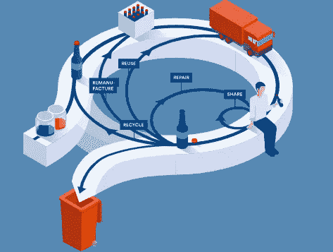
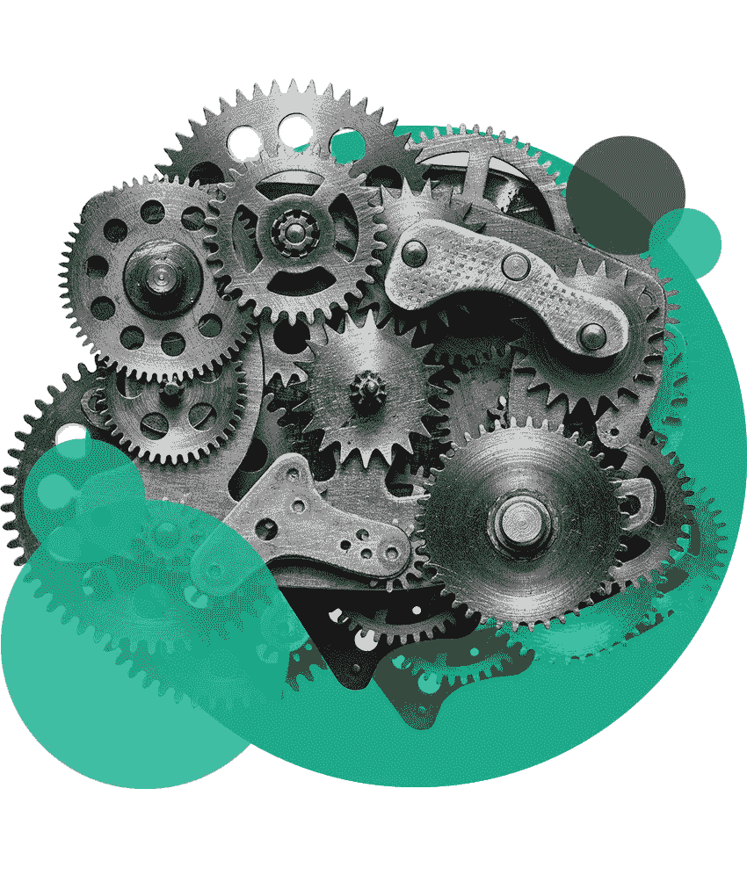

# 向循环经济转型中的人工智能

> 原文：<https://medium.datadriveninvestor.com/artificial-intelligence-in-the-transition-to-a-circular-economy-9614bd670a81?source=collection_archive---------2----------------------->

循环经济旨在将我们的经济模式从目前的开采和消费模式转变为一种通过设计实现恢复和再生的系统。通过将材料保存在生物和技术循环中，循环经济正在彻底改造产品开发，因此需要对网络和运营设计进行复杂的新思维。从这个意义上说，嵌入人工智能(AI)和物联网(IoT)将有助于在三个主要方面克服这些挑战:

*   优化设计，
*   有效的商业模式，
*   智能基础设施。

**1-设计**

人工智能可以通过迭代的机器学习辅助设计流程来增强产品、组件和材料的创造，以符合循环经济，从而实现快速原型制作和测试。人工智能算法分析大量现实生活和历史数据的能力可以帮助设计师通过将圆形材料与消费者偏好相匹配来减少复杂性。算法还可以通过建议符合圆形标准的初始模型和调整来加速设计过程，然后设计师可以根据数据进行调整。人工智能可以补充设计师的想法，以解锁新颖的产品，同时消除人类的偏见。

**2-商业模式**

数字技术的使用促进了经济的优化和效率。从这个意义上说，人工智能已经赋予了产品即服务和租赁等循环商业模式以竞争力。应用包括预测性维护，以维持产品和材料的长期使用；动态产品定价也是如此，例如，在食品到期前降低食品价格，减少食品浪费；智能库存管理和匹配算法有助于个人与数字共享平台上的二手商品建立最佳联系。

**3-基础设施**

人工智能应用可以帮助简化机器人基础设施，这些基础设施可以识别和识别物体，以实现经济中的最佳物质流动。人工检查和处理用过的产品妨碍了有效的拆卸、分类和分离材料。人工智能可以促进对产品生命周期结束时的状况进行自动评估，并就它们是否可以重复使用、转售、维修或回收以最大限度地保值提出公正的建议。人工智能可以通过识别物料流并根据产品的条件和位置调整拆卸基础设施来推进旧产品的自动化拆卸。

人工智能的大规模应用有可能通过尊重我们地球极限的竞争性创新来重塑工业流程。如今，将高级数据分析应用于循环的例子包括

*   电子元件设计、制造和分类的材料识别，
*   预测交通流量以提高城市机动性，
*   或者通过使用匹配成分、颜色和味道的算法来设计替代食品，以根据消费者偏好和可持续性考虑来创建食谱。

Source: Ellen MacArthur Foundation

然而，尽管人工智能工具可以加速向公平、包容和没有判断偏见的循环经济的过渡，但它们仍然应该由人类负责，并由人类价值观和数据隐私和安全原则驱动。

 [## 另一场精心策划的全球经济危机正在逼近？如果我们的数据经济可以帮助它|数据…

### 我们的 DApp 的开发，称为 DECENTR，目前正与我们的 R&D 同步进行，作为我们即将到来的…

www.datadriveninvestor.com](https://www.datadriveninvestor.com/2019/03/06/another-engineered-global-economic-crisis-looming-not-if-our-data-economy-can-help-it/) 

在未来，随着技术的发展，预测分析可以集成到整个系统中，以促进完全循环社会的发展，满足当代人的需求，而不会破坏未来的需求，并在此过程中为个人、企业和整个社会释放巨大的经济价值。