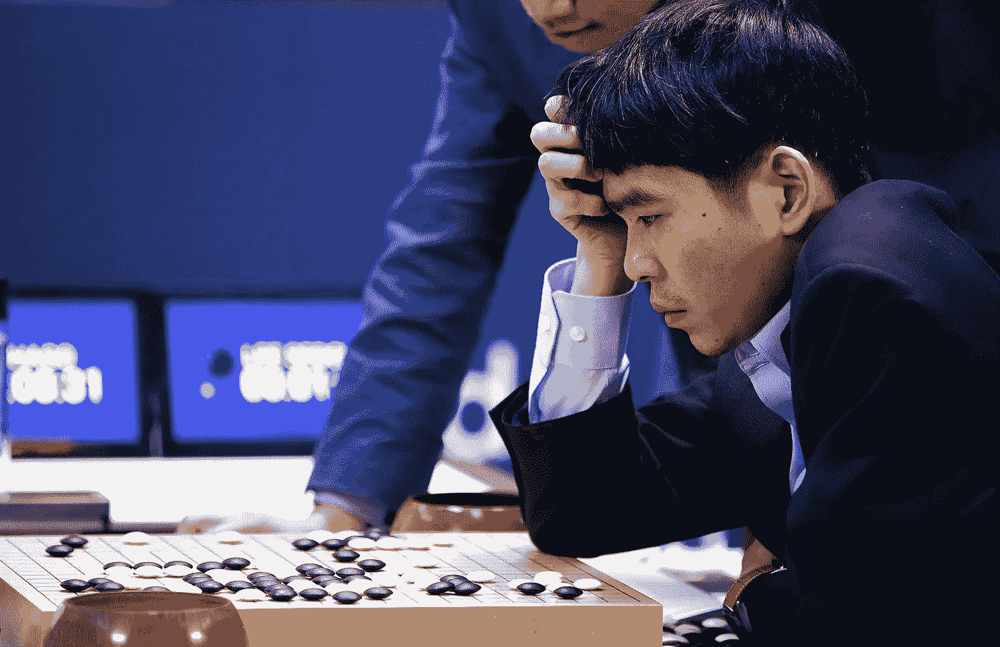

# 受游戏启发的人工智能:国际象棋和围棋

> 原文：<https://medium.datadriveninvestor.com/artificial-intelligence-inspired-by-games-chess-and-go-dd1d97d3dbb0?source=collection_archive---------12----------------------->

The day when AlphaGo program beat the world champion Go player Lee Sedol

> 我也认为它们只是游戏。他们成了一个灵感。

在[我之前的帖子](https://medium.com/@ralphesber/jobs-in-the-future-and-ai-41126f87c821)中，我简要地谈到了人工智能的 3 个不同阶段。我还假设我们正处于第一阶段:人工狭义智能(ANI ),其中每台机器或计算机都专门负责执行局限于一个领域的任务。谷歌地图只能指引你走哪个方向才能到达目的地。即使是 Siri，尽管它可以回答各种不同的主题(天气预报、道路交通……)，但它仍然无法自己解决新问题，也无法分析它无法应对的情况。

但是为了理解 AI 能把人类带到哪里，我们应该理解它从哪里来。

# 第一个灵感:象棋

这一切都始于 50 年代初著名的**艾伦·图灵**，他建议将“下棋”作为对机器的一种测试，以了解它们是否像人类一样聪明。**约翰·麦卡锡**，也是那个时代的计算机科学家，决定完全理解智能，并相信机器在某种程度上可以模仿人类的智能，并以人类同样的方式解决问题。他和几个相信他的计划的科学家合作。他们建立了一个实验室，实际上创造了这个句子:“**人工智能**”。

 [## 人工智能和虚拟现实的融合-你能期待什么|数据驱动的投资者

### 在技术领域，融合是合乎逻辑的一步。就在几十年前，你可能需要一个专门的…

www.datadriveninvestor.com](https://www.datadriveninvestor.com/2018/08/30/the-convergence-of-ai-rv-what-you-can-expect/) 

这是第一次使用**黑客**这个术语。它的本意是描述一个人试图调整一台计算机，去做它原本就没有被设计去做的事情。但这也是冷战最热烈的时候。美国和苏联不放过任何机会炫耀他们远离军事力量的能力。国际象棋已经成为两个巨人对峙的完美代表。国际象棋比赛成为地缘政治事件，事情朝着苏联的方向发展。他们在棋院上投入了很多，所以从 1948 年开始就获得了世界冠军头衔。

与此同时，计算机象棋成为人工智能研究中最有趣的项目。当麦卡锡接受了他的计算机国际象棋程序和俄罗斯程序之间的挑战时，他也成了一名冷战战士。当时互联网还不存在，所以他们通过电报交换移动，一系列比赛实际上花了 9 个多月，最终苏联队以 3 比 1 获胜。麦卡锡在职业生涯中并没有专注于国际象棋，但他的工作激发了许多其他科学家创建自己的国际象棋程序，而最大的挑战是:机器有一天会打败人类吗？

直到 1996 年，IBM 最伟大的计算机“深蓝”在 6 场比赛中击败了世界象棋大师。最后，机器在他们的游戏中打败了人类。

# 另一种方法:

回到 50 年代，其他研究人员尝试了一种不同的人工智能方法:神经网络，他们称之为“感知机”。他们相信他们可以复制人类大脑的工作方式，然而，硬件和软件的限制，然后关闭了该项目。几乎没有人相信这种方法会给人工智能领域带来好处，但有一个人:**杰夫·辛顿**。他试图让计算机像人一样学习，这一探索几乎所有人都认为是疯狂的，或者至少是无望的。同样，硬件和数据的限制也没有给 Hinton 任何动力去验证他的项目。主要想法是建立几层我们称之为神经元的东西，当输入数据时，它们实际上可以“学习”执行任务，而无需按照特定的规则进行编程。这个想法需要快速的计算机处理和大量的数据来训练模型。直到 2006 年左右，超高速芯片问世，互联网上产生的大量数据极大地推动了辛顿的算法。

另一家初创公司也认为神经网络可以成为人工智能未来的基础: **Deepmind** 。这家公司成立于 2010 年，创建了学习如何像人类一样玩电脑游戏的机器人。后来被谷歌收购，他们开发了自己的算法并创造了 **AlphaGo** ，最终在 2016 年以五局(4 比 1)击败了世界冠军围棋(中国古代游戏)选手李·塞多尔。

# 迈向未来的一大步

从一开始，国际象棋就是让机器像人一样思考的主要灵感。然而，科学家们长期以来采取的方法是适得其反的，它主要依赖于与硬件处理能力直接相关的蛮力计算。国际象棋程序被编程来计算所有的可能性，并采取正确的步骤或最有可能获胜的步骤。但当涉及到更复杂的任务时，例如围棋，它比象棋有更多的可能走法，就像整个宇宙中的原子一样多，旧的计算方法不会导致任何结果。这几乎是不可能的。使用强化学习和神经网络使该技术向未来迈出了一大步。这是一种模仿人脑学习过程的方法。突然间，计算机开始识别图像中的内容，识别语音并翻译语言。

对于机器学习来说，要达到可以达到人类智能的水平还有很多挑战，但它已经在正确的轨道上了。一些科学家说，大约需要 40 到 50 年，我们才能在我们中间找到人工智能。我们将面临许多问题，问题将开始出现，特别是当机器开始自己做决定和创建内容时。现在没人能回答的问题。