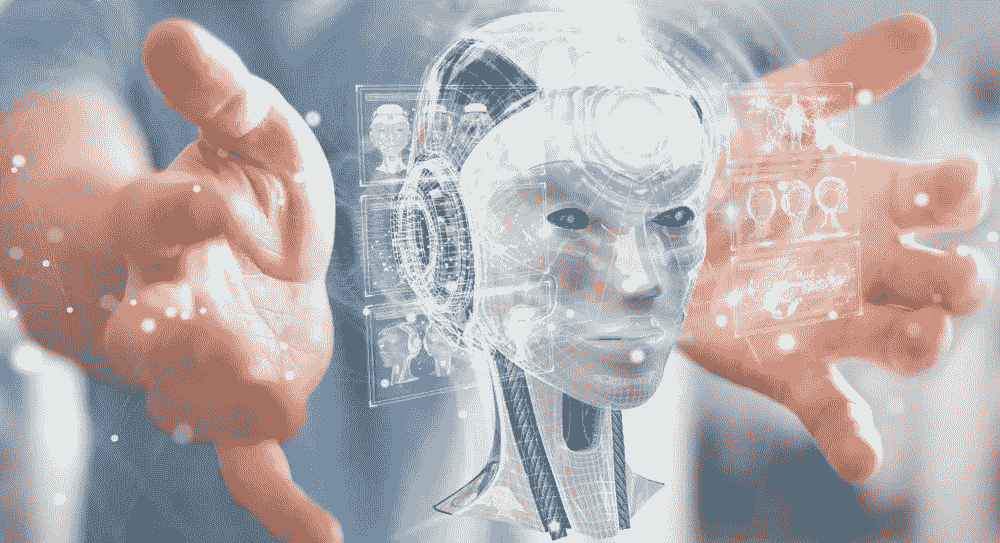

# 人工智能——是救星还是灾难？

> 原文：<https://medium.datadriveninvestor.com/artificial-intelligence-is-it-saviour-or-devastation-d9d822bf7167?source=collection_archive---------7----------------------->

人工智能，一个被广泛使用的术语，正在渗透到各个行业和渠道。它不是新的，但随着时间的推移，它变得越来越现代。在组织和行业层面，人工智能及其趋势被用来改造应用程序和操作。AI 对应的是取代人类智能，成功执行人类所做任务的智能机器。基于人工智能的机器学习、分析、处理和自动化人类过去所做的任务。随着数字化和技术的到来，人工智能算法也变得越来越强，能够产生认知功能。

# **驻留在企业中的人工智能**

公司已经认识到基于人工智能的应用程序和软件的效率和能力，并正在将他们的系统与这些服务集成。例如，许多在线企业害怕通过使用[人工智能面部识别系统](https://shuftipro.com/face-verification)来识别客户身份的在线欺诈，该系统具有潜在的高效智能算法，通过确保用户账户的授权访问来帮助企业防止在线欺诈。类似地，许多其他基于其运营和实践的企业正在安装基于人工智能的解决方案，以实现系统自动化，消除人工努力并提高效率。从谷歌到亚马逊，从脸书到特斯拉，人工智能技术都得到了应用。

 [## 今年值得关注的 5 大人工智能趋势|数据驱动的投资者

### 预计 2019 年人工智能将取得广泛的重大进展。从谷歌搜索到处理复杂的工作，如…

www.datadriveninvestor.com](https://www.datadriveninvestor.com/2019/02/19/artificial-intelligence-trends-to-watch-this-year/) 

# **人工智能的好处**

随着对人工智能工业应用需求的增长，企业将继续投资于先进技术，帮助他们加速高效的数据处理。然而，机器学习和人工智能模型的实现基于数据科学技术和方法，其中需要大量数据来训练和测试模型，以使它们高效并能够实时做出决策。

人工智能的未来相当有希望。世界正朝着智能和自动化的住房和城市、嵌入人工智能技术的先进医疗和手术设备等方向发展。

以下是人工智能技术的一些好处:

1.  **任务优化**

人工智能技术的主要目标是优化和自动化日常任务，使它们更加高效。使用人工智能，组织可以执行由人类完成的简单和高级任务。亚马逊 Alexa 就是一个例子，它可以执行几个功能，例如在线订购产品，播放喜欢的音乐，提供信息，传递游戏比分和新闻，控制智能家居，告诉天气，制作待办事项列表等。同样，自动驾驶汽车通过人工智能技术导航。

**2。消除人工开销**

所有过去由人类执行的耗时且需要持续关注的任务现在都由基于人工智能的应用程序来处理。基于人工智能和机器学习的模型被创建，这些模型学习数据以及如何在某些输入中采取行动。基于人工智能的系统在许多工业领域成功地取代了人类。例如，[面部识别技术](https://shuftipro.com/blogs/top-8-facial-recognition-trends-to-watch-in-2020)识别人类。在[机场](https://medium.com/datadriveninvestor/american-airlines-using-face-recognition-at-dallas-fort-worth-international-airport-4434c8985ee5?source=your_stories_page---------------------------)和网上身份识别，这以前是由人工完成的，需要很长时间来检查个人的身份，以确定他们是真是假。

# **人工智能的风险**

人工智能模型需要大量的知识来训练模型，但任何差异都可能导致毁灭性的情况。关于这一点，业内专家分享了他们的见解。根据比尔·盖茨的说法，人工智能技术既有希望又有危险，在一些领域，这项技术可能不会像预期的那样发挥作用。因此，在战争中使用它们是危险的。正如比尔·盖茨所说；

“这个世界还没有那么多既有前途又危险的技术——你知道，我们有核能和核武器。”

关于战争中的 AI，比尔·盖茨说过；

***“我认为最值得关注的地方是武器系统，”***

1.  **高成本**

企业在基于人工智能的解决方案上投入了数百万。第一个缺点是，基于人工智能的模型需要巨额成本来构建、训练它们，并使它们能够在工业层面上使用。它的安装通过各种程序，公司需要高素质的开发人员和先进的设备。同样，如果发生损坏，公司的成本会更高。因此，大多数大公司和企业选择使用它们并在更大的规模上安装它们，中小型企业害怕在 it 上投资。

**2。庞大的数据集**

为了训练人工智能模型，需要庞大的训练和测试数据集。数据越多，模型就越好。任何差异都可能导致模型的破坏和无法忍受的环境。

**3。失业风险**

随着时间的推移，人工智能将在未来取代可能导致失业的人。人工智能威胁着那些蓝领工人。然而，对人工智能的进步有不同的看法。有些人认为这项技术足够强大，可以修改每一寸和每一个用例，而有些人则担心这项技术会彻底毁灭。

总之，人工智能被用于各种应用中，且改进也在不断提供。不久的将来可以被看作是一部科幻电影，技术是一种传播，大角色是人工智能。