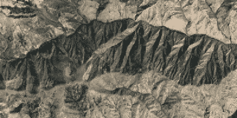
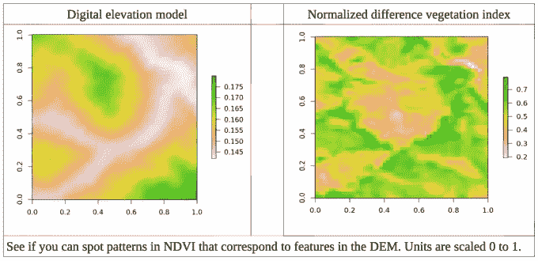
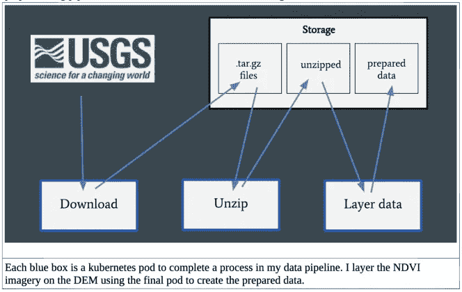
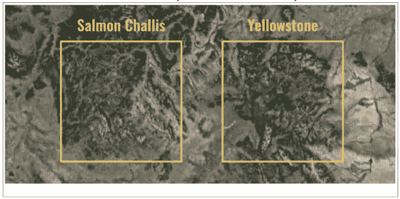
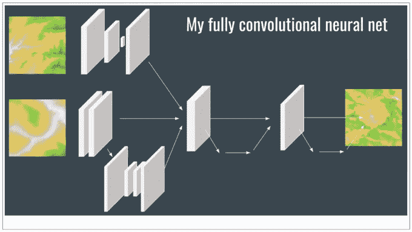
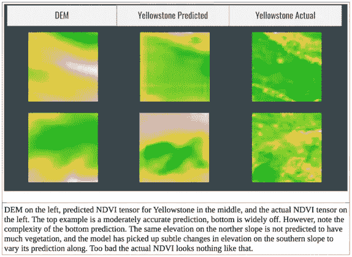

# 人工智能是生态学的先驱

> 原文：<https://medium.datadriveninvestor.com/artificial-intelligence-is-pioneering-advances-in-ecology-5bd86d2ab8e1?source=collection_archive---------22----------------------->

*Originally published*

*原载于* [*CloudOps 的博客*](https://www.cloudops.com/blog/) *。*

这个项目的 GitHub repo 可以在:[https://github.com/TristansCloud/YellowstonesVegitiation](https://github.com/TristansCloud/YellowstonesVegitiation)找到

**“**[**遥感**](https://en.wikipedia.org/wiki/Remote_sensing) **是在不与物体发生物理接触的情况下，获取有关物体或现象的信息……【并且】通常指使用基于卫星或飞机的传感器技术。”**

这是懒人数据收集。“每天扫描整个世界”数据收集。遥感为我们提供了关于世界状况的连续数据流，彻底改变了农业、国际防务、环境监测、危机管理、电信、天气预报、消防和许多其他领域。任何可以在空间范围内设计的应用都可能受益于遥感的进步。

作为一名生态学家，我的领域已经能够通过使用遥感技术来监测全球森林覆盖变化和有害藻类大量繁殖，估计濒危物种的数量，并指定对生态系统功能最重要的保护区。

不想被冷落，一直在思考遥感能给自己的研究兴趣带来什么。我在进化生物学和生态学的交叉领域研究驱动进化变化的过程，称为生态进化动力学。我对构成生态系统的非生物因素特别感兴趣:地形、气候、地球化学和人类干扰(严格来说是生物因素，但也是特例)之间的交叉如何决定了什么生物将在那里生存？

对大数据的[机器学习](https://www.cloudops.com/2018/09/machine-learning-tensorflow-kubernetes-and-kubeflow/)解决方案和应用也很感兴趣。一个自然产生的问题是，我可以使用遥感和机器学习将我的非生命预测者与大规模和跨不同生态系统类型的最终生态系统联系起来吗？

为此，我首先必须定义我的预测因子和反应变量。简单地说，我选择 myresponse 是来自 Landsat 8 卫星的开源 NDVI 图像，它每 16 天拍摄一次地球的大部分。NDVI 代表归一化差异植被指数，这是一种对给定区域植被数量的测量。植物吸收光合作用活跃的光并反射近红外光，因此这两种波长之间的差异是健康植物物质存在多少的量度。在第一次尝试中，我选择了数字高程模型(DEM ),忽略了气候、地球化学和人类活动。我选择了一个区域进行研究，该区域在整个研究区域的气候上应该几乎没有偏差，因为在第一次尝试建立该模型时，我只想关注地形的影响。然而，我想设计一个数据管道，一旦我想解决更复杂的预测和反应，可以很容易地扩展。

Kubernetes 提供了一个理想的解决方案，允许我创建 pods 来完成预处理管道中的每个步骤，并在不再需要时删除那些资源。

USGS 拥有一个用于下载 Landsat 8 图像的 API，我通过编程语言 R 访问它，并在下载舱中执行。然后将数据解压缩到一个新的 pod 中，最后我的预测值 DEM 在最终 pod 中的 NDVI 图像上分层，以创建我准备的数据。当我扩展项目时，这最后一步很容易扩展到不同的预测层。

# 神经网络

假设气候和其他因素保持不变，我想为这一分析测试的假设是，我能在多大程度上根据 DEM 预测植被生长，以及该模型从一个区域到另一个区域的可移植性。为了测试这一点，我从美国西北部的两个国家公园下载了 NDVI 图像:鲑鱼湖国家公园和黄石国家公园。

我选择了这两个地方，因为它们处于相似的地理区域，所以可能有相似的气候。它们都是山区，占地面积相似。最后，它们都是国家公园，应该拥有相对远离人类干扰的原始生态系统(尽管这两个地区都有一些农业和人类居住区)。

我选择了两个场景，一个来自鲑鱼湖，一个来自黄石公园，来自同一年同一季节。我的计划是建立一个完全卷积的神经网络(CNN ),并对来自 Salmon Challis 的张量进行训练，以预测黄石公园的张量。通过对 NDVI 和 DEM 图像进行 51 像素乘 51 像素的分割，我为 Salmon Challis 创建了 17，500 个单独的张量，为 Yellowstone 创建了 17，500 个单独的张量。然后，我构建了一个 CNN 来获取两个输入，51 x 51 DEM 以及覆盖更大区域的 51 x 51 像素低分辨率 DEM，以防某个区域周围的大规模地理特征对预测植被很重要。模型的输出是 51 x 51 的 pixelNDVI 图像。

通过反复试验，我发现受 [GoogLeNet](https://research.google/pubs/pub43022/) 启发的初始框架提高了模型预测的稳定性。Inception 将张量分支到不同的处理路径，可能允许模型理解数据中的不同特征，同时保持计算高效的网络。GoogLeNet 凭借这种风格的架构在 2014 年赢得了 ImageNet 大规模视觉识别挑战赛，如果你有兴趣了解更多关于网络架构对神经网络性能的影响，我建议阅读这一模型和其他模型的原始研究论文(并不过分技术性)。 [UNet](https://arxiv.org/abs/1505.04597) ，一个独立的卷积网络，也启发了我的一些架构。

总的来说，模型性能超过了基于广义加性模型(GAMs)的经典技术，但是仍然不能令人满意，得到了相当多的错误图像。参见一些模型预测的最终数字。我想自学设计神经网络，所以现在我避免从预训练的网络进行迁移学习，尽管这仍然是一种选择。通过 GCP、CloudOps 和每天生成的大量遥感数据，我拥有了改进这个模型的资源和数据。我想通过更多的预测，并增加我的神经网络的宽度和深度。如果你想看看我的 [github](https://github.com/TristansCloud/YellowstonesVegitiation) 在神经网络或我用来下载数据的 Kubernetes 解决方案中的实际层，请看看我的。我仍在从事这个项目，所以我的网络架构可能有所发展。祝您在自己的数据科学冒险中好运！

Kubernetes 和云原生技术使科学家能够存储和理解遥感收集的数据。尽管如此，这些技术可能很难学习和掌握。CloudOps 的 [DevOps 研讨会](https://www.cloudops.com/workshops/)将通过实践培训加深您对云原生技术的理解。参加我们为期 3 天的 [Docker 和 Kubernetes 研讨会](https://www.cloudops.com/workshops/https://www.cloudops.com/workshops/https://www.cloudops.com/workshops/#DockerK8s)开始在开发或生产中使用容器，或者参加我们为期 2 天的[机器学习研讨会](https://www.cloudops.com/workshops/#machineLearning)使用 Kubernetes 和其他开源工具使您的 ML 工作流变得简单、可移植和可扩展。

## 特里斯坦·科斯丘奇

Tristan 是一名进化生物学家，对景观水平对遗传和表型变异的影响感兴趣。他在温哥华岛研究三棘鱼，在维多利亚湖流域研究尼罗河鲈鱼和单带喙慈鲷。他在棘鱼方面的工作使用遥感来量化环境，以测试进化的可预测性。

*本帖原载* [*此处*](https://www.cloudops.com/blog/remote-sensing-data-pipelines-kubernetes-and-neural-networks-in-ecology/) *于* [*CloudOps 的博客*](https://www.cloudops.com/blog/) *。*

[**注册订阅 CloudOps 每月简讯，了解最新的 DevOps 和云原生开发。**](https://www.cloudops.com/newsletter-signup/)