# 人工智能-模块第一部分

> 原文：<https://medium.datadriveninvestor.com/artificial-intelligence-modules-27cb7a9d9466?source=collection_archive---------2----------------------->

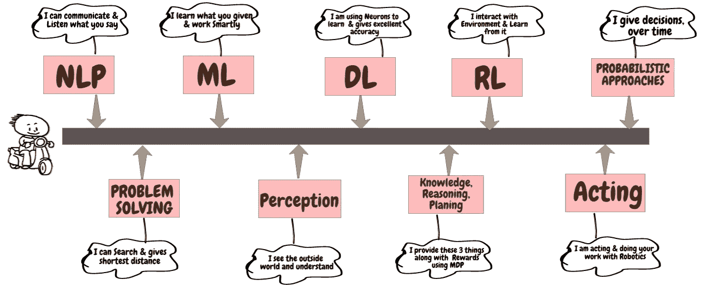

**AI Modules or sub-fields introducing to newbie or starter of AI**

**介绍问题解决、规划、推理&机器学习。**

由于可读性问题，本文分为两部分。

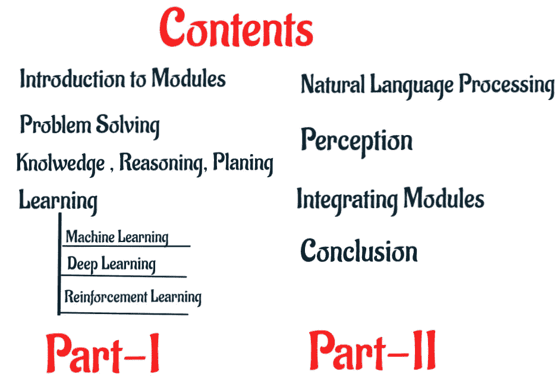

在这篇文章中，人工智能模块概述了它需要什么，类别，实现，算法类型，应用和例子，在每个模块中给出了一个算法及其内部工作(只有数学部分，而不是代码)，在几个模块中涵盖了算法在单独的文章中，需要遵循相同的。本文的目的是介绍这些模块。

## 这篇文章的阅读风格

这篇文章以一种互动的方式探讨了如何向新手或初学者询问关于模块的问题，AI 模块会立即解释并给出答案。

上述模块可分为基于状态的模块、知识模块、推理模块、学习模块、语言学模块和感知模块。

人工智能包括大量子领域，从一般任务(感知和学习)到具体任务，如下棋、证明数学定理、写诗、驾驶汽车和诊断疾病。上图中描述的几个子领域对人工智能的初学者或新手来说很难理解。

# 学习 AI 模块需要什么？

人工智能是一种算法方法，执行不同数学和统计学科的算法，你需要对数学及其相关学科感兴趣。下面的文章简要地探讨了数学问题。

 [## 人工智能与数学

### 探索人工智能的数学和统计课题。

medium.com](https://medium.com/swlh/ai-mathematics-699a9ea2a0d6) 

除了上面的文章，你可以在下面的文章中更新线性代数和概率以及如何在人工智能中使用它们。

 [## 人工智能中的线性代数&量子计算

### 线性代数的用途介绍:线性代数是人工智能(人工智能)的主要计算工具…

medium.com](https://medium.com/swlh/linear-algebra-in-artificial-intelligence-quantum-computing-c61ea629367c)  [## 人工智能中概率的力量

### 这个博客解释了适用于人工智能主要领域的基本概率论概念…

medium.com](https://medium.com/swlh/the-power-of-probability-in-ai-bfe07bbea061)  [## 线性代数-如何用于人工智能？

### 了解线性代数在人工智能中的应用。

medium.com](https://medium.com/analytics-vidhya/linear-algebra-how-uses-in-artificial-intelligence-2e1e001c65) 

人工智能模块可以在各种应用程序中实现，它是普遍适用的，在每个模块中提供它在应用程序中的使用位置。

> **简单解释一下解题方法？**

在**计算机科学**和**人工智能**中，解决问题包括算法、启发式和根本原因分析等技术。求解所需的资源量由**“计算复杂性理论”**描述。

## 定义问题和解决方案

**目标制定**:基于当前情况和代理的绩效衡量，是解决问题的第一步。

**问题公式化**:给定一个目标，决定考虑什么动作和状态的过程。

**寻找**:寻找达到目标的一系列动作的过程。

**解**:搜索算法以一个问题作为输入，以动作序列的形式返回一个解。

**计划**:从起始状态到目标状态的路径称为**计划**。

问题解决代理使用原子表示，这里状态没有对问题解决算法可见的内部结构。

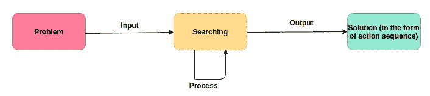

**Solution described in the form of action sequence for all categories**

在人工智能中，问题解决由不同的策略组成，如搜索、对抗性搜索(游戏)和约束满足问题(CSP)。

# 解决问题的策略

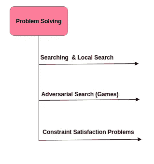

**搜索**:基于以初始状态为根的搜索树，从起始状态移动到目标状态；分支是动作，节点对应于问题状态空间中的状态。有两种不同的策略:知情搜索和非知情(启发式)搜索。这些被认为是经典的搜索。

**局部搜索**:这些算法使用单个当前节点运行，并且通常只移动到该节点的邻居。除了寻找目标之外，局部搜索算法对于解决纯优化问题是有用的。

**对抗性搜索**:这些搜索问题通常被称为**“游戏”**。在这里，不止一个代理参与到环境和竞争环境中，这些环境和竞争环境提供给代理同时相互作用。

**约束满足问题(CSP)**:这里我们为每个状态使用一个分解的表示；一组变量，每个变量都有一个值。当每个变量都有一个满足该变量上所有约束的值时，约束满足问题(CSP)就解决了。主要设计是通过识别违反约束的变量/值组合，一次性消除大部分搜索空间。

所有策略算法都可以按如下方式分层排列。

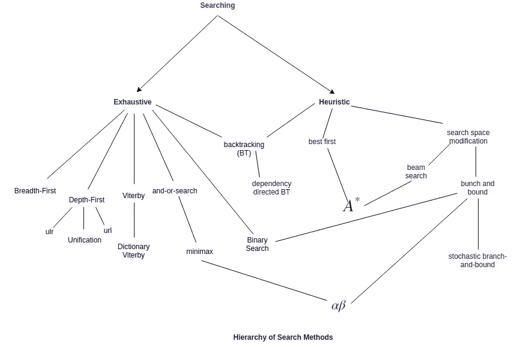

**Search Methods described hierarchically for all the strategies**

不知情的搜索算法，除了问题的定义之外，没有给出关于问题的任何信息。

## **衡量解决问题的表现**

我们可以用四种方式评估算法的性能。

**完备性**:确保算法保证在有解的地方找到解。

**最优性**:策略是否找到最优解？

**时间复杂度**:找到解决方案需要多少时间？

**空间复杂度**:执行搜索需要多少内存？

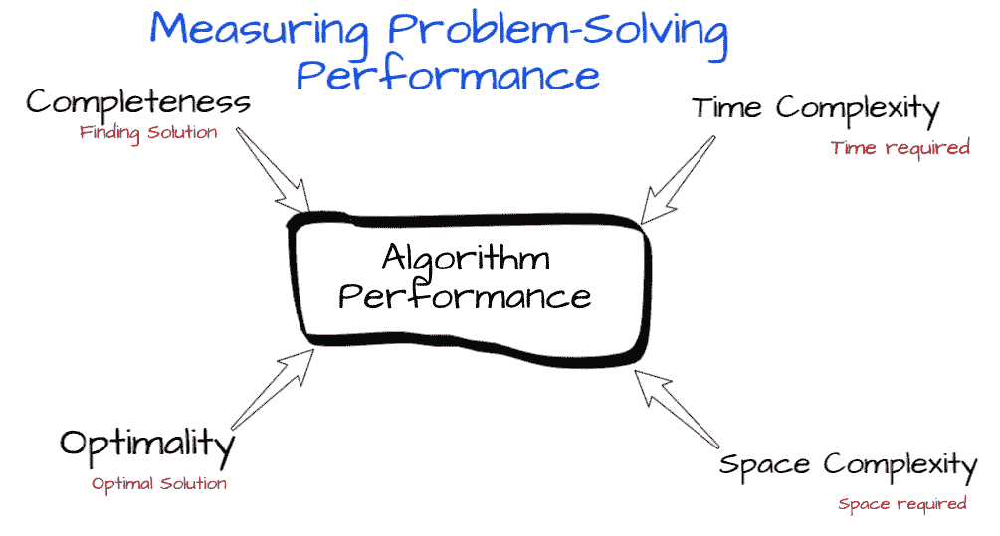

> **需要学习什么？**

需要大 O 记法、NP-完全性、动态编程、递归函数、数据结构、排序方法、离散数学、编程动手(C++/Python/Java)、算法原理等。,

> **请简单探讨一下它的应用？**

它的应用是游戏，最小最大问题，寻找最短路径距离，优化，过滤，路径寻找，邻居着色等。,

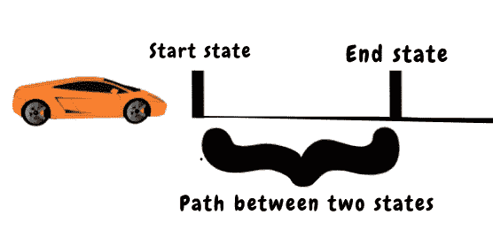

在自动驾驶汽车中，它最适合用来寻找从一个地方移动到另一个地方的路径。我们在自动驾驶汽车技术中使用许多搜索方法来寻找路径，如 Dijkstra 算法、A*搜索算法等。,

> **讲解知识、推理和刨？**

这是人工智能中最重要的模块，智能体应该拥有在任何艰苦环境中工作的概率方法。

> **为什么需要知识？**

为了获得好的决策，智能代理需要关于世界的知识。

**让我们定义术语知识、推理和计划。**

知识对在环境中做出决策大有裨益。认识论是哲学中有关知识的分支。

对知识的内部表示进行操作的推理过程。

**知识库代理**:基于知识的代理的核心组件是它的知识库。一个通用的基于知识的代理。给定一个感知对象(它看到了什么)，代理将该感知对象添加到它的知识库中，向知识库询问最佳动作，并告诉知识库它实际上已经采取了该动作。简单地说，基于知识的代理像我们所有的代理一样，它接受一个感知作为输入并返回动作。代理必须维护一个知识库，该知识库最初可能包含一些背景知识。

# 知识表示和本体论

使用本体的知识表示。本体论将世界上的一切组织成类别的层次结构。在本体论中，将对象组织成类别是知识表示的重要部分。

创建表示，集中于一般概念，如事件、时间、物理对象和信念——这些概念出现在许多不同的领域。代表这些抽象概念有时被称为**“本体工程”**。

## 目标

对象中的主要主题是类别、具体化、子类别、继承、分类、不相交、分解、划分、对象的物理组成、簇、最小化等。,

## 测量对象

通过物体的属性来衡量物体，例如:高度、质量、成本等。，分配这些属性称为度量。对象属性有内在的和外在的。内在属性属于对象的实体，而不是对象的整体，而外在属性不在细分之下。例如:将对象分成两半，属性保留内在属性，外在属性不保留。

事件可以在操作过程中被激活。

推理可以通过概率论来实现。

> 实现(知识、推理和计划)方法需要什么？

嗯，可能有不同的数学主题来实现这些概念，最重要的是用于推理的[概率论](https://medium.com/swlh/the-power-of-probability-in-ai-bfe07bbea061?sk=c35fea9ad01114a09312aa82e4129ed5)，用于知识工程的命题逻辑和一阶逻辑。

# 平刨

规划设计一个行动计划来实现一个人的目标——这是人工智能的一个关键部分。规划的一个众所周知的例子是问题解决代理和混合逻辑代理。问题解决代理可以找到导致目标状态的动作序列。混合逻辑代理使用基于问题逻辑结构的领域独立试探法。

状态空间搜索的规划算法是向前(前进)状态空间搜索和向后(回归)相关状态搜索。在向前状态空间搜索中，从初始状态开始，用问题的动作向前搜索目标状态集中的一个成员，而在向后搜索中，从目标开始向后搜索初始状态。

规划图是一种特殊的数据结构，用于给出更好的启发式估计。平面图是组织成层次的有向图。这个图是从初始状态开始构建的。

计划实时用于时间安排、日程安排和资源。许多操作都会消耗资源。动作可以产生和消耗资源。时间是最重要的资源之一。它可以通过调度算法来处理，或者调度可以与计划集成。

当环境中的其他智能体合作或竞争时，需要多智能体规划。

规划可以扩展到非确定性环境、多主体和随机环境的马尔可夫决策过程以及未知环境的强化学习。

> **人工智能中最流行的概率方法是什么？**

下图描述了人工智能中众所周知的概率方法。

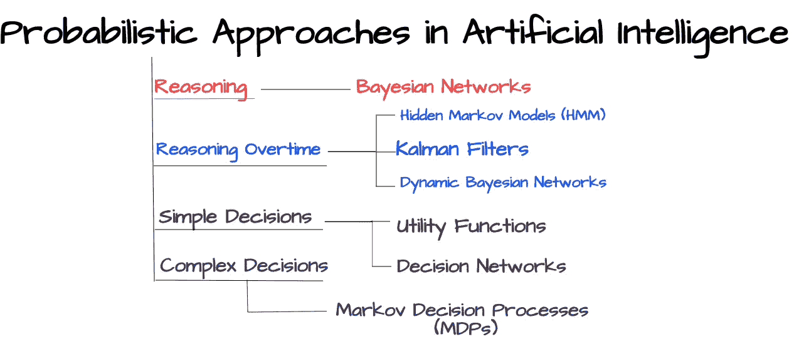

这些方法在处理算法中的推理时非常有用。

> 解释概率方法中的任何一种方法？

隐马尔可夫模型(HMM)对于在连续或面向序列的应用中寻找中间结果是最重要的。

HMM 是一种时间概率模型，其中过程的状态由单个离散随机变量描述。变量的可能值是世界的可能状态。隐马尔可夫模型的目的是学习观察值和输出标签的联合分布。

HMM 模型可以用输入、输出和两个概率来描述，它们定义如下。

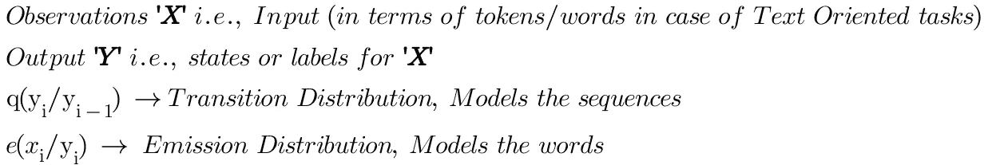

下面给出一个使用 HMM 的机器翻译模型(西班牙语到英语)的例子:

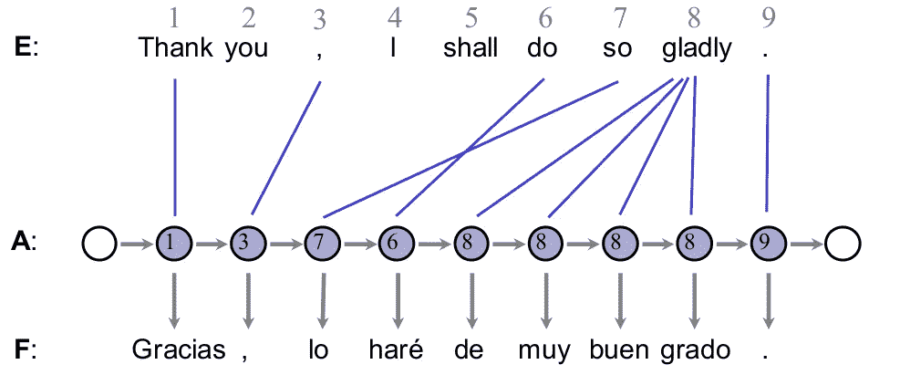

HMM 学习公式如下:

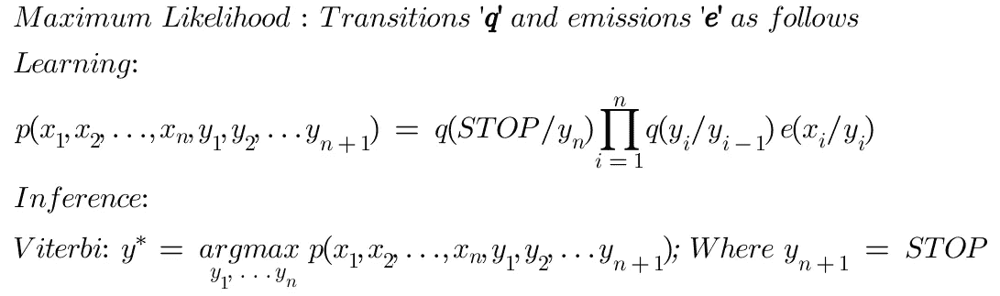

**HMM Learning and Inference**

此外，我们可以分解为过渡

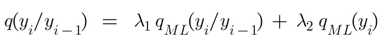

> 我可以在哪里应用这些方法？

这些可以应用于人工智能算法中推理适用的任何地方，特别是自动驾驶汽车、时间序列分析、过滤等。,

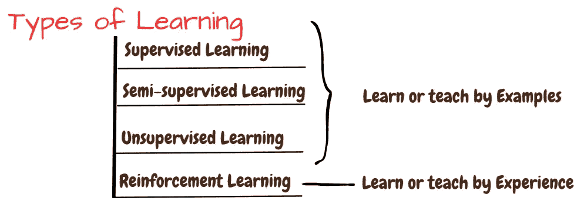

在**监督或半监督或无监督学习中**算法学习例子中的模式(即数据集中的数据点)。在**强化学习**世界(是学习的源泉)，通过探索学习模式。

请注意，在开始学习模块之前，有必要了解一些术语。表示法是由。表示法中的每个部分都是特征。

> **表示学习**:机器学习不仅要发现从表示到输出的映射，还要发现表示本身。这种方法就是**表象学习**。

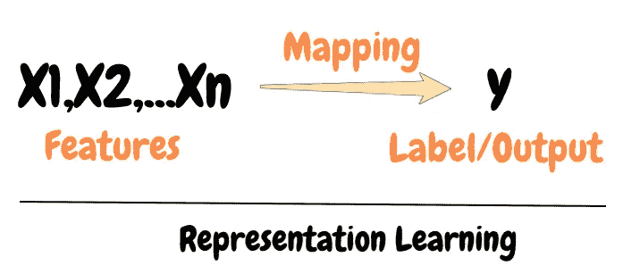

有模块可以组合成学习，实现知识推理。

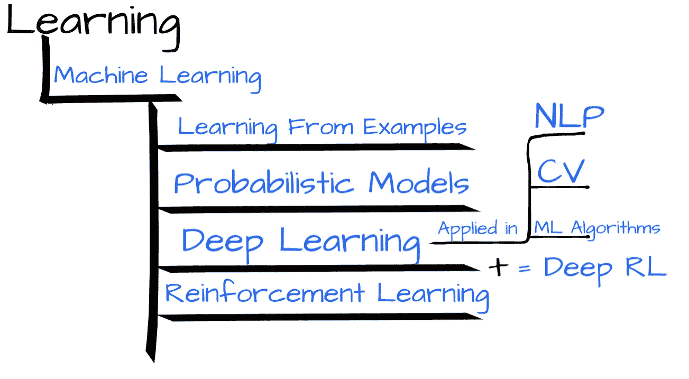

最终学习在人工智能中具有高优先级模块。

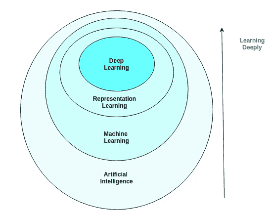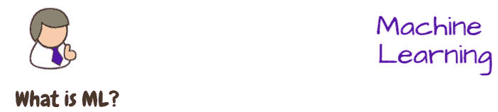

机器学习是一种从数据中学习的算法方式，然后将对相同的未知数据分布做出自己的决定。最大似然法中有两种学习算法，监督学习和非监督学习。

嗯，需要数学科目写算法。主要课程有线性代数、统计学、向量微积分、数值计算、信息论、实分析等。，不如参考这篇[文章](https://medium.com/swlh/ai-mathematics-699a9ea2a0d6?sk=81c51e208e1b0586080a143ff4f225ec)。

机器学习可以使用深度学习处理文本、图像和视频。所有的机器学习算法都可以使用深度学习来实现。

**监督学习算法**:这些算法经历一个包含特征的数据集，但是每个观察或示例都与一个目标或标签相关联。监督学习算法研究数据集，并根据特征学习预测值(用于回归)/分类(用于分类)。

监督学习算法如下图所示。

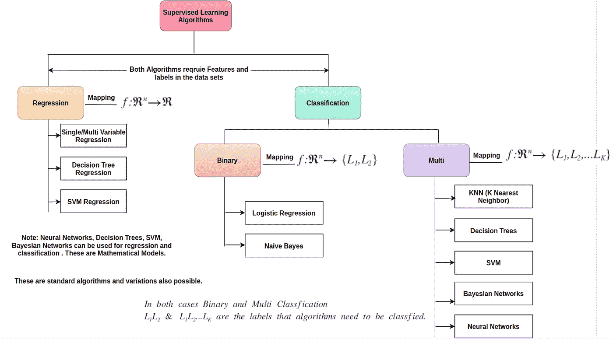

**Supervised Learning Algorithms**

**无监督学习算法**:

**无监督学习**是在没有相应标签或响应的情况下，对数据进行建模。我们可以从原始数据中得出结论，并有可能找到模式和结构。最强大的工具是聚类和降维。

**聚类**:这是一种将数据拆分到相似项目的桶中的过程。从某种意义上说，更可能是在不知道任何对应标签的情况下对数据进行分类。

**降维**:它是关于操纵数据在一个更简单的视角下查看。比如去掉冗余的特征，我们可以在一个更低维的空间解释同样的数据，看看哪些特征真正重要。

无监督学习算法如下图所示。

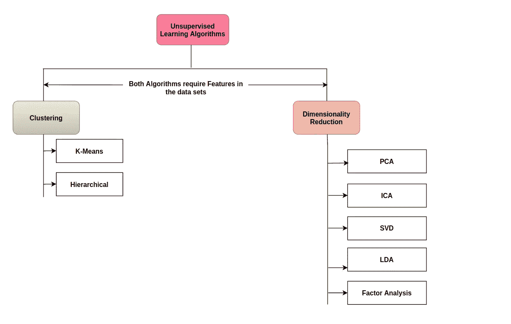

它有深度学习、强化学习等分支。你可以把深度学习和强化学习结合起来，即 Deep RL =深度学习+强化学习。

下图给出了清晰的图像。

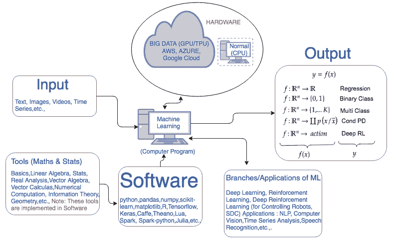

**ML,DL, RL Software and Hardware Infrastructure**

以下是可以应用 ML 的应用—第五章，[深度学习书籍](https://www.deeplearningbook.org/)。

你可以以各种方式使用，如线性回归(预测连续变量，例如:房租)、分类(二元分类:邮件是火腿还是垃圾邮件)、降维(PCA)、使用 K-means 的数据聚类、使用 Bayes 规则的生成模型(获取文本)、多类分类(for)、使用决策树的分层决策、使用关联规则的对象之间的关联。下图简要描述了算法的应用。

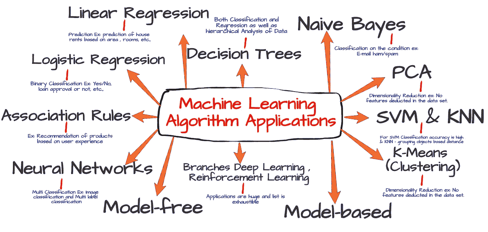

**Machine Learning Algorithms and its applications**

你可以在**中找到线性回归算法(内部工作)的完整例子，在这个[线性代数中，LA 概念如何应用于 ML-回归算法](https://medium.com/analytics-vidhya/linear-algebra-how-uses-in-artificial-intelligence-2e1e001c65?sk=7734226c0b2b92b782fb2b11d9de7a5a)**部分-它如何在 AI 中使用？。

感谢您阅读本文，感谢您的反馈、评论和分享。如果评论部分有任何错误，请告诉我。