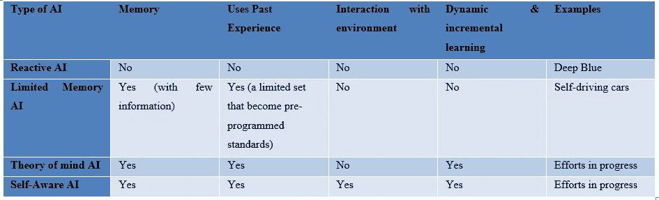
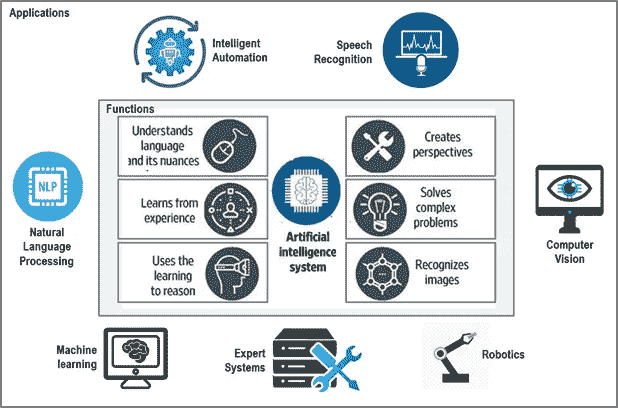
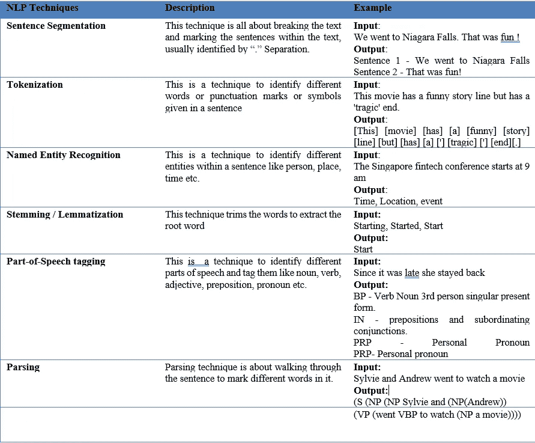
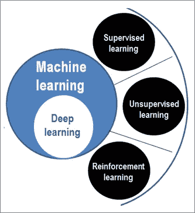
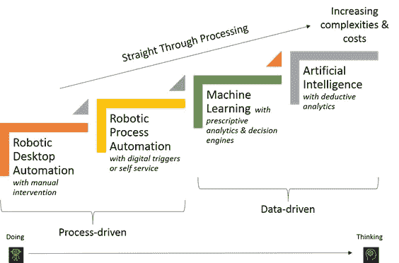

# 简化的人工智能

> 原文：<https://medium.datadriveninvestor.com/artificial-intelligence-simplified-838de55441de?source=collection_archive---------2----------------------->

自从 1956 年在达特茅斯会议上首次提出以来，人工智能的定义一直在发展。从模仿人类大脑的工作方式到解决重点突出的复杂问题，做所有人类能做的事情，如看、听、交流、行动、学习、感知、思考、决定、表达情感和同情心，或与环境互动并在特定环境下做出反应。最近人工智能在视觉、语言识别和自动驾驶汽车方面的突破改变了我们今天感知人工智能的方式。下面给出的是人工智能的一个简单非正式的定义。

> 人工智能(AI)是一个宽泛的术语，可以定义为计算机科学的一个领域，涉及使计算机能够像人一样行事或执行通常需要人类智能的任务。

人工智能系统的目的一直在演变。在这一节中，我们将涵盖不同类型的人工智能系统，这些系统已经根据其核心目的进行了分类。我们还可以观察这些不同类型的人工智能系统如何标志着向构建更智能的系统迈进了一步。

下图列出了不同类型的人工智能:

1.**反应机器人工智能**是第一种人工智能。这些机器没有记忆，不使用来自经验的信息。在这些机器中，当前的环境被直接感知，并付诸行动。这使得计算机每次遇到某种情况时的行为完全相同。这样做的好处是得到可靠和一致的结果。例如:深蓝(由 IBM 开发的下棋计算机，在国际象棋比赛中战胜了卡斯帕罗夫)。

**2。** **有限记忆 AI** 机器，另一方面，查看过去并将它们用作世界预编程表示，并应用于当前数据集。例如，在自动驾驶汽车中，关于车道标志、速度限制或道路方向、车辆的当前速度和相对邻近汽车速度的数据，决定汽车何时应该改变车道。

**3。** **心智理论人工智能机器是**智能机器，它们使用先进的技术来理解人类的情感。“心理理论”是一个心理学术语，指的是生物有感情和思想，并决定他们的行为。

**4。** **有自我意识的人工智能机器:**这些机器是心智理论人工智能的扩展，它们可以配置表征；这意味着我们将拥有在特定环境下具有意识和感知能力的设备。这也被称为人类感知人工智能或人类交互人工智能。这些机器上没有原型。

**人工智能的类型**

人工智能系统的另一种分类方式是基于手头问题的复杂程度；**人工狭义智能**(ANI)**人工广义智能**(AGI)**人工超级智能** (ASI)。

> **人工狭义智能** (ANI)是关于用有限的能力范围来解决针对给定请求的问题。在这种情况下，智能手机中类似 Siri 的功能可以被视为一个例子。这也被称为弱人工智能，
> 
> **人工通用智能** (AGI)另一方面被称为强人工智能(Strong-AI)，指的是像人类一样有能力的机器。Pillo 机器人就是一个例子，机器人可以诊断疾病，也可以服药。
> 
> 人工超级智能(ASI)是一种机器，它可以做超出人类能力的事情。Alpha 2 机器人是这方面的第一次尝试，机器人可以管理智能家居和操作家中的事情。它可能是这个家庭的一员。今天大部分现存的人工智能是人工智能。AGI 和意大利航天局正处于发展阶段。

下图代表了人工智能系统的核心功能和特征，以及支持实现这些功能的相关子领域。

人工智能的应用或子领域是:

1.自然语言处理

2.机器人学

3.机器学习和深度学习

4.专家系统

5.语音或声音识别

6.智能自动化和

7.计算机视觉

这些子领域中的每一个都是相互关联的，任何现实世界的实现通常都包括一个或多个子领域。在下一节中，在深入研究计算机视觉之前，我们将通过真实世界的例子和相关的技术工具来研究每个子领域的简短定义。

# 自然语言处理

**自然语言处理**，也称为 NLP，指的是计算机科学中的一个专业领域，处理从自然语言或人类语言中分析和得出有用或有意义的信息。在高层次上，这需要使用正式的技术，如标记化、特定业务案例上下文中的关系提取、单词分类和句子检测。对于一门语言来说，指该语言遵循的基本规则的句法和指其含义的语义起着重要的作用。这种复杂性来自于这样一个事实，即文本的目的可能是模糊的，并且可能随着上下文的变化而变化。例如，单词“*饱和度*”在与人类行为背景的颜色一起使用时可能意味着不同。

下图显示了当前 NLP 应用的关键领域。

NLP 在各种各样的学科中被用来解决各种各样的问题。应用程序的简要列表如下:**搜索，其中**是指在更大的内容上下文中识别文本的特定元素。**，**机器翻译，即将文本从一种自然语言翻译成另一种自然语言，对文档、博客等中描述的更多实质性内容进行总结。**命名实体识别(NER)** 从文本中提取地名、人名和事物名，**信息分组**即根据内容和上下文对文本进行分类。**情感分析**通常用于感知和提供关于产品在市场上表现如何的自动帮助或反馈，如一本书、一部电影等。**回答询问**或支持所使用的药物或服务；例如，聊天机器人和**语音识别**可以帮助分析和理解与人类对话的背景。

下面列出了一些基本的自然语言处理技术和例子:

# 机器人学

**机器人学**是一门计算机科学学科，涉及物理机器人或机器的设计、编程、工程和开发，这些机器人或机器被建造来执行通常由人类完成的任务。

机器人技术的采用最初是针对对人类有危险的工作，如焊接、铆接、采矿、清理有毒废物或拆除炸弹等，或者需要高精度或对人为错误容忍度低的工作，如医疗领域的长时间手术。

 [## 论机器人权利:机器人可以被奴役吗？数据驱动的投资者

### 人们可以随心所欲地对待他们的机器人吗？一个人可以对他们的机器人“暴力”吗？机器人应该是…

www.datadriveninvestor.com](https://www.datadriveninvestor.com/2020/02/13/on-robot-rights-can-robots-be-enslaved/) 

虽然机器人已经存在和发展了几十年，但直到现在，机器人在日常活动中的使用才开始增加。随着物联网和大数据的出现，大量流数据点和分析的同化不是挑战。例如，如果我们看看自动驾驶汽车上的一个简单传感器[【LJ1】](#_msocom_1)，它每毫秒或每秒处理数十万个数据点，以评估汽车的移动是否安全，是否在规定的时间内到达目标目的地。

# 机器学习

**机器学习**是一种将智能构建到机器中的方法，它将能够随着时间的推移进行学习，并利用自己的经验做得更好。它涉及一种模式搜索机制，这种机制完全是从更多信息或环境的宇宙中过滤相关的细节。

以这种方式构建的机器学习算法处理建筑智能。学习算法的目标是以规则的形式产生一个最大程度上准确和精确的结果。

下图描述了机器学习的各个子领域。

**监督学习**都是按照一个已知的预期进行的，这意味着需要从数据中分析的内容已经定义。在头脑中没有明确的目标或要解决的具体问题的情况下，学习被称为**无监督学习**。在这种情况下，目标是首先破译数据中的结构，并识别潜在的输出属性。举个例子，训练一只宠物小狗，每当它遵循指令时就奖励它，效果很好。他很快发现什么样的行为有助于他获得奖励。专注于从结果中获得最大回报的学习方法被称为**强化学习。**

**深度学习**是机器学习的一个领域，专注于将机器学习与人工智能统一起来。对于人脸检测需求，深度学习算法会记录或学习鼻子的长度、两眼之间的距离、眼球的颜色等特征。该数据用于解决分类或预测问题，并且与传统的浅层学习算法非常不同。在第二章中，我们将介绍一些用于计算机视觉的特定深度学习方法。

# 专家系统

专家系统也称为 ES，是人工智能最重要的研究领域之一，最初与斯坦福大学有关。这些系统主要致力于解决特定领域的复杂问题，达到人类智能或专业知识的典范水平。专家系统具有高度响应性、可靠性、准确性和高性能。虽然它们不能代替人类做决策，但它们被用作人类的顾问。它们可以帮助诊断、解释、预测、证明或推理。任何专家系统都包括三个核心组件，一个**知识库**，一个**推理机**和一个**用户界面**。

专家系统在许多领域中被大量使用，一些使用的例子是金融领域中的欺诈检测、可疑交易和股票市场交易的识别、医疗领域中的重大疾病诊断和疾病根本原因的推断，以及通过对照从早期监控报告中导出的模式监控系统的当前状态来预测系统的潜在行为。

# 语音和声音识别

[**语音识别**](https://techterms.com/definition/speech_recognition) 技术使计算机能够识别口语单词，然后将其转换为文本进行分析。处理中的自然进展包括对提取的文本应用 NLP 技术。**语音识别**是语音识别的一个子集，其目标之一是根据声音识别一个人。今天，许多电子产品，如手机、电视、电子设备都支持语音识别，这使得基于简单指令的智能和自动操作成为可能。苹果、谷歌和亚马逊等科技巨头提供的 Siri、Alexa 和谷歌助手等先进服务正在打破简化生活和日常活动的障碍。

# 智能过程自动化

自动化已经从运行重复和平凡的任务发展到处理复杂的案件和优化人类执行任务的整体方式。机器人流程自动化(RPA)是一种技术应用，允许用户配置“软件机器人”(bot)来捕获和解释现有应用，以高效的方式处理交易、操纵数据、触发响应以及与其他数字系统通信，并根据需要扩展到更多实质性工作和请求负载。

当与 NLP(自然语言处理)、机器学习、计算机视觉和其他子领域结合使用时，智能过程自动化(IPA)对 RPA 具有更强的认知能力。下图描述了构成智能自动化系统的所有要素。

# 计算机视觉

**计算机视觉，**也称为**视觉，**是计算机科学中的一个新的前沿领域，它致力于使计算机、设备或机器能够看到、理解、解释或操纵所看到的东西。

计算机视觉技术实现深度学习技术，并且在少数情况下，还采用自然语言处理技术作为分析从图像中提取的文本的自然步骤。随着深度学习的进步，图像分类、物体检测、跟踪和图像处理等构建功能变得更加简单和准确，从而引领了探索更复杂的自主应用的道路，如自动驾驶汽车、人形机器人或无人机。通过深度学习，我们现在可以操纵图像，例如，将汤姆·克鲁斯的特征叠加到另一张脸上。或将一张图片转换成素描模式或水彩画模式。我们可以消除照片的背景噪音，突出重点，甚至用颤抖的手。可以点击稳定的图片。我们可以估计物体的接近程度、结构和形状，也可以确定表面的纹理。通过不同的光线或相机曝光，我们可以识别物体并认出我们以前见过的物体。

如需了解更多详情，请阅读#apress 出版的我的书:

 [## 使用 OpenCV 学习计算机视觉

### 使用 OpenCV 库和 Python 构建计算机视觉的实际应用。这本书讨论了不同的…

www.google.com。](https://www.google.com/books/edition/Learn_Computer_Vision_Using_OpenCV/-WmVDwAAQBAJ?hl=en&gbpv=1&printsec=frontcover) 

此外，请参考我以前所有的“简化”博客系列:

[深度学习简化版](https://medium.com/datadriveninvestor/deep-learning-simplified-7949aeab5827)、[集成学习简化版、](https://medium.com/datadriveninvestor/ensemble-learning-simplified-868a99b6d945)和[强化学习简化版。](https://medium.com/datadriveninvestor/reinforcement-learning-rl-simplified-87b4aa74b85b)

另外，订阅我的网站 sunilagollapudi.com。