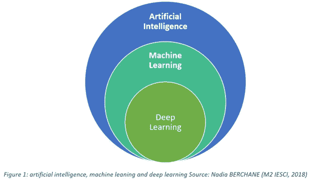
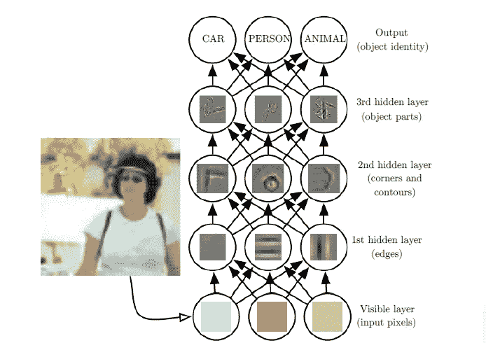
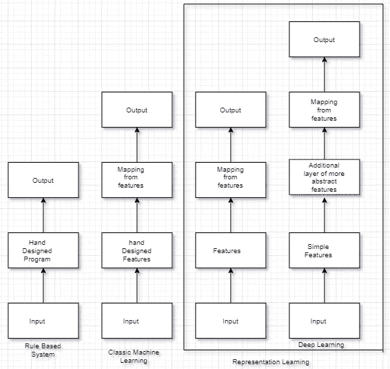

# 人工智能 VS 机器学习 VS 深度学习

> 原文：<https://medium.datadriveninvestor.com/artificial-intelligence-vs-machine-learning-vs-deep-learning-8ade79eed0cb?source=collection_archive---------7----------------------->

*术语***通常用于描述模仿人类与人脑相关的“认知”功能的机器(或计算机)，如维基百科中的“学习”和“解决问题”**

*当人工智能在早期发展时，该领域迅速处理和解决了对人类来说智力上困难但对计算机来说相对简单的问题——这些问题可以通过一系列正式的数学规则来描述。事实证明，对人工智能的真正挑战是解决人们容易执行但难以正式描述的任务——我们凭直觉解决的问题，感觉是自动的，就像在图像中识别口语或人脸。*

*人工智能是用智能模仿用户行为的机器。人工智能允许计算机从经验中学习，理解现实世界的问题，并根据概念的层次来解决问题。*

*例如，IBM 创造了一个名为“深蓝”的人工智能下棋系统，它打败了世界冠军加里·卡斯帕罗夫。当然，国际象棋是一个非常简单的世界，只有 64 个盒子和 32 个只能以严格限定的方式移动的棋子。设计一个成功的国际象棋策略是一项巨大的成就，但挑战并不在于向计算机描述一组棋子和允许的走法的难度。*

****维基百科—机器学习****(****ML****)是计算机系统用来执行特定任务的算法和统计模型的科学研究，不使用明确的指令，而是依靠模式和推理。**

*机器学习是人工智能(AI)的子集。它对样本数据建立数学模型，并试图发现样本数据的趋势。它预测结果变量，而不需要显式的程序来执行特定的任务。*

*依赖硬编码知识的系统所面临的困难表明，人工智能系统需要通过从样本数据中提取
模式来获取自身知识的能力。这种能力被称为机器学习。*

*机器学习算法的引入允许机器解决真实世界的问题并做出看起来主观的决定。简单的逻辑回归机器学习算法可以确定垃圾邮件与合法邮件。*

***机器学习算法的问题:-***

1.  *这些简单的机器学习算法的性能在很大程度上取决于它们被给予的数据的表示。*

*例如，当逻辑回归用于预测患者是否患有疾病时，AI 系统不会直接检查患者。相反，医生会告诉系统几条相关信息，比如是否有子宫疤痕。包含在患者图像中的每条信息被称为**特征。**逻辑回归了解患者的这些特征如何与各种结果相关联。但是，它不能以任何方式影响特征的定义方式。如果给 logistic 回归的是患者的 MRI 扫描，而不是医生的正式报告，它将无法做出有用的预测。MRI 扫描中的单个像素与分娩过程中可能发生的任何并发症的相关性可以忽略不计。*

*2.很难从样本数据中找到重要的特征。*

*例如，假设我们想写一个程序来检测照片中的循环。我们知道自行车有轮子，所以我们可能希望使用轮子作为一个特征。不幸的是，很难用像素值来准确描述轮子的样子。轮子具有简单的几何形状，但是它的图像可能会因为落在轮子上的阴影、轮子的金属部分发出的耀眼的阳光、前景中的对象遮挡了轮子的一部分等等而变得复杂。*

*这个问题的一个解决方案是使用机器学习不仅发现从表示到输出的映射
，而且发现表示本身。
这种方法被称为**表征学习。***

****深度学习*** *(也称为深度结构化学习或差分编程)是基于具有表示学习的人工神经网络的更广泛的机器学习方法家族的一部分。学习可以是有监督的、半监督的或无监督的。——维基百科**

* [## 将定义 2020 年就业前景的五大数据科学和机器学习趋势|数据驱动…

### 数据科学和 ML 是 2019 年最受关注的趋势之一，毫无疑问，它们将继续发展…

www.datadriveninvestor.com](https://www.datadriveninvestor.com/2020/02/19/five-data-science-and-machine-learning-trends-that-will-define-job-prospects-in-2020/) 

深度学习通过引入用其他简单表示法表示的来解决机器学习在表示学习中的重要问题。深度学习允许机器从简单的复杂问题构建复杂的解决方案。

Source:- MIT

上面是深度学习模型的例子。计算机很难理解原始输入数据(图像、视频或语音)的含义，例如表示为像素值集合的图像。从一组像素到对象标识的函数映射非常困难。如果直接解决，学习这种映射似乎是不可能的。深度学习通过将所需的复杂映射分解为一系列嵌套的简单映射来解决这一困难，每个映射由模型的不同层来描述。输入呈现在可见层，这样命名是因为它包含了我们能够观察到的变量。然后一系列隐藏层从图像中提取越来越抽象的特征。这些层被称为**【隐藏】**，因为数据中没有给出它们的值；相反，模型必须确定哪些概念对于解释观察数据中的关系是有用的。这里的图像是每个隐藏单元所代表的特征的可视化。给定像素，通过比较相邻像素的亮度，第一层可以容易地识别边缘。给定第一个隐藏层对边缘的描述，第二个隐藏层可以很容易地搜索拐角和扩展轮廓，它们可以被识别为边缘的集合。给定第二隐藏层在角和轮廓方面对图像的描述，第三隐藏层可以通过找到轮廓和角的特定集合来检测特定对象的整个部分。最后，这个对物体形象的描述。

流程图显示了人工智能系统的不同部分如何在不同的人工智能学科中相互关联。

感谢阅读！！*