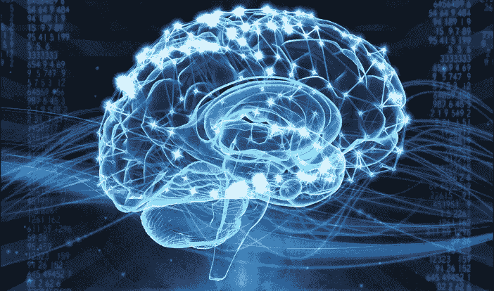
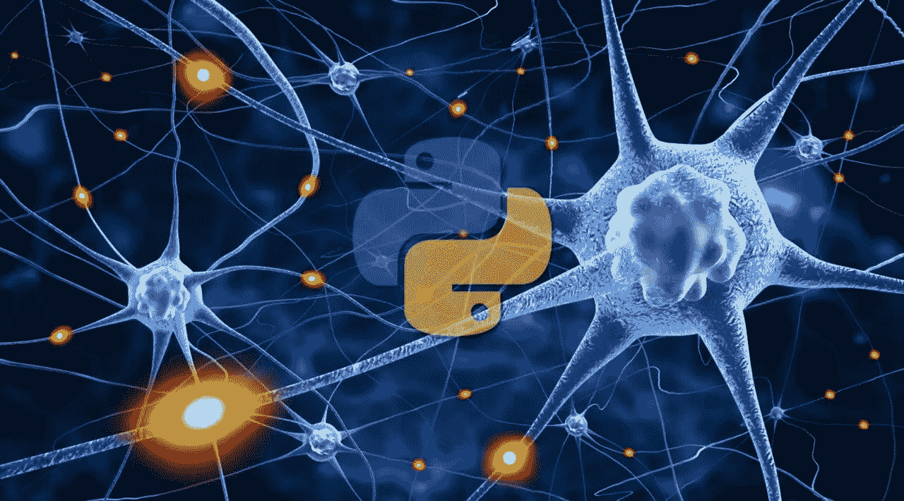
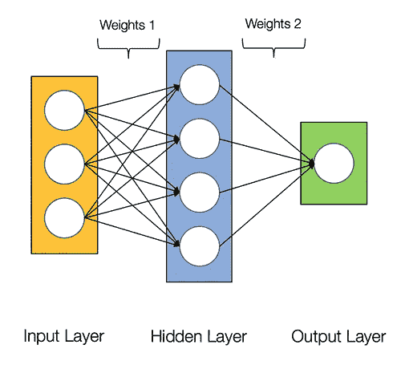
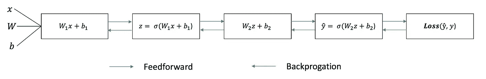
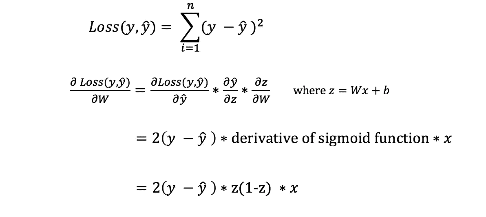
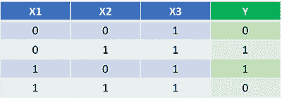
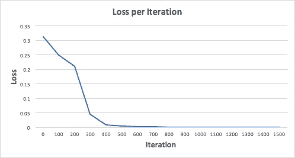
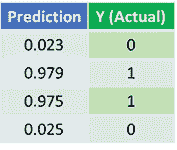

# Python 中的人工神经网络

> 原文：<https://medium.datadriveninvestor.com/artificial-neural-network-in-python-704fae2e23?source=collection_archive---------1----------------------->



# 什么是人工神经网络？

人工神经网络或连接主义系统是受构成动物大脑的生物神经网络启发但不完全相同的计算系统。这种系统通过考虑例子来“学习”执行任务，通常没有用特定于任务的规则来编程。

人工神经网络是一组算法，大致模仿人脑，用于识别模式。他们通过一种机器感知、标记或聚类原始输入来解释感官数据。它们识别的模式是数字的，包含在向量中，所有现实世界的数据，无论是图像、声音、文本还是时间序列，都必须转换成向量。

在不进行大脑类比的情况下，我发现简单地将神经网络描述为将给定输入映射到期望输出的数学函数更容易。



神经网络由以下组件组成

*   一个**输入层**、**T3、x**
*   任意数量的**隐藏层**
*   一个**输出层**，**， *ŷ* ，**
*   一组**权重**和**在各层之间偏向**， ***W 和 b***
*   一个选择**激活功能**用于每个隐藏层，*。在本教程中，我们将使用一个 Sigmoid 激活函数。*

*下图显示了 2 层神经网络的架构(*注意，在计算神经网络的层数时，输入层通常被排除在外**

**

*Architecture of a 2-layer Neural Network*

# *用 Python 创建人工神经网络类很容易*

```
*class NeuralNetwork:
    def __init__(self, x, y):
        self.input      = x
        self.weights1   = np.random.rand(self.input.shape[1],4) 
        self.weights2   = np.random.rand(4,1)                 
        self.y          = y
        self.output     = np.zeros(y.shape)*
```

# *训练神经网络*

*简单 2 层神经网络的输出 ***ŷ*** 为:*

**

*您可能会注意到，在上面的等式中，权重 ***W*** 和偏差 ***b*** 是影响输出 ***ŷ.的唯一变量****

*自然，权重和偏差的正确值决定了预测的强度。从输入数据中微调权重和偏差的过程称为**训练神经网络。***

*训练过程的每次迭代包括以下步骤:*

*   *计算预测输出 ***ŷ*** ，称为**前馈***
*   *更新权重和偏差，称为**反向传播***

*下面的序列图说明了这个过程。*

**

# *前馈*

*正如我们在上面的序列图中看到的，前馈只是简单的微积分，对于一个基本的 2 层神经网络，神经网络的输出是:*

**

*让我们在 python 代码中添加一个前馈函数来做到这一点。注意，为了简单起见，我们假设偏差为 0。*

```
*class NeuralNetwork:
    def __init__(self, x, y):
        self.input      = x
        self.weights1   = np.random.rand(self.input.shape[1],4) 
        self.weights2   = np.random.rand(4,1)                 
        self.y          = y
        self.output     = np.zeros(self.y.shape)def feedforward(self):
        self.layer1 = sigmoid(np.dot(self.input, self.weights1))
        self.output = sigmoid(np.dot(self.layer1, self.weights2))*
```

*然而，我们仍然需要一种方法来评估我们预测的“好性”(即我们的预测有多远)？损失函数允许我们这样做。*

# *损失函数*

*有许多可用的损失函数，我们问题的性质决定了我们对损失函数的选择。在本教程中，我们将使用一个简单的**平方和误差**作为我们的损失函数。*

**

*也就是说，平方和误差就是每个预测值和实际值之间的差值之和。差值是平方的，因此我们可以测量差值的绝对值。*

***我们训练的目标是找到使损失函数最小化的最佳权重和偏差集。***

# *反向传播*

*既然我们已经测量了预测的误差(损失)，我们需要找到一种方法来**传播**误差回来，并更新我们的权重和偏差。*

*为了知道调整权重和偏差的合适量，我们需要知道损失函数相对于权重和偏差的**导数。***

*回想一下微积分，函数的导数就是函数的斜率。*

**

# *梯度下降算法*

*如果我们有导数，我们可以简单地通过增加/减少来更新权重和偏差(参考上图)。这被称为**梯度下降**。*

*然而，我们不能直接计算损失函数关于权重和偏差的导数，因为损失函数的方程不包含权重和偏差。因此，我们需要**链式法则**来帮助我们计算。*

**

*计算损失函数相对于权重的导数的链式法则。注意，为了简单起见，我们只显示了假设一层神经网络的偏导数。*

*唷！这很难看，但它让我们得到了我们需要的东西——损失函数相对于权重的导数(斜率)，这样我们就可以相应地调整权重。*

*现在我们有了这个，让我们把反向传播函数添加到我们的 python 代码中。*

```
*class NeuralNetwork:
    def __init__(self, x, y):
        self.input      = x
        self.weights1   = np.random.rand(self.input.shape[1],4) 
        self.weights2   = np.random.rand(4,1)                 
        self.y          = y
        self.output     = np.zeros(self.y.shape)def feedforward(self):
        self.layer1 = sigmoid(np.dot(self.input, self.weights1))
        self.output = sigmoid(np.dot(self.layer1, self.weights2))def backprop(self):
        # application of the chain rule to find derivative of the loss function with respect to weights2 and weights1
        d_weights2 = np.dot(self.layer1.T, (2*(self.y - self.output) * sigmoid_derivative(self.output)))
        d_weights1 = np.dot(self.input.T,  (np.dot(2*(self.y - self.output) * sigmoid_derivative(self.output), self.weights2.T) * sigmoid_derivative(self.layer1)))# update the weights with the derivative (slope) of the loss function
        self.weights1 += d_weights1
        self.weights2 += d_weights2*
```

# *把所有的放在一起*

*现在我们已经有了完整的 python 代码来进行前馈和反向传播，让我们将我们的神经网络应用于一个例子，看看它做得有多好。*

**

*我们的神经网络应该学习一组理想的权重来表示这个函数。请注意，仅仅通过检查来计算重量对我们来说并不简单。*

*让我们训练神经网络 1500 次迭代，看看会发生什么。查看下面的每次迭代损失图，我们可以清楚地看到损失**朝着最小值单调递减。**这与我们之前讨论的梯度下降算法一致。*

**

*让我们看看神经网络经过 1500 次迭代后的最终预测(输出)。*

**

*1500 次训练迭代后的预测*

*我们做到了！我们的前馈和反向传播算法成功地训练了神经网络，并且预测收敛于真实值。*

*[](https://www.datadriveninvestor.com/2020/03/04/on-artificial-intelligence-and-surveillance-capitalism/) [## 人工智能和监督资本主义|数据驱动的投资者

### 大科技，总是现在:人工智能推动的大科技，已经使购物，搜索，在你的…

www.datadriveninvestor.com](https://www.datadriveninvestor.com/2020/03/04/on-artificial-intelligence-and-surveillance-capitalism/) 

请注意，预测值和实际值之间略有不同。这是可取的，因为它防止**过度拟合**，并允许神经网络**更好地将**推广到看不见的数据。

# 最终想法


尽管 TensorFlow 和 Keras 等深度学习库可以在不完全了解神经网络内部工作原理的情况下轻松构建深度网络，但我发现，对有抱负的数据科学家来说，更深入地了解神经网络是有益的。*