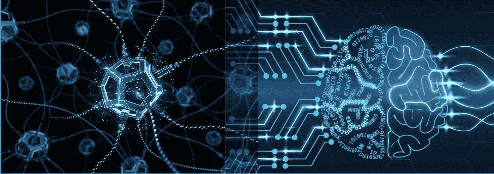
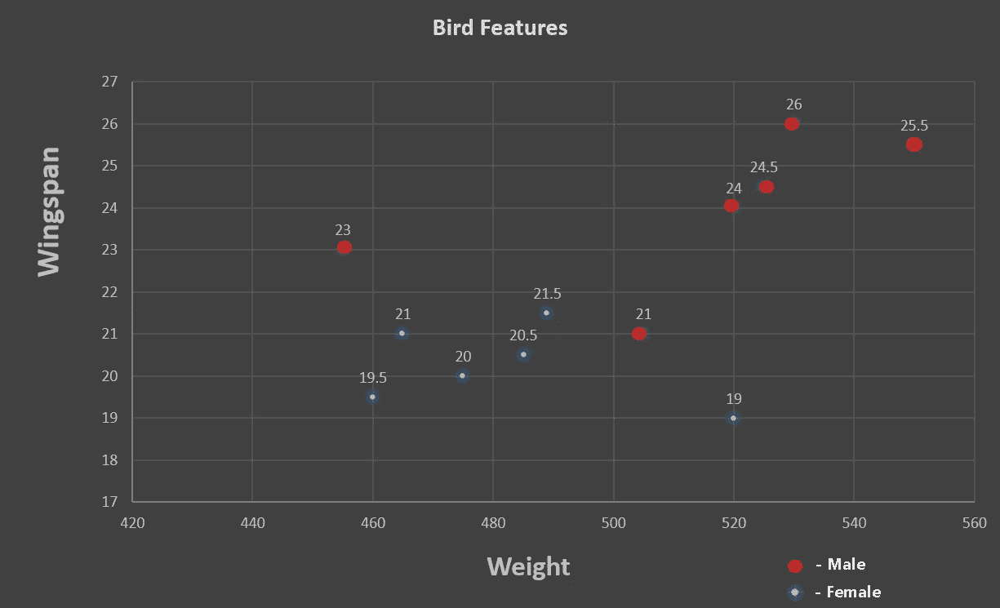
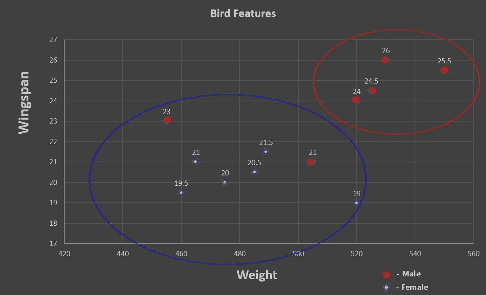
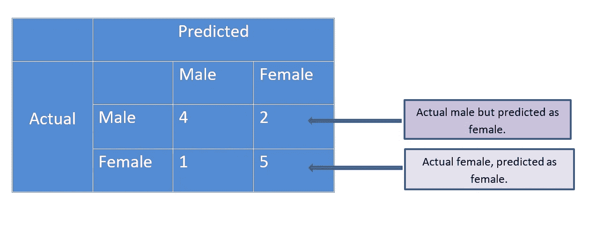
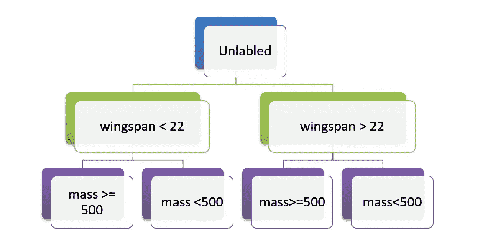
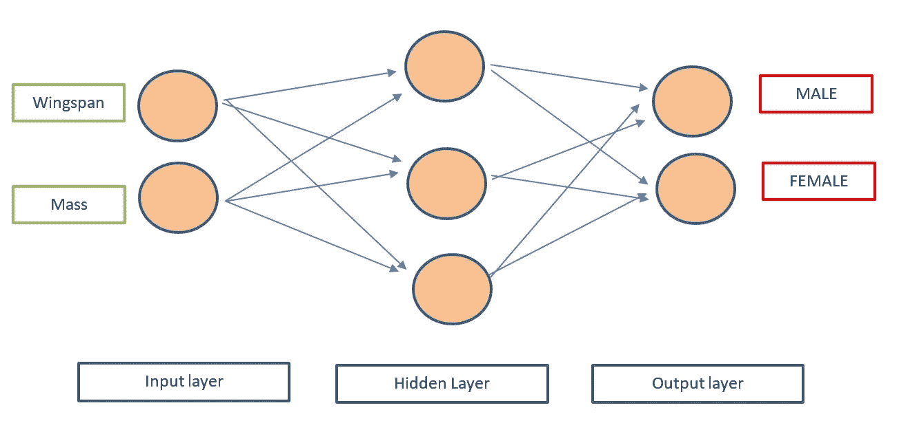
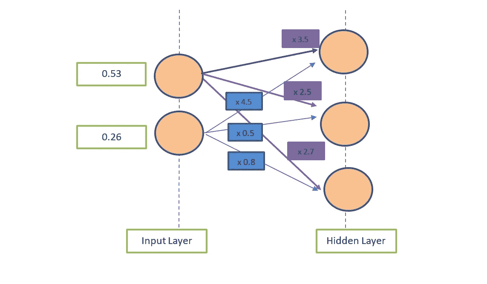
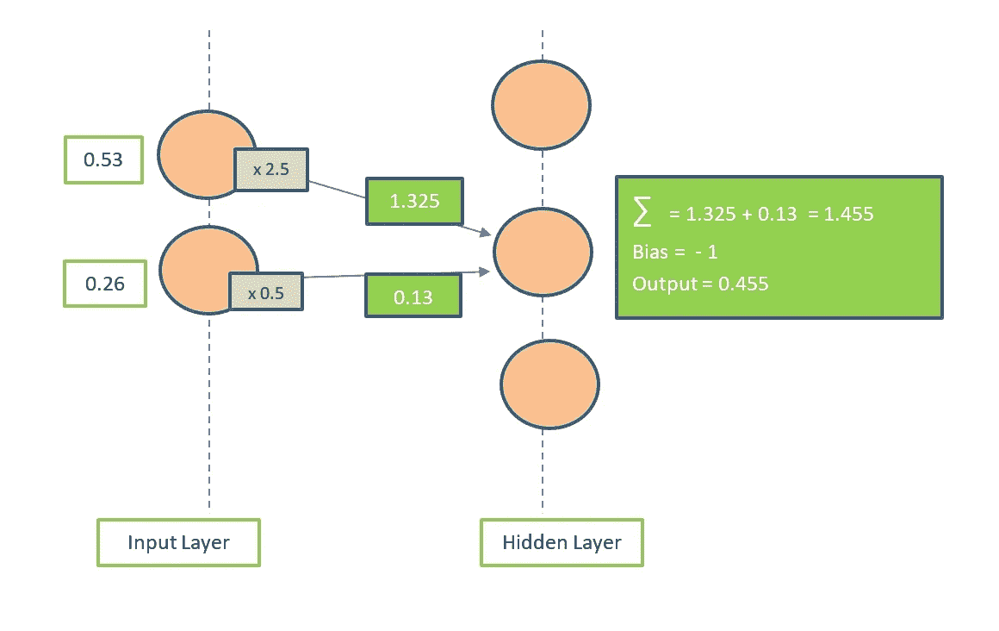
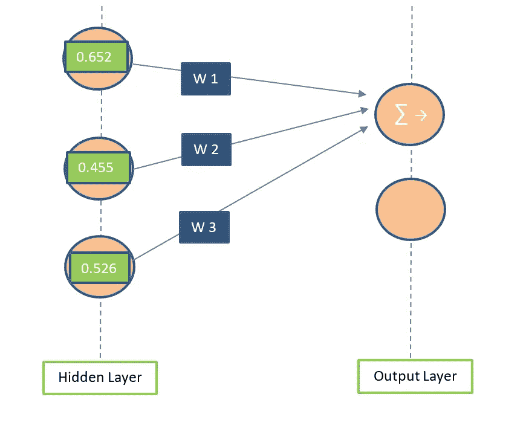

# 人工神经网络过于简化

> 原文：<https://medium.datadriveninvestor.com/artificial-neural-networks-over-simplified-7ed8d8b7d3fc?source=collection_archive---------8----------------------->

# 叙述

这个故事将主要向你解释神经网络的理论背景，也是以一种非常简单的方式，尽可能地抽象出数学。但是你必须记住，关于神经网络和它们的现代方法，还有更多、更多的东西需要从理论上学习，这个故事将为你理解人工神经网络的总体情况、重要性和一般用例提供一个良好的开端。

当然，有很多研究材料声称可以解释神经网络。但是大部分这些可用材料的问题是，它们直接进入更高层次的解释，把原理留在后面，所以基本思想有时被遗漏了。我的目标是为你填补这个空白，以便你非常清楚地理解神经网络的核心机制，即使在高级步骤中引入了许多数学和统计。

# 语境

如果你最终阅读了这篇文章，那么你可能已经知道什么是人工神经网络，它与机器学习和人工智能有什么关系。但是为了有一个好的开始，让我用一点介绍来证明这篇文章的标题。

现代计算机在组织、获取和处理海量数据方面有着惊人的速度和能力。如果没有计算机，这个世界可能会比今天落后几百年，这是肯定的。

但是，如果我们不仅可以使用这些指令来处理数据，还可以使用它们对数据做出自己的决定，那会怎么样呢？这基本上是机器学习的核心思想，提出了**算法**，为计算机提供了从数据中**学习的能力，然后在没有或很少需要程序员中间指令的情况下，自己做出决策**和**预测**。这种方法还没有像人类智力一样强大，还没有。但它可以被认为是迄今为止我们拥有的最伟大的技术之一，它具有朝向更大目标——人工智能——的巨大潜力。

ML 和 AI 算法往往要复杂得多，所以与其深入研究它们的核心机制，不如让我们先关注它们要完成的任务。

# 问题

简而言之，我们在这里试图解决的问题是**基于给定的有效数据**做出决策，或者大部分时间预测**。**

为了进一步阐述这个想法，让我用一个非常简单和标准的例子。

假设有一种鸟，根据它们的性别，有不同的重量和翼展。如果你不是生物学家/动物学家，甚至不是与该研究领域相关的学生，仅仅通过观察来决定一只鸟的性别可能会很棘手。但是现在我们知道它们在重量和翼展上有所不同，我们可以尝试一种方法，利用这种想法来决定一只特定的鸟是雄性还是雌性。

 [## AI 将军是否已经超过了人类的智力容量？数据驱动的投资者

### 不仅在游戏中，而且在劳动力市场上，机器都比人类聪明。在今天的许多领域，使用…

www.datadriveninvestor.com](https://www.datadriveninvestor.com/2020/02/12/has-general-ai-exceeded-the-intellectual-capacity-of-humans/) 

一个很简单的问题不是吗？

现在，我们预测给定数据类别的这类过程被称为**分类/标记。**

用于执行这些任务的算法被称为**分类器**。

(老实说，我认为互联网上没有其他地方有人像这样简单地定义这两个术语！)

有时我们也可以使用图像，来提出解决这类问题的技术。(图像处理和计算机视觉)

但是，如果我们能够使用一种方法来解决这个问题，在这种方法中，我们处理这些现实世界实体的一组特征来做出决策，而不是使用图像(这是大尺寸的文件)，我们就可以大大降低我们必须开发来解决这个问题的算法的复杂性。

(这意味着通过分析特征(如体重、身高、翼展、眼睛颜色或给定实体的任何相关特征集)与它们应该属于的类别之间的聚合关系来解决问题。)

让我们看看这是如何工作的。

特征是我们将要分类的实体的特征。在我们的例子中，特征是重量和翼展。

为了想出一个好的分类器来做出正确的预测，我们需要关于我们正在看的场景的**验证/标记的**数据。验证/标记意味着数据集也已经包含它们正确的类别/标签(它们所属的类别)。

(在我们的例子中，不管这只鸟是公的还是母的)

用这些数据调整分类算法被称为训练分类器。

对于我们的例子，理想的数据集应该是这样的

这些数据应该首先通过该主题领域的人类专家进行的实地研究来收集，以便数据是可靠的。

然后，只有我们可以使用这些数据，并训练一个分类器，通过可用的特征来自动判断一只给定的鸟是雄性还是雌性。

因为我们这里只有两个特征，所以很容易用这样的几何图形表示它们

正如你所看到的，在这个图表中，雄性和雌性两组鸟形成了两个视觉上可区分的**簇**数据点，如下所示。

但是正如你所看到的，也有中间值和重叠，这使得这种聚类方法不是 100 %公平的。

所以现在还不完全清楚如何区分雄性和雌性，只看这个。

这就是我们要使用机器学习算法来完成的，找到区分聚类的最佳方式。

让我们假设这个场景，规则如下。

**翼展> 22 厘米表示是雄鸟，否则就是雌鸟**

**体重> 500 克表示是雄性，否则为雌性**

这些被称为**决策边界**，它们分割样本空间。

当我们仔细观察数据时，我们可以发现以下细节。

Confusion Matrix

上面这张表叫做 ***混淆矩阵*。**

所以你可以理解，如果我们使用上述规则来区分雄性和雌性鸟，我们会像这样结束，一些鸟的性别预测是错误的。

虽然我们没有办法画出 100 %准确的线条，但我们应该努力达到最大的准确性。事实上，这是 ML 算法的期望，以最大化分类的准确性，同时最小化错误的结果。

我们使用提供给我们的训练数据实现了所有这些结果。

现在，我们可以将获得的知识应用于任何未知的鸟类样本空间，并对其性别进行分类。

使用划分的决策空间对数据进行分类/标记的简单过程也可以使用**决策树来表示。**

Decision Tree

使用一组 IF 条件可以很容易地实现这种决策树。

但是，当应用程序变得越来越复杂时，这种类型的实现不会非常准确。

生成决策树的最大似然算法需要选择自己、划分哪些特征以及用于分离的限制。然而决策树只是 ML 技术的一个基本例子。

有一些算法使用许多并行工作的决策树来得出最佳结果。这样的算法被称为**森林。**

还有一些非基于树的方法，如**支持向量机**，它使用任意线条分割决策空间。

这些线不应该仅仅是直线，它们可以是曲线、多项式或任何其他奇特的数学函数。

最大似然算法的工作是找出哪条线最适合分离聚类。

我们使用的上面的例子只有两个特性，所以很容易处理。

假设我们在这个基础上再加一个特征，眼睛颜色什么的。

那么 2D 决策空间变成 3D，并且决策边界也将变成 3D。

同样，在该示例中，我们只有两个类别需要区分，但也可能存在不止两个类别的情况。

现在你可以看到事情变得多复杂了，不是吗？

为一个只有 3 个特性和 4 或 5 个类别的场景计算出一个分类标准，手工操作几乎是不可能的！

但这是真实世界的情况。现实世界中的许多最大似然问题涉及 100 或 1000 多个类别的特征。当然，强大的机器每天都在做这项工作。

像决策树和支持向量机这样的技术在统计学领域根深蒂固，甚至在计算机时代之前，人们就使用它们来利用数据做出自信的决策。

有一大类广泛使用的统计机器学习技术，但也有没有统计起源的方法，如受人脑机制启发的人工神经网络。

**生物神经元**基本上就是组合起来构成生物大脑的细胞。它们利用电信号和化学信号处理和传递信息。

神经元从一组其他细胞获取一个或多个输入，以某种预先定义的方式处理这些输入，然后发出自己的新信号。大量的这些细胞相互连接，形成一个能够处理复杂信息的大网络。

人工神经元也在以类似的热情工作，但几乎没有区别。

**在这里，输入和输出信号都是数字。**

此外，神经元被组织成一个**分层结构**。这里重要的事实是，给定层中的所有神经元都连接到上一层中的所有神经元，以及下一层中的所有神经元。

让我们看看这种人工神经网络将如何对鸟类进行分类。

A simple neural network

第一层，输入层接收场景中每个特征的数据，一次一只鸟。

输出层有两个神经元，代表场景的**类别**。对于这个例子，男性和女性。

在这个过程的最后，这些神经元中的一个会比另一个更兴奋。(因为我们在这里处理数字，在输出层的一个神经元将比另一个/其他神经元具有更高的值)这将是我们的网络对给定鸟的分类问题做出的**决定**。

一旦关于要素的数据被输入层接收，它们就被传输到中间层，在那里执行困难的工作。

为了简单地解释这个过程是如何完成的，让我们看一个例子

假设我们拿第一只鸟来说，质量 530 g，翼展 26 cm。(让我们以标准单位使用它们)

(先不要担心下图中的数字)

在第一层，输入值首先乘以特定的**权重**(权重是矩形内的数字——稍后将讨论如何选择权重),然后发送到隐藏层的神经元。

对于隐藏层中的每个不同神经元，输入层中的每个神经元将使用不同的权重，如上图所示。(每个**神经元连接**的不同权重)

在隐藏层的神经元处，这些值首先被**求和**，然后应用**偏置**。(加上或减去一个固定值)。现在让偏差为-1。稍后将讨论它们是如何被选择的。

weighting, summing and biasing the input values

当创建神经网络时，这些权重和偏差值最初被设置为随机值。

然后，ML 算法开始调整这些值，以获得符合所提供的带标签的训练数据的准确输出。

这个选择最合适的权重和偏差值的过程实际上是神经网络的训练阶段。

这发生在许多步骤中，逐渐增加了模型的准确性。这个过程和人类的学习过程非常相似。

在到达输出层之前，还要对输出值执行一次操作。

即在计算的最终值上应用变换/激活函数。

转换函数的目的通常是限制输出值的幅度，大多数情况下，我们将输出值转换为 0 和 1 之间的值或任何其他给定的范围，或将负值转换为 0。这取决于应用程序和创建者的愿望，这样做的目的是在输出层传递一个关于该特定条目所属类别的清晰想法。

对于我的例子，我将避免使用这样的函数，并将相同的值传递到这个节点之外。

一旦完成所有这些工作，当最终值将从隐藏层的节点传递到输出层的节点时，两个层的不同节点之间的每个连接也将具有不同的权重，如果输出层需要，它们将再次被求和并转换。

最后，输出层中退出最多的节点(具有最高值的节点)将被选为决策/标签。

该示例仅显示了一个神经元操作这些值，但是加权、求和、偏置和转换的过程是在我们的神经网络的所有节点/神经元上进行的，具有不同的权重和不同的偏置等，并且最终值被向前传播，一次一层。

隐藏层不一定是单层或神经元，它可以是多层深。

这就是深度学习这个术语的由来。

训练神经网络实际上意味着我们为网络中的每个连接找到一组完美的加权和偏置值，最终为标记的数据做出正确的决定。正如你现在所想的，这个训练过程是一个计算量非常大的任务。对于复杂的应用程序，这个过程有时会持续几周甚至几个月。

神经网络实际上是在 50 年前发明的，但由于现代 CPUs GPUs 等强大的硬件组件，它最近才得到实际应用。

然而，这些神经网络只能对事物进行分类，所以我们实际上还不能将它们解释为智能结构。但事实上，它们非常有用。