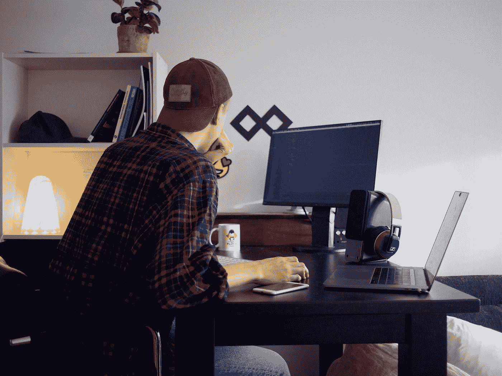

# 作为一个自由职业者，不要害怕多收费。

> 原文：<https://medium.datadriveninvestor.com/as-a-freelancer-dont-be-scared-of-charging-more-22666e1072eb?source=collection_archive---------11----------------------->

## 如何调整心态，让自己相信自己更有价值

Photo by [Per Lööv](https://unsplash.com/@perloov?utm_source=medium&utm_medium=referral) on [Unsplash](https://unsplash.com?utm_source=medium&utm_medium=referral)

作为一名自由职业者，定价是最难的事情之一，因为你总是被夹在你是否值得你所报的价格和客户是否会接受之间。

让我们面对它；新手告诉你的客户你的价格很吓人。当一个潜在客户问你服务收费多少时，你的心跳会一直加快。

即使到现在，当我给一些客户的价格高于我通常收取的价格时，我的心也不会停留片刻。当他们比平时花更长时间回复时，情况就更糟了。我开始想，我是否应该回他们一条短信，说“我只是在开玩笑”，给他们一个更低的价格。

有时，他们从不回复，但在其他场合，他们会告诉你继续这个项目，然后你开始觉得自己像一个顶级的自由职业者。

定价全在于自信。如果你不相信你自己，你就不能真正收费高。不管你有多优秀。

我认识一些收费很低的优秀作家。你开始奇怪为什么这些人不喜欢钱，但通常情况并非如此。很多时候，问题仅仅是他们不相信自己能收取这样的费用。你不能责怪他们，因为他们没有得到正确的心态。

我会告诉你我是如何对我的费用充满信心的。我开始写博客，并创办了一份新闻简报。

它为我做了两件事。我的手艺越来越好，因为我练习并教别人。其次，积极的评论给了我信心，如果你按照这些步骤去做，你也可以做到。创建内容有助于练习和教学。此外，当人们真正看到你的产品的价值时，你会有一些自信。

积极的评价会让你开始相信自己，这是调整心态的第一步。

下一件事是将你通常收取的费用乘以 2 或 5。有些人会告诉你多加一个零。你能做到的！

直接告诉客户金额，看看他/她会怎么说。只要养成“会有更多客户来”的心态，你就没事了。

感谢您的阅读