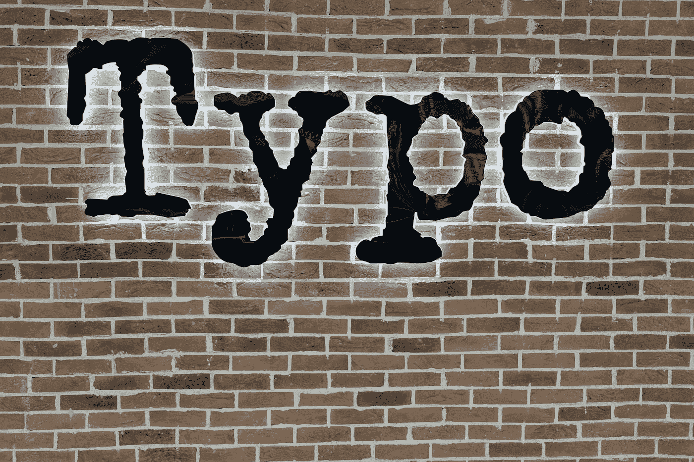
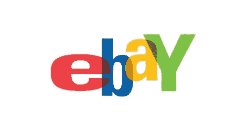
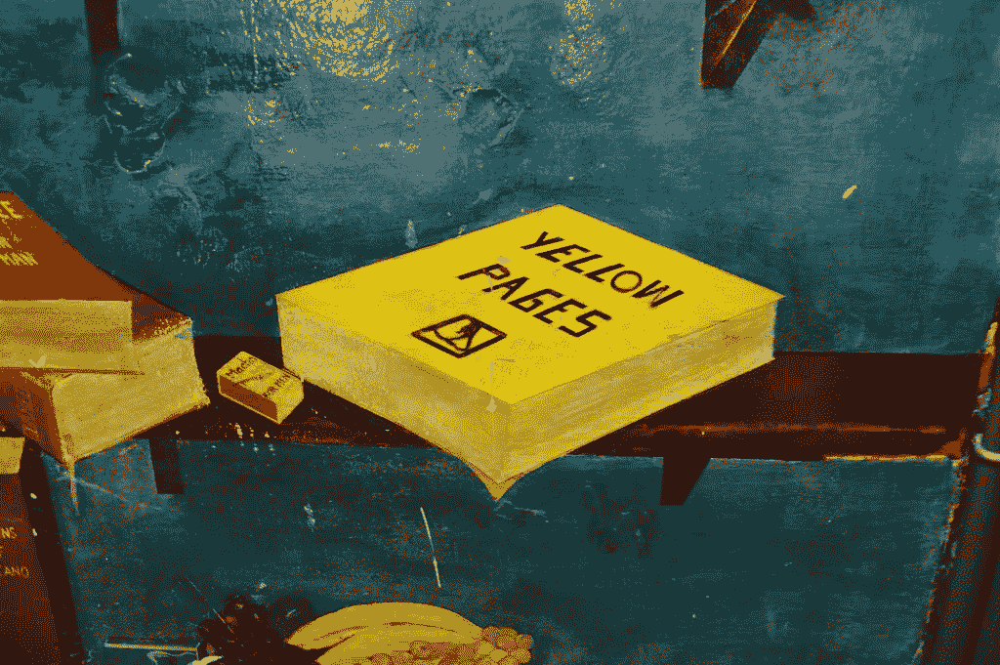

# 由于打字错误造成世界上最大的损失

> 原文：<https://medium.datadriveninvestor.com/as-a-result-of-typing-error-cause-the-biggest-loss-in-the-world-1351857101d5?source=collection_archive---------8----------------------->

Photo by [Nick Fewings](https://unsplash.com/@jannerboy62?utm_source=medium&utm_medium=referral) on [Unsplash](https://unsplash.com?utm_source=medium&utm_medium=referral)

## 高达 4 亿美元的损失

没有人是完美的，所以错误是我们生活的一部分。无论大小，所有人都会犯错。从计数错误，按错按钮，或者其他小错误开始。但是信不信由你，有很多我们认为“小”的错误往往会产生重大影响，造成大的损失。

这一次，我们将只关注一个通常被认为微不足道的小错误，即“打字错误”，或俗称的“打字错误”，它会造成高达数十亿美元的重大损失。因此，这是世界上有史以来损失最大的“打字错误”案例。

[“eBay logo”](https://www.flickr.com/photos/24178168@N07/3440028348) by [ebayink](https://www.flickr.com/photos/24178168@N07) is licensed under [CC BY-NC-ND 2.0](https://creativecommons.org/licenses/by-nc-nd/2.0/?ref=ccsearch&atype=rich)

# 易贝上的错误类型

2007 年，易贝的一名卖家试图拍卖他刚刚发现的一瓶 1852 年的旧啤酒。但是这个供应商在写关于老啤酒品牌的细节时犯了一个小错误。这个啤酒品牌其实是 Allshop 的(有两个字母 P 的)，但是卖家只写了一个字母 P 的 all shop。一位买家注意到了易贝的这个小错误，他立即在拍卖会上以大约 300 美元的价格买下了这件物品。

在没有意识到的情况下，这个错误让这种稀有啤酒的发明者不得不甘愿咬破手指，承受相当大的损失。原因是不久之后，偶尔购买这种啤酒的人回到易贝上出售这种啤酒，只是这次有正确的品牌，即带有两个字母 p 的 Allshopp。不久之后，这种罕见的啤酒卖了 50 多万美元。

[“Mizuho ATM”](https://www.flickr.com/photos/18378305@N00/7725914398) by [Can Pac Swire](https://www.flickr.com/photos/18378305@N00) is licensed under [CC BY-NC 2.0](https://creativecommons.org/licenses/by-nc/2.0/?ref=ccsearch&atype=rich)

# 瑞穗证券

2005 年，一家名为瑞穗证券的日本公司决定聘请一家名为 J2 全球的经纪公司来管理他们的股票，并为该公司制定扩大市场份额的战略。但谁能想到，这个决定会是瑞穗证券犯下的最大错误。

 [## 全球思考，本地行动:创业公司拓展新市场的 4 个关键|数据驱动的投资者

### 你是一家初创公司，在你的本土市场上表现出色。恭喜你。你能在新的市场重复它吗？这个…

www.datadriveninvestor.com](https://www.datadriveninvestor.com/2020/08/23/think-global-act-local-4-keys-for-startups-to-expand-into-new-markets/) 

起初，他们计划以每股 610.00 日元的价格出售股份。然而，一位负责安排股票出售的年轻经纪人在输入要出售的股票价格时犯了一个致命的小错误。这位年轻的经纪人没有以 61 万日元的价格卖出一股，而是以每股 1 日元的价格卖出了 61 万股。这立即引起了东京证券交易所的混乱，造成了大约 407 亿日元的损失。

Photo by [Cytonn Photography](https://unsplash.com/@cytonn_photography?utm_source=medium&utm_medium=referral) on [Unsplash](https://unsplash.com?utm_source=medium&utm_medium=referral)

# 合同中逗号的错位

2006 年，加拿大一家名为 Bell Aliant 的巨型电信服务公司决定与一家名为 Rogers Communications 的有线电视公司合作，使用他们每年价值高达 100 万加元的有线电视线路。

在合同协议中，有一点是他们可以“在五年后继续这种合作，如果认为这对双方都有利，或者如果协议有偏见，在一年内取消合作并全额退款。”

正是在这一点上，罗杰斯通讯公司犯了一个错误，放置了一个逗号，这使得 Aliant 在一年后取消了他们的合同。Aliant 方没有浪费这个机会，他们在一年后决定取消合同，并要求全额退款。

两家公司曾将此案告上法庭，但由于这个逗号的位移，罗杰斯一方最终败诉，不得不退回价值一百万美元的一年期合同。最终，伪造逗号的错误给他们留下了总计 230 万加元的损失。

Photo by [Brooke Lark](https://unsplash.com/@brookelark?utm_source=medium&utm_medium=referral) on [Unsplash](https://unsplash.com?utm_source=medium&utm_medium=referral)

# 错误的年份

2010 年，新泽西州参与了一项政府奖学金计划，为成绩优异的学校提供高达数亿美元的奖学金。要加入这个项目，他们需要做的就是要求新泽西州的所有学生注册。

他们已经成功迈出了这第一步，新泽西甚至进入了前 3 的名单，听到最终的决定只是时间问题。有了这些条件，许多新泽西州居民都很高兴，并希望他们的州能成为价值数亿美元的奖学金之一。

然而，由于一名政府工作人员在填写登记表时出错，新泽西州被取消了资格。在这份表格中，他们应该填写一份 2009 年的教育预算清单，作为获得奖学金的对比。然而，他们在教育基金表格上填写的是 2008 年或者更早一年。今年填新泽西的失误取消了价值近 4 亿美元的奖学金基金。

[“Yellow Pages”](https://www.flickr.com/photos/57868312@N00/13885446876) by [Matt From London](https://www.flickr.com/photos/57868312@N00) is licensed under [CC BY 2.0](https://creativecommons.org/licenses/by/2.0/?ref=ccsearch&atype=rich)

# 黄页中的印刷错误

黄页是一本包含各地电话号码的书。这本书通常是为了帮助人们更容易地找到从餐馆到医院的所有现有设施的电话号码而出版的。为了把电话号码印在黄页上，我们需要付费，就像在报纸上登广告一样。

黄页通常用于促进商业和其他服务，如加利福尼亚州的一家旅游公司所做的那样，他们决定在黄页上包括他们的电话号码以吸引更多的游客。然后，该公司选择页面的“异国情调”部分来放置他们的电话号码，以吸引喜欢异国旅游景点的游客。

但当它陷入异国情调的黑暗时，旅行社的电话号码被黄页列入情色页面，因为他们的员工犯了一个打字错误。更糟糕的是，这本黄页书已经印了上千册，旅行社意识到了这个错误，并向黄页的出版商提出了投诉。

收到此投诉后，相关黄页的出版商打算通过重印所有现有黄页来承担责任。然而，感到委屈的旅行社显然另有想法。他们随后将黄页的出版商告上法庭，并成功赢得了诉讼，获得了 1000 多万美元的赔偿。

## 访问专家视图— [订阅 DDI 英特尔](https://datadriveninvestor.com/ddi-intel)