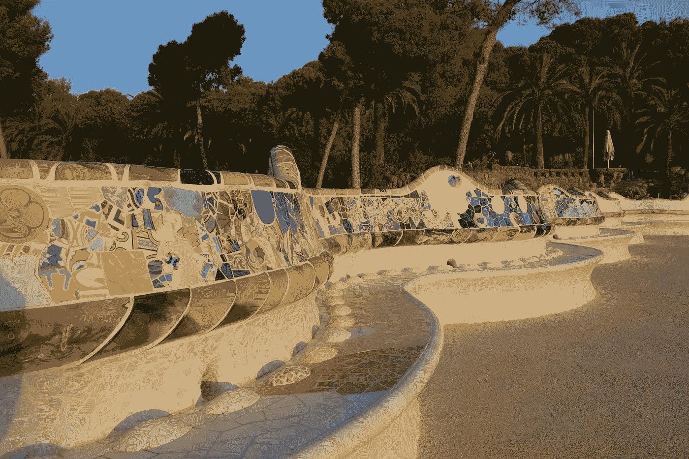

# 作为一个美国人，被关在西班牙

> 原文：<https://medium.datadriveninvestor.com/as-an-american-locked-down-in-spain-db43d7f6fce?source=collection_archive---------11----------------------->

你能从我们近 3 周的新冠肺炎禁闭中学到什么。

The empty benches of my beloved Parc G*ü*ell (photo copyright Matt Jones, 2019)

我是美国人，去年从伦敦搬到西班牙巴塞罗那。巴塞罗那已经经历了动荡的一年——2019 年 10 月，在加泰罗尼亚分离主义领导人被判刑后，这座城市爆发了骚乱和火焰——但 3 月 14 日，当政府实施为期两周的冠状病毒封锁(现已延长至四周)时，一切都真正发生了变化。

在我离圣家堂仅两个街区的办公室里，我们在 3 月 12 日周四早上得到保证，冠状病毒不会影响我们的运营。我们被告知一切照旧。

那天下午 5 点，我们接到指示，收拾好笔记本电脑，立即回家，直到 4 月份的某个未知日期才返回办公室。

13 号星期五(因为那天当然是 13 号星期五)，宣布全国范围的封锁，第二天开始。

因此，对于我们这些西班牙人来说，生活发生了巨大的变化。我们只被允许离开家去杂货店，药店，遛狗，和一些其他必要的差事。没有反叛的“冠状病毒党”发生(人是怎么了)，我心爱的收养城市的街道和海滩空无一人。西班牙人不会到处乱搞；上周六上午，我在我们阳光明媚的露台上度过，除了头顶盘旋的警用直升机强制实施封锁之外，我处于必要的隔离状态。

 [## 冠状病毒；惊慌失措；字里行间的 z |数据驱动的投资者

### 围绕冠状病毒的话题；更准确地说，新冠肺炎几乎占据了整个新闻预报的头条…

www.datadriveninvestor.com](https://www.datadriveninvestor.com/2020/03/23/coronavirus-a-to-panic-z-between-the-lines/) 

我们西班牙人现在已经忍受了 17 天的隔离，对于那些刚刚开始经历这种隔离的美国人，我的建议是保持理智和健康。

1.  **如果你在家工作，坚持严格的时间表。**假设你的工作对疫情来说是“非必要的”,不要在早上 8 点之前或下午 6 点之后工作。你会发现，如果你不注意这些界限，你会工作到晚上，忽略必要的私人时间。你会发疯的。
2.  **如果你没有工作……无论如何，坚持严格的时间表。**同时起床和睡觉。安排一整天的活动，无论是看新闻、做家务还是写日记(好的，或者看网飞)。当你整天无所事事，又不能出门时，你会慢慢滑入一种怪异的脱节状态，时间的流逝变得流动而朦胧。没有什么比与外界隔绝更危险的了。
3.  少吃点，忍住不要大量饮酒。在欧洲，我们每天在上下班和出差之间要走三到五英里。带走卡路里燃烧意味着油腻的食物会让你变得懒散，让我们承认吧，*脂肪*。孤立会导致抑郁，添加过多的食物、酒精和体重增加会助长这种循环。
4.  **锻炼…按照** ***的时间表*** 。如果你发现自己在 YouTube 上搜索你几天后放弃的锻炼，原因如下:你不对任何人负责，你没有承诺一个时间表。在封锁的第三天，我在巴塞罗那的健身小组在下午 6 点开始直播每天的训练。下午 6 点的锻炼安排在我的工作日历上，这清楚地标志着我工作日的结束，也是我坚定的承诺。此外，教练和锻炼参与者对我来说是一种社区形式，这是独立的*强制性的*。
5.  **所以是的，形成社区。**安排 Skype 或 Zoom 聊天、鸡尾酒时间、琐事之夜等。，和朋友家人在一起。像安排工作会议一样安排它们——它们是必需的。但是如果你和我一样，讨厌打电话(或者最近花太多时间在变焦上)，那么做吧:我已经开始打开我的 Skype 摄像头，只是在看书。一个朋友将加入我的 Skype 通话，并做他自己的个人活动。我已经意识到，这不仅仅是交谈，而是你所爱的人的存在。
6.  **在锁定期间，承诺创造一些切实的东西。** [我老公在创建 YouTube 烹饪演示](https://youtu.be/98rHUfUGO8I)；我的西班牙同事正在尝试烤美式煎饼和巧克力蛋糕；我在写更多(感谢阅读！)，并使用 Powerpoint、动画和在线投票技术创建*史诗级*知识之夜。从混乱和不确定中创造出某种东西的行为令人非常满意。
7.  数数你的幸福。认真。我知道这听起来很简单，但是*很容易陷入黑暗的、世界末日般的想法(“因为我们有点像在世界末日”)。我的黑暗想法始于第 13 天，尽管我每天都在锻炼，有一份我热爱的工作，在我(与世隔绝的)阳台上有西班牙的阳光，有一个爱我的丈夫和一只和我关在一起的*非常*可爱的小猫。走出这个黑洞的唯一方法是承认感恩。在 30 分钟内，我列出了不下 17 个项目，包括“巴塞罗那三月的天气比被困在潮湿炎热的室内要好得多”；“访问我的图书馆的无尽的电子书贷款”；最重要的是，“我的朋友和家人都很健康或正在康复。”*
8.  提醒你自己一个普遍的事实:一切都会结束。知道所有不好的事情最终都会结束给了我们隧道尽头的光明；相反，承认这种短暂让我们真正欣赏美好的事物。

但我不想撒谎——在这个疫情期间，无限期禁闭最困难的事情之一是学会适应不确定的情况，以及随之而来的缺乏控制。所以，当这一切最终结束时，我不再纠结于“如果”,什么时候会结束，而是专注于努力接受可能的结果。坦率地说:有些结果并不好。但我必须找到一种方法来处理它们，如果它们发生的话。

正如古代波斯人所说的那样，这一切都会过去的。坚持住。