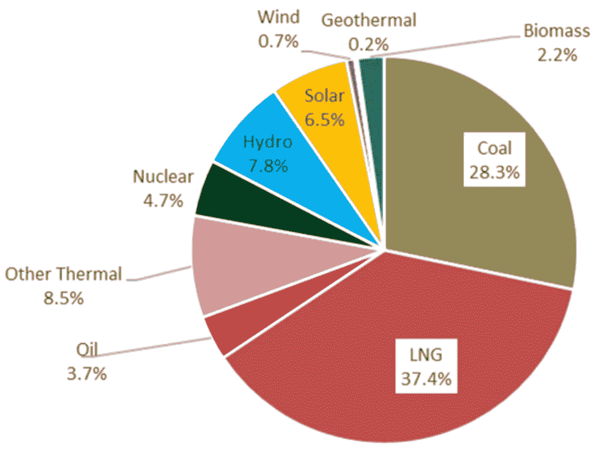

# 随着各国逐渐摆脱对化石燃料的依赖，区块链技术正在发挥什么作用？

> 原文：<https://medium.datadriveninvestor.com/as-countries-weed-themselves-off-fossil-fuel-what-role-is-blockchain-technology-playing-fdd354dbe0f5?source=collection_archive---------14----------------------->

2 分钟视频—利用区块链减少国家对石油、天然气和煤炭的依赖—[https://youtu.be/FPTd2t6lSvA](https://youtu.be/FPTd2t6lSvA)

[德国电力部门](https://www.cleanenergywire.org/factsheets/history-behind-germanys-nuclear-phase-out)将停止使用煤炭，这是对环境最有害的发电方式之一，到 2038 年，它还希望到 2022 年停止使用核电站，以应对气候变化。反过来，德国也越来越依赖风能或太阳能等微型可再生能源发电。这提出了一个挑战，因为就其性质而言，它们产生少量的电力，并且依赖于阳光或大风天气。像许多其他国家一样，德国发现，随着他们在一个集中的结构中淘汰化石燃料产生的电力，未来的电力网在转移电力方面需要更多的地方而不是国家。区块链供电的平台能够跟踪和追踪哪里需要电力，生产电力，然后进行适当的支付。这一点至关重要，因为对等发电正在发挥越来越大的作用，就像微型发电供应商从他们生产的电力中获得更多一样。这应该会导致安装风力和太阳能发电设施的资本支出获得更好的回报，从而鼓励更多的投资者，从而减少一个国家对煤炭和天然气的依赖。帮助改变德国电力供应的公司的一个例子是 [Lition](https://www.lition.io/about.php) ，其能源平台声称是世界上第一个 P2P 大众市场能源交易平台。它已经为德国 1000 多个城市的客户提供绿色能源。

Source:[ISEP.or.jp](https://www.isep.or.jp/en/717/)

与此同时，据世界经济论坛报道，日本在浮动太阳能发电方面处于全球领先地位，因为它希望减少对进口化石燃料的依赖。日本最大的漂浮太阳能发电厂坐落在山仓大坝后面，60，000 块电池板为 5，000 个家庭供电，每年可减少 8，000 多吨二氧化碳。继 2011 年 3 月 T2 福岛核电站灾难之后，可再生能源现在约占全球能源总量的 20%。东京电力公司最近宣布与伊藤忠商事合作，建立一个基于区块链的平台来交易剩余电力，使日本的房主能够相互交易电力。其目的是使用区块链技术和人工智能(AI)来跟踪电力，以将一个家庭的多余电力出售给其他房主。

因此，我们可以看到区块链技术正在帮助各国减少对化石燃料的依赖，因为各国试图履行其气候变化义务。

#区块链#可再生#经济#环境#气候变化#核能#透明#太阳能#德国#日本#二氧化碳排放#电力#由 Digital Bytes 购买给您如果您想每周收到 Digital Bytes，请发送电子邮件至 Jonny。Fry@Teamblockchain。