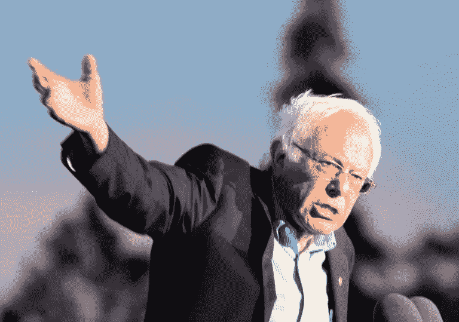

# 不出所料，伯尼被耍了。

> 原文：<https://medium.datadriveninvestor.com/as-expected-bernie-got-played-5d2e370b9ed9?source=collection_archive---------6----------------------->

## 纽约放弃了他的选票，民主党全国委员会允许这种情况发生。

Photograph Source: Shelly Prevost — [CC BY 2.0](https://creativecommons.org/licenses/by/2.0/)

好吧，这是正式的。纽约州选举委员会决定将伯尼·桑德斯排除在投票之外，并以“冠状病毒问题”为由取消了 6 月 23 日的初选。请记住，由于病毒，纽约人首先会被邮寄选票，而落选的候选人仍然会有他们的名字。唯一真正的改变？伯尼·桑德斯将不再是一个选项，剥夺了选民表达自己偏好的基本权利。

不出所料，伯尼又一次让*扮演了*。

伯尼·桑德斯屈服于暂停竞选的压力，为这一决定辩护，表示希望尽一切可能确保乔·拜登在大选中击败唐纳德·特朗普总统，取得民主选举的成功。作为奖励，民主党全国委员会袖手旁观，因为纽约作出了前所未有的决定，放弃了他的名字，从而剥夺了他从联邦最大的州之一获得任何代表作为杠杆的机会。这对于在大会上建立政党纲领至关重要。但当然，让伯尼付出代价并不是纽约州选举委员会，尤其是民主党全国委员会唯一想要的结果。将他从选票中剔除无疑会让他在纽约的支持者不愿费心去投票，从而降低左派选民和初选挑战者的选票。

当然，正如在伯尼·桑德斯问题上经常出现的情况一样，这远不止是一个候选人和一次选举。

自然，这无疑会促使其他即将到来的国家采取同样的行动。但是正如伯尼在他关于这个决定的[声明](https://twitter.com/BernieSanders/status/1254845389355827204?s=20)中指出的，乔·拜登已经警告说，总统可能会利用这个病毒来推迟 11 月的选举。现在，多亏了纽约州，他有了这样做的先例。但参议员竞选团队在声明中没有注意到一个不可否认的、厚颜无耻的事实，即对于民主党来说，阻止伯尼·桑德斯一直比击败川普总统重要得多，我不确定还有什么比纽约州的行动更能证明这一点。

在一个以华尔街的腐败为核心，全国大约七分之一的亿万富翁称之为家乡的州，纽约州愿意开创一个破坏这个国家仍然拥有的任何民主外表的先例，以努力摧毁一个目标是授权我们接管他们权力的候选人，这有什么奇怪的吗？

没有真正的理由这样做，除了在可能质疑乔·拜登的选民面前摩擦，迫使达成共识，并确保我们接受他是我们唯一剩下的人。老实说，我心里已经没有生气的空间了。这是对每一个为伯尼带到国家舞台的信息贡献时间和精力的志愿者和组织者的蓄意和恶意的侮辱。我们再次被告知，在当前的政治结构范围内，这一运动不受欢迎，这意味着我们将不得不在它之外建立一个。但只要我活着，我心中就会永远爱着伯尼·桑德斯，因为即使没有别的，他也让我睁开了眼睛，唤醒了我。即使有时他并不打算这么做，他的竞选活动也让我对选举过程和美国政治的本质有了更多的了解，如果他没有选择竞选，我可能永远也学不到。

 [## 保护主义、政治和经济动荡|数据驱动的投资者

### 美国股市昨日出现 400 多点的大幅反转，为未来的事情发出了警告信号。市场…

www.datadriveninvestor.com](https://www.datadriveninvestor.com/2018/06/28/protectionism-politics-economic-turmoil/) 

两党的面具已经被扯下，对数百万美国人来说，他们再也不会被隐藏起来了。

民主党内部没有“抵抗”，只有对左派的抵抗。没有一个主流政党真正关心中产阶级和工人阶级。但是知识就是力量，尽管我对这次选举的结果感到震惊，但我感到欣慰的是，有无数人从我们今天犯下的错误中吸取了教训。我感到欣慰的是，下一任伯尼·桑德斯不会这么客气，也不会愿意屈从于党内精英的意志。现在的权力是在借来的时间里运行的，我们不会被压制太久。伯尼可能被耍了，但未来的领导人一定会决心不让 2020 年发生在他身上的事情发生在他们身上。

正如我以前说过的，他们可能赢得了这场战斗。但是我们会赢得这场战争。