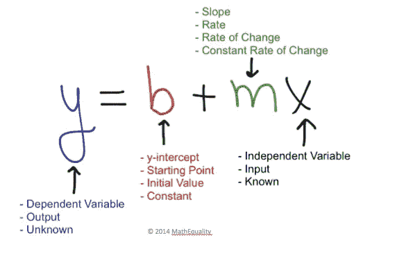
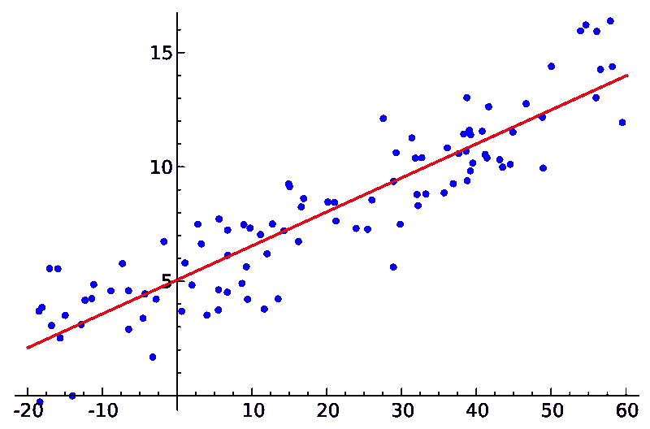
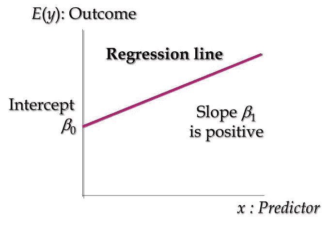
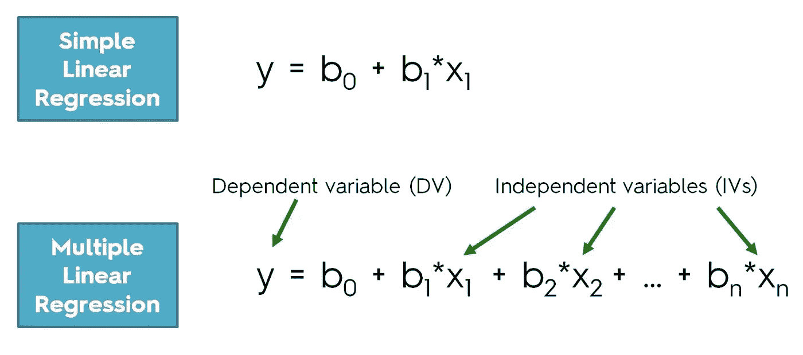
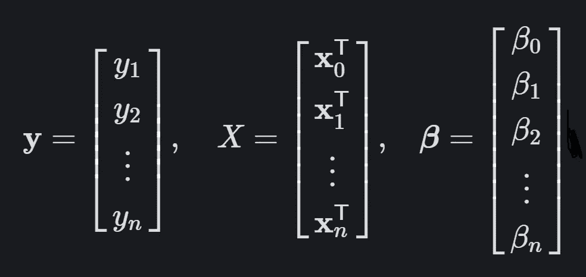
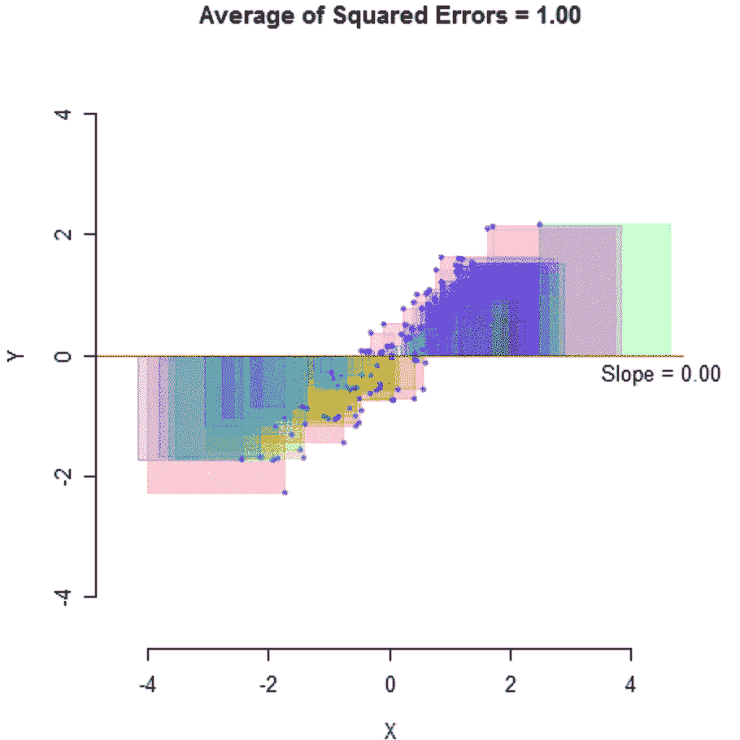
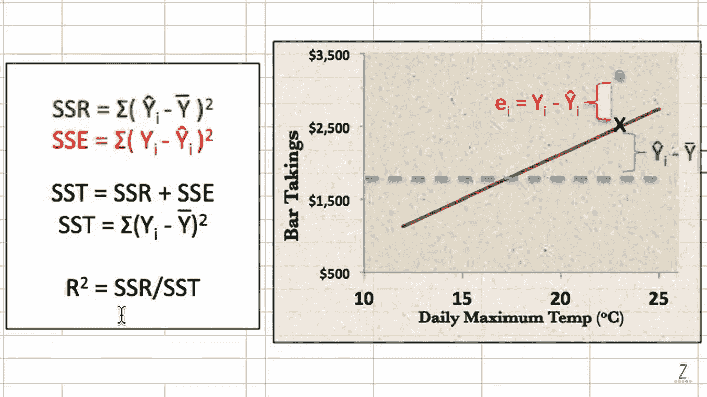
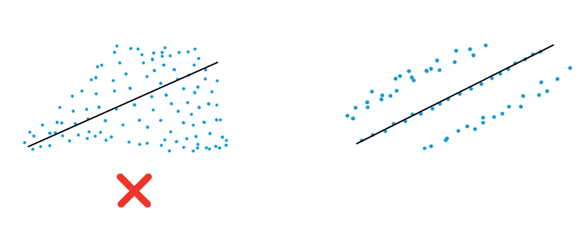
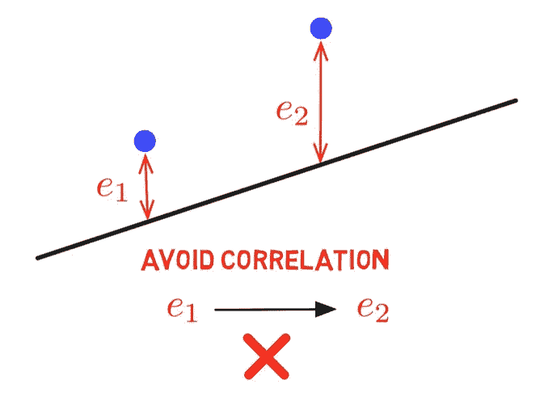
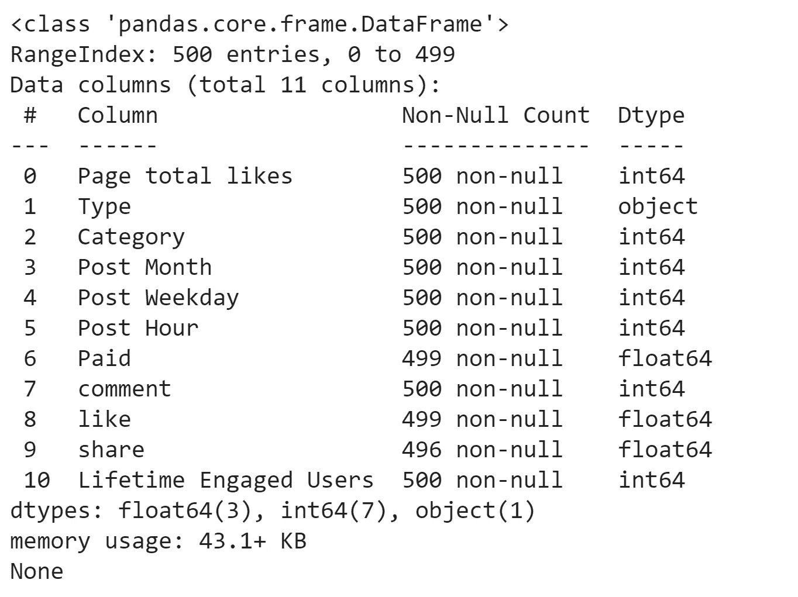

# ASAP 线性回归指南

> 原文：<https://medium.datadriveninvestor.com/asap-guide-to-linear-regression-fda841656fbd?source=collection_archive---------11----------------------->

> 这是一个关于机器学习中线性回归的快速、简单、无废话的指南。你需要知道的一切，都在一个地方。我们开始吧

众所周知，线性回归是一种简单的算法，也是比较复杂模型的良好基线。在本文中，我们探索算法，理解数学，运行代码，并学习可能的线性回归**A**S**S**oon**A**S**P**。

# 第 1 部分:基础知识

线性回归(LR)是一种回归算法*。*

它用于预测输出为连续值**的情况，例如数字 7。**

它显示了一个或多个**自变量***(输入/数据/特征)*和**因变量** *(结果/预测)*之间的关系。

> 记住这一点的一个简单方法是输出依赖于输入。为了更好地理解其中的区别，点击[这里](https://www.scribbr.com/methodology/types-of-variables/#independent-vs-dependent)。

# 第二部分:数学

## 第 2.1 节:简单线性回归(SLR)

**简单线性回归**是 LR 最简单易懂的版本。它只包含一个预测一个因变量的自变量。

在学习算法和 LR 本身之前，理解这一点是很重要的。它也是多元和多项式线性回归的基础。如果看完这一节还是不懂单反，那就看[这个](https://www.youtube.com/watch?v=IL3UCuXrUzE)上 2x 速( *4 分钟*)

LR 背后的等式源自我们在中学都学过的一个简单等式:

*Fig 1.1\. This equation has many names, most commonly known as the* ***slope-intercept form*** of a line. [source](https://mathequality.wordpress.com/2014/01/15/sharing-is-caring-linear-equations-review/)

SLR 的方程是斜率截距形式方程的直接推导。有了这两个方程的顶部和底部，很容易看到变量重叠。

Fig 1.2\. In statistics and modeling, ŷ is pronounced as “y hat” and represents the predicted value of a function or model, or in this case, regression algorithm. [source](https://www.sharpsightlabs.com/blog/linear-regression-in-r/)

*   **β0** 是 y 轴截距
*   **β1** 是系数/斜率
*   **X** 是自变量
*   而 **ŷ** 是因变量

虽然 LR 可以显示两个或多个变量之间的关系，但是 SLR *只能显示两个变量之间的关系。这就是为什么它只有两个变量， **ŷ** 和 **X** 。这使得可视化变得容易:*

Fig 2.1\. An example of regular linear data. [source](https://en.wikipedia.org/wiki/Simple_linear_regression)

这里有一个更概括的版本:

Fig 2.2\. E(y) = **ŷ** [source](https://www.slideshare.net/atiqrehman15/regression-correlation-44070123)

## 第 2.2 节:多元线性回归(MLR)

> 注意:从现在开始，特征和自变量将互换使用，因为它们代表相同的概念。

虽然 SLR 可用于单一预测者/预测的情况，但 MLR 几乎可用于有多个因素决定结果的所有其他情况，例如这个[数据集](https://archive.ics.uci.edu/ml/datasets/Facebook+metrics)。它遵循与 SLR 几乎相同的方程，但有多个“ **β1X** ”或独立变量和系数的组合。

Fig 3\. [source](https://www.superdatascience.com/blogs/regression-classification-multiple-linear-regression/)

MLR 为每个特征分配一个唯一的系数，并将两个值存储在一个方向的[向量](https://www.mathsisfun.com/algebra/scalar-vector-matrix.html)中，以便于修改并在运算*(乘法)*中用作[矩阵](https://www.mathsisfun.com/algebra/scalar-vector-matrix.html)函数:

Fig 4\. vertical matrixes. [source](https://m325.com/linear-regression-from-scratch/#/)

## 维度

有了两个变量，我们很容易将数据可视化。即使有三个变量，我们也可以在 3D 平面上将其可视化*(见图 5)* 。但是随着我们的价值增加，我们到达了维度的问题，在继续前进之前必须理解这个问题。

需要注意的一点是**只有**自变量的数量增加。这是因为因变量是我们预测的值，所以它总是一个值。对于利用神经网络的更复杂的人工智能模型，我们可以有多个。但是在大多数机器学习应用程序中，并且为了这篇文章，结果只有一个值。

假设我们有两个特征。这意味着，理论上，我们有两个 x 轴和一个 y 轴。为了映射它，我们必须向上移动维度，并像这样投影数据:

Fig 5\. a hyperplane regression. [source](https://sphweb.bumc.bu.edu/otlt/MPH-Modules/BS/R/R5_Correlation-Regression/R5_Correlation-Regression_print.html)

在这个例子中，我们在一个三维空间中，超平面是少了一个维度的黄色子空间*(这就是为什么它是一个二维平面)。*

两个特征是我们仍然可以想象的，但是当我们向更高维度移动时，我们的大脑无法理解它。幸运的是，我们的电脑可以，这也是 MLR 工作的原因。如果你想更深入地了解，请查看这篇文章。

> 还有一种叫做**降维**(由于时间关系，我们不会涉及这个)的方法，可以通过不同的技术(主成分分析、线性判别分析、核 PCA 等)来降低维度。如果你想更深入地了解这一点，可以看看这一章。

> 您可能想知道所有这些值是如何计算出来的？我们如何知道截距或系数是正确的？我们怎么知道我们的模型是否正确？

显然，我们可以用肉眼看到这条线与我们的数据是如何对齐的(*见图 2.1* )，但我们的计算机使用一种更精细、更准确的方式来做到这一点。

 [## 回归树是如何工作的？数据驱动的投资者

### 之前我们谈到了决策树以及如何在分类问题中使用它们。现在我们转移我们的焦点…

www.datadriveninvestor.com](https://www.datadriveninvestor.com/2020/04/13/how-do-regression-trees-work/) 

## 第 2.3 节:算法技术

在我们开始之前，让我们弄清楚一些事情，*算法和模型之间的区别。*

我在这篇[文章](https://medium.com/datadriveninvestor/difference-between-an-machine-learning-algorithm-and-model-14879f4aec7b)但是 *tl 中深入地谈到了这一点；博士*:一种算法在我们的数据上运行，以发现模式和规则，这些模式和规则存储在数据中并用于创建一个模型，该模型可用于确保预测。

因此，我们将涵盖的技术将用于算法和我们的数据，以创建一个准确的模型。

## 普通最小二乘法

为了找到我们模型的未知参数，我们使用线性最小二乘法。这些方法中最流行的是一种叫做**普通最小二乘法的技术。**

OLS 的目标是最小化每个点的残差平方和。它计算残差平方和，因为线下的点有一个负残差，如果我们对它们求和，它会抵消其他正和。平方每个残差确保积极性，避免抵消。

> 残差是直线上一个点与其预测值之间的距离。

这是一个简洁的可视化:

Fig 6\. [source](https://mlfromscratch.com/linear-regression-from-scratch/)

## r 的平方

衡量我们模型准确性的最常见方法是通过一种称为 **r、**的技术，也称为**决定系数**。

它通过测量 Y 的变化百分比告诉我们回归线对实际值的预测有多好，这是由于它在 X 上的回归*(这就是为什么它的值在 0 和 1 之间)*。

R 基本上将回归线各点的残差平方和与均值各点的残差平方和进行比较。

Fig 7\. [source](https://www.youtube.com/watch?v=p8rIhf6Q1o4)

这个等式可能看起来令人生畏，但它只是简单地比较了均值误差和回归误差。等式中可能会有一些变化，因为 SST 避免得到负值，所以根据点在线的上方或下方，我们必须加上或减去。

这里有一个很好的[视频](https://www.youtube.com/watch?v=2AQKmw14mHM&t=355s)涵盖了它的基本原理。强烈推荐观看:-)

# 第 3 部分:在我们建造之前

## 第 3.1 节:LR 的假设

在进入大楼之前，我们需要考虑 LR 的几个假设。如果不满足这些假设，那么我们的数据可能会自行崩溃，搞乱我们的模型。

1.  **线性** -数据必须是线性的*(见图 2.1)* 。
2.  **方差** -误差的方差应该是常数*(见下图 7.1)*。
3.  **多元正态** -残差必须正态分布*(只有少数异常值，其余点应接近直线)*。
4.  **误差的独立性** -残差不应相互关联*(见下图 7.2)*。
5.  **缺乏多重共线性** -特征/自变量之间相关性不高*(一个特征不直接预测另一个特征，如长度和体积)*

from left to right — Fig 8.1 and 8.2 [source](https://www.youtube.com/watch?v=hVe2F9krrWk&t=179s)

## 第 3.2 节:构建 MLR 模型的方法

我说“MLR 型号”而不是“LR 型号”是有原因的。对于单反模型，我们只有两个变量要实现，所以没有细微差别。但是在处理 MLR 时，我们可以有三到三百个变量。这就是为什么我们必须采用减少变量的方法。

为什么这么做是个好主意，有两个**主要原因: **(1)** 我们拥有的变量越多，我们的计算机就越难制作和运行一个有效的模型， **(2)** 我们拥有的变量越多，我们就越难理解变量的影响并从我们的数据中得出有价值的见解。**

**我们使用一个 **P 值分数** *(一个相关变量，衡量一个变量在其他变量中的重要性——通常设置为 0.5%或 5%)* 来帮助我们找到我们的特征中实际上对结果有影响的重要变量。这也称为显著性水平**

**我们主要有 5 种方法找到这一点:**

1.  ****All-in** -这种方法使用我们所有的变量，只有在我们事先知道所有变量都很重要的情况下，我们才会这样做。**
2.  ****后院消除** -该方法适合所有变量，并取出具有最高 p 值的变量。它重新拟合模型，并重复这个过程，直到我们的变量都低于我们的 p 值。**
3.  ****正向消除** -该方法为每个特征创建一个 SLR 模型，并找出 p 值最低的一个。然后，它保留该特征，并用该特征和一个额外的预测器拟合所有可能的模型。然后重复这一过程，直到没有要素低于 p 值。**
4.  ****双向消除** -该方法利用正向消除的第一步*(为每个特征创建一个 SLR 模型，并找到 p 值最低的一个)*，然后使用反向消除去掉所有高于我们 p 值的变量并重复。它也被称为**逐步回归。****
5.  ****分数比较**——这种方法使用一个特定的优良标准(如赤池标准)，然后用 *n* 变量 *(2^n -1)* 构造所有可能的变量，并选择最好的。随着变量的增加，这也是极其不可持续的。**

**幸运的是，大多数机器学习库——包括**scikit-learn**——会找到最佳方法，并在我们编码时自动应用。**

**说到编码…**

# **第 4 部分:构建模型**

**为了构建这个模型和大多数机器学习模型，我们将使用 python 库 **skit-learn** 。我们使用 skit-learn 是因为它是最广泛和用户友好的机器学习库之一。加上巨蟒石。**

> **开始吧！**

**出于学习目的，这是一个非常简单的 MLR 模型。[数据集](https://archive.ics.uci.edu/ml/datasets/Facebook+metrics)是从 UCI 机器学习知识库中检索出来的，包含 2014 年脸书邮报的指标，来自一家国际化妆品公司的 500 多篇帖子。**

**它有多个我们可以使用的自变量和因变量。在这种情况下，我们将使用指标来预测终身参与用户作为基线*(尽管可以使用任何其他预测变量)*。**

> **如果你想了解真正的代码，可以去我的 [GitHub](https://github.com/SabeehHassany/Facebook-Engaged-User-Prediction-MLR) 。**

**首先，我们要**导入这三个基本库**，像 skit-learn 一样，适用于所有的 ML。**

**我们可以**通过 Pandas dataframe 导入数据集**，并使用 iloc 来分配变量。请记住，数据集的名称必须针对不同的用例进行更新，并且它必须与您的位于同一文件夹中。py 文件或上传到 Jupyter 笔记本或 Google Collab。**

**对于任何数据科学问题，最重要的任务之一是**预处理数据**。因为我们的计算机是非常精确和准时的机器，我们的数据集必须是完美的。**

**必须考虑缺失值或 NaN(非数字)值，并遵循 LR 假设。可以通过查看我们的数据或使用单独的函数来检查这些假设，但是，我们必须自己处理缺失和格式不正确的值。**

> **有多种方法可以做到这一点，但最有效的方法是使用 skit-learn 提供的预处理工具。这在不同的情况下会有所不同，但是我们将在这里讨论一些。**

**在分配数据集之后，我们可以运行 *print(dataset.info())* 来快速可视化我们所有的列，以查看我们需要在哪里修复数据。最好是实际查看我们的数据集或对 csv 文件使用条件格式，但这也可以。我们得到这样的结果:**

****

**Fig 9\. Null values == bad.**

**对于这个数据集，我们总共有 3 列缺少数据。我们可以使用简单估算函数来帮助我们**估算缺失数据**。**

**对于指数 8 和 9(最后一个指数不包括在内，因此为“8:10”)，我们可以使用“中值”来估算，以补偿异常值，对于指数 6，我们使用“最频繁”，因为它是一个二进制数据点。**

**索引 1 有**分类数据**，必须使用名为 OneHotEncoding 的函数进行转换。这必须在输入缺失值后完成，因为 OneHotEncoding 会自动将编码列作为第一个索引来替换所有其他列。**

**由于一个简单算法的大数据集和许多变量，我们可以使用 90/10 **数据集分割**。出于一致性的考虑，随机状态被调整为 3。**

**现在**训练模式** l 出奇的容易。在制作了 LinearRegression 对象的实例之后，我们可以使用它来拟合训练数据和训练模型。LinearRegression()对象的括号是空的，因为我们没有调整模型*(我们将在括号内赋值)*的参数，因为与更复杂的模型相比，它们不那么必要/重要。**

**训练完我们的模型后，我们可以用它来做新的预测。在这里，我们可以分配一个变量， *y_pred* ，测试集的预测值。然后，通过使用 **concatenate** 函数，我们可以通过 *(len(y_wtv)，1))* 将预测值和实际值并排显示在 2D 数组中，以便于查看。**

**最后，为了确定我们的模型性能，我们可以计算一个 r 值。在这个模型中，我们达到了接近 0.80 的 r，这意味着 80%的数据可以通过我们的模型来预测。print 函数将 r 值转换成一个字符串，因此可以很容易地打印和读取。**

# **第五部分:结论**

**大概就是这样。看，没有看起来那么难！**

**现在我们有了这个基本的理解，我们可以努力理解任何机器学习算法——详细的。**

**我在这篇文章中提炼了所有你需要知道的东西，但是你可以从不同的角度去了解更多。如果你想深入理解这些概念，我推荐你查看我的图片的所有来源。它们都是惊人的网站、文章或视频，包含大量有用的信息。**

**干杯。**

# **摘要**

*   **线性回归非常容易理解和建立，并预测一个*连续值。***
*   **简单线性回归有*一个*自变量，而多元线性回归有*两个或更多自变量。***
*   **有不同的*数学程序*来创建/训练和测量我们模型的准确性**
*   **在 ***regressor.fit(X_train，y _ train)***-使用我们的模型之前，需要对数据进行预处理以发现缺失点并确认异常值**

# **希望你喜欢这本书！：**

**在你离开之前，请允许我自我介绍一下:)**

**我是一个好奇的 17 岁男孩，对机器学习和数据科学及其交叉脑机接口超级感兴趣。我喜欢学习新东西和认识新朋友**

**在 [*Linkedin*](https://www.linkedin.com/in/sabeeh-hassany-334b6b194/) ， [*中型*](https://medium.com/@sabeehhassany) (哦看！你已经来了)，还是 [*碎碎念*](https://twitter.com/sabeehhassany) *！***

****访问专家视图—** [**订阅 DDI 英特尔**](https://datadriveninvestor.com/ddi-intel)**