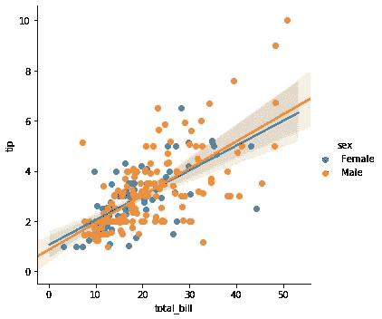

# 线性回归的假设

> 原文：<https://medium.datadriveninvestor.com/assumptions-of-linear-regression-90fe0fa17121?source=collection_archive---------10----------------------->

H ello 世界！我的数据科学社区博客。在这里，我们将讨论线性回归的基本假设。有兴趣开始学习线性回归的人，那么这个博客是为你准备的。



Scatter Plot [‘Image By Author’]


QQ Plot [‘Image By Author’]

**线性回归**是一种评估一个或多个预测变量是否解释因变量(标准变量)的分析，是一种基于监督学习的机器学习算法。它执行回归任务来计算回归系数。回归模型是基于独立变量的目标预测。

[](https://www.datadriveninvestor.com/2020/02/19/five-data-science-and-machine-learning-trends-that-will-define-job-prospects-in-2020/) [## 将定义 2020 年就业前景的五大数据科学和机器学习趋势|数据驱动…

### 数据科学和 ML 是 2019 年最受关注的趋势之一，毫无疑问，它们将继续发展…

www.datadriveninvestor.com](https://www.datadriveninvestor.com/2020/02/19/five-data-science-and-machine-learning-trends-that-will-define-job-prospects-in-2020/) 

有不同种类的回归模型。这些模型的不同之处在于自变量和因变量之间的关系，以及正在使用的自变量的数量。

# 什么时候应该使用线性回归？

线性回归是一种参数模型。在参数模型的帮助下，我们只能处理回归问题。参数模型是出于分析目的对数据做出一些假设的模型。我们需要记住线性回归的假设，否则模型无法提供数据的良好结果。

为了执行成功的回归分析，我们有五个关键假设。

1.  线性关系
2.  自相关
3.  多重共线性
4.  异方差
5.  误差项的正态分布

我们走吧！

1.  **线性关系:**

如果您将线性模型与非线性、非加性数据集相匹配，回归算法将无法从数学上捕捉趋势，从而导致模型效率低下。此外，这将导致对未知数据集的错误预测。

寻找残差与拟合值图(解释如下)。此外，您可以在模型中包含多项式项(X，X，X)来捕捉非线性效应。

导入所需的包

```
%matplotlib inline
import matplotlib.pyplot as plt
plt.style.use('seaborn-whitegrid')
from sklearn.datasets.samples_generator import make_regressionfrom sklearn.datasets.samples_generator import make_regression
x1, y1 = make_regression(n_samples=100, n_features=1, noise=10)
plt.plot(x1, y1, 'o', color='black');
plt.title("Linear Relationship Exists")
```

2.**自相关:**

误差项中相关性的存在大大降低了模型的准确性。这通常发生在下一个时刻依赖于前一个时刻的时间序列模型中。如果误差项相关，估计的标准误差往往会低估真实的标准误差。

如果发生这种情况，会导致置信区间和预测区间变窄。较窄的置信区间意味着 95%的置信区间包含系数实际值的概率小于 0.95。让我们通过一个例子来理解窄预测区间:

例如，X 的最小二乘系数为 15.02，其标准差为 2.08(无自相关)。但是在存在自相关的情况下，标准误差降低到 1.20。因此，预测区间从(12.94，17.10)缩小到(13.82，16.22)。

此外，较低的标准误差会导致相关的 p 值低于实际值。这将使我们错误地得出一个参数具有统计显著性的结论。

寻找德宾-沃森(DW)统计。它必须介于 0 和 4 之间。如果 DW = 2，意味着没有自相关，0 < DW < 2 implies positive autocorrelation while 2 < DW < 4 indicates negative autocorrelation. Also, you can see the residual vs time plot and look for the seasonal or correlated pattern in residual values.

```
from numpy import *
import numpy as N
import pylab as Pfn = 'data.txt'
x = loadtxt(fn,unpack=True,usecols=[1])
time = loadtxt(fn,unpack=True,usecols=[0])def estimated_autocorrelation(x):
    n = len(x)
    variance = x.var()
    x = x-x.mean()
    r = N.correlate(x, x, mode = 'full')[-n:]
    #assert N.allclose(r, N.array([(x[:n-k]*x[-(n-k):]).sum() for k in range(n)]))
    result = r/(variance*(N.arange(n, 0, -1)))
    return resultP.plot(time,estimated_autocorrelation(x))
P.xlabel('time (s)')
P.ylabel('autocorrelation')
P.show()
```

3\. **多重共线性:**

当发现自变量中度相关或高度相关时，就存在这种现象。在具有相关变量的模型中，找出预测变量与响应变量的真实关系是一项艰巨的任务。换句话说，很难找出哪个变量实际上有助于预测响应变量。

另一点，随着相关预测因子的出现，标准误差有增加的趋势。而且，标准误差越大，置信区间越宽，导致斜率参数的估计精度越低。

此外，当预测值相关时，相关变量的估计回归系数取决于模型中可用的其他预测值。如果发生这种情况，你将会得出一个错误的结论，即一个变量强烈/微弱地影响着目标变量。因为，即使你从模型中去掉一个相关变量，它的估计回归系数也会改变。那可不好！

您可以使用散点图来显示变量之间的相关性。同样，你也可以使用 VIF 因子。VIF 值<= 4 suggests no multicollinearity whereas a value of > = 10 意味着严重的多重共线性。最重要的是，相关表也应该解决这个问题。

```
from statsmodels.stats.outliers_influence import variance_inflation_factordef calc_vif(X):# Calculating VIF
    vif = pd.DataFrame()
    vif["variables"] = X.columns
    vif["VIF"] = [variance_inflation_factor(X.values, i) for i in range(X.shape[1])]return(vif)
```

4.**异方差:**

误差项中非恒定方差的存在导致异方差。一般来说，非常数方差出现在异常值或极端杠杆值的情况下。看起来，这些值得到了太多的权重，从而不成比例地影响了模型的性能。当这种现象发生时，样本外预测的置信区间往往过宽或过窄。

您可以查看残差与拟合值图。如果存在异方差，该图将呈现漏斗形模式(见下一节)。此外，您可以使用 breu sch-Pagan/Cook-Weisberg 测试或 White general 测试来检测这种现象。

```
from statsmodels.stats.diagnostic import het_breuschpagan
from statsmodels.stats.diagnostic import het_white
from statsmodels.formula.api import ols
bp_stats = het_breuschpagan(model.resid,model.model.exog)
from statsmodels.compat import lzip
name=['F statistic','p-value']
test = sms.het_goldfeldquandt(model.resid,model.model.exog)
lzip(name,test)
```

5.**误差项的正态分布**

如果误差项是非正态分布的，置信区间可能变得过宽或过窄。一旦置信区间变得不稳定，就会导致基于最小二乘估计系数的困难。非正态分布的存在表明，有几个不寻常的数据点必须仔细研究，以便建立一个更好的模型。

可以看看 QQ 图(如下图)。你也可以进行正态性的统计检验，如科尔莫戈罗夫-斯米尔诺夫检验，夏皮罗-维尔克检验。

```
import numpy as np 
import pylab 
import scipy.stats as statsmeasurements = np.random.normal(loc = 20, scale = 5, size=100)   
stats.probplot(measurements, dist="norm", plot=pylab)
pylab.show()
```

# 结论

在这篇博客中，我们看到了线性回归的不同假设。这篇文章背后的动机是获得回归假设的直觉和洞察力。此外，我们没有涵盖文章中提到的所有测试。但是，我想，这有助于探索其他测试和方法。

如果你喜欢这篇文章，请给我鼓掌，并帮助其他人找到它。

此外，如果我错过了假设/主题，请告诉我。乐于学习和融入。

与我联系:- [LinkedIn](https://www.linkedin.com/in/dheerajkumar1997/)

与我联系:- [Github](https://github.com/DheerajKumar97?tab=repositories)