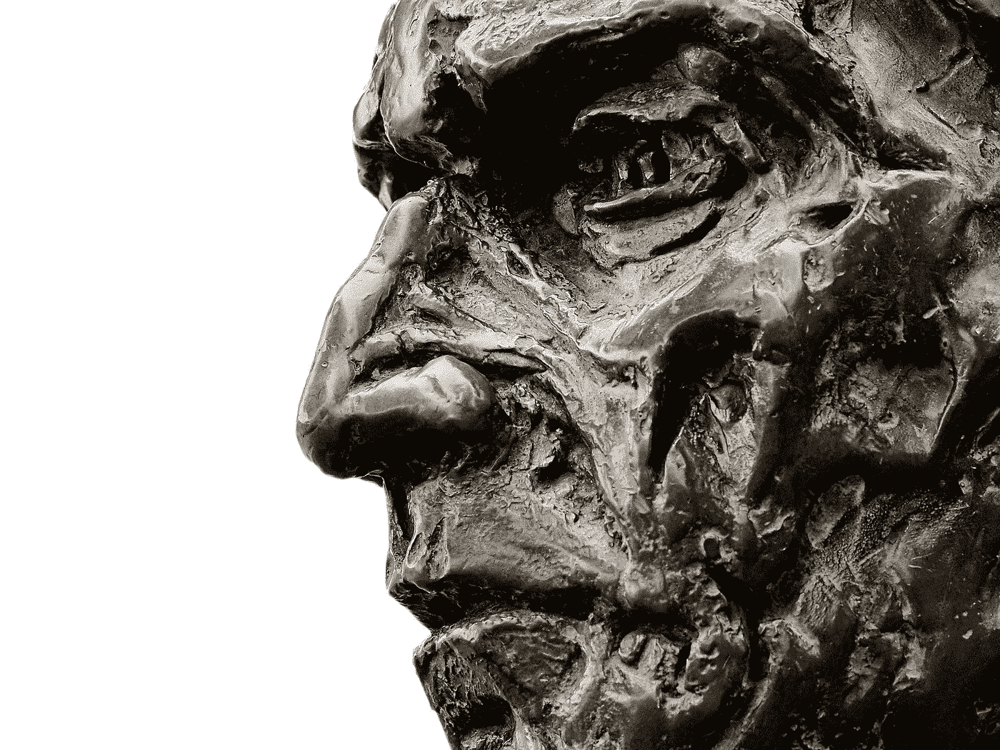

# “你的感情到头来算不了什么。但每个原则的最后都是一个承诺。”—埃里克·托马斯

> 原文：<https://medium.datadriveninvestor.com/at-the-end-of-your-feelings-is-nothing-c5f01fb09ff3?source=collection_archive---------6----------------------->

他的话终于开始被理解了。

Be like our very friendly-looking statue guy here

大家 2021 快乐。首先，如果你没有听说过埃里克·托马斯——嘻哈传教士——你应该去 YouTube 上看看他的作品。在我短暂的栅栏安装工生涯中，我每天早上在上班的路上都会听他的音乐。让我告诉你，挖洞做栅栏很快就过时了。尤其是因为傅%！岩石。简单地说，我在那里没呆多久。但我确实会因为我的儿子 ET 而深情地回顾过去。

我认为上面的雕像非常适合今天帖子的主题。有时候你得像雕像一样。绝情。很像我们的雕像老兄。我并不是说你应该出去做个混蛋，像对待傻瓜一样对待别人。这是双重否定。

我建议你忽略的感觉是那些不为你着想，却不停地在你耳边低语甜蜜诱惑的感觉。那些说方便语言的人。你猜怎么着？你脑中的那些声音在方便的语言中是流利的。

我说的是那些偏离你的时间表很容易被放弃的时候。当你脑海中的声音说“来吧。只是今天。你可以请得起今天的假。”也许那天你不想健身，那个邪恶的声音说“你应该休息一天。今天是个大日子，你累了。没什么大不了的。”

重要时刻。双份。不要。

因为虽然你很在乎当下的感受，但你未来的目标却不在乎。他们不在乎你是否累，也不想做几个俯卧撑。或者一篇博文。或者读 10 页。

让我重复一遍:不要说方便的语言。说出你目标的语言。它们是黑色和白色的。基于结果。就像我们的雕像一样，他们是无情的。伙计们，把鱼钩放在合适的位置。你的目标不在乎你的感受。他们关心的只是你为他们付出的时间。如果你想达到这些目标，就要让自己对坚持通往这些目标的道路负责。

> “你的感情到头来算不了什么。但每个原则的最后都是一个承诺。”

ET 的话终于在我脑海里生根发芽了。坚持我的原则培育了他的话语播下的种子，在我去做那份可怕的击剑工作的路上(我提到过石头很烂吗？).

所以坚持你的原则，伙计们。在伪造它们的时候，你对自己做出了承诺。不要屈服于试图打破承诺的诱惑情绪。他们什么都不是，应该被如此对待。

好吧。我受够了。我将留给你另一个 ET 的深刻。

> “……在任何时候，都要能够为了你将要成为的人而牺牲你现在的样子。”

**进入专家视角—** [**订阅 DDI 英特尔**](https://datadriveninvestor.com/ddi-intel)