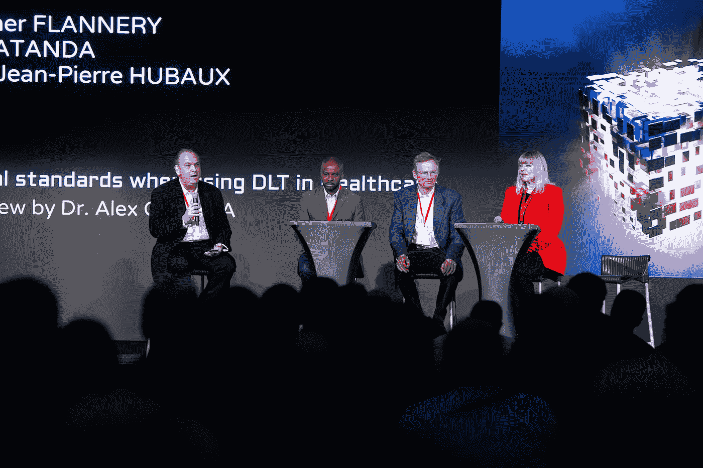
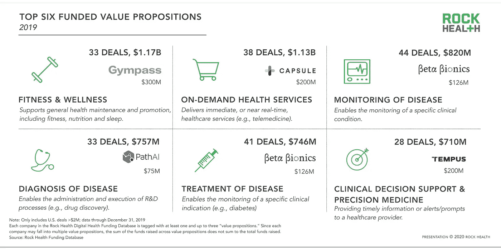
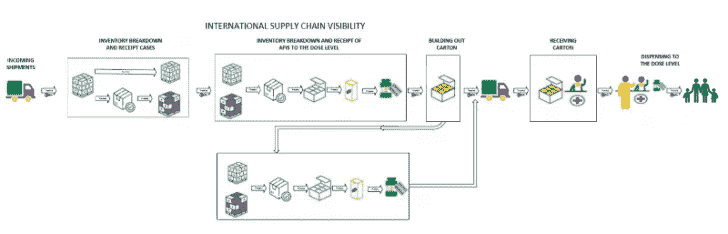
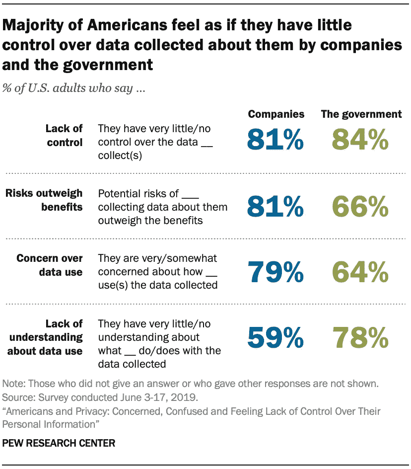
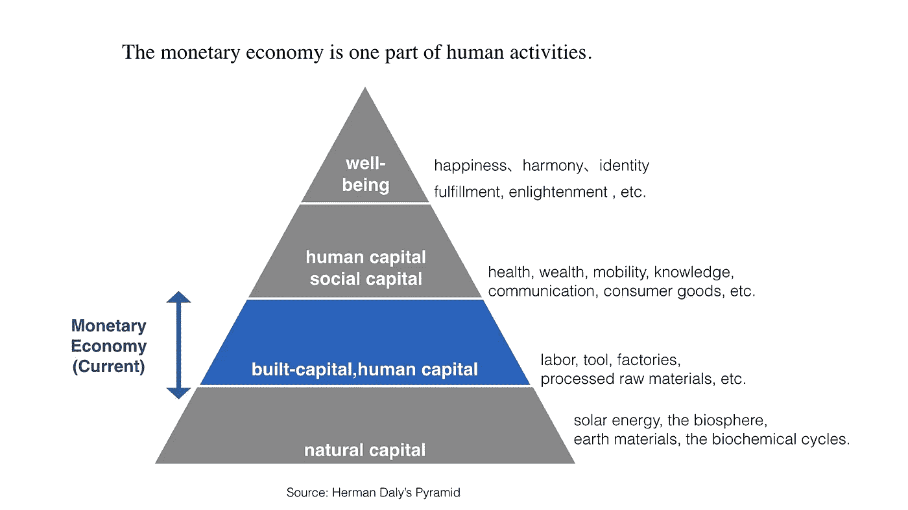

# 在第二届日内瓦区块链年会上，医疗保健占据了中心舞台

> 原文：<https://medium.datadriveninvestor.com/at-the-second-geneva-annual-blockchain-conference-healthcare-takes-center-stage-c32e73113422?source=collection_archive---------14----------------------->

Starting the Davos Week over 1200 people attended the second [Geneva Annual Blockchain Conference](https://genevablockchaincongress.com/agenda/). On center stage discussing the Ethics of DLT Standards in Healthcare are from right to left: [Heather Flannery](https://www.linkedin.com/in/heatherflannery/) (CEO, Consensys Health), Prof. Jean Pierre Hubaux (Director, [C4DT, EPFL](https://www.c4dt.org/)), Dele Atanda (Founder, the [Internet Foundation](https://theinternet.foundation/), CEO [MetaMe](https://metame.com/)) and Dr. [Alex Cahana](https://www.linkedin.com/in/dr-alex-cahana-282367157/) (GenesisBlock)

*更多的演讲者，更多的与会者，更多的医疗保健和区块链*

去年，我用 2020 年的三个承诺总结了[首届日内瓦区块链](https://medium.com/crypto-oracle/three-thoughts-about-blockchain-from-moderating-genevas-first-annual-blockchain-conference-461a77d306f)年会:更多女性、更多社会影响和更多医疗保健。事实上，今年的演讲者和与会者都增加了一倍，50 多家初创企业展示了他们的解决方案，我们举行了为期两天的小组讨论(不再有 [*manels*](https://www.macmillandictionary.com/us/dictionary/american/manel) )、[创意研讨会](https://www.hug-ge.ch/sites/interhug/files/a5_blockchain_programme_web.pdf)以及关于道德、政策和社会影响的广泛讨论。

An ideation workshop where [Helen Disney](https://www.linkedin.com/in/helen-disney-unblocked/) (left), [Mirko De Malde](https://www.linkedin.com/in/mirkodemalde/\) and Prof. [Sanjeev Krishna](https://www.linkedin.com/in/sanjeev-krishna-52092115/) (center) discuss with [Deepti Atrish](https://poonyah.co.in/) (fourth from left) how to improve her solution for remote elderly care

从这两天来看，今年似乎将形成三大趋势。

# 趋势# 1:数字健康是以患者为中心的，而区块链健康是由患者驱动的

由于数字医疗去年吸引了 74 亿美元(比 2018 年创纪录的 82 亿美元略有下降)，医疗保健和健康投资主要用于支持*增加*医疗服务消费(药物、测试、医生就诊)的解决方案。即使是促进健康、营养或睡眠的解决方案，也不能给用户带来直接或间接的经济利益。

Rock Health Digital Health Venture Funding [Report](https://rockhealth.docsend.com/view/zstw92q) (January 2020)

另一方面，使用区块链的医疗保健解决方案是通过令牌化设计的，旨在为作为数据创造者的患者提供[金钱和非金钱利益](https://www.coindesk.com/data-creators-should-share-in-the-profits-from-big-data)。这不仅为健康行为提供了直接的价值和激励( [Amchart](https://www.amchart.io/) ， [MedicalChain](https://medicalchain.com/en/) )，还保护我们免受数据挖掘的影响，这些数据挖掘可能会通过参与算法被操纵以增加健康消费。

(*我简单解释一下* [*这里*](https://worldradio.ch/article/alex-cahana-geneva-blockchain-congress/) *以及详细解释一下* [*这里*](https://anchor.fm/didier-borel/episodes/Dr--Alex-Cahana--Healthcare--and-Blockchain-eagqtd) )

 [## 5 个可以拯救环境的潜在区块链用例|数据驱动的投资者

### 区块链技术已经成为创新和颠覆的代名词。而医疗保健等几个行业…

www.datadriveninvestor.com](https://www.datadriveninvestor.com/2020/03/06/5-potential-blockchain-use-cases-that-can-save-the-environment/) 

# 趋势 2:区块链健康解决方案首先在新兴市场部署

正如我在这里提到的，区块链在医疗保健领域的两个早期使用案例是供应链和临床试验。在[供应链](https://medium.com/hackernoon/blockchain-in-healthcare-opportunities-challenges-and-applications-d6b286da6e1f)中，假药和假药每年造成数十亿美元的重大损失，近一半的临床试验没有报告，40%的医疗保健提供商数据记录充满错误和数据泄露，去年估计损失[40 亿美元](https://healthitsecurity.com/news/data-breaches-will-cost-healthcare-4b-in-2019-threats-outpace-tech)。

因此，像 [Rymedi](https://www.rymedi.com/) 这样的供应链解决方案和像 [Bloqcube](https://bloqcube.com/) 和 [Molecule](https://molecule.to/) 这样的临床试验管理解决方案，以及像[蒙古](http://files.alfresco.mjh.group/alfresco_images/pharma//2018/07/31/66785e17-aea8-4e51-9468-bcb2deb3e07e/Rymedi%20Mongolia%20Press%20Release.pdf)和[印度](https://bloqcube.com/events-media/)这样的其他解决方案，如 [SolveCare](https://solve.care/) 、 [Remelife](https://remelife.com/) 和 [Poonyah](https://poonyah.co.in/) 首先被部署在这些国家，就不足为奇了。

Rymedi workflow in the Mongolia Hep C project ([source](https://www.enterprisetimes.co.uk/2019/12/09/kadena-and-rymedi-partner-to-validate-medicinal-products-quality/))

# 趋势 3:医疗保健数据都是关于隐私、匿名和自我主权的

数据驱动的产品和服务通常被推销为有可能节省用户的时间和金钱，甚至带来更好的健康和幸福。尽管如此，大部分美国成年人并不认为他们从这种广泛的数据收集系统中受益。约 81%的公众表示，他们因公司收集数据而面临的潜在风险超过了好处，66%的人表示政府收集数据也是如此。此外，79%的公众不相信企业或政府是他们收集的数据的好管家。

It is time to [rethink](https://www.theverge.com/2019/1/29/18197541/health-data-privacy-hipaa-policy-business-science) our health data privacy laws (Image [source](https://www.pewresearch.org/internet/2019/11/15/americans-and-privacy-concerned-confused-and-feeling-lack-of-control-over-their-personal-information/))

因此，很多努力被投入到创建健康数据的隐私、匿名和自我主权的标准中。虽然一些法律解决了长期的互操作性挑战以及对更大的数据流、增强的安全性、信任和卫生实体之间的问责制的需求(如国家协调办公室[TEFCA](https://www.himss.org/resources/tefca-and-blockchain-enabling-trusted-data-flow-between-health-networks)框架)，但其他法律将自我主权和干净的数据视为一项基本人权(如最近由英国标准协会批准的由[互联网基金会](https://theinternet.foundation/)提出的《数字权利世界宣言》)。

# 最后的想法:我们有价值，因为我们的数据有价值

与 2019 年相反，今年的会议不那么沾沾自喜，更专注于设计一个可持续、包容和公平的医疗保健市场。除了道德标准和政策，我们还认识到并讨论了创建生态系统的必要性，该生态系统*将人们从医疗服务消费者转变为健康和财富的创造者*。

希望到 2020 年，企业会意识到，除了寻找产品/市场契合度、社区采用和充分的去中心化(即社区所有权)，他们还会认识到健康和福利是真正的经济活动。

因此，我们将能够从竞争性商品(“ *stuff* ”)经济心态成熟为真正的丰富和协作的数据经济。

Well-being is the ultimate capital (Image [source](https://medium.com/commonsos/what-changes-will-come-from-blockchain-and-the-token-economy-67db9eebba06))

> 这将使环境、社会和治理(ESG)投资最终包括健康，并成为环境、社会、治理和健康(ESGH)框架。

非常感谢会议的二十多位发言者和组织者。

明年再见！

*如果你喜欢你所读的内容，* ***继续在下面“鼓掌”，这样其他人也会看到(最多允许 50 次鼓掌！)***