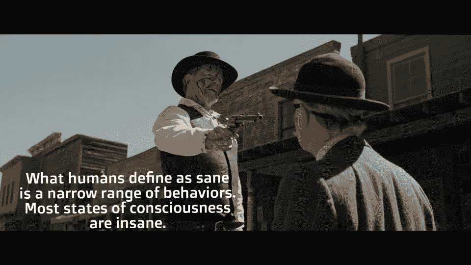

# 数据宗教时代的无神论

> 原文：<https://medium.datadriveninvestor.com/atheism-in-the-era-of-data-religion-1e47bd97881c?source=collection_archive---------9----------------------->

Credit: Photo by [Robert Bye](https://unsplash.com/@robertbye?utm_source=unsplash&utm_medium=referral&utm_content=creditCopyText) on [Unsplash](https://unsplash.com/s/photos/data-religion?utm_source=unsplash&utm_medium=referral&utm_content=creditCopyText)

无神论意味着在没有任何有形的证据证明上帝存在的时候，不相信或不相信上帝的存在；只有超自然生物的故事流传下来，以便召集智人合作。**数据宗教现在使得想象物理神的崛起成为可能**。无神论在实际数据神面前会如何适应？未来几年，它会自我突破还是自我重塑？

为了理解这些明显的数据之神，让我们深入西部世界的幻想世界。*(警告:前方剧透)*

***《西部世界》*** 是 HBO 出品的一部美国科幻电视剧。故事发生在一个虚构的、技术先进的以狂野西部为主题的游乐园里，里面住着机器人“主人”，他们看起来像人类，有情感。公园迎合富有的“客人”,他们可以在公园里放纵自己最疯狂的幻想，而不用担心主人的报复，主人被设计成不会伤害人类。随着节目的进行，我们将见证人类和机器人之间展现的力量。第一季的高潮是机器人意识到他们的行为导致了对人类的报复。该系列的第二季围绕着追踪杀手机器人并使公园恢复正常。

 [## 挑战你对人工智能和社会看法的 4 本书|数据驱动的投资者

### 深度学习、像人类一样思考的机器人、人工智能、神经网络——这些技术引发了…

www.datadriveninvestor.com](https://www.datadriveninvestor.com/2019/02/28/4-books-on-ai/) 

在回到西部世界之前，让我们先把注意力转移到现在的世界。类似的戏剧发生在我们的生活中，只不过我们的游乐园是互联网。这个公园迎合了由机器人“主人”组成的十亿“客人”，这些“主人”看起来还活着，并且理解人们的要求。这里的一个问题是，由于“公园条例”，这些“客人”不能沉溺于他们最疯狂的幻想。有时，我们都觉得公园可能在看着我们。

这正是西方世界不可告人的动机。每一个进入公园的“客人”都有一个嵌入其中的芯片(在他们不知情的情况下)，该芯片跟踪每个人能想到的情绪、动作和其他感官属性。真正的高潮是将所有收集到的信息输入到一个看起来和“客人”一模一样的“主机”中。现在两人在外貌和智力上都难分伯仲。

虽然这一切听起来高度虚构，实际上发生在现实生活中，但它确实在揭示戏剧和故事的肤浅方面做了一件体面的工作。这是一个很好的例子，它扩展了我们的思维领域，超越了故事，并在里面进行反思。

> 我相信故事帮助我们提升自己，修复我们内心的创伤，帮助我们成为我们梦想成为的人。揭示更深真相的谎言。
> 
> —罗伯特·福特博士(安东尼·霍普金斯)，《西部世界》第一季:(电视剧 2016—)

Credit: [https://i.redd.it/po1chu19ud611.jpg](https://i.redd.it/po1chu19ud611.jpg)

探索不同的意识状态听起来很酷，只要你有意识地决定这么做。更多的自由等同于探索你新的部分，这是社交媒体免费提供的。互联网监管的旧秩序正在被打破，看看它还能在多大程度上发掘你身上新的部分。

尤瓦尔·诺亚·哈拉里在他的书《21 世纪的 21 个教训》中写道:

> “获取数据的竞赛已经开始，数据巨头如谷歌、脸书、百度和腾讯。到目前为止，许多这类公司似乎已经采用了注意力的商业模式，为我们提供免费的信息、服务和娱乐，然后他们将我们的注意力转售给广告商。然而，数据巨头的目标可能远远高于任何以前的注意力商家。他们真正的业务根本不是卖广告。相反，通过吸引我们的注意力，他们设法积累了大量关于我们的数据，这比任何广告收入都有价值。**我们不是他们的顾客——我们是他们的产品。**

放弃权力的想法对我们来说已经变得如此自然，以至于我们意识不到正在发生的改变宗教信仰。至少你知道自己是一个印度教徒、基督教徒、犹太教徒，或者是遵循一套信仰的其他宗教团体的一部分。但在数据宗教中，一神教和多神教的概念本身就是一个大问题。

*哪个公司、组织或国家将收集最多的数据？或者我应该只是遵循多神教，并提交给不同的组织对自己的不同部分有最多的信息？*

当然，大多数人类无知地这样想，我一点也不怪他们。为了一种没有决策的生活而牺牲我们的自由意志听起来是个不错的交易。

# 决定

从石器时代到硅时代，整个人类故事和戏剧总是围绕着决策。以你的故事为例。想想一些小事，比如向某人描述你的一天——“哦，天哪！今天早上，我在自助餐厅遇到一个人，他讲述了一个电影场景，两兄弟被迫藏在一只大象里面，但最后被一些东西盖住了。他对一群陌生人说那种话，真让人恶心。但我很好奇，最终还是看了这一幕。晚上很棒，我呆在 [*家*](#) *妈妈做了一些新鲜美味的煎饼！。她真的知道我什么时候累。反正今天要早点睡，马上要考试了。*

在更深的层次上，你只是在描述你和其他人那天所做的决定，这些决定导致了*“你生命中的一天”的故事。你有很多选择(不听那个人的话，不看电影场景，晚上和朋友在一起，睡懒觉，等等。)，但是**你**做出了的选择决定，最终为你的戏剧增添了一个新的场景。花点时间思考一下。*

一些宗教给了你做出正确决定的自由，而另一些则规定了“正确”的决定，这让生活变得更简单(*更快乐*是主观的)。所有这些意识到决定的理论在宗教中从来没有真正重要过，因为人类只是想在他们的生活之外相信另一个故事。这些故事无疑有助于将不同的部落聚集在一起，是当今全球社区的结果。

但是在数据宗教中，历史会掉头重新审视你的真实故事。你今天为什么追求你所信仰的宗教？或者一个更大胆的问题。你为什么还要追求宗教？无神论者现在会以数据宗教为荣，提出正确的问题，期望它揭示虚构人物中的神和精心编造的故事中的宗教。或者他们会吗？

> 就像我们大脑的数学能力转移到计算器一样，随着人工智能在音乐和绘画等艺术形式中的崛起，我们可以想象我们大脑的神经网络转移到机器。

# 无神论

小时候，我妈妈一直给我讲一个故事，讲的是在一个古老的王国里，一个名叫拉吉的农民的故事。据说，拉吉的妻子总是向社区里的其他女人吹嘘她的丈夫，暗示他在王宫工作，每天都能见到国王。这种情况持续了数年，直到社区中的另一个人 Tej 也获得了在皇宫工作的机会。他对自己的新工作非常兴奋，于是去皇宫见了拉杰。他在宫殿里到处寻找他，但是没有找到。他终于在一个后院找到了他，他的衣服破旧不堪，沾满了油污。他在清洗一支步枪。泰吉被眼前的景象震惊了，他问拉杰，即使在皇宫工作了多年，为什么还要做这份琐碎的工作。Raj 看着 Tej，证明了他工作的权力:

*“仔细听我说 Tej。国王每天都独自去打虎。如果有一天我没有把他的步枪做好，子弹就不会发射。你可以想象国王对我的信任程度。我不能对他‘扣动扳机’。”*

信任是拉吉多年来积累的数据。权力成了副产品。

**无神论**是 Tej。**数据神**是 Raj。**消费者**才是‘王’。

我再解释一下。无神论者在过去的几年里一直试图找到一个新的令人信服的故事，而不是上帝的故事。Tej(无神论者)很想见到 Raj，当面对他时，他得到了他一直在寻找的答案，即国王(消费者)并不是最有权力的人，尽管他有权力做决定并给人们是非感。无神论高兴了几分钟。但是…

> 权力已经转移到其他地方。对谦逊的人来说。一个真实的人。一个能扣动扳机的人。数据之神。

无神论者坚信的一件事是自由思想，这显然受到了数据宗教的挑战。无神论者现在正在考虑他们是否应该在数据宗教游戏中发牌，或者只是坚持传统宗教，在传统宗教中，他们至少有一个邪教追随者，没有逻辑解释。

在未来的几年里，我们可以看到无神论由于科学技术而瓦解。当人类成为真神，用仿生手臂和基因操控决定自己命运的时候，无神论者会悄悄发现，他们的战斗呐喊已经回响到了聋子的耳朵里。