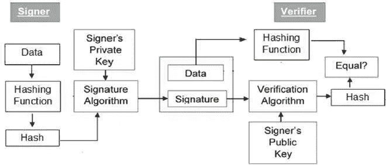
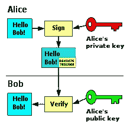

# 针对数字签名的攻击模型

> 原文：<https://medium.datadriveninvestor.com/attack-models-against-digital-signatures-b3dc1fd0513a?source=collection_archive---------8----------------------->

## 数字签名的价值及其使用所带来的影响，在适用的法规和国际规范的支持下，使我们能够建立全面、安全的解决方案来应对许多新出现的威胁。

由证书颁发机构(CA)颁发的验证数字证书是可用的。为了使用公钥，个人应该证明他/她拥有数字证书中的公钥。因此，证书思想和 ca 应运而生。它提供了一系列的应用程序，以确保完整性和显示创作者的身份。如果整个系统由于 CA 伪造证书的发行而受到有意或恶意的损害，这也是一个失败。

数字签名意味着合同是由签名人制作和签名的，并且合同没有被更改。它用于记录的不可否认性、身份验证和完整性，使用公钥加密生成。如果两方共享一个数字文档，重要的是该数据应该被加密，以便目的地理解在它被传输之后该材料没有被改变，并且所获得的文档又是由发送者生成的。

## 数字签名

数字签名是一种确保消息内容在传输过程中不被更改的机制。如果收件人手动签署文档，您可以使用您的私钥和公钥组合应用邮件内容的单向哈希。您的客户端仍然可以读取它，但是它会生成一个只能用公共服务密钥解密的签名。然后，接收方将通过服务器的加密密钥来验证发送方和消息内容的完整性。

Model of Digital Signature

该数字签名系统确保信息的三个认证特征:

**认证:**当验证者用公共发送者密钥验证数字签名时，只有具有匹配的隐藏私有密钥的发送者而没有其他人生成签名。

 [## 提高网络安全的最低成本和最有效途径|数据驱动型投资者

### 在组织在 2020 年面临的诸多挑战中，网络安全(或缺乏网络安全)已成为新闻报道的焦点…

www.datadriveninvestor.com](https://www.datadriveninvestor.com/2020/09/04/the-lowest-cost-most-effective-path-to-better-cybersecurity/) 

**不可否认:**如果有入侵者的进入和篡改，接收者端的数字签名搜索失败。修改数据的影线和测试算法产品不匹配。因此，如果数据隐私受到损害，接收方将安全地拒绝请求。

**完整性:**由于签名者只知道签名密钥，所以只能在给定的数据上生成有效的签名。因此，如果将来出现分歧，用户可以将数据和数字签名发送给第三方。

数字签名可以分为两类；

单一签名；当个人给出的生物制品的散列被确定时，首先创建加密签名，该散列被加密，并且使用发送者的私钥或公钥将该散列添加到信息中。签名数据通常可以在签名人证书的副本中找到。

多个签名；多重签名是数字签名，其中一组个人对记录或证书进行签名，使得签名只有在由每个成员形成时才有效。

Message encryption and decryption (Wikipedia)

在多重签名中，生成 n 个随机秘密密钥 k1、k2、kn 和 t 个公共密钥 t，使得:(k1+k2+…kn)*t=1 mod φ(n)

每个签名者接受消息 M，并通过 S1=Mk1 mod n 签名

n 个签名然后乘以 CA 以形成签名 S。S = S1 * S2 * Sn mod n

该签名被发送给接收者。接收者可以使用 t. M=Stmod n 来验证签名

任何成员都可以使用公钥 t 来验证原始消息。

## 针对数字签名的攻击模型

对数字签名的攻击有三种类型:

**1。选择消息攻击:**攻击者欺骗真实用户对用户通常不想签署的信件进行数字签名。入侵者然后提供原始消息和签名的数字签名的组合。这有助于入侵者生成一个合法的人需要签名的新消息，并使用以前的签名。

*1.1。在这个过程中，C 让 A 对消息进行数字签名，而 A 并不打算这么做，也不知道 A 的公钥。*

*1.2。direct choosed-method:*在这个过程中，C 理解了 A 的公钥，获得了 A 在消息上的签名，用 A 的签名替换了原来 C 的签名的消息。

**2。已知消息攻击:**在已建立的消息攻击中，C 有几个在 A 之前的消息和签名。现在 C 试图在文档 A 上创建 A 的签名，A 无意通过使用暴力技术和检查以前的数据来复制 A 的签名来签名。这种攻击与众所周知的加密明文攻击相同。

**3。仅密钥攻击:**在这种攻击中，认为受害者的身份试图从公众和攻击者那里窃取这些信息。攻击者试图创建用户。

## 引用的来源

[https://www . tutorialspoint . com/cryptography/cryptography _ digital _ signatures . html](https://www.tutorialspoint.com/cryptography/cryptography_digital_signatures.html)

[https://en . Wikipedia . org/wiki/Digital _ signature #认证](https://en.wikipedia.org/wiki/Digital_signature#Authentication)

[https://www . geeks forgeeks . org/types-of-digital-signature-attacks/](https://www.geeksforgeeks.org/types-of-digital-signature-attacks/)

[https://www . researchgate . net/publication/290543323 _ Different _ types _ of _ attacks _ on _ digital _ signature](https://www.researchgate.net/publication/290543323_Different_types_of_attacks_on_digital_signature)

[https://www . sans . org/reading-room/whites/infosec/digital-signature-multiple-signature-cases-purposes-1154](https://www.sans.org/reading-room/whitepapers/infosec/digital-signature-multiple-signature-cases-purposes-1154)

**访问专家视图—** [**订阅 DDI 英特尔**](https://datadriveninvestor.com/ddi-intel)