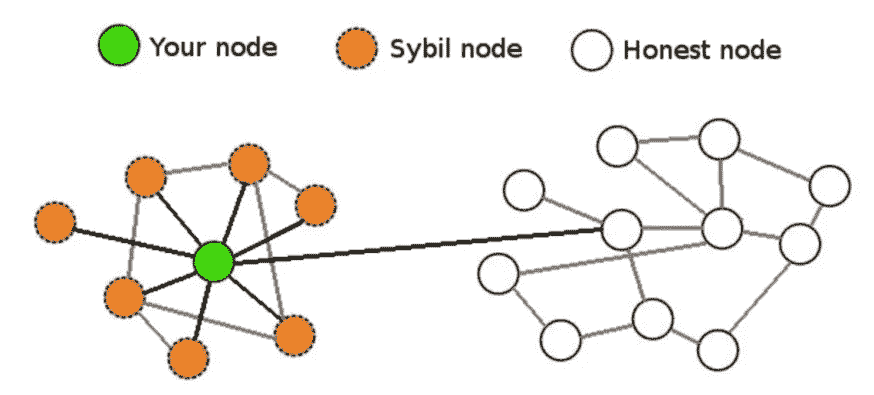
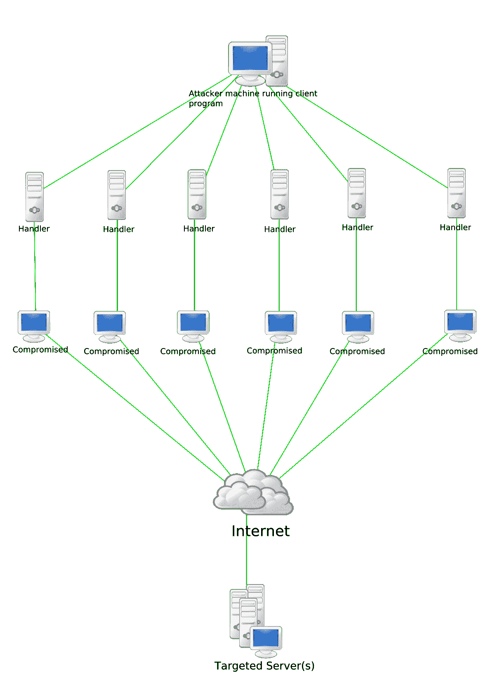

# 对比特币的攻击:神话还是现实？(带音频)

> 原文：<https://medium.datadriveninvestor.com/attack-on-bitcoin-myth-or-reality-be995b47aad8?source=collection_archive---------20----------------------->

**加密货币=加密+货币:**

*   密码意味着隐藏
*   货币意味着有一定的货币价值。

**比特币:**

*   硬币市值排名第一的加密货币。
*   首先，这是 2008 年白皮书中最初确定的使用中本聪化名的实体或个人团体。不久之后，也就是 2009 年 1 月，它被发布了。
*   它是一种点对点的在线货币，确保所有交易直接发生在网络用户之间，而不需要他们之间的任何中介。
*   用 Nakamoto 的话来说，创造比特币是为了允许直接进行在线转账，而不需要通过金融机构，直接从一方到另一方。
*   它受到 SHA-256 算法的保护，该算法属于 SHA-2 散列算法家族。这也被其比特币现金(BCH)叉和许多其他加密货币所使用。

现在，如果有可能攻击排名第一的加密货币。 ***那么个人又怎么会信任其他市值低的加密货币呢？*** 现在我们将讨论对它的一些攻击，以及比特币如何保护自己免受这些攻击。

***对比特币的攻击可以分为三种形式:***

1.  **可能有问题**

***a)*******未加密的桌面钱包****

*   *Wallet.dat 存储私钥。*
*   *如果未加密，那么如果有人可以访问您的文件系统，他们就可能成为攻击目标。*

****b)茜玻发作****

*   *它涉及一个网络节点同时操作多个身份并破坏系统权限。*
*   *这种攻击的主要目的是获得网络中的大多数权力，以在系统中执行非法行为(关于网络中制定的规则和法律)。*
*   *单个实体(计算机)建立和操作多个身份(用户帐户、基于 IP 地址的帐户)的能力。*
*   *对于外部观察者来说，这些众多的虚假身份往往是合法的唯一身份。*

**

****c)数据包嗅探****

*   *监控和处理网络中传输的所有数据包。*
*   *网络或系统管理员嗅探器用于网络流量管理和故障排除。,*
*   *这些嗅探器安装在设备的硬件或软件中。*
*   *恶意攻击者可以通过放置针对某个节点的数据包嗅探器来收集和分析所有网络流量。*
*   *如果有人因为任何原因可以通过 Wireshark 这样的软件看到我们的互联网流量，那么这个人就会看到交易是从哪里发起的。*
*   *现在攻击者将渲染西比尔攻击。*
*   *使用 TOR，没有人可以映射我们的地址。如果是外面的人在映射，那就没有任何意义了。*

****d)拒绝服务攻击****

*   *网络攻击，攻击者试图通过暂时或永久中断连接到互联网的主机的服务，使目标用户无法访问计算机或网络资源。*
*   *拒绝服务通常是通过用不想要的请求淹没目标计算机或资源来克服网络并避免执行任何或所有有效请求来实现的。*

**

***2。大概没问题***

****a)破解密码术****

*   *SHA-256 或公-私加密在将来可能会被破坏。*
*   *为了解决这个问题，我们可以构建一个升级到新散列函数的客户机。*

****b)分割****

*   *无论出于何种原因，当互联网在某个特定位置关闭时，外部发生的交易将无法到达该位置的区块链交易。*
*   *如果条件正常化，那么外部的区块链将超过内部的区块链。*

****c) 51%攻击****

*   *51%攻击是对区块链网络的一种可能的攻击，在这种攻击中，一个人或一个组织可以操纵大部分散列率，可能造成网络中断。*
*   *在这种情况下，入侵者可能有足够的挖掘能力来故意排除或改变事务的顺序。*
*   *他们甚至可以撤销他们在控制时所做的购买——导致双重支出危机。*

**

***3。绝对不是问题***

****一)丢失的硬币****

*   *如果人们因为任何原因丢失了他们的 BTC，或者他们可能忘记了他们的私钥。*
*   *但是我们知道 BTC 的可用性是恒定的。*
*   *所以当需求很高，而可用性很低的时候。那么加密空间会产生混乱。*
*   *解决方法是我们可以把每个 BTC 分解成更多的小数位。*
*   *As 1 BTC 可以拆分成 100 M 的 satoshi。精度可以用小数点来加强。然而，通胀不会上升。*

****b)猜测别人的私钥****

*   *这几乎是一项不可能完成的任务。*

*希望你喜欢。*

*希望得到积极的回应。*

*请关注我的@Medium 简介 [Yash Kamal Chaturvedi](https://yashkamalchaturvedi.medium.com/)*