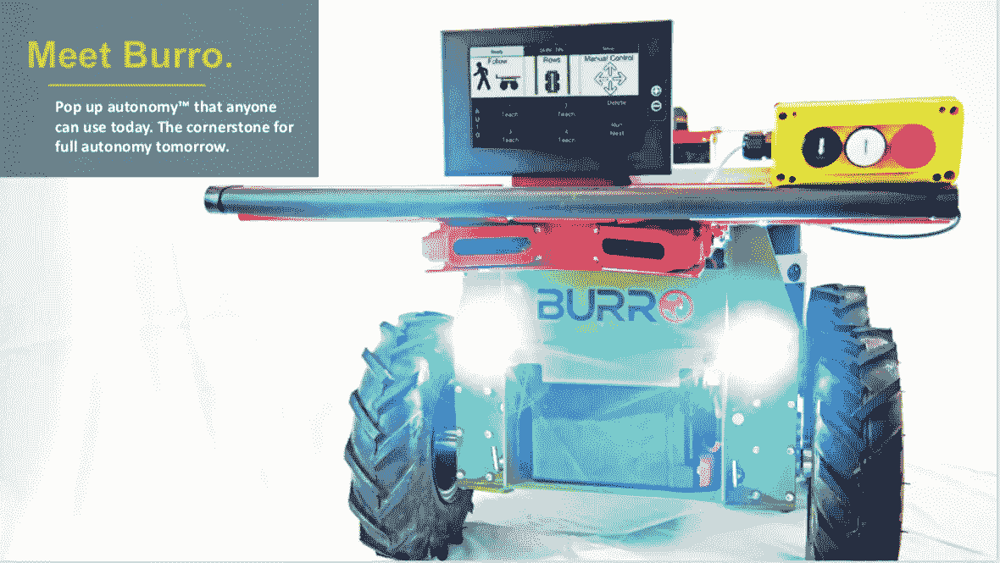
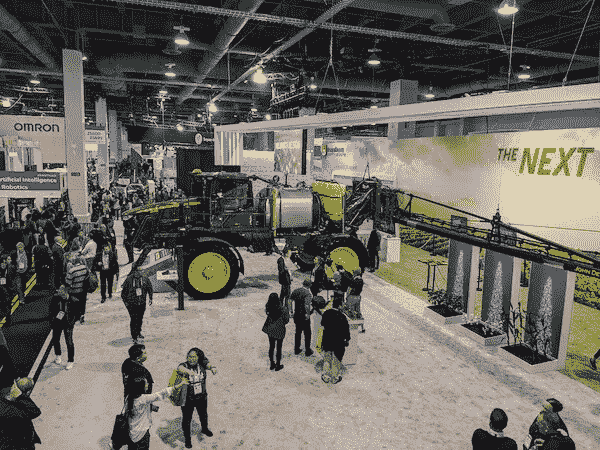
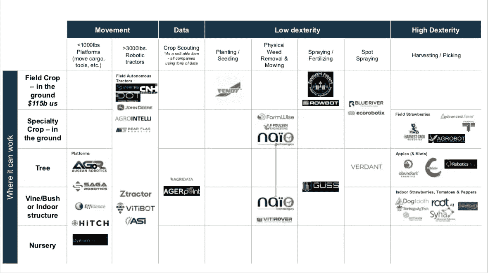
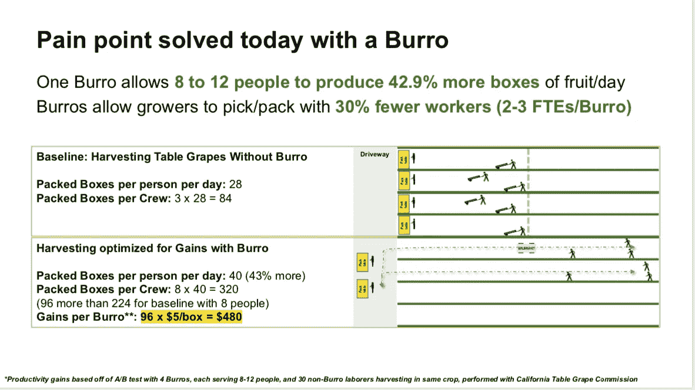
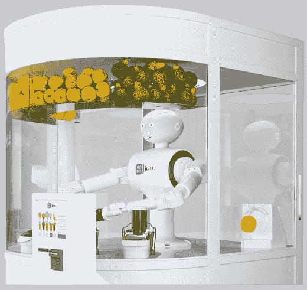
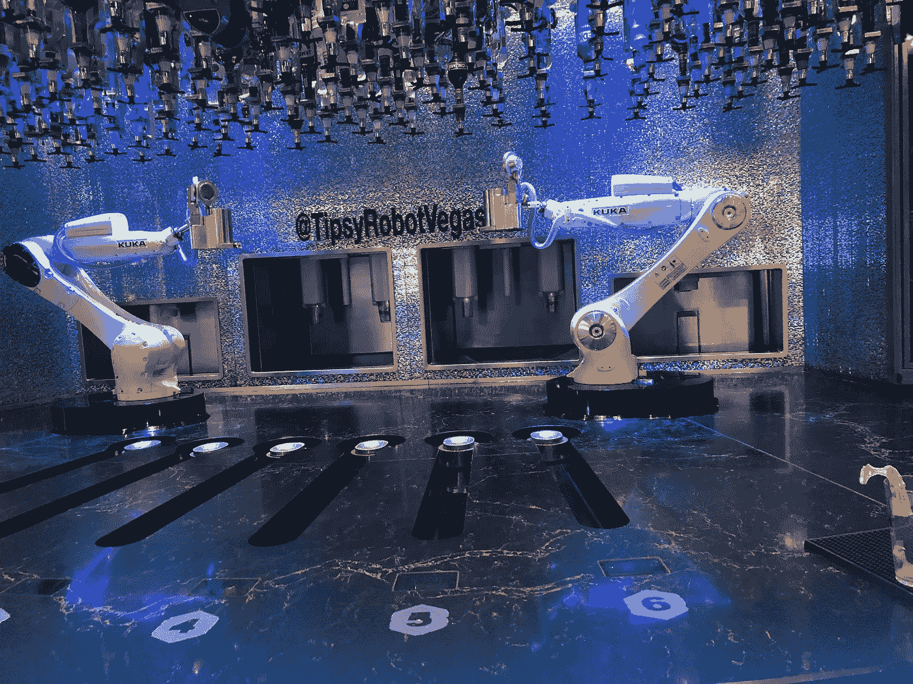

# 奥吉安机器人:从农场到餐桌的食品生产机械化

> 原文：<https://medium.datadriveninvestor.com/augean-robotics-mechanizing-food-production-from-farm-to-table-253e92a50bf1?source=collection_archive---------12----------------------->

它跨度超过 120 英尺，占据了拉斯维加斯会议中心已经过度拥挤的机器人部分的相当大的面积，让许多人想知道，“拖拉机在 [CES](https://robotrabbi.com/2020/01/13/ces2020/) 上到底在做什么？”自从[以 3.05 亿美元收购人工智能初创公司 Blue River Technologies】以来，John Deere 一直将未来押注于数据驱动的农业。John Deere 的 Laurel Caes 在解释巨大的绿色联合收割机出现在展厅的原因时表示:“这是一个很好的机会，技术行业的人可以参观这些机器，了解更多关于他们的食物是如何生产的，以及技术在将食物端上餐桌方面发挥的重要作用。"](https://www.theverge.com/2017/9/7/16267962/automated-farming-john-deere-buys-blue-river-technology)

上个月，我在机器人实验室[接待了来自](https://www.meetup.com/RobotLab/) [AGR Augean Robotics](http://www.augeanrobotics.com/company.html) (一家 [ff VC](http://ffvc.com/) 投资组合公司)的查理·安德森(Charlie Andersen)，深入了解农业技术市场。安德森从商学院毕业后曾在迪尔最大的竞争对手凯斯纽荷兰公司工作，作为一个多代农场的孩子，他对这个行业了如指掌。在为 CHNi 分析了 Blue River 和更广泛的无人驾驶市场后，他“得出结论，autonomy 是农业领域新市场颠覆的力量，这意味着它是创业公司最适合商业化的力量，所以我决定创办一家专注于农业的机器人公司。”

AGR 是少数几个真正在田间工作的系统之一，而其他新贵仍在室内修修补补。安德森感叹道，“大约 200 万个美国农场每年产生约 4000 亿美元的收入——按收入计算，一半的产出是农作物，一半是牲畜。”在他看来，牲畜和谷物生产已经走上了完全自动化的轨道。畜牧业生产通常是相当机械化的，在某些情况下是自动化的(例如机器人挤奶室)。同时，大约四分之一的美国农产品是谷物——玉米、大豆、小麦等。像棉花这样的其他大田作物——这些作物非常机械化，生产过程中几乎不需要劳动力——这就是迪尔、CNHi、[、久保田](https://www.kubotausa.com/)、 [AGCO](https://www.agcocorp.com/) 和其他公司集中营销和研发资金制造更大/更好的拖拉机、联合收割机、喷雾器等的地方，”Augean 的首席执行官认为。这使得占劳动力 88%的特殊作物生产(如浆果、果园和蔬菜)成为易受干扰的低挂水果。安徒生画了一幅老年农民的肖像，他们在不断增加的开销和微薄的利润中挣扎，迫使许多业主卖掉他们的家庭地产，将生产转移到中南美洲。他分享道，“总的来说，随着全球人口的增长，对食品的需求也在增长——人口增长的讽刺之处在于，随着地球上的人口越来越多，农民越来越少，为农民工作的人也越来越少。因此，从劳动力到水、化肥到机械，各方面的投入越来越昂贵和稀缺，总的来说，种植者希望用更少的资源做更多的事情。”根据安德森的评论，机器人不仅仅是最新的设备，它可能是美国农业经济的救星。

尽管许多金融分析师预测农业科技将实现超级增长，但目前的现实受到漫长的销售周期和艰难的运营环境的阻碍。正如安德森所解释的，“在挑战方面，美国农民的平均年龄是 58 岁，这些年龄的上升与整合和越来越少的大型经营者相关。同时，这些条件通常对自主性非常具有挑战性，机器人必须一次又一次地面对和处理照明/天气/场地可变性/严酷性，每个行业的多样性使得寻找具有大型 tam 的行业非常困难，并且开发从一个行业扩展到另一个行业的解决方案非常困难。”与此同时，机会可能比其他自主领域更大，因为无人驾驶农用车辆能够在没有法规、行人和其他障碍的情况下立即绕过工人。

AGR 的方法不是取代人类，而是通过给农场工人配备被称为美洲驴的机械驴来缓解当今农学效率低下的问题。“我们正在做一些不同的事情，”这位企业家自豪地说，“采取逐步或分阶段的方法实现完全自主，首先是一个名为 Burro 的协作机器人平台，它可以帮助人们提高工作效率，收集大量数据，随着时间的推移，可以模块化地扩展到各种不同环境下的完全自主农业，我们今天就可以进入市场，而不是 5 年后。”在观察了鲜食葡萄是如何采摘和收集的之后，安德森推出了一辆自动驾驶的独轮车，可以在葡萄园中自动驾驶，作为收割机的购物车。他进一步阐述道，“我们发现，就像亚马逊仓库中的 Kiva 系统一样，如果你在田间运输中实现自动化，你就可以让从事采摘等高价值/高灵活性工作的人变得更加高效——一个 10 人的团队在我们的机器人来回运行的情况下收获鲜食葡萄，每天可以多采摘 40%的水果，因此我们的一个机器人的回报期仅为 30 和 40 天。”从长远来看，他希望将他在鲜食葡萄方面的成功转化为其他劳动密集型作物，如浆果和果园水果。事实上，作为一家初创公司，他最大的担忧是扩大团队规模以满足需求。“每一个购买我们机器人的种植者都开始询问 5 个其他用例，通常是在不同的作物上，我们没有想象我们的驴子会进入，我们必须确保我们的自主功能在任何地方都一致可靠地运行，”这位首席执行官打趣道。他设想在未来几年内，一个机器人群体将形成一个完整的农业物流平台，“在 5 年内，我看到我们的美洲驴机器人将形成核心 API，用于许多未来人们喜欢的特种作物的自主任务。通过掌握在复杂的农业环境中从 A 点移动到 B 点的过程，借助强大的模块化自主平台，我相信我们正在构建一个工具携带平台，可以实现自主采摘、修剪、除草、定点喷洒和许多其他任务。”

安德森的愿景被许多其他机器人专家所接受，他们看到了从农场到餐桌的物流解决方案。上个月，我被介绍给 RoboJuice，这是果汁吧老板 Mikalai Sakhno 的一项美味发明。用首席执行官 Igor Nefedov 的话说，“我意识到食品自动化是不可避免的未来，我想参与这一变革。”Nefedov 声称，“我们的冰沙会更便宜，质量更高，而且不需要等待。”鉴于最近机器人衰退的口水仗，如 [Zume 披萨，Creator(汉堡包)和 CafeX](https://sf.eater.com/2020/1/8/21056918/sf-robot-food-apocalypse) 社会可能还没准备好把厨房交给机器人。奈菲多夫反驳道，“我们使用类似人类的机器人，因为科学证明，人们更喜欢看起来像他们的机器人……人们最终会建立一种情感联系……这将驱动回头客。”RoboJuice 仍处于建设模式，计划在今年晚些时候开设第一个展台，展示其特许经营概念。与此同时，在上个月的 CES 上，一个繁忙的拉斯维加斯夜晚，我路过了一个完全空无一人的自动化酒吧，[微醺机器人](http://thetipsyrobot.com/)。当问女主人有什么好酒时，她回答说，这家赌场的夜总会的酒保做的莫吉托鸡尾酒很棒。

*想了解更多关于服务机器人的信息？本周三，请和我一起在 VentureOut，*[*RSVP*](https://v-o.io/2SEqNVd)*上，与*[*promo bot*](https://promo-bot.ai/)*的 Oleg Kivokurtsev 一起深入了解这个行业。*

 [## 模式和机器人:复杂的现实

### 哈耶克的名著《复杂现象理论》(哈耶克，1964)深入探讨了复杂性的话题，并断言…

www.datadriveninvestor.com](https://www.datadriveninvestor.com/2019/03/04/patterns-and-robotics-a-complex-reality/)