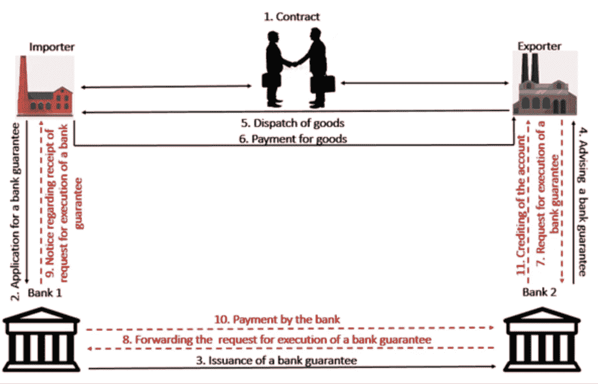

# 澳大利亚首次在金融服务领域大量使用区块链技术

> 原文：<https://medium.datadriveninvestor.com/australias-first-significant-use-of-blockchain-technology-in-the-financial-services-sector-ec03f35b8234?source=collection_archive---------16----------------------->

Source: [Procreditbank.med](https://www.procreditbank.md/files/images/garantia%20en.png)

一个 [2 分钟的视频](https://youtu.be/oRGcdQsD4rw)介绍区块链技术在澳大利亚金融服务领域的首次大规模应用

区块链技术在金融服务领域的第一次值得注意的应用是由 ANZ 和英联邦银行、Scentre Group(运营 Westfield 购物中心)和西太平洋银行支持的一个名为 Lygon 的[项目，由 IBM 在 hyperledger 区块链上提供支持。](https://www.lygon.io/)

然而，颇具讽刺意味的是，根据[城市词典](https://www.urbandictionary.com/define.php?term=2%2B2)的说法，Lygon 是"*一个智力有限或极低的人，在他们最好的一天也不知道如何处理等式*[*2+2*](https://www.urbandictionary.com/define.php?term=2%2B2)*=…*"让我们希望一个处于数字技术前沿的项目不要纠结于这种令人兴奋的计算，否则它的智能合同将看起来不那么“智能”

Lygon 是一个基于区块链的平台，计划用数字替代方案取代政府、建筑和能源行业使用的纸质担保。

 [## 区块链投票和美国选举|数据驱动的投资者

### 在不到 70 天的时间里，这个世界上最古老的民主国家将以前所未有的方式面临最大的摊牌…

www.datadriveninvestor.com](https://www.datadriveninvestor.com/2020/08/26/blockchain-voting-and-the-american-elections/) 

Lygon 声称，它可以提高提供银行担保的效率，将时间从一个月减少到一天。Lygon 主席 Nigel Dobson 说:"*在将银行保函数字化的过程中，我们实质上改变了一个三方合同。我们已经将文书工作、流程及其背后的合法性数字化了…..包括大幅降低银行担保的数十亿美元的欺诈风险，降低出错的可能性，提高执行速度*

这是集体资本主义的又一个例子，即三家相互竞争的银行联合起来，为它们的客户和它们自己解决一个共同的问题。

它还展示了区块链技术如何被用于建立一个新的数字基础设施，以提高效率，降低业务风险和加强合规控制，而不是用于销售产品的技术

给你带来的数字字节，如果你想收到你的每周版有更多的文章，像这封电子邮件 info@teamblockchain.net

**#区块链#银行# bank #西太平洋银行#金融服务# IBM # Hyperledger #澳洲#风险#合规**

**访问专家视图—** [**订阅 DDI 英特尔**](https://datadriveninvestor.com/ddi-intel)