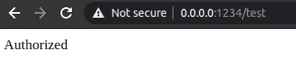
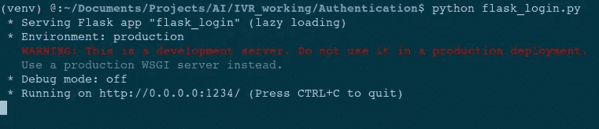
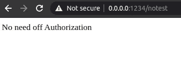
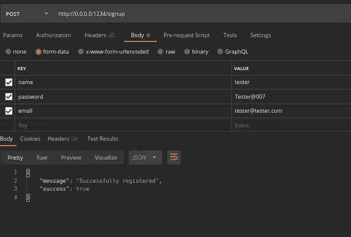
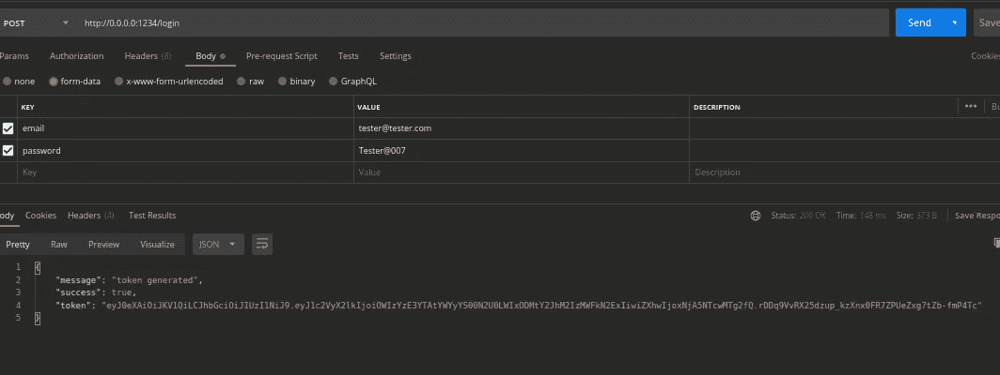
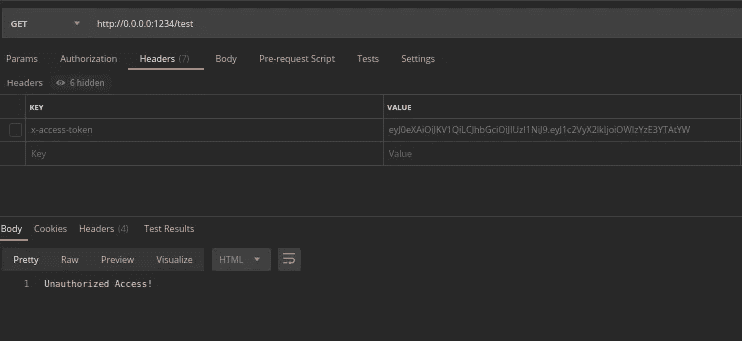
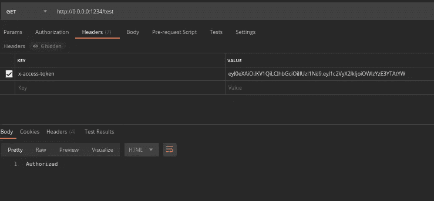

# 使用 Json Web 令牌的身份验证 Flask API

> 原文：<https://medium.datadriveninvestor.com/authentication-flask-api-using-json-web-tokens-50104f2f1533?source=collection_archive---------1----------------------->

## 使用 JWT-Python 进行身份验证的简单 flask 应用程序

Photo by [Markus Spiske](https://unsplash.com/@markusspiske?utm_source=unsplash&utm_medium=referral&utm_content=creditCopyText) on [Unsplash](https://unsplash.com/s/photos/authentication?utm_source=unsplash&utm_medium=referral&utm_content=creditCopyText)

在这个故事中，我们将看看如何在 flask python 中使用 flask 登录进行认证和授权。认证意味着你验证某人的凭证，而授权则决定他们是否可以访问网站的某个部分。

让我们弄清楚它是什么。

首先让我们浏览一下我们将在本教程中使用的**库**。

1.  使用的库

Flask : Flask 是一个流行的 Python web 框架，这意味着它是一个用于开发 web 应用程序的第三方 Python 库。

**uuid** : UUID，通用唯一标识符，是一个 python 库，帮助生成 128 位的随机对象作为 id。

**Werkzeug**:*Werkzeug*是 python 库，其中包含了大量用于实现 web 应用程序网关接口(`WSGI`)应用程序的开发和调试工具。在本教程中，我们使用它来生成和检查密码散列。

PyJWT : `PyJWT`是一个 Python 库，允许你编码和解码 JSON Web 令牌(JWT)。

**functools** : functools 是高阶函数(作用于或返回其他函数的函数)的标准 Python 模块。`wraps()`是一个装饰器，应用于装饰器的包装函数。它通过复制诸如`__name__`、`__doc__`(文档字符串)等属性来更新`wrapper`函数，使其看起来像`wrapped`函数。

 [## 使用 Python |数据驱动投资者的名称匹配技术

### 我们确实面临很多情况，我们必须匹配一个有很多变体的单词。这可能是因为错别字…

www.datadriveninvestor.com](https://www.datadriveninvestor.com/2020/12/07/name-matching-techniques-with-python/) 

**py mongo**:py mongo 发行版包含从 Python 与 MongoDB 数据库交互的工具。

现在让我们创建一个简单的 flask 应用程序，它有两条路线。因为这是一个教程，所以一个路由可以不经过认证而被访问，但是另一个路由需要认证。

在这里你可以看到，当我运行这个烧瓶应用程序。我可以进入两条路线。见下图。

Generated By Author

现在我应该添加身份验证和授权。第一步是创建一个注册 API。

我们请求将`name, emailid and password`作为 API 中的表单数据。我们还增加了一些验证电子邮件格式和密码的功能。现在，通过使用`uuid`和`werkzeug`，我们添加了一个唯一的`userid`，并为用户提供的密码生成了一个散列。所有这些都用 pymongo 保存到`mongodb`。

Generated By Author

现在创建一个**登录** API 来生成 jwt 令牌。

这里我们创建了一条路线`/login.`，将`emailid, passwords`作为输入。首先，评估电子邮件 id，并检查是否有具有相同电子邮件 id 的用户。之后，使用`check_password_hash`函数对用户密码和输入密码进行哈希运算和检查。如果一切正常，`jwt.encode`方法生成一个在`‘exp’`时间内有效的令牌，我们将它作为参数提及，为了创建令牌`userid`，必须给出一个`secretkey`作为参数。这个密钥可以是任何数字。

Generated By Author

现在这个令牌可以用于授权。之前，我们创建了两个 API 路由。一个需要认证，另一个不需要。但是我们如何给 API 路由添加授权呢？

注意，我们需要认证的一个 API 添加了一个`@token_required`装饰函数。上面也写了这个函数。它实际上检查 request.headers 部分中的“x-access-token”。这将检查 API 的授权。现在运行它并查看它。

Generated By Author

Generated By Author

请通过 gihub repo 获取完整的代码库。

 [## raoofnaushad/authentic ation _ flask _ API _ jwt

### 使用 JWT-Python-raoofnaushad/authentic ation _ flask _ API _ jwt 验证的简单 flask 应用程序

github.com](https://github.com/raoofnaushad/authentication_flask_api_jwt) 

希望这个故事对你们所有人有用。谢谢你的时间。

访问专家视图— [**订阅 DDI 英特尔**](https://datadriveninvestor.com/ddi-intel)