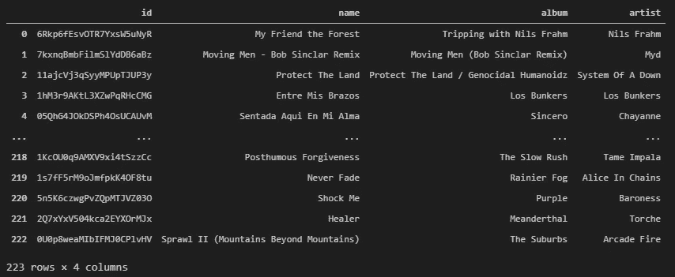
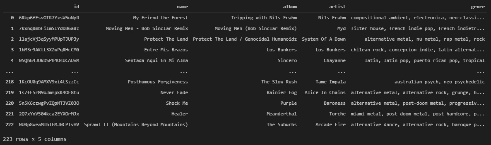

# 自动将用户保存的曲目按流派添加到 Spotify 上的播放列表

> 原文：<https://medium.datadriveninvestor.com/automate-the-process-of-adding-your-users-saved-tracks-by-genre-to-playlists-on-spotify-d6402da60285?source=collection_archive---------11----------------------->

停止在 Spotify 上将曲目逐个添加到您的播放列表中！！。

Photo by [Puria Berenji](https://unsplash.com/@ipuriagram?utm_source=unsplash&utm_medium=referral&utm_content=creditCopyText) on [Unsplash](https://unsplash.com/s/photos/spotify?utm_source=unsplash&utm_medium=referral&utm_content=creditCopyText)

我认为自己是一个音乐爱好者，我通常在做日常活动的时候花大部分时间听音乐。因此，我一直在播放许多不同的播放列表，当我喜欢一首新曲目时，我会立即将其保存到我在 Spotify 上的用户库中。但这样做的主要问题是，当一年结束时，我总是会在我的用户库中完成大量的音乐，而不是这样，我可以根据每个曲目的音乐类型将所有这些新音乐保存在不同的播放列表中。

这就是为什么我决定在 Python 上创建一个脚本来自动化所有这一过程，因此，与其浪费时间在我的播放列表上逐个保存歌曲，该脚本将执行这一过程，在 Spotify 上按流派保存我的不同播放列表上的曲目。

在本文中，我将解释这个脚本的工作原理以及理解如何使用它的主要概念。所以让我们开始行动吧！！。

你可以在我的 [GitHub 库](https://github.com/cristobalvch/Spotify-Music-Genres)下载所有代码和文件。

# 1.Spotify 凭据

要操作用户的媒体库和播放列表，你必须使用 Spotify API。首先，你需要访问这个[页面](https://developer.spotify.com/)，点击仪表盘部分，用你的 Spotify 账户登录，创建一个新的应用。完成所需的信息，然后您将获得您的客户端 Id 和客户端密码来使用 API。您将需要以下值来使用此过程所需的 Spotify 上的所有工具:

*   **客户端 Id** :要获取，请在 Spotify 开发者页面上创建一个新应用。
*   **客户机密**:要获取，在 Spotify 开发者页面上创建一个新应用。
*   **用户名**:如需获取，请在 Spotify 桌面应用程序上打开您的个人资料，点击“分享”并复制 Spotify URI。
*   **重定向 URL** :指定 Spotify API 批准您的凭证时要重定向的 URL。我通常使用本地主机。" http://localhost:8888/callback "

一旦有了所有这些值，就需要将它们保存到位于文件[***utils . py***](http://github.com/cristobalvch/Spotify-Music-Genres/blob/main/utils.py)中的变量 CLIENT_ID、CLIENT_SECRET、REDIRECT_URI 和 USERNAME 中。

你会注意到文件[***genre-analysis . ipynb***](https://github.com/cristobalvch/Spotify-Music-Genres/blob/main/genre-analysis.ipynb)*有一个函数叫做带有一些变量的凭证，这些变量是:*

*   ***sp** :访问 Spotify 上曲目的数据和功能的认证。*
*   ***spt:** 认证访问 Spotify 上的个人资料库。*
*   ***spp** :在 Spotify 上操作个人播放列表的认证。*

# *2.下载已保存曲目的数据*

*本文的第二部分包括下载用户已保存曲目的以下功能:*

*   ***id**:Spotify 的曲目 id。*
*   ***名称:**曲目的标题。*
*   ***专辑:**专辑的曲目名称。*
*   ***艺人:**曲目的艺人名称。*

*这些功能将在您需要获取曲目的音乐流派时使用。然后，您将通过执行函数 *get_saved_song_ids* 和*get _ features _ saved _ songs*获得所有这些功能。在我的例子中，我获得了保存在用户资料库中的 223 首曲目，显示在以下数据帧中:*

**

*DataFrame with Tracks Saved on Spotify (Photo by Author)*

# ***2.1。奖励:从播放列表下载曲目***

*我扩展了函数 *get_saved_song_ids* 的范围，以包含一个选项来下载任何播放列表的曲目 id。如果您想使用它，您只需要聚集下面定义的参数:*

*   ***playlist_id** :您想要下载的播放列表的 id。要获得打开的 Spotify 桌面应用程序，请搜索您的播放列表，点击共享并复制 Spotify URI。你要去掉字符的粗体部分，如下:**【Spotify:playlist:】**3 u1krdahox 5 znkwxbvaavd*
*   ***is_playlist** :你应该指定“True”，这样函数就会理解你传递的是关于播放列表的信息，而不是用户保存的曲目。*

* [## 如何用 Python |数据驱动投资者构建 Twitter 抓取应用

### 每秒发出约 6000 条推文，每天发布 5 亿条推文，普通人甚至不能…

www.datadriveninvestor.com](https://www.datadriveninvestor.com/2020/12/01/how-to-build-a-twitter-scraping-app-with-python/) 

# 3.查找已保存曲目的音乐类型:

Spotify API 没有任何与标记每个曲目的音乐流派相关的功能。取而代之的是，API 为艺术家和专辑标记音乐流派。这就是为什么我们需要为每个音轨存储上述所有信息。

所以我创建了一个名为*finding _ music _ genre _ on _ Spotify*的函数，你需要将数据帧和所需的认证作为参数传递。值得一提的是，这个函数需要一点时间来完成它的过程。该功能将创建一个名为“流派”的新列，其中包含与每个曲目的专辑或艺术家相关的所有音乐流派。我获得了下一个信息:

DataFrame with Tracks and Music Genres on Spotify (Photo by Author)

最后，为了防止音乐流派出现任何类型的空值，我创建了一个代码，该代码基于具有相同艺术家或专辑的音轨的数据帧来使用音乐流派。

# **3.1。额外收获:在维基百科上寻找音乐流派**

如果你不能使用上面的功能找到你的曲目的所有音乐流派，并且你仍然有空值，我创建了另一个名为*find _ music _ genre _ on _ Wikipedia*的功能。该函数执行与其他函数相同的过程，但在维基百科上搜索信息，并将结果与文件**[***musicgenresdata . txt***](https://github.com/cristobalvch/Spotify-Music-Genres/blob/main/musicgenresdata.txt)上的音乐流派进行比较，以提取与每个曲目的特定音乐流派相关的词。**

# **4.将保存的曲目添加到您的播放列表中！！**

**最后，找到所有音乐类型后，您可以开始将曲目添加到目标播放列表中。在我的例子中，我创建了 4 个播放列表，所以我必须获得这 4 个播放列表的 Spotify URI。播放列表包括:**

*   **金属播放列表。**
*   **摇滚播放列表。**
*   **流行音乐播放列表。**
*   **冷却播放列表。**

**使用功能*add _ music _ to _ playlist _ genre，您可以根据曲目的类型添加您想要的所有曲目。该功能有以下参数:***

*   ****df** :包含所有轨道信息的数据帧。**
*   ****用户名**:你的用户名的 Spotify URI(在本文的 Spotify 凭证部分定义)。**
*   ****流派**:您要添加的曲目流派。**
*   ****playlist_id** :目标播放列表的 Spotify URI。**
*   ****spp** :播放列表操作的认证(在本文的 Spotify 凭证部分定义)。**

**在播放列表中添加曲目时，必须提及两个要求:**

*   **您必须"**公开**"您的目标播放列表(转到您的播放列表，点击共享，然后点击公开)。**
*   ***add _ music _ to _ playlist _ genre****返回*一个新的数据帧，其中删除了您添加到播放列表**中的曲目的信息。原因是为了防止不同播放列表上的重复曲目，因为有些曲目有不止一种音乐流派。**

**在我的例子中，我将所有音乐类型为“Metalcore”的曲目添加到金属播放列表中。我还在摇滚播放列表中添加了“艺术摇滚”曲目，在冷播放列表中添加了“环境”曲目。**

**我建议您在将一些曲目添加到不同的播放列表后保存数据帧，以便在您的用户库中有很多曲目的情况下，您不会在每次决定运行脚本时都有重复的歌曲！。**

**我希望这篇文章可以帮助你自动化你的 Spotify 桌面应用程序，也可以扩展你的知识，寻找新的想法，继续使用 Python 和数据分析工具自动化任务。**

**如果你想听我用这个脚本创建的摇滚播放列表，你可以点击下面的链接。**

# **我的其他文章:**

** [## 如何分析你最喜欢的音乐艺术家的歌词的情感和文字

### 使用 Python 对歌曲歌词进行文本和情感分析的有趣方式。

towardsdatascience.com](https://towardsdatascience.com/how-to-analyze-emotions-and-words-of-the-lyrics-from-your-favorite-music-artist-bbca10411283)  [## 从电脑的音乐文件夹中自动播放 Spotify 上的播放列表。

### 将音乐文件导出到 Spotify 播放列表的有趣方式。

medium.com](https://medium.com/datadriveninvestor/automating-playlists-on-spotify-from-the-music-folders-of-your-computer-c79060eadab2)  [## 用深度学习预测一首歌的音乐情绪。

### 一个很酷的方法来预测音乐曲目的情绪与神经网络模型使用 Keras 和 Tensorflow 库对…

towardsdatascience.com](https://towardsdatascience.com/predicting-the-music-mood-of-a-song-with-deep-learning-c3ac2b45229e)  [## 使用 Python 和 K-Means 对音乐进行聚类，在 Spotify 上创建您的个人播放列表。

### 在 Spotify 播放列表中按相似性对歌曲进行分组的简单方法。

towardsdatascience.com](https://towardsdatascience.com/clustering-music-to-create-your-personal-playlists-on-spotify-using-python-and-k-means-a39c4158589a)  [## 一个在网络上工作的总线和分析的交互格式。

### 像自动化和可视化一样，这也是 Python 和 Power Bi 的主要用途。

medium.com](https://medium.com/@cristobal.veas.ch/una-forma-interactiva-para-buscar-y-analizar-ofertas-de-trabajo-en-la-web-ef9327b0a8d3)  [## 一个友好的公共汽车和分析人员在网上到达部门。

### 由于自动化的原因，很多时候需要使用 Python 和 Power Bi。

medium.com](https://medium.com/@cristobal.veas.ch/una-forma-genial-para-buscar-y-analizar-arriendos-de-departamentos-en-la-web-e20727390a8c)  [## 你用电脑看报纸的新闻

### 一个有趣的形式分析了帕拉布拉斯和他的感觉，这是一个关于蟒蛇皮的新闻…

medium.com](https://medium.com/@cristobal.veas.ch/c%C3%B3mo-hacer-reflexionar-a-tu-computador-con-las-noticias-del-pa%C3%ADs-dc14d2fc0a67) 

**进入专家视图—** [**订阅 DDI 英特尔**](https://datadriveninvestor.com/ddi-intel)***