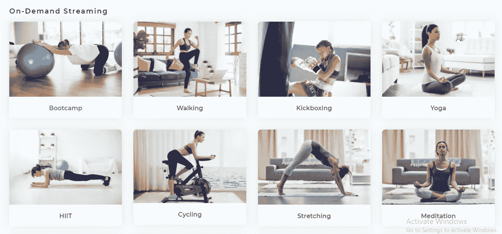
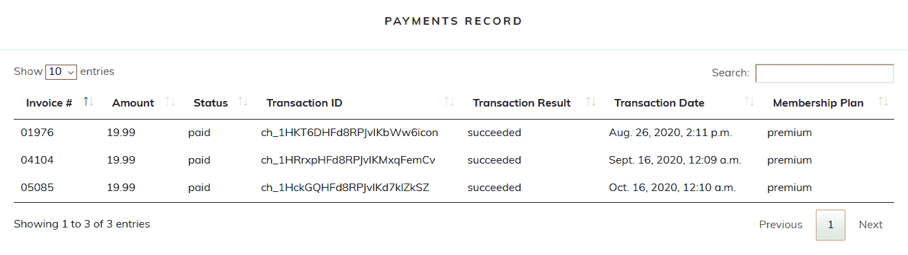

# 自动化虚拟健身

> 原文：<https://medium.datadriveninvestor.com/automate-virtual-fitness-take-payments-host-live-stream-create-on-demand-videos-3fa4cb2ba2d8?source=collection_archive---------19----------------------->

## 接受付款、主持直播和制作点播视频

## 什么是**自动化**？

词典将其定义为“使一个装置、一个过程或一个系统自动运行的技术。”它是一种允许以最少的人工输入来执行过程或程序的技术。

## **为什么您应该考虑让您的业务实现自动化？**

自动化操作带来了更高的生产率、可靠性、可用性、更好的性能和更低的运营成本。

通过引入**智能工作流程**和移除**冗余任务**，自动化在商业中的重要性对于帮助公司用更少的做更多的**至关重要。**

自动化还提高了日常运营中发生的事情的可见性，从而腾出更多时间来关注关键业务。

## **“虚拟”是什么意思？**

谷歌对“虚拟”一词的定义是:虚拟本身并不存在，而是由**软件**制造出来的，看似如此。

虚拟企业通过互联网开展全部或大部分业务。它可能有也可能没有某种物理存在，如办公室或仓库，但没有客户可以访问的物理位置。

如果你的企业中确实存在这样一个虚拟平台，那么这就是所谓的**混合商业模式**。

**虚拟健身**是运动与科技的融合。世界各地的软件公司已经迅速发现了 2020 年健身业务不断变化的问题，并正在帮助健身业务拥有自己的虚拟平台，这可能会成为后大流行时代的游戏规则改变者。

现在你已经准备好理解“**自动化虚拟健身**这个完整术语的意思了。这是一个虚拟平台，为您的健身业务，其中业务运作是自动化的。

Inqline 是一家软件公司，它注意到了 2020 年不断变化的健身趋势，并推出了 Inqline Fit 平台。本文将讨论 Inqline Fit 平台的三个方面，这些方面可以彻底改变任何健身业务。

## **实时流健身课程**

流式传输是从服务器到客户端的音频或视频文件的连续传输。通过流式传输，在客户端设备上播放的媒体文件被远程存储，并通过互联网一次传输几秒钟。

目标是消除将整个视频下载到客户端设备上进行播放的需要。播客、网络广播、电视节目、电影和音乐视频是流媒体内容的常见形式。

**流媒体直播**是指视频流通过互联网实时发送，无需先录制和存储。

想想**常规流媒体**和**直播流媒体**之间的区别，就像演员背诵记忆的独白和即兴演讲之间的区别。

在前者中，内容被预先创建、存储，然后传递给观众。在后者中，观众在演员创作内容的同时收到内容，就像在直播中一样。

直播通常指的是**广播**直播:一对多的连接，一次发送给多个用户。

在冠状病毒全球疫情期间，世界各地的许多健身企业和健身教练已经在 Zoom、Instagram、脸书等平台上开始了直播健身课程。

通过在此期间与您的客户保持联系，您可以让您的客户确信他们需要您来实现他们的健身目标。

为了在 Zoom 上实时播放锻炼课程，健身企业的健身教练通常会在每次举办课程时生成一个唯一的链接。点击此链接将会引导您进入实时流会话。它会通过电子邮件发送给所有参加会议的成员。

请注意，整个过程容易出现错误和重复的任务，这对健身教练和会员来说都是令人沮丧的。

每当主持人必须主持直播流会话时，主持人必须生成新的缩放链接，并且成员必须在他们的电子邮件收件箱中搜索来自他们的教练的具有正确缩放会话链接的最新电子邮件。

为每个会话发送一个新的 Zoom 链接会让会员的收件箱被 Zoom 链接邮件淹没，每封邮件在直播会话结束时都变得毫无用处。

对于主持人来说，在开始会话之前长时间等待大量成员加入会话可能是令人沮丧的，这些成员可能只是从他们的收件箱中点击了错误的链接来加入。

为了避免这样的问题，Inqline Fit 自动完成了这一过程。一旦会员在虚拟平台上登录他们的帐户，他们就会看到一个界面，其中显示了每个实时会话的所有详细信息，如下图所示。

上图是从 Inqline Fit 中截取的片段。将显示每个实时会话的详细信息。到了实时健身课程的时间，“等待中”状态会变为“加入课程”，点击此按钮将引导您进入实时课程。

## **点播视频**

视频点播(VOD)基本上与直播相反，它允许用户在任何合适的时间从任何连接互联网的设备上观看视频。

一些著名的基于互联网的视频点播系统有网飞、Hulu、Disney+和 YouTube。YouTube 采用广告资助模式，用户可以免费获得大部分视频内容，但必须为优质内容支付订阅费。

对于点播视频，Inqline Fit 使用 YouTube。会员一登录就提供给他们的界面也有详细信息和选项，可以点击将他们导向 YouTube 视频。

## **录制的直播会话可以作为点播视频上传**

成员可能会因为繁忙的日程安排而错过他们的直播会议。缩放允许您记录每个会话并保存它，以便错过实时会话的任何人都可以访问它的记录。

同样，这个过程容易出错，并且由重复的任务组成。主持直播课程的讲师将负责录制、上传并向成员提供录制的直播课程。

讲师可能会忘记在直播开始时按下“录制”按钮。因此，当天的会议将有一个不完整的记录提供给可能错过现场会议的成员。

讲师必须在他们的计算机上搜索正确的会议记录文件，并上传一个名称，该名称应允许成员识别它是哪个会议的记录。

Inqline Fit 通过自动化消除了整个流程中的人工输入需求。直播会议会自动保存在服务器上，并从那里上传到 YouTube 上作为点播视频，所有成员都可以访问。

由于它托管在 YouTube 上，只有会员才能在 qline Fit 平台上观看视频，因为这些视频被列为私人视频。零服务器成本就可以上传无限量视频。

## **Inqline Fit 允许使用 Stripe 收款**

如果会员用现金支付或将钱存入你的银行账户，很难收集和保存每个会员的付款记录。此外，会员不能查看自己的付款记录。

Inqline Fit 自动收集付款和记录。它允许会员用信用卡支付。会员所要做的只是在虚拟平台上输入他们的信用卡详细信息，以进行首次支付，这些详细信息将被保存下来，供后续支付周期使用。

Stripe 是一家为互联网构建经济基础设施的科技公司。从新创公司到上市公司，各种规模的企业都使用他们的软件来接受支付和管理在线业务。

会员可以在平台上查看他们的付款记录，如下面的代码片段所示。

# **结论——虚拟平台现在对获得竞争优势至关重要**

根据一项调查显示，一旦疫情结束，59%的美国人不打算更新他们的健身会员资格。健身房老板可能会努力让会员回到大流行后的世界。

那些投资了虚拟平台的人已经设法在这些充满挑战的时期挽救了他们的健身业务，并有可能在未来几年的竞争中处于领先地位。

现在，会员的需求将会多样化。有些人更喜欢虚拟健身的便利性和安全感，而有些人则喜欢团体健身提供的社区和团队意识。有些人会选择两者兼而有之。