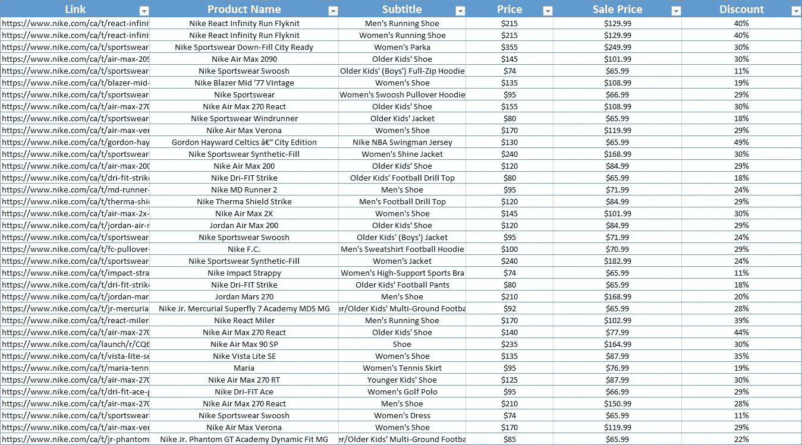
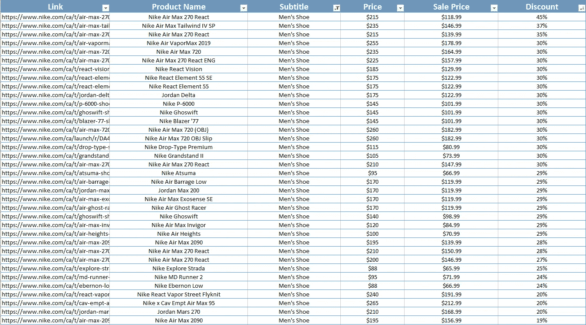
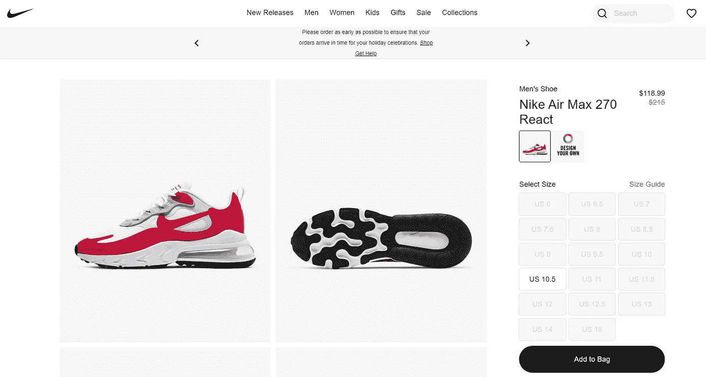

# 如何使用网络信息搜集让你的生活自动化

> 原文：<https://medium.datadriveninvestor.com/automate-your-life-using-web-scraping-a063ae6008a3?source=collection_archive---------1----------------------->

## 我将向你展示 3 种节省时间的独特方法，使用网络抓取

Photo by Nicole Wolf from [Unslpash](https://unsplash.com/photos/-xTBn1YBrTE)

你知道你现在读的是什么数据吗？

对你来说，这可能只是几个词，但在后端，你在网上阅读的所有内容都是可以被提取、分离和操作的数据。

简而言之，这就是**刮网器**的功能。

他们浏览为创建网站而创建的代码(HTML 代码),并获取他们想要的数据。Web Scrapers 还使用代码来点击按钮、向输入框发送文本以及自滚动，从而与网页进行交互。

如果你不知道什么是 Web Scraper，那么现在你有了一个想法，我们可以进入你为什么阅读这篇文章的要点。

**时间到了！**

时间是每个人最有价值的资产，而人们经常花费这笔资产去做他们不喜欢的事情。

但是如果你不需要。如果你能让你的电脑处理所有你不想自己做的事情，那会怎么样？

你看，网络抓取是一种独特的技能，可以帮助你的生活自动化，并不像听起来那么困难。

事实上，我将向您展示的所有示例只需要不到 **50** 行代码，只需几个小时就可以学会，并且节省了我做自己真正喜欢的事情的时间。

所以说，让我给你看…

# 使用网络信息搜集的三种方式让你的生活自动化

# 1.节省购物时间

如果你不知道自己在找什么，或者想找到某个特定产品的最佳价格，购物可能会非常耗时。与其花上几个小时在网站上寻找衣服、旅馆、甚至汽车的最佳价格，不如让电脑在几分钟内完成。

你可能会问这怎么可能。嗯，通过使用网络抓取，我们实际上可以收集整个网站的所有数据，并将其放入一个漂亮干净的表格中，您可以根据折扣、评论或一般产品进行过滤。

为了演示这一点，我将收集 Nike 网站上所有产品的详细信息，并将数据放入一个有组织的 excel 电子表格中。

在大约 3 分钟内，1829 件产品从 Nike 网站上被删除，正如你从上表中看到的，我们有每件产品的名称、副标题、价格、销售价格、折扣和链接。

在一个表中拥有每种产品的所有数据可以节省您的购物时间，因为如果您正在寻找一种特定的产品，如男鞋，您可以轻松地筛选该表以找到最佳交易。

看看下表就知道了…

正如你所看到的，我们现在只查看男鞋，在整个耐克网站上最划算的男鞋是 45%折扣的 Nike Air Max 270 React。要实际查看该产品，我们只需转到表格中显示的链接即可。

我希望你能看到网络抓取的威力，以及如何应用到正确的网站上来节省你购物的时间。正如你刚才看到的，我们在大约 5 分钟内找到了整个 Nike 网站上最划算的男鞋交易。

 [## 如何用 Python |数据驱动投资者构建 Twitter 抓取应用

### 每秒发出约 6000 条推文，每天发布 5 亿条推文，普通人甚至不能…

www.datadriveninvestor.com](https://www.datadriveninvestor.com/2020/12/01/how-to-build-a-twitter-scraping-app-with-python/) 

# 2.执行日常任务

每个人都有某种日常事务。有些人醒来后可能会带他们的狗出去，做早餐，或阅读。虽然我们无法创建一个程序来为您完成这些活动，但我们可以使用网络抓取来执行一些日常任务，这样您就不必这么做了。这些例子包括…

*   发送电子邮件
*   在社交媒体上发帖
*   找工作
*   点餐
*   购买产品

如果你对网络抓取如何每天执行这些操作持怀疑态度，让我给你看一个。

假设你最近失业了，正在找一份数据分析师的工作。每天当你醒来的时候，你都会继续浏览(最大的求职网站),在多个页面中寻找新的工作。这个过程可能需要 10-20 分钟。

现在，假设我可以使用网络抓取创建一个程序，它会在每天起床前向您发送一封电子邮件，其中包含一个数据分析师的所有帖子的详细信息，这些信息确实在一个整理有序的表格中。

现在这个过程只需要你几分钟，当你醒来的时候，你可以打开你的电子邮件，查看这个表格，看到所有发布的新工作。

我让上面的段落听起来像是假设的，但我实际上已经创建了一个网络抓取程序来做这件事，并在下面的视频中付诸实施。

注意时间，当程序运行到凌晨 1 点 02 分时，它会将一个数据分析师的所有招聘信息删除，并将这些详细信息通过电子邮件发送给我自己。

# 3.快速获取数据

这个例子主要面向那些从事数据科学、商业、研究或任何需要收集数据的工作的人。

数据收集可能是最无聊和乏味的工作，如果你有一份像我一样的工作，数据收集可能会占用你一天的几个小时，那么你可能会希望你在做其他事情。

然而学习网络抓取使这个过程变得更快，这就是计算机能够比人以指数速度收集数据的简单原因。

让我给你举一个我收集数据的例子。

我是一名体育分析师，我们创建模型所需的一些数据是 2019-2020 赛季的 NBA 球员统计数据。Basketball-Reference.com 将这些数据制成表格。

The table in the image above has a player’s stats for every game they participated in the 2019–2020 season.

不要被愚弄了，那个表中还有数百行。

现在，如果我手动收集这些数据，可能需要几分钟到一个小时才能获得所有数据，但使用网络抓取只需要几秒钟。

观看下面的视频，注意在不到 30 行代码中，我的 Web 抓取程序如何能够在不到 12 秒的时间内收集上表中的所有数据。

停止花费数小时收集数据，让计算机为你做，这样你就可以做你真正喜欢的事情。

# 学习网页抓取

如果你有兴趣学习更多关于网页抓取和如何做我上面展示的所有例子，我会在下面留下一个链接到我的课程，教你创建你自己的网页抓取项目所需的所有必要工具。

 [## Python 巨型课程 2022 中的网络抓取

### 我是克里斯·唐小蓝，一个喜欢编写程序来完成我所有无聊任务的技术呆子，这样我就可以坐在沙发上了…

christopher-zita.mykajabi.com](https://christopher-zita.mykajabi.com/web-scraping-in-python-mega-course)