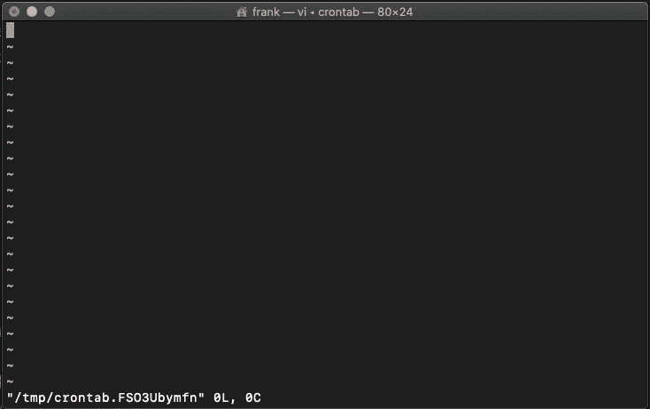
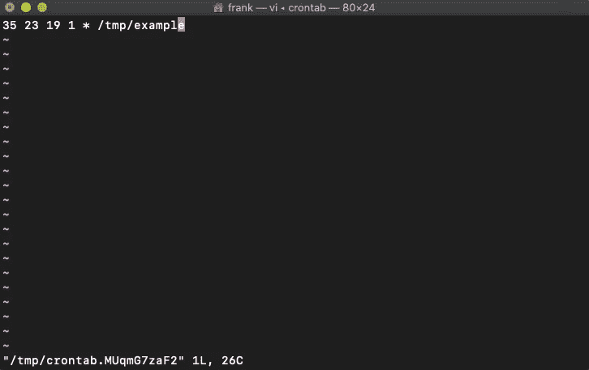
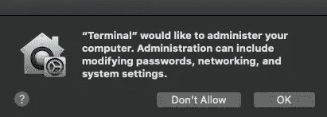
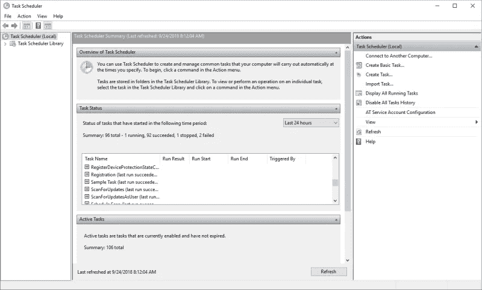

# 通过 3 个步骤自动化您的脚本

> 原文：<https://medium.datadriveninvestor.com/automate-your-python-scripts-in-3-steps-mac-and-windows-3c6fb0fb5bc2?source=collection_archive---------5----------------------->

## 厌倦了重复的任务？自动化您的脚本并节省大量宝贵的时间。


Photo by [Alison Pang](https://unsplash.com/@alisonpang?utm_source=medium&utm_medium=referral) on [Unsplash](https://unsplash.com?utm_source=medium&utm_medium=referral)

大多数工作都充满了无聊和重复的任务，不会给任何职业增加价值。这些任务迟早会占用大量时间，并停止您的工作流程；结果，你可能会变得效率更低。

但是不用担心！在本文中，我将通过 3 个简单的步骤向您展示如何在特定的时间在 Mac 和 Windows 上运行 Python 脚本，这样您可以更好地利用您的时间。

# 苹果个人计算机

我们将使用一个名为`example.py` 的 Python 脚本，它需要每分钟、每小时或每天执行一次。

## 步骤 1:使您的 Python 文件可执行

将`.py` 分机转换成`.exe`有不同的方法。对于这个例子，我将使用“PyInstaller ”,因为它很简单。

PyInstaller 读取您编写的 Python 脚本，并找到脚本执行所需的模块和库。然后，它收集所有这些文件的副本，并将它们放在一个可执行文件中。

*   打开终端，运行`pip install pyinstaller`
*   现在让脚本可执行写`pyinstaller --onefile example.py` 在你的脚本所在的目录

之后，应该创建一个名为“dist”的文件夹。文件夹中是独立的可执行文件！

## 步骤 2:打开终端并运行 crontab -e

在 macOS 上，你可以用 *crontab* 安排作业。如果你以前从未听说过 *crontab* ，就按照这些步骤开始吧！

打开终端，运行`crontab -e`。现在你的终端应该看起来像下面的图片。



Image by author

在这里你可以列出你的 cron 工作。每个工作都有自己的一行。cron 作业需要以下格式。

```
* * * * * command_to_execute* - minute (0-59)
* - hour (0-23)
* - day of the month (1-31)
* - month (1-12)
* - day of the week (0-6, Sunday to Saturday)
```

尽管格式看起来很简单，但我强烈建议使用 [crontab.guru](https://crontab.guru/) 来生成正确格式的 cron 表达式。

## 步骤 3:使用 Crontab 调度作业

现在我们必须创建 cron 作业。

*   点击`i`激活`INSERT`模式
*   用正确的格式写 cron 表达式。在本例中，我创建了`35 23 19 1 * path_of_executable.` ，这意味着“*在 1 月 19 日的 23:35 运行文件* a *(你可以在 [crontab.guru](https://crontab.guru/) 上验证这个)*

**

*Image by author*

*   *打出后，按`esc`然后按`:wq`保存(`w` -写入)并退出(`q` -退出)文件。*

*按下回车键后，会出现以下窗口(至少在 macOS Catalina 10.15 上)*

**

*Image by author*

*只需点击“确定”即可授予访问权限。就是这样！如果您遵循了所有的步骤，您应该有一个新的 crontab。*

*要验证 crontab 是否已创建，只需运行`crontab -e or crontab -l`命令。新的 crontab 应该在那里。如果你想删除它，写下`crontab -r.`*

**注意:如果没有弹出任何内容，但是您仍然有权限问题，那么您可能需要手动授予访问权限。如果有，就进入系统偏好- >安全和隐私- >隐私- >全磁盘访问。**

# *Windows 操作系统*

*正如我们之前为 Mac 所做的那样，我们将使用一个名为`example.py` 的 Python 脚本，它需要每分钟、每小时或每天执行一次。*

## *步骤 1:创建一个 Python 可执行文件(bat 文件)*

*批处理文件通常用于帮助加载程序，一次运行多个进程，以及执行常见或重复的任务。*

*bat 文件将是可执行文件。我们将我们的脚本存储在一个文件中，然后单击 bat 文件，在命令提示符下执行命令来运行 Python 脚本。*

*   *创建一个记事本。我给我的`note`打电话*
*   *在记事本内写下以下内容`**<Your Python.exe Location> <Your python Scripts Location> .**`你的记事本应该是这样的:*

```
*"C:/User/python.exe" "C:/Scripts/example.py"*
```

*   *保存记事本，将扩展名从`.txt`更改为`.bat`*

## *步骤 2:在 Windows 任务计划程序中配置任务*

*windows 任务调度器是默认的 Windows 应用程序，用于管理任务以响应基于事件或基于时间的触发。*

*在本例中，我们将按照以下步骤安排`example.py` 脚本:*

*   *单击开始窗口并搜索任务计划程序。*

**

*Task Scheduler*

*   *点击右侧窗口中的“创建基本任务”*

*将弹出一个窗口，显示以下选项:*

1.  ***创建一个基本任务:**写下您的任务名称和描述(例如，这个脚本将在每天下午 6 点运行)*
2.  ***触发时间:**选择新任务的触发和动作。可以选择每日、每周、每月等。在本例中，我将选择“每月”*
3.  ***选择上一次选择的确切时间:**由于我之前选择了“每月”，现在我必须选择重复该任务的月份(例如，一月、二月和三月)*
4.  ***操作:**选择“启动程序”并点击“下一步”按钮。然后，浏览任务应该运行的程序。在这种情况下，我将选择我们之前创建的 bat 文件。*
5.  *最后，点击**完成**按钮。*

*就是这样！您的新任务应该出现在任务计划程序的首页。*

# *结论*

*现在您知道了一种自动化 Python 脚本的简单方法！我们在 Windows 上使用任务调度程序，在 Mac 上使用 Crontab。最重要的是，现在我们可以停止在无意义的任务上浪费时间，专注于更重要的事情。*

**希望这对你有用！**