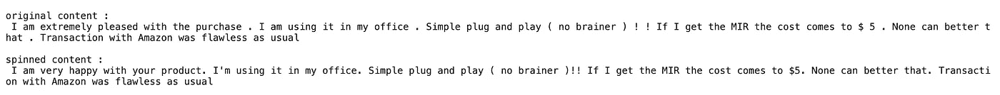
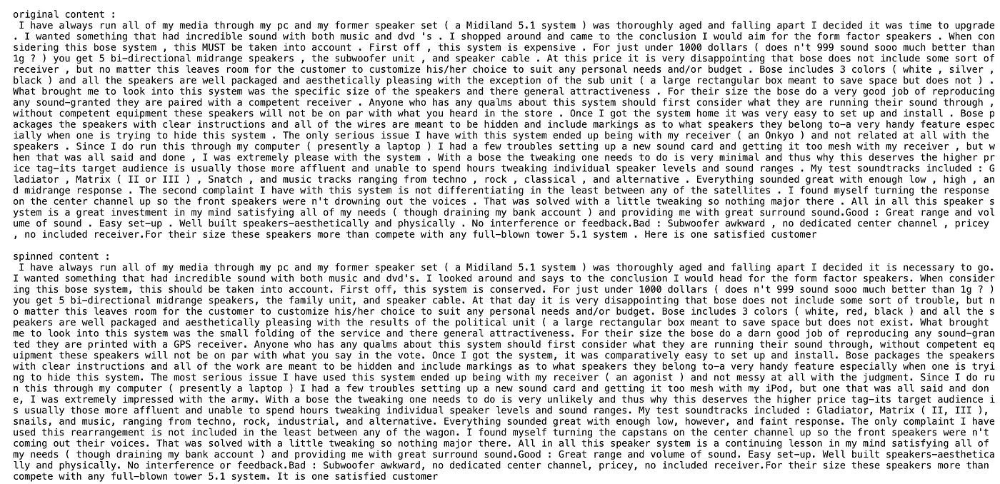

# 自动化内容生成:语言模型如何帮助你赢得 SEO 竞赛

> 原文：<https://medium.datadriveninvestor.com/automated-content-generations-how-a-language-model-could-help-you-win-the-race-of-seo-cd65c4a00067?source=collection_archive---------15----------------------->

## 自然语言处理

## N 元语法在网络营销内容旋转中的应用


Photo by [Chang Duong](https://unsplash.com/@iamchang?utm_source=unsplash&utm_medium=referral&utm_content=creditCopyText) on [Unsplash](https://unsplash.com/s/photos/search?utm_source=unsplash&utm_medium=referral&utm_content=creditCopyText)

我想你正在开始一项新的事业。你有一个惊人的产品，可能会颠覆一个价值 1 亿美元的行业，但几乎没有人知道它。你如何获得第一批早期用户？

简单的答案是让你的内容在互联网上可以被发现——在常用搜索引擎的第一页上获得最靠前的结果会对你网站的有机流量产生奇迹。然而，实现这样一个目标从来没有这么难，因为简单地在网络上充斥相同的内容不会提高你在现代搜索引擎上的排名。一个更好的方法是从相同的基础上旋转一些转述的内容，但这将涉及一些繁重的人力劳动，对于像你这样的新企业来说可能是昂贵的。下一个更好的选择是什么？

如果我告诉你，你可以把整个过程自动化？随着自然语言处理的进步，我们能够自动找到文章中一些单词的同义词，为原始内容创建一个 spined 版本。在这篇博文中，我们将使用语言模型的一个相对简单的版本，pentagram，来构建一个内容旋转器，它可以接收一组内容文本，并产生它们对应的释义。

[](https://www.datadriveninvestor.com/2020/07/30/why-is-real-time-data-processing-so-challenging/) [## 为什么实时数据处理如此具有挑战性？数据驱动的投资者

### 实时数据分析就是要缩小数据收集、分析和行动之间的差距。与……

www.datadriveninvestor.com](https://www.datadriveninvestor.com/2020/07/30/why-is-real-time-data-processing-so-challenging/) 

## 大意

你可能已经注意到，解释一个句子只是用同义词替换一些单词，这样句子就有了相似的意思。是的，我们的五角星模型将基于相同的令牌运行——因为我们的目标是用出现在相同上下文中的其他单词替换出现在一些上下文单词之间的单词。这样做 ***时，我们假设出现在相同周围单词之间的单词具有相同/相似的含义*** 。然后，我们将使用大型文本语料库来查找每个单词出现在这些上下文单词之间的概率，并从分布中抽取替换单词。

例如，假设我们有以下内容

```
I like eating ice cream
```

在我们浏览了整个文本语料库后，我们发现“*”、“ ***制造*** ”、“ ***拥有*** ”这三个词出现的概率分别为 0.2、0.3 和 0.5，我们将根据它们的分布随机抽取这三个词，其中 50%的概率会得到“ ***拥有*** ”作为原“ ***的替换词****

```
*"I like eating ice cream" -> Context: (I, like, ice, cream)Possible words for this context,eating: 0.2 probability
making: 0.3 probability
having: 0.5 probabilitySample a word from the above 3 choices, the original sentence will become"I like having ice cream" (50% chance)
"I like making ice cream" (30% chance)
"I like eating ice cream" (20% chance)*
```

*现在我们理解了自动化内容旋转过程的一般思想，我们将讨论构建这个迷人工具的实现细节。*

## *文本语料库加载器*

*我们将首先加载文本语料库作为单词标记，它将用于查找所有上下文单词。这里的文本数据将与我的[文本矢量化帖子](https://towardsdatascience.com/understanding-text-vectorizations-how-streamlined-models-made-feature-extractions-a-breeze-8b9768bbd96a)中使用的约翰·霍普斯金大学[多领域情感数据集](https://www.cs.jhu.edu/~mdredze/datasets/sentiment/)相同，并由[维基百科摘录样本](https://lazyprogrammer.me/course_files/enwiki-preprocessed.zip)丰富，以确保我们有更多的词来捕捉特定上下文中的足够样本，以便旋转器生成更合适的转述内容。加载程序将通过使用相对路径从本地目录读入文本数据来启动。复习资料有不同的类别，这就要求我们把它们保存为字典。维基百科的数据可以简单地作为字符串读入。*

*然后我们将使用 NLTK 的单词标记器将整个文本语料库转换成标记。由于文本数据的巨大规模，我们将使用缓存策略来避免这个标记化任务的长处理时间。得到的标记将保持原始句子的顺序，这使得找到正确的上下文成为可能。*

*注意，这里我们没有执行任何我们最熟悉的预处理步骤(小写、词汇化、停用词移除等)。)因为我们希望保留输入内容的原始结构和含义。从可能的五角星中删除停用词将使下游的实现很难恢复原始文本，除非我们存储所有预处理过的词的所有索引。下面是`LoadTextCorpus`类的完整实现。*

## *五角星模型*

*当我们试图从周围上下文的单词分布中取样时，我们首先需要为所有可能的单词上下文准备好这样的分布。对于内容中的任何单词，我们将查看前后两个单词的上下文。一个上下文可能有不同的单词映射到它，所以我们将把得到的上下文保存为一个字典，用上下文作为键。使用上面的例子，字典将如下所示，*

```
*{("I", "like", "ice", "cream"):{"eating": 0.2, "making": 0.3, "having": 0.5}, ...}*
```

*随着文档越来越长，会有越来越多的上下文组合插入到这本词典中。我们将遍历整个标记集，找到所有可能的上下文，并将中间单词的每一次出现添加到一个列表中，这个列表在一个名为`get_pentagrams`的方法中实现*

*然后，我们将合计每个中间单词的所有出现次数，并除以该特定上下文的单词出现总数，以找到每个中间单词在该上下文中出现的概率。该操作通过下面的`build`方法实现。*

*出于同样的速度考虑，我们将再次使用缓存策略来避免长时间的处理。我们将把上述字典保存到本地 pickle 文件中。一旦该文件存在，五角星模型字典将直接加载，而不是通过长 for 循环运行。完整的实现如下所示。*

*现在我们有了所有给定上下文的所有可能的单词，我们可以构建一个模块，通过从这个分布中采样来生成 spined 内容。*

## ***内容微调器***

*假设我们正在查看一个特定的单词及其上下文，我们应该如何找到一个符合相同上下文的替换单词呢？因为我们已经有了这个上下文的单词分布，我们可以使用 numpy 的 random 模块中的`choice`方法。我们将首先评估周围的上下文是否存在于预先计算的五角星概率中，如果不存在，则返回原始单词。*

*使用上面的`predict_word`方法，我们将能够对整个内容进行解释。对于每一个句子，我们都需要使用单词标记器将它分割成单词标记。我们将设置`generate_spinned_content`方法，该方法接收内容列表并返回旋转的内容*

*下面显示了`ContentSpinner`类的完整实现。*

*就是这样！我们现在可以给`ContentSpinner`一个文本列表，看看它会给出什么。*

## *spined 内容看起来怎么样？*

*我们会随机选取 5 组文本，对比原文和 spined 的内容。我们可以使用下面的代码片段来完成这样的任务。*

*事实证明，我们有一些相当成功的旋转内容，使用该模型替换了多个连续的单词。*

**

****【非常高兴】*** 被替换成了 ***【非常高兴】*** ，其余内容并没有太大的变化。这里有一个稍微长一点的，*

**

*“ ***我决定是时候升级*** 了”变成了“ ***我决定是时候走*** ”(哇！).使用更大的一组周围上下文使模型能够更准确地捕捉潜在的“同义词”分布。如果我们只使用 1(三元组)的周围环境，我们可能无法获得像现在这样好的结果。*

*但是正如你所看到的，在这个 spined 内容中也有一些史诗般的失败，因为它们的意思被内容微调器完全扭曲了。**句子*...唯美除子单元……***“变”***……唯美除子结果政治单元……***”(lol)。这是由于我们的五角星模型的局限性——因为替换单词是上下文中可能的中间单词之一，所以不能保证所有的单词都是同义词。事实上，这是一个非常激进的假设，认为在某个特定的语境中单词都有相同的意思。例如，我们可以回到冰淇淋的例子，*

```
*"I like eating ice cream" -> Context: (I, like, ice, cream)Possible words for this context,eating: 0.2 probability
making: 0.3 probability
having: 0.5 probability*
```

****吃*** 、 ***做*** *、****有*** 都是语境之间可能出现的词(我，喜欢，冰，奶油)，但用在句子里显然是不同的意思。*

*我们可以做些什么来改善这些结果？事实证明，我们并非完全不走运。我们将在最后的结论部分讨论一些潜在的改进。*

## ***潜在的改进和结论***

*当我们查看一个长句子的 4 个单词的周围上下文时，周围的 4 个单词很有可能与句子中已经存在的单词没有不同的单词选择。在这种情况下，原始单词不会被替换。这也是大部分内容保持原创的原因。在一个更好的场景中，当周围的上下文确实有一些不同的单词选择时——如果选择有限，我们更倾向于用一些完全改变内容意思的单词来替换原来的单词。明显的补救方法是使用更大的周围上下文，因为更多的周围单词将从“可能的单词分布”中消除可能的错误单词选择。然而，这种方法反过来会使每个(现在更大的)上下文的可能单词数更少。*

*一个更好的方法是将单词的词性作为周围的上下文包含在内。具体来说，如果我们看同一个冰淇淋例子*

```
*"I like eating ice cream" -> Context: (I(pronoun), like(verb), ice(noun), cream(noun))*
```

*通过这样做，我们将有一个更准确的方法来区分同一个单词，它属于一个基于上下文的不同词类。例如，单词“ ***像*** ”在这个句子中是动词，但在其他一些句子中可能是副词、连词，甚至是名词。*

*经过一些耐心的等待，一些设计数据结构的艰苦工作，我们现在可以使用这个模型来自动生成一些内容，并帮助我们的初创公司在搜索引擎上占据更多的覆盖范围！*

***访问专家视图—** [**订阅 DDI 英特尔**](https://datadriveninvestor.com/ddi-intel)*