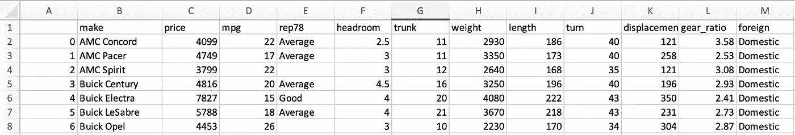
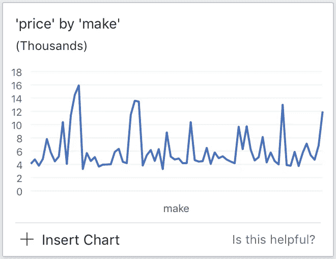
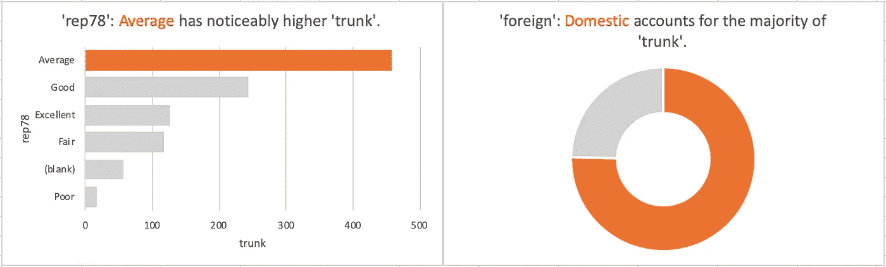
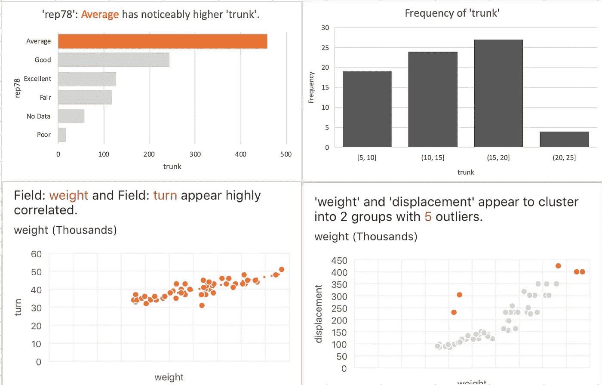

# 自动化探索性数据分析:测试 MS Excel 的“Ideas”功能

> 原文：<https://medium.datadriveninvestor.com/automated-exploratory-data-analysis-test-driving-ms-excels-ideas-feature-514f34d944e8?source=collection_archive---------0----------------------->

## Microsoft Excel 的自动化探索性数据(EDA)分析工具“Ideas”的测试和审查

TLDR:这篇文章测试了微软 Excel 提供的自动化 EDA 工具。在一次试驾之后，对我来说，继续寻找一个最喜欢的一站式自动化 EDA 工具。我管理我的期望。

# 介绍

探索性数据分析(EDA)是数据科学中的一个重要课题。任何处理来自研究人员、分析师、商业智能专业人士等的数据的人都会花时间来完成这项任务。根据《哈佛商业评论》的一篇文章，数据科学家花费 80%的时间来寻找、清理和组织数据。


Image Source: [www.wallpaperflare.com](http://www.wallpaperflare.com).

微软 Excel 提供了一个名为“Ideas”的自动化 EDA 工具。在熟练的、有洞察力的分析师手中，这可以很好地补充一个或多个广泛可用的工具。

为了测试“想法”，我把我最喜欢的演示数据集之一[加载到 Excel 中，并给这个自动化的 EDA 加了一把劲。*因为这是一次‘试驾’,所以我使用了著名的汽车数据集。*在本文中，我使用了汽车数据集，该数据集包含 74 个与汽车相关的观察值，包括价格、燃油效率、重量、尺寸、维修记录、制造产地和其他相关信息。我之前已经写过这个数据源](https://towardsdatascience.com/three-datasets-i-often-use-as-examples-c70ec5b2f793)。

# 汽车数据集

为了设置该数据集，我使用了以下代码为自己准备了该数据的本地副本，然后可以在 Excel 中打开:

```
import pandas as pdauto = 'http://www.stata-press.com/data/r15/auto2.dta'
df = pd.read_stata(auto)df.to_csv('auto2.csv')
```

在 Excel 中，数据显示如下:



Image Credit: Author’s screen capture of data from stata-press.com.

首先要注意的是，包含车辆维修记录信息的列(rep78)包含一些缺失的数据。我将关注 Excel 的自动化 EDA 是否以及如何处理丢失的数据。另一项需要注意的是，price 看起来像一个整数，没有任何东西(除了列的标题)表明 price 与货币相关。

[](https://www.datadriveninvestor.com/2020/02/19/five-data-science-and-machine-learning-trends-that-will-define-job-prospects-in-2020/) [## 将定义 2020 年就业前景的五大数据科学和机器学习趋势|数据驱动…

### 数据科学和 ML 是 2019 年最受关注的趋势之一，毫无疑问，它们将继续发展…

www.datadriveninvestor.com](https://www.datadriveninvestor.com/2020/02/19/five-data-science-and-machine-learning-trends-that-will-define-job-prospects-in-2020/) 

下一步，单击下面红框中显示的 Excel 的“创意”按钮。只有 74 次观察，结果很快就回来了。


Image Credit: Author’s screen capture from Microsoft Excel.

## 结果

第一个结果是一个折线图，将*价格*放在 *y* 轴上，将*制造*放在 *x* 轴上。我认为这种可视化的有用性很低。它既没有揭示有用的见解，也没有激发任何其他想法。



Image Credit: Author’s screen capture from Microsoft Excel.

第二个可视化(技术上是一个列表)是维修记录(rep78)、车辆品牌(make)和车辆长度(length)的三向枢纽。这些数据的一个我有时会忽略的方面是，这些数据将关于车辆品牌和型号的信息合并到品牌列中。

由于篇幅限制，这里我没有展示可视化。为了更好地理解第二个可视化效果，可以用 Python 生成一个等价的可视化效果，代码如下:

```
df.pivot_table(index=['rep78','make'], aggfunc='sum')['length']
```

我对这种可视化的有用性评价很低。然而，它确实提醒了我 make 列需要一些数据清理。在进行进一步的 EDA(自动化或其他方式)之前，我将确保使用类似于下面的代码来清理该数据列:

```
# Create a new column to contain vehicle model data
df[‘model’] = df[‘make’].apply(lambda x: x.split()[1] 
                               if len(x.split()) > 1 else x)# Create a new column to contain only make data
df['make2'] = df['make'].apply(lambda x: x.split()[0])
```

第二次和第三次可视化也令人失望:



Image Credit: Author’s screen capture from Microsoft Excel.

左侧显示的分析表明，较大的行李箱容量似乎与具有“一般”维修记录的车辆相关。右边显示的是一项分析，表明大部分的累积行李箱空间是在国内车辆。有用吗？见解深刻？

## 最后看一眼

为了帮助 Excel 的自动化 EDA 执行得更好，我用一个“干净”版本的 make 列重新加载了一个新的数据集。我还将价格的数字类型转换为美元。我把丢失的数据条目修改为“无数据”对数据稍加清理后，新的结果更有希望。

Excel 的自动化 EDA 生成了直方图、散点图、线图和表格。这些分析说明了潜在的相关性、聚类和异常值。39 个自动化 EDA 可视化中的一些包括以下内容:



Image Credit: Author’s screen capture from Microsoft Excel.

[](https://adamrossnelson.medium.com/membership) [## 加入我的介绍链接媒体-亚当罗斯纳尔逊

### 作为一个媒体会员，你的会员费的一部分会给你阅读的作家，你可以完全接触到每一个故事…

adamrossnelson.medium.com](https://adamrossnelson.medium.com/membership) 

# 最终分析

继续寻找最喜欢的一站式自动化 EDA 工具。我可以再次使用 Excel 的 EDA，但我也可能会将它与 Pandas Profiling 结合使用，后者已在 Medium 上多次讨论过([使用 Pandas-profiling 加速您的探索性数据分析](https://towardsdatascience.com/speed-up-your-exploratory-data-analysis-with-pandas-profiling-88b33dc53625)，[使用 Pandas-Profiling 实现更好的 EDA](https://towardsdatascience.com/a-better-eda-with-pandas-profiling-e842a00e1136)，以及[使用 Pandas Profiling 进行探索性数据分析](https://towardsdatascience.com/exploratory-data-analysis-with-pandas-profiling-de3aae2ddff3))。我最喜欢的另一个 EDA 工具是久经考验的联合图、配对图，甚至是我在 [Seaborn](https://seaborn.pydata.org/examples/index.html) 中试图执行的有争议的小提琴图。

当谈到可以有效地自动化 EDA 的任何部分的工具时，我管理我的期望。从 Excel 中的这些例子可以看出，在将数据交给算法之前，仍然有必要查看数据。

*   Excel 没有识别丢失的数据。
*   如果没有额外的设置和配置，Excel 无法理解至少两个最重要的数据列的性质。
*   大多数建议的可视化提供了很少有意义的见解。
*   一些可视化启发了我以后用其他工具实现的其他可视化和分析。

# 感谢阅读

感谢阅读。把你的想法和主意发给我。你可以写信只是为了说声嗨。如果你真的需要告诉我是怎么错的，我期待着尽快和你聊天。Twitter:[@ adamrossnelson](https://twitter.com/adamrossnelson)LinkedIn:[亚当罗斯尼尔森](https://www.linkedin.com/in/arnelson/)。