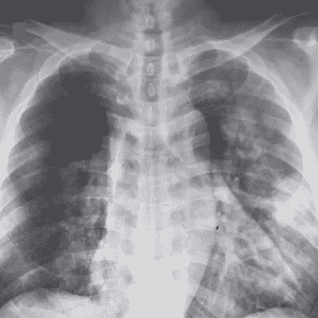

# 医疗超负荷时代的自动化病理学

> 原文：<https://medium.datadriveninvestor.com/automated-pathology-in-a-time-of-medical-overload-9aa64d747f08?source=collection_archive---------26----------------------->

Photo by [Fusion Medical Animation](https://unsplash.com/@fusion_medical_animation?utm_source=medium&utm_medium=referral) on [Unsplash](https://unsplash.com?utm_source=medium&utm_medium=referral)

新冠肺炎。我将尽量避免详述病毒的影响，因为我假设你们大多数人都熟悉它已经带来的变化。但话虽如此，如果你仍然想深入了解这种病毒，它的广泛可见的后果，以及其他流行病，我强烈推荐阅读[这](https://medium.com/@theksociety/a-covid-19-master-guide-9fad9a96f1c2)主指南。

既然我已经了解了这一点，那就让我们进入你可能点击这篇文章的原因，好吗？

在智能机器创造的这个时期，**医疗自动化**和**T5 这两个词已经成为流行语。抛开技术的浮华的公共层面，我相信这个领域的创新现在比以往任何时候都更需要利用。**

 [## 冠状病毒；惊慌失措；字里行间的 z |数据驱动的投资者

### 围绕冠状病毒的话题；更准确地说，新冠肺炎几乎占据了整个新闻预报的头条…

www.datadriveninvestor.com](https://www.datadriveninvestor.com/2020/03/23/coronavirus-a-to-panic-z-between-the-lines/) 

为了了解如何最有效地利用这些创新，我们必须了解已经在使用的各种方法，这些方法是患者自主治疗的一种手段。下面我将重点介绍其中的一些方法。

## 自动化病理学

Images of Coronavirus captured through an x-ray of an infected Vietnamese patient.

自动化诊断可能是自动化医疗实践中最受欢迎的技术之一，它可以依赖于许多高功能的框架来创建对特定上下文的专家般的理解。

最常见的包括以下内容:

*   一种 CNN 或图像分类程序，对包括或不包括显示病原体存在的区域的图像进行训练。

对于那些不知道 CNN 是什么的人，我推荐通读这篇文章。CNN 利用类似于基本人工神经网络的网络结构。这两者的主要区别在于 CNN 中卷积层的存在。虽然你可以在上面的文章中了解更多关于这个想法的信息，简单地说，卷积层在进行一系列操作后，通过像素分组和一个称为 max pooling 的额外操作来最小化图像的大小。

你可能在想:这很酷，但是 CNN 怎么能应用于医学领域呢？

很高兴你问了。

CNN 的必要训练和验证数据是图像。令人欣慰的是，这些年来已经拍摄了无数图像，显示了身体和血液的宏观和微观感染区域。旧照片和新照片可以创建用于训练网络的数据集。一旦经过训练，网络就能够以不同程度的效率将图像中显示的身体区域分类为感染或良性。

*   一个具有简单的线性回归式架构的程序，该程序分析数字输入以预测患者是否确实具有感兴趣的医学状况。

在我解释使用像线性回归这样的技术的医学含义之前，我将首先解释构成这些程序之一的基本概念。如果你能回忆起中学数学课，试着回忆最佳拟合线的概念。

对于外面的正常男女，我会试着唤起你的记忆。在二维平面/图形上，可以画出无限数量的点。最佳拟合线的绘制与图上绘制的点之间的距离相关。因此，这条线总体上代表了这些点的大致增加和/或减少。然而，这种计算不仅限于二维。

虽然人类很难概念化，但计算机可以相对容易地执行最佳拟合线计算。这允许两个以上的参数产生二元结果。

在医学领域，这允许量化输入，如体温、体重和分解的人口统计信息，以推断患者是否患有危及生命的疾病。

## 信任困境

尽管这些解决方案听起来不可否认是积极的，但仍有一个必须克服的障碍:信任。从许多标准来看，医学是一个需要最多训练和专业知识的专业领域。一个程序可以在几分钟或几小时内获得诊断病人的能力，其熟练程度堪比专家，这种想法至少对普通人来说是陌生的。

由于缺乏理解，随之而来的是缺乏信任。在这种时候，如果没有人们的信任，自动化医疗解决方案将只不过是用来增加物理医生工作的便利创新。

## 为什么现在有必要这么做？

我们目前的医疗基础设施目前处于后勤包围之中。只有受过部分培训的专业人员被派往前线，重症监护室床位短缺，病人感染的速度太快，无法得到充分的治疗。如果我们能够克服医疗自动化领域的信任困境，这些技术可以被部署来创建一个除紧急情况之外的部分功能医疗世界。

# 接触

嘿，我是杰克。我是知识社会的一名 15 岁的创新者。在过去的几个月里，我一直在深入研究机器学习和人工智能。最近，我专门研究了计算机视觉。在接下来的几周里，我将详细介绍我所学到的概念的技术细节。敬请关注。导航到下面的链接进行连接！

电子邮件:mmcd.jack@gmail.com

领英:[https://www.linkedin.com/in/jack-mcdonald-a960ab194/](https://www.linkedin.com/in/jack-mcdonald-a960ab194/)

推特:【https://twitter.com/jackmmcd123 